# Antigravity Gateway — 产品架构

> 将 Antigravity (Google DeepMind AI 编程代理) 变为无头 API 服务器，解锁远程访问、子代理集成和自动化 AI 工作流。

---

## 系统全景

> 2026-04 split 说明：
> 从**产品视角**看，系统仍然是“一个前端 + 一个平台后端”。
> 从**部署视角**看，默认形态收敛成同设备 `opc-web + opc-api` 两个服务。
> 从**工程视角**看，`opc-api` 内部仍保留 `control-plane`、`runtime`、`scheduler` 三条模块边界。
> 这样拆不是为了增加概念，而是为了避免“配置/列表查询”被“对话执行/language server/provider 连接/后台恢复”污染。

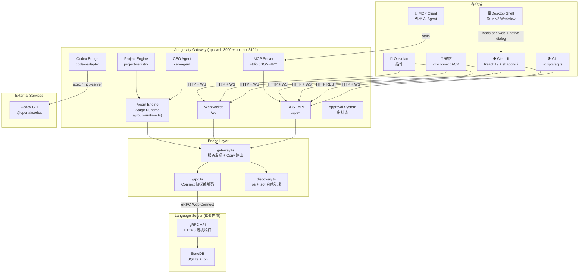

---

## 部署与进程角色

### 产品视角 vs 工程视角

对外可以把系统理解成：

1. **前端**：浏览器里的 Web UI
2. **后端**：Antigravity Gateway 平台

默认部署不再暴露 4 个角色，而是同一台设备上的 2 个服务：

1. `opc-web`
   - 页面渲染
   - 浏览器入口
   - HTTP `/api/*` 代理到 `opc-api`
   - 当前仍承载 `/ws` 浏览器入口；后续可继续迁移到 `opc-api`
2. `opc-api`
   - 配置、项目、审批、部门、CEO、MCP、workspace catalog
   - conversation / run / stream / workspace launch / language server 相关运行时 API
   - 默认负责 cron scheduler；恢复、导入、reconcile 等 companion worker 仍为显式开关
   - 运行在宿主机，直接访问 Antigravity IDE、本机文件系统、workspace、`~/.gemini` 和 SQLite

内部实现仍有 `control-plane / runtime / scheduler` 模块，但它们是代码边界，不是用户默认部署概念。

### 为什么不是简单“一前一后”

因为这个系统不是普通 CRUD 后台，而是一个带执行引擎的 Agent 平台。

普通后端主要处理：

1. 存
2. 查
3. 改
4. 删

而当前平台除了管理面，还要处理：

1. 启动/发现 Antigravity workspace 与 language server
2. conversation send / cancel / step watch / stream
3. run dispatch / intervene / resume
4. 后台 scheduler / importer / reconciler

这些能力和“查 CEO profile / 查部门配置 / 查审批列表”在工程特性上完全不同：

1. **control-plane** 要求轻、稳、可预测、可分页、适合读模型查询
2. **runtime** 要求能连外部运行时、处理长连接、容忍抖动、支持流式和取消
3. **scheduler** 要求可后台持续运行，但 cron 循环不能和 fan-out/approval/consumer 恢复噪音绑死

如果把它们重新塞回单一后端进程，最终会出现：

1. 首页和设置页被执行链路污染
2. language server / gRPC / provider 抖动放大到整个后端
3. scheduler companion / importer 恢复噪音拖慢普通 API

所以最准确的理解不是“用户要部署 4 个角色”，而是：

1. **对外仍然是一个后端**
2. **默认部署是同设备前后端分离**
3. **后端内部再拆成管理面、执行面、后台 worker**

### 当前默认部署形态

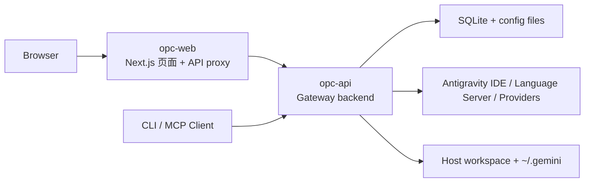

### 后端内部模块边界

| 模块 | 负责什么 | 不负责什么 |
|---|---|---|
| `control-plane` | 项目、CEO、审批、部门、配置、workspace catalog、MCP | 不负责 conversation send/stream，不直接做执行链 watch |
| `runtime` | conversation、run、steps、stream、`/api/me`、`/api/models`、workspace launch/kill | 不承担组织配置、审批列表、部门配置读写 |
| `scheduler` | cron、恢复、导入、reconcile、后台增量刷新 | 不提供前端列表/设置类同步请求；`opc-api` 默认只启用 cron，companion 后台默认关闭 |

### 部署建议

默认不走 Docker。项目与宿主机 Antigravity IDE、Language Server、workspace 文件系统、`~/.gemini` 结合很深，Docker 会引入进程发现、端口、文件挂载和权限隔离问题。

推荐命令：

```bash
npm run dev          # 同设备启动 opc-api + opc-web
npm run dev:api      # 只启动后端，默认端口 3101
npm run dev:web      # 只启动前端，默认端口 3000
```

生产同设备：

```bash
npm run start:api
npm run start:web
```

### 可选桌面壳：Tauri

Tauri 是当前推荐的“本机能力层”，不是新的业务后端。

当前落地范围：

1. `src-tauri/` 提供 Tauri v2 桌面壳，开发态加载 `http://127.0.0.1:3000`。
2. `npm run desktop:dev` 只打开桌面壳，不自动启动新的 Node 后台。
3. `npm run desktop:check` 只做 Rust/Tauri 编译检查。
4. 桌面壳通过 `@tauri-apps/plugin-dialog` 提供 macOS 原生目录选择能力。
5. CEO Office 新建部门时，Tauri 环境优先打开系统文件夹选择器；普通浏览器仍保留手动路径输入兜底。

这层不会改变 Antigravity IDE / Language Server / Codex Native 的运行路径：

1. 是否连接 Antigravity、是否启动 Language Server，仍由 runtime API 和 provider 选择决定。
2. 手动导入 workspace 仍走 `/api/workspaces/import`，只写 OPC workspace catalog，不启动 Antigravity。
3. Tauri 只解决普通 Web API 无法可靠选择本机文件夹的问题。

当前 Tauri 仍是开发态桌面壳。生产级桌面包、Node 后端 sidecar、自动端口编排和升级策略应作为下一阶段单独收口。

`AG_ROLE=web` 仍是低层工程开关。它必须配置 `AG_CONTROL_PLANE_URL` 和 `AG_RUNTIME_URL`，当前默认都指向同一个 `opc-api` 地址：`http://127.0.0.1:3101`。裸 `AG_ROLE=web` 会让 `/api/*` 返回 503，这是保护机制。

后续若需要真正物理分离或 Docker 化，可以在不推翻代码边界的前提下演进。当前默认不建议 Docker，因为：

1. API 需要访问宿主机 Antigravity 进程
2. API 需要读取本地 workspace 和 `~/.gemini`
3. Docker 默认隔离会让 Language Server 发现和端口连接复杂化

---

## 模块依赖关系

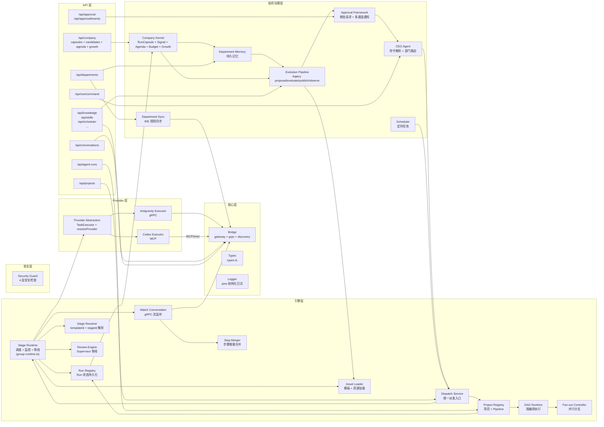

---

## Company Kernel

Company Kernel 是 run 执行记录、组织学习、经营议程和自增长候选之间的收口层。它不启动 Provider，不扫描 Antigravity IDE，不负责 Language Server 生命周期，只消费已经存在的 run lifecycle、result envelope、artifact、scheduler 和 verification 信号。

当前落地范围：

1. `RunCapsule`：每个 run 的结构化事实胶囊，记录 checkpoints、证据、决策候选、可复用步骤、blockers、quality signals。
2. `WorkingCheckpoint`：由 `createRun()` / `updateRun()` 的低频关键字段变化生成，不做高频后台轮询；显式 append/rebuild 会合并既有 checkpoints，不覆盖历史。
3. `MemoryCandidate`：run 完成后的自动沉淀先进入候选，不直接写长期 active knowledge；空证据、高冲突、volatile 候选不会被系统自动晋升。
4. `Promotion`：显式 promote 后才写入 `knowledge_assets`，并携带 evidence / promotion 元数据；`promoted/auto-promoted/rejected/archived` 等闭合状态不会被后续候选重生成回滚。
5. `OperatingSignal` / `OperatingAgendaItem` / `CompanyOperatingDay`：把 run failure、reusable learning、scheduler routine/risk、approval lifecycle、knowledge candidate 变成可排序议程；CEO Office 读取 `/api/company/operating-day`，不再只依赖前端拼接。
6. `OperatingBudgetPolicy` / `BudgetLedgerEntry` / `CircuitBreaker`：agenda dispatch、scheduler dispatch、growth generate/evaluate 前先返回 allow/warn/block 与拦截原因；打开的 circuit breaker 会阻止 dispatch，scheduler 被拦截时返回 `skipped` 且不创建 run。
7. Budget reservation 会在 run 创建后绑定 `runId`；run 进入 completed/failed/blocked/cancelled/timeout 等终态后统一 commit/release，ledger 汇总会忽略已被终态流水覆盖的 reserved，避免重复计数；没有 target workspace 的 agenda 不会先占用预算。
8. `CircuitBreaker` 会从真实 run terminal 状态更新部门、scheduler job、provider、workflow 维度，连续失败打开熔断；`recoverAt` 到期后进入 `half-open` 探测态，成功终态会 reset 对应 breaker。
9. `GrowthProposal` / `GrowthObservation`：从 RunCapsule、promoted knowledge、候选记忆生成 SOP/workflow/skill/script/rule 提案；promoted `pattern/lesson` knowledge 可生成 SOP，三次以上同类成功 RunCapsule 生成 workflow proposal，高风险提案默认创建 approval request，审批通过后才 publish。
10. 已发布的 workflow/skill GrowthProposal 会进入 Prompt Mode 执行解析，下一次相似任务可自动注入 canonical workflow/skill；Observation 记录命中 run、成功率、估算 token saving 与 regression signals。
11. `CompanyLoopPolicy` / `CompanyLoopRun` / `CompanyLoopDigest`：在同一 Company Kernel 内组织 daily/weekly/growth/risk loop。loop 只选择 Top-N agenda，dispatch cap 默认 1，所有 dispatch 仍走 budget gate；scheduler 只新增 cron 型内置 job，不新增 5s interval 或第二套 worker，且内置 daily/weekly cron 从 loop policy 读取 cadence、timezone 和 enabled。`CompanyLoopRun.metadata.skippedAgenda` 保留每个 skipped item 的结构化原因。
12. `SystemImprovementSignal` / `SystemImprovementProposal`：把性能、UX、测试失败、运行错误、用户反馈转成受控系统改进 proposal。高风险/critical 涉及 scheduler、provider、approval、database、runtime、company API 等 protected core 时必须生成 approval request；passed test evidence 不能绕过审批状态，审批会持久化为 proposal metadata，已审批 proposal 可在 failed evidence 后通过最新 passed evidence 恢复到 `ready-to-merge`；第一版不提供 auto merge / push / deploy API。
13. `/api/company/*`：同时挂载到 Next App Route 和 split `api/control-plane` 路由表；control-plane 使用独立 `company-routes` 懒加载 App Route handler，`AG_ROLE=web` 会代理到 control-plane，不直接读写本地 DB。
14. Knowledge 页面提供候选记忆详情态、候选到 GrowthProposal 生成入口、KnowledgeAsset 关联 GrowthProposal 下钻；CEO Office 展示真实 agenda、loop 摘要与系统改进摘要，并可 pause/resume autonomous loop；Ops 展示 Company Loops、Self Improvement evidence/test/rollback/approval 审计、Operating Signals、预算 ledger、open breaker 与 scheduler 摘要。前端不新增高频轮询，不新增后台 job。
15. Settings 提供 `Autonomy 预算`入口，可配置组织级 budget、部门默认 budget、loop policy、并发、失败预算、operation cooldown 与 high-risk approval threshold；审批策略由 `autonomy-policy` 读取组织预算策略元数据，不再写死在 publisher。

新增持久化表：

| 表 | 用途 |
|---|---|
| `run_capsules` | RunCapsule source of truth，按 `run_id` 唯一 |
| `memory_candidates` | 记忆候选、评分、冲突、晋升/拒绝状态 |
| `operating_signals` | 经营信号、dedupe key、score、status |
| `operating_agenda` | CEO 可处理议程、priority、推荐动作、预算状态 |
| `budget_policies` | 组织/部门/scheduler/growth 预算策略 |
| `budget_ledger` | dispatch-check / dispatch / run commit 的预算流水 |
| `circuit_breakers` | 部门、scheduler job、provider、workflow 熔断状态 |
| `growth_proposals` | SOP/workflow/skill/script/rule 增长提案 |
| `growth_observations` | 增长提案发布后的采用观察 |
| `company_loop_policies` | 组织/部门 company loop policy |
| `company_loop_runs` | daily/weekly/growth/risk loop run 记录 |
| `company_loop_digests` | loop run 生成的 CEO digest |
| `system_improvement_signals` | 性能、UX、测试、运行错误、用户反馈等系统改进信号 |
| `system_improvement_proposals` | 带风险分级、测试计划、回滚计划和审批状态的系统改进 proposal |

兼容边界：

1. `src/lib/agents/department-memory.ts` 仍保留传统 Markdown memory 的人工读写。
2. run finalization 不再自动 append `.department/memory/*.md`。
3. `KnowledgeAsset` 继续由 `src/lib/knowledge/store.ts` 管理；新增 `evidence` / `promotion` 可选字段保持旧 UI/API 兼容。
4. Evolution pipeline 保持原有 proposal/evaluate/publish 流程；Company Kernel 的 GrowthProposal 是新的治理层，发布 workflow/skill/rule/script 时才写 canonical asset 或 workflow script，SOP 发布为 `KnowledgeAsset`。
5. `NEXT_PHASE=phase-production-build` 时 `AIConfig` 默认不读取真实 HOME 配置；如需构建期读取，可显式设置 `AG_ALLOW_BUILD_HOME_CONFIG=1`。

---

## 编排概念逻辑关系

系统中存在多个层次的编排概念，它们构成如下逻辑关系：

### 概念层级总览

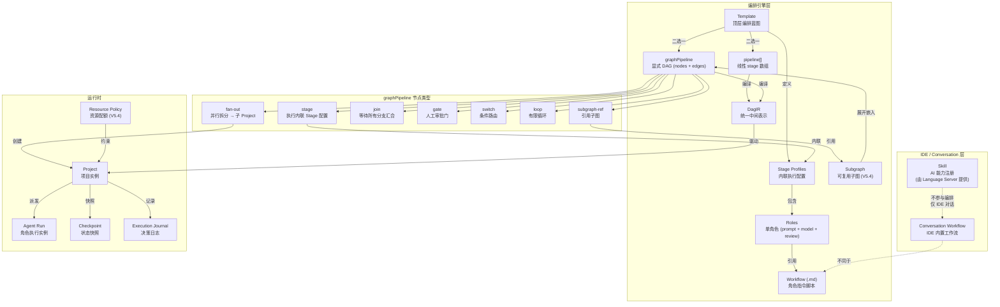

### 概念说明

| 概念 | 定义 | 生命周期 |
|:-----|:-----|:---------|
| **Skill** | Language Server 注册的 AI 能力（如 `edit_file`、`codebase_search`）。通过 gRPC 从 IDE 获取。 | IDE 内置，**不参与 Pipeline 编排** |
| **Workflow** | 存储在 `assets/workflows/*.md` 的指令脚本。每个 Role 引用一个 workflow 路径（如 `/dev-worker`），运行时注入为 Agent 的 system prompt。 | 由模板作者编写，角色执行时加载 |
| **Stage Profile** | Stage / node 内联执行配置，定义执行模式、角色、能力、来源约束。 | 内联定义在 `pipeline[]` / `graphPipeline.nodes[]` |
| **Template** | 顶层编排蓝图。包含 `pipeline[]` 或 `graphPipeline`，以及可选的 `contract` 定义。 | 存储在 `assets/templates/*.json` |
| **pipeline[]** | 线性 stage 数组，隐式顺序依赖。简单场景推荐。 | Template 内定义，编译时转化为 DagIR |
| **graphPipeline** | 显式 DAG 定义（`nodes[]` + `edges[]`），支持 8 种节点类型。复杂场景推荐。 | Template 内定义，编译时转化为 DagIR |
| **DagIR** | 统一的中间表示（V5.0）。运行时只认 DagIR，不区分原始格式。 | 编译时生成，缓存在内存 |
| **Fan-out** | DAG 中的并行拆分点。读取上游产出的 work-packages，为每项创建独立子 Project。 | graphPipeline 或 pipeline 中的节点类型 |
| **Subgraph** | 可复用的 DAG 片段（V5.4）。在编译时展开为 IR 节点。 | 存储在 `assets/templates/*.json`（`kind: 'subgraph'`） |
| **Resource Policy** | 资源配额策略（V5.4）。限制 runs / branches / iterations 等。 | 存储在 policies 目录 |

### 关键澄清

1. **Skill ≠ Workflow**：Skill 是 IDE 层面的 AI 能力注册（类似 MCP tool），不参与 Pipeline 编排。Workflow 是 Agent 的指令脚本，驱动每个 Role 的行为。
2. **pipeline[] 与 graphPipeline 互斥**：一个 Template 只能用一种格式。两者编译为同一个 DagIR，共享同一个运行时。
3. **Fan-out 创建子 Project**：fan-out 不是"在同一个 Project 中并行"，而是为每个 work-package 创建独立子 Project，各自有独立的 `projectId`、运行历史和状态。
4. **Subgraph 是编译时概念**：subgraph-ref 在编译为 DagIR 时被展开，运行时不存在"子图"的概念。

---

## 1. Conversation 对话系统

### 数据流

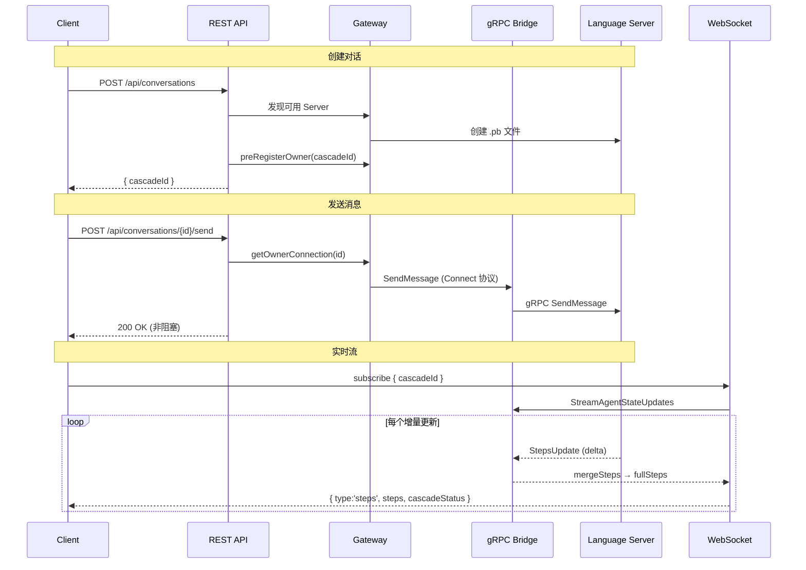

### 关键文件

| 文件 | 职责 |
|---|---|
| `src/app/api/conversations/route.ts` | 创建/列出对话；`antigravity` 走 Cascade，`codex / native-codex / claude-api / openai-api / gemini-api / grok-api / custom` 走本地 conversation |
| `src/app/api/conversations/[id]/send/route.ts` | 发送消息；Antigravity 走 gRPC，本地 provider 走 Gateway executor / transcript store，支持 `@[file]` 附件；本地 provider failed status 会转为 HTTP error |
| `src/app/api/conversations/[id]/steps/route.ts` | 读取对话步骤；支持 gRPC checkpoint、本地 transcript 文件与 API-backed transcript store |
| `server.ts` `/ws` | WebSocket 订阅 (`subscribe` / `multi-subscribe` / `unsubscribe`) |
| `src/lib/bridge/gateway.ts` | 服务发现 + Conv→Owner 路由映射 |
| `src/lib/bridge/grpc.ts` | Connect 协议编解码 `[flags:1][len:4][payload]` |
| `src/lib/agents/step-merger.ts` | 增量步骤合并为完整时间线 |
| `src/components/chat.tsx` | 聊天 UI，Timeline 步骤渲染 |

### Connect 协议封装

Gateway 与 Language Server 之间使用 **gRPC-Web Connect** 协议通信：

```
请求: POST https://localhost:{port}/connect-rpc/{service}/{method}
Body:  [flags: 1 byte][length: 4 bytes][JSON payload]
认证:  x-csrf-token header
```

### 服务发现

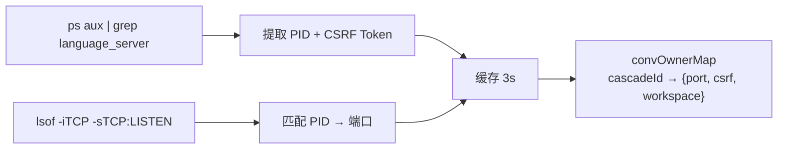

---

## 2. Agent 多代理系统

### 运行生命周期

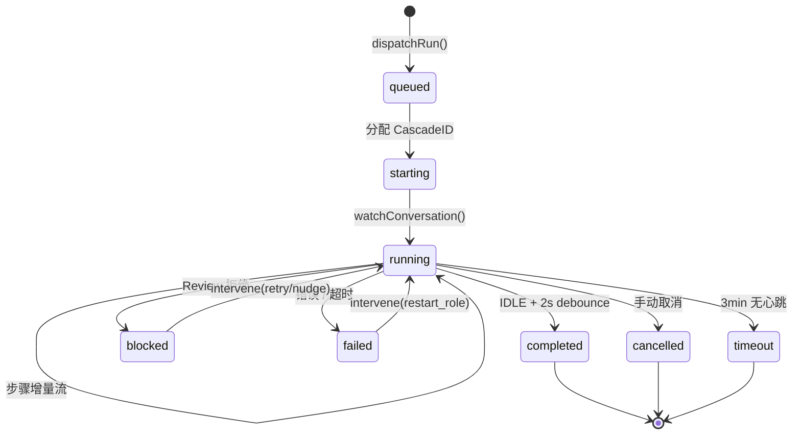

### Stage Profile 及角色

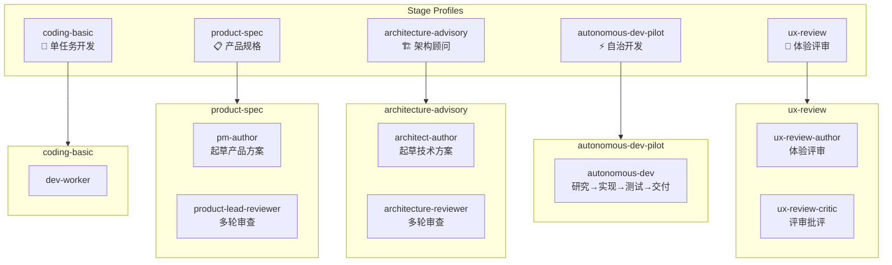

### Pipeline 交付流

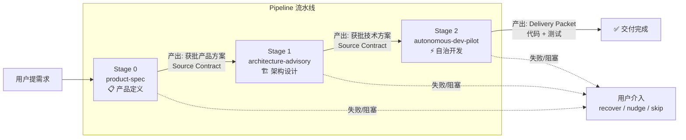

### Source Contract 机制

上游 Run 的产物自动注入下游：

```
SourceContract {
  requireReviewOutcome: ['approved']       // 上游必须通过审阅
  acceptedSourceStageIds: ['product-spec'] // 可接受的上游 stage
  autoBuildInputArtifactsFromSources: true // 自动构建输入产物
  autoIncludeUpstreamSourceRuns: true      // 传递性依赖解析
}
```

### Review 审阅机制

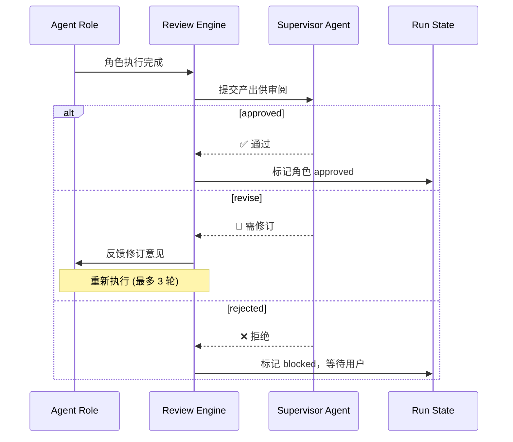

### 关键文件

| 文件 | 职责 |
|---|---|
| `server.ts` | 统一 role launcher：`web / api / control-plane / runtime / scheduler` |
| `src/lib/gateway-role.ts` | split 角色与代理开关判定 |
| `src/proxy.ts` | web-only API guard：未配置 control-plane/runtime URL 时阻断 `/api/*` |
| `src/server/shared/proxy.ts` | Next route handler 到 control-plane/runtime 的薄代理 |
| `src/server/shared/http-server.ts` | 基于 Fetch Request/Response 的轻量 route server |
| `src/server/api/server.ts` | 同设备默认后端：组合 control-plane 与 runtime routes；默认承载 cron scheduler，关闭 importer/bridge worker |
| `src/server/control-plane/server.ts` | 控制面独立 HTTP server |
| `src/server/control-plane/company-routes.ts` | Company Kernel control-plane routes；按请求懒加载 Next App Route handler，降低控制面启动与测试导入成本 |
| `src/server/control-plane/routes/*.ts` | CEO / Departments / Approval / Settings / Workspaces 的共享控制面 handler |
| `src/server/runtime/server.ts` | 运行时独立 HTTP server |
| `src/server/runtime/routes/*.ts` | runtime-owned 的 user/workspace handler |
| `src/server/workers/scheduler-worker.ts` | scheduler worker 与单实例保护；cron 和 companion 后台分开开关 |
| `src/lib/agents/group-runtime.ts` | 核心 stage runtime: dispatch → watch → compact → review |
| `src/lib/agents/dispatch-service.ts` | 统一派发入口 `executeDispatch()`，CEO 和 team-dispatch 共用 |
| `src/lib/agents/stage-resolver.ts` | 基于 `templateId + stageId` 解析 stage 定义 |
| `src/lib/agents/pipeline/template-normalizer.ts` | 加载期归一化 legacy 模板到 inline-only schema |
| `src/lib/agents/prompt-builder.ts` | Prompt 构建 + review 决策解析 |
| `src/lib/agents/supervisor.ts` | Supervisor AI Loop + 步骤摘要 |
| `src/lib/agents/run-artifacts.ts` | Artifact 扫描/复制 + 交付包读取 + 范围审计 |
| `src/lib/agents/result-parser.ts` | Result.json 解析 + step 启发式提取 |
| `src/lib/agents/finalization.ts` | Advisory/Delivery run 终态处理 |
| `src/lib/agents/runtime-helpers.ts` | 路径规范化、证据提取、审计构建、终止传播 |
| `src/lib/agents/run-registry.ts` | Run 状态持久化（SQLite `runs` 表 + `run-history.jsonl` 事件补写） |
| `src/lib/agents/asset-loader.ts` | 从磁盘加载 template/review-policy，并做 inline-only normalize |
| `src/lib/agents/watch-conversation.ts` | gRPC 流监听子对话，30s 心跳 / 3min 超时 |
| `src/lib/agents/review-engine.ts` | Supervisor 审阅: approve / revise / reject |
| `src/lib/agents/step-merger.ts` | 增量步骤合并 |
| `src/lib/agents/checkpoint-manager.ts` | Pipeline 状态快照与恢复 |
| `src/lib/agents/scheduler.ts` | Cron 定时任务调度 |
| `src/lib/agents/department-sync.ts` | IDE 规则同步（Antigravity/Claude/Codex/Cursor） |
| `src/lib/agents/department-memory.ts` | 三层持久记忆（组织/部门/会话） |
| `src/lib/company-kernel/*` | 公司运行内核：RunCapsule、WorkingCheckpoint、MemoryCandidate、OperatingSignal、Agenda、Budget、AutonomyPolicy、CircuitBreaker、GrowthProposal |
| `src/lib/knowledge/store.ts` | 结构化 `KnowledgeAsset` 存储（SQLite + filesystem mirror） |
| `src/lib/knowledge/retrieval.ts` | 按 workspace / prompt / workflow / skill 召回相关知识 |
| `src/lib/execution/contracts.ts` | `ExecutionProfile` 合同与 run/scheduler 推导逻辑 |
| `src/lib/agents/approval-triggers.ts` | 异常时自动触发审批请求 |

---

## 3. Project 项目系统

### 数据模型


### Pipeline 状态机

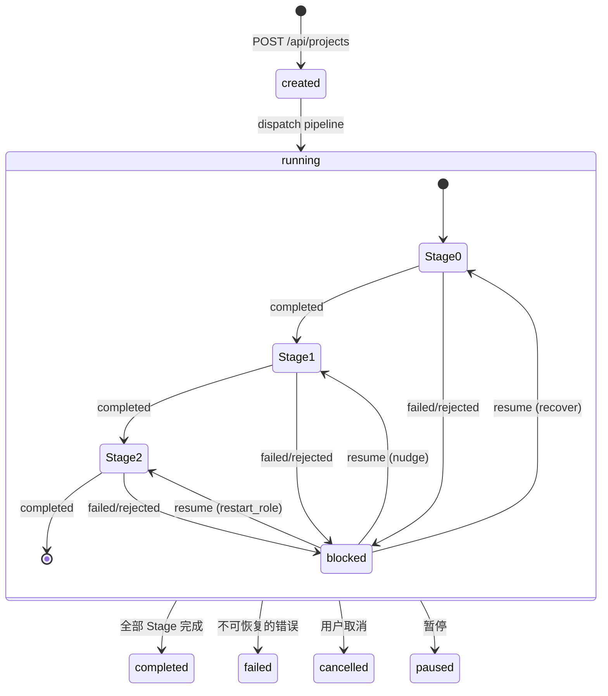

### 持久化

```
~/.gemini/antigravity/gateway/
├── assets/
│   ├── templates/             # Pipeline 模板 JSON
│   ├── workflows/             # 全局 Workflow .md（跨项目共享）
│   └── review-policies/       # 审阅策略 JSON
├── storage.sqlite             # 主数据库（projects / runs / conversations / links / visibility / jobs / deliverables）
├── runs/{runId}/
│   └── run-history.jsonl      # Run 级统一执行历史
├── projects/{projectId}/
│   └── journal.jsonl          # Project 级 control-flow 日志
└── legacy-backup/             # 一次切换迁移后的旧 JSON 备份

~/.gemini/antigravity/
└── conversations/             # 对话 .pb 文件

{workspace}/demolong/
├── projects/{projectId}/
│   ├── project.json           # 项目输出镜像（SQLite 仍是主真相源）
│   └── runs/{runId}/          # 按 Run 存储产出
└── runs/{runId}/              # 独立 Run（无 Project）产出
```

### 关键文件

| 文件 | 职责 |
|---|---|
| `src/lib/agents/project-registry.ts` | 项目 CRUD + Pipeline 状态管理 |
| `src/lib/agents/project-types.ts` | 项目数据模型 |
| `src/lib/agents/project-events.ts` | 项目事件总线（`stage:failed` 等） |
| `src/lib/agents/project-diagnostics.ts` | 项目健康诊断 |
| `src/lib/agents/project-reconciler.ts` | 项目状态修复 |
| `src/lib/bridge/conversation-importer.ts` | `.pb / brain / state.vscdb / live trajectory` 导入 SQLite conversation projection |
| `src/lib/bridge/worker-entry.ts` | Bridge/importer worker 启动入口 |
| `src/lib/agents/dag-compiler.ts` | Pipeline → DagIR 编译器 |
| `src/lib/agents/dag-ir-types.ts` | DagIR 中间表示类型 |
| `src/lib/agents/dag-runtime.ts` | DagIR 运行时执行器 |
| `src/lib/agents/graph-compiler.ts` | graphPipeline → DagIR 编译 |
| `src/lib/agents/graph-pipeline-types.ts` | graphPipeline 类型定义 |
| `src/lib/agents/fan-out-controller.ts` | Fan-out 分支控制器 |
| `src/lib/agents/contract-validator.ts` | Source Contract 验证 |
| `src/lib/agents/execution-journal.ts` | 决策日志记录/查询 |
| `src/lib/agents/pipeline-generator.ts` | AI 辅助 Pipeline 生成 |
| `src/lib/agents/resource-policy-engine.ts` | 资源配额策略执行 |
| `src/lib/agents/scope-governor.ts` | 写入范围审计 |

---

## 4. MCP Server

### 架构

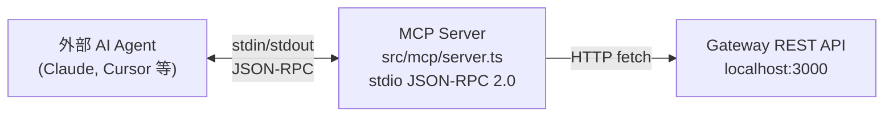

### 暴露的 Tools

| Tool | 版本 | 功能 | 只读 | 幂等 |
|---|---|---|---|---|
| `antigravity_list_projects` | V3 | 列出项目 + Pipeline 状态 | ✅ | ✅ |
| `antigravity_get_project` | V3 | 获取项目详情 + 全部阶段 | ✅ | ✅ |
| `antigravity_get_run` | V3 | 获取 Run 详情 + Supervisor 审阅 | ✅ | ✅ |
| `antigravity_intervene_run` | V3 | 重试 / 推进 / 重启角色 / 取消 | ❌ | ❌ |
| `antigravity_dispatch_pipeline` | V3 | 从模板启动新 Agent Run | ❌ | ✅* |
| `antigravity_get_project_diagnostics` | V3.5 | 项目健康诊断 | ✅ | ✅ |
| `antigravity_list_scheduler_jobs` | V3.5 | 定时任务列表 | ✅ | ✅ |
| `antigravity_reconcile_project` | V3.5 | 项目状态修复（默认 dryRun） | ❌ | ✅ |
| `antigravity_lint_template` | V4.4 | 模板契约校验 | ✅ | ✅ |
| `antigravity_validate_template` | V5.1 | 通用格式校验（自动检测格式） | ✅ | ✅ |
| `antigravity_convert_template` | V5.1 | pipeline ↔ graphPipeline 互转 | ✅ | ✅ |
| `antigravity_gate_approve` | V5.2 | Gate 节点审批 / 拒绝 | ❌ | ❌ |
| `antigravity_list_checkpoints` | V5.2 | 列出 Checkpoint 快照 | ✅ | ✅ |
| `antigravity_replay` | V5.2 | 从 Checkpoint 恢复 | ❌ | ❌ |
| `antigravity_query_journal` | V5.2 | 查询执行日志 | ✅ | ✅ |
| `antigravity_generate_pipeline` | V5.3 | AI 生成 Pipeline 草案 | ✅ | ❌ |
| `antigravity_confirm_pipeline_draft` | V5.3 | 确认保存 AI 草案 | ❌ | ❌ |
| `antigravity_list_subgraphs` | V5.4 | 列出可复用子图 | ✅ | ✅ |
| `antigravity_list_policies` | V5.4 | 列出资源配额策略 | ✅ | ✅ |
| `antigravity_check_policy` | V5.4 | 检查配额是否超限 | ✅ | ✅ |

> *dispatch 具有幂等检测：已完成的 Run 会自动短路，避免重复执行。

### 启动方式

```bash
npx tsx src/mcp/server.ts    # stdio 模式
```

---

## 5. Codex 集成

### 架构

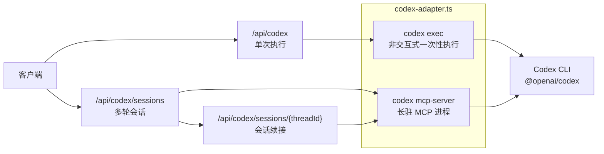

### 两种模式

| 模式 | API | 说明 |
|:-----|:----|:-----|
| **Exec** | `POST /api/codex` | 单次非交互执行。等价于 `codex exec "prompt"`。适合简单一次性任务 |
| **MCP Session** | `POST /api/codex/sessions` + `POST /api/codex/sessions/{threadId}` | 多轮对话。底层维持 `codex mcp-server` 长驻进程，支持线程续接 |

### 关键组件

| 文件 | 职责 |
|---|---|
| `src/lib/bridge/codex-adapter.ts` | Codex CLI 封装：exec 函数 + MCP Client 类 |
| `src/app/api/codex/route.ts` | 单次执行 API |
| `src/app/api/codex/sessions/route.ts` | 创建 MCP 会话 |
| `src/app/api/codex/sessions/[threadId]/route.ts` | 续接 MCP 会话 |
| `src/app/api/codex/_mcp-client.ts` | MCP Client 单例管理（globalThis 存活，热重载安全） |

### Sandbox 模式

| Sandbox | 权限 |
|:--------|:-----|
| `read-only` | 只读（exec 默认） |
| `workspace-write` | 可写工作区（session 默认） |
| `danger-full-access` | 完全访问 |

### 前置条件

需要全局安装 Codex CLI：`npm i -g @openai/codex`

---

## 6. Provider Abstraction Layer

### 概述

Provider Abstraction Layer 是多 Provider 支持的核心。所有 AI 交互（Agent 任务执行、Supervisor 审阅、Nudge）都通过统一的 `TaskExecutor` 接口进行。运行时仍由 `group-runtime.ts` 承载，但它现在是 stage-centric 的 Stage Runtime，不直接调用 gRPC 或 Codex MCP。

### 架构

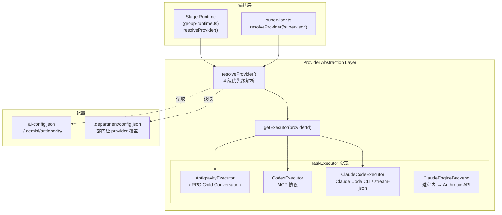

### TaskExecutor 接口

```typescript
interface TaskExecutor {
  readonly providerId: string
  executeTask(opts: TaskExecutionOptions): Promise<TaskExecutionResult>
  appendMessage(handle: string, opts: AppendMessageOptions): Promise<TaskExecutionResult>
  cancel(handle: string): Promise<void>
  capabilities(): ProviderCapabilities
}
```

### Provider 解析优先级

`resolveProvider(sceneOrLayer, workspacePath?)` 按以下顺序依次匹配：

| 优先级 | 来源 | 示例 |
|:-------|:-----|:-----|
| 1 (最高) | Scene 级覆盖 | `scenes.supervisor.provider = 'antigravity'` |
| 2 | Department 级覆盖 | `.department/config.json` 中 `provider: 'codex'` |
| 3 | Layer 级默认 | `layers.execution.provider = 'codex'` |
| 4 (兜底) | 组织默认 | `defaultProvider: 'antigravity'` |

### AI Layer 定义

| Layer | 场景 | 默认 Provider |
|:------|:-----|:-------------|
| `executive` | （保留，用于未来 CEO AI 决策） | antigravity |
| `management` | Supervisor 巡检、Evaluate 干预、记忆提取 | antigravity |
| `execution` | Pipeline 任务执行（Stage Runtime 角色执行） | antigravity |
| `utility` | Review 决策解析、代码摘要 | antigravity |

### Scene 覆盖

可对特定场景指定 provider + model + 约束条件：

```json
{
  "scenes": {
    "supervisor": { "provider": "antigravity", "model": "MODEL_PLACEHOLDER_M47" },
    "nudge": { "provider": "codex", "constraints": { "timeout": 60000 } }
  }
}
```

### 支持的 Provider

| ProviderId | 实现类 | 协议 | 状态 |
|:-----------|:-------|:-----|:-----|
| `antigravity` | `AntigravityExecutor` | gRPC → Language Server | ✅ 已实现 |
| `codex` | `CodexExecutor` | MCP → Codex CLI subprocess | ✅ 已实现 |
| `native-codex` | `NativeCodexExecutor` | OAuth → Codex Responses API (in-process) | ✅ 已实现 |
| `claude-code` | `ClaudeCodeExecutor` | Claude Code CLI → stream-json | ✅ 已实现 |
| `claude-api` | `ClaudeEngineAgentBackend` | 内存级 → Anthropic API | ✅ 已实现 |
| `openai-api` | `ClaudeEngineAgentBackend` | 内存级 → OpenAI API | ✅ 已实现 |
| `gemini-api` | `ClaudeEngineAgentBackend` | 内存级 → Gemini REST API | ✅ 已实现 |
| `grok-api` | `ClaudeEngineAgentBackend` | 内存级 → xAI / Grok API | ✅ 已实现 |
| `custom` | `ClaudeEngineAgentBackend` | 内存级 → OpenAI-compatible API | ✅ 已实现 |

### Capability 矩阵

| 能力 | Antigravity | Codex | Native Codex | Claude Code | Claude / OpenAI / Gemini / Grok / Custom API |
|:-----|:------------|:------|:-------------|:------------|:----------------------------------------------|
| 流式步骤数据 | ✅ | ❌ | ❌ | ❌ | ❌ |
| 流式文本输出 | ✅ | ❌ | ❌ | ❌ | ✅ |
| 多轮对话 | ✅ | ✅ | ✅ | ✅ | ✅ |
| IDE 技能（重构/导航） | ✅ | ❌ | ❌ | ❌ | ❌ |
| 沙盒执行 | ❌ | ✅ | ❌ | ❌ | ❌ |
| 取消运行 | ✅ | ❌ | ❌ | ✅ | ✅ |
| 实时步骤监听 | ✅ | ❌ | ❌ | ❌ | ❌ |
| 无需外部 Runtime | ❌ | ❌ | ✅ | ❌ | ✅ |
| 免 API 额度消耗 | ❌ | ❌ | ✅ | ❌ | ❌ |
| 内建工具执行 | ❌ | ❌ | ❌ | ❌ | ✅ |

### Department Runtime Contract 当前接线边界

`POST /api/agent-runs` 现在已经支持把 `executionProfile + departmentRuntimeContract` 作为结构化 carrier 注入 `taskEnvelope`，并由：

1. `src/app/api/agent-runs/route.ts`
2. `src/lib/agents/group-runtime.ts`
3. `src/lib/agents/prompt-executor.ts`
4. `src/lib/backends/types.ts`

一路透传到 `BackendRunConfig`。

当前真正消费这套 Department runtime 合同的是：

- `src/lib/backends/claude-engine-backend.ts`

因此已经覆盖的 provider 为：

1. `claude-api`
2. `openai-api`
3. `gemini-api`
4. `grok-api`
5. `custom`

当前已经完成的是：

1. `native-codex`
   - Department / `agent-runs` 主链已经切到 `ClaudeEngineAgentBackend('native-codex')`
2. `claude-api / openai-api / gemini-api / grok-api / custom`
   - 继续走同一条 Claude Engine Department runtime

当前仍保留在轻量/local runtime 的是：

1. `codex`

它不进入 Claude Engine Department runtime 主链，高约束任务会由 capability-aware routing 回退到更强的 provider。

### 运行历史与会话持久化

| Provider 路径 | 原始过程来源 | Cutover 后持久化 | 当前可见性边界 |
|:--------------|:-------------|:-----------------|:---------------|
| `antigravity` | IDE conversation + gRPC step stream | `storage.sqlite` + `run-history.jsonl`（含 `provider.step`） | 新 run 可完整回放；老 run 若早于 cutover，通常只能回放 transcript/result/artifact 级别信息 |
| `codex` / `native-codex` | Gateway 自管 transcript / thread handle | `storage.sqlite` + `run-history.jsonl`（user/assistant/tool/result） | 新 run 可完整回放；老 run 通过迁移补出 transcript/result/verification/artifact |
| `claude-code` / `claude-api` / `openai-api` / `gemini-api` / `grok-api` / `custom` | Gateway 自管 stream / tool / completion 事件 | `storage.sqlite` + `run-history.jsonl` | 新 run 按统一 schema 可回放；历史 run 取决于 cutover 前是否已有可导入 transcript |

**重要边界**

- `storage.sqlite` 是结构化主数据真相源；`conversations / run_conversation_links / conversation_visibility / conversation_owner_cache` 共同承担 conversation 读模型。
- `run-history.jsonl` 是 run 级执行历史真相源。
- `Project journal.jsonl` 仍保留，但只承担 project 级 control-flow，不承担完整 conversation 语义。
- **只有 cutover 后的新 run 保证完整 provider 过程历史。** cutover 前的老 run 经过迁移后可见，但不保证恢复出完整 step-by-step 过程。

### 配置文件

- **组织级**: `~/.gemini/antigravity/ai-config.json`
- **部门级**: `workspace/.department/config.json` 中的 `provider` 字段

### Provider 可用性约束

- Settings `Provider 配置` / `Scene 覆盖` 下拉只展示当前真实可用的 Provider。
- 可用性来源于 `ProviderInventory`：API Key 是否已配置、本地 CLI 是否已安装、OAuth / CLI 登录态是否存在。
- `/api/ai-config` 在保存前会对 `defaultProvider`、`layers.*.provider`、`scenes.*.provider` 做同一套校验，拒绝任何未配置 Provider，避免前端绕过。

### 关键文件

| 文件 | 职责 |
|---|---|
| `src/lib/providers/types.ts` | `TaskExecutor`、`AIProviderConfig`、`ProviderId` 等类型定义 |
| `src/lib/providers/ai-config.ts` | 配置加载/缓存/持久化 + `resolveProvider()` 4 级解析 |
| `src/lib/providers/provider-availability.ts` | Provider 可用性规则、选择器可选项过滤、配置保存校验 |
| `src/lib/providers/provider-inventory.ts` | 读取 API Key 状态 + 本地 CLI / 登录态，生成 `ProviderInventory` |
| `src/lib/providers/antigravity-executor.ts` | gRPC 子对话创建 + 消息发送 |
| `src/lib/providers/codex-executor.ts` | MCP Client 池管理 + 同步任务执行 (legacy, 依赖 codex CLI) |
| `src/lib/providers/native-codex-executor.ts` | 原生 Codex OAuth 执行器 (in-process, 免 API 额度) |
| `src/lib/bridge/native-codex-auth.ts` | Codex OAuth Token 读取 / JWT 过期检查 / 自动刷新 |
| `src/lib/bridge/native-codex-adapter.ts` | Responses Streaming API 适配 (chatgpt.com/backend-api/codex) |
| `src/lib/providers/claude-code-executor.ts` | Claude Code CLI 调用 + stream-json 结果归一化入口 |
| `src/lib/backends/claude-engine-backend.ts` | ClaudeEngine 进程内执行器 + AgentBackend 适配 |
| `src/lib/providers/index.ts` | 导出 + `getExecutor()` 工厂函数 |

### Claude Engine 子系统（M1 类型基座 + M2 上下文层 + M3 记忆层 + M4 工具层 + M5 权限层 + M6 API 层 + M7 MCP 层 + M8 查询引擎）

`src/lib/claude-engine/` 是 Claude Code 内嵌迁移的新子系统。当前已经落了八层基础能力：

1. **M1 类型基座**：提供消息、权限、工具合同。
2. **M2 上下文层**：提供参数化 Git 快照、CLAUDE.md 分层发现与 prompt 上下文聚合。
3. **M3 记忆层**：提供文件型 MEMORY.md 目录约定、安全路径校验、frontmatter 扫描、记忆存储与系统提示拼装。
4. **M4 工具层**：提供 6 个核心工具与独立注册器，可直接完成文本文件读写编辑、shell 执行、glob 搜索与 grep 搜索。
5. **M5 权限层**：提供规则类型、规则字符串解析、MCP 工具前缀匹配、来源优先级和内存态 `PermissionChecker`。
6. **M6 API 层**：提供原生 `fetch` 版 Anthropic Messages API 客户端、SSE 解析、指数退避重试、工具 schema 转换与 token/费用跟踪。
7. **M7 MCP 层**：提供 stdio-only MCP client、工具/资源发现、工具调用、多 server 管理，以及 `mcp__server__tool` 到 Claude Engine Tool 的桥接。
8. **M8 查询引擎**：提供 tool-aware 的多 turn query loop、顺序/并行工具执行器，以及维护对话历史与累计 usage 的 `ClaudeEngine` 高层封装。

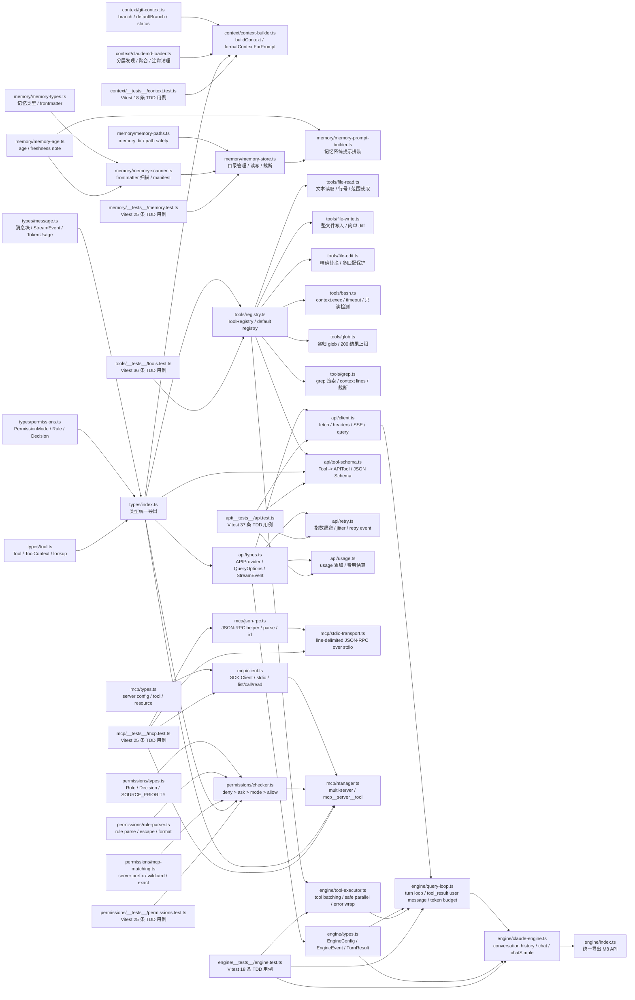

当前边界：

1. 不依赖 React / UI / AppState。
2. 不依赖 `bun:bundle` 或 Claude Code 仓库内部模块。
3. Git 调用通过注入的 `exec` 执行；M3 的文件系统访问使用 Node `fs/promises` 与显式路径校验。
4. 当前只迁入本地文件型 memory primitives：目录定位、扫描、读写、截断和 prompt 组装。
5. M5 当前只覆盖内存态权限 primitives：规则解析、MCP 前缀匹配、来源优先级和 mode 判定；不包含权限 UI、磁盘持久化、classifier 或 denial tracking。
6. M6 当前只覆盖 Anthropic 直连：原生 `fetch` + SSE 解析 + `query()` + retry/tool-schema/usage；`openai` / `bedrock` / `vertex` 仅保留 provider 接口与类型，未实现实际调用。
7. M6 当前不实现 OAuth、Bedrock/Vertex 鉴权适配，也不依赖 `@anthropic-ai/sdk` 或 `zod-to-json-schema`。
8. M7 当前运行时主链优先使用 `@modelcontextprotocol/sdk` 的 `Client` 与 `StdioClientTransport`，只实现 stdio transport；SSE/HTTP 仅保留配置字段，未落地。
9. M7 当前不实现 OAuth、远程认证或真实 MCP server 端到端联调；`json-rpc.ts` 与 `stdio-transport.ts` 主要作为 repo 内轻量 helper / fallback primitive 保留并测试。
10. M8 当前只覆盖核心 main loop、tool execution loop 与对话历史管理；不实现消息压缩、streaming tool execution、UI/React 集成或 provider 级 fallback。
11. 当前仍未迁入 Claude Code 的 LLM 相关记忆检索、memory extraction agent 与非核心工具集。
12. M4 本地核心工具当前只覆盖 6 个基础工具；MCP 工具通过 M7 管理器桥接，不属于本地内建工具集。

关键文件：

| 文件 | 职责 |
|---|---|
| `src/lib/claude-engine/types/message.ts` | 定义 Claude Engine 的消息块、流事件与 token usage |
| `src/lib/claude-engine/types/permissions.ts` | 定义权限模式、规则、决策与工作目录来源 |
| `src/lib/claude-engine/types/tool.ts` | 定义 Tool/ToolContext/ToolResult，并提供名称匹配与查找函数 |
| `src/lib/claude-engine/context/git-context.ts` | 提取工作区 Git 上下文，返回 branch、defaultBranch、commit 与 status 摘要 |
| `src/lib/claude-engine/context/claudemd-loader.ts` | 分层发现并加载 CLAUDE.md / CLAUDE.local.md / `.claude/rules/*.md` |
| `src/lib/claude-engine/context/context-builder.ts` | 聚合 Git、日期、CLAUDE.md，并格式化为 prompt 可消费上下文 |
| `src/lib/claude-engine/context/index.ts` | 统一导出上下文层公共 API |
| `src/lib/claude-engine/context/__tests__/context.test.ts` | 锁定 M2 上下文层的 18 条最小 TDD 基线 |
| `src/lib/claude-engine/memory/memory-types.ts` | 定义 4 种记忆类型、header 和 frontmatter 合同 |
| `src/lib/claude-engine/memory/memory-paths.ts` | 计算 per-project memory 目录、entrypoint 路径并校验安全路径 |
| `src/lib/claude-engine/memory/memory-age.ts` | 将文件 mtime 转换成 age / freshness reminder |
| `src/lib/claude-engine/memory/memory-scanner.ts` | 扫描 memory 目录、解析 frontmatter、格式化清单 |
| `src/lib/claude-engine/memory/memory-store.ts` | 管理 memory 目录、记忆文件读写、删除和 MEMORY.md 截断 |
| `src/lib/claude-engine/memory/memory-prompt-builder.ts` | 构建记忆系统提示、类型指导与禁止保存清单 |
| `src/lib/claude-engine/memory/index.ts` | 统一导出 M3 记忆层公共 API |
| `src/lib/claude-engine/memory/__tests__/memory.test.ts` | 锁定 M3 记忆层的 25 条最小 TDD 基线 |
| `src/lib/claude-engine/tools/registry.ts` | 提供 ToolRegistry、默认 registry 与按 enabled/read-only 过滤 helper |
| `src/lib/claude-engine/tools/file-read.ts` | 读取文本文件并附加行号、offset/limit 截取与元数据 |
| `src/lib/claude-engine/tools/file-write.ts` | 整文件创建/覆盖写入，返回 create/update 类型与简单行级 diff 统计 |
| `src/lib/claude-engine/tools/file-edit.ts` | 基于 exact match 做精确替换，拦截 0 匹配或多匹配未确认写入 |
| `src/lib/claude-engine/tools/bash.ts` | 通过 `ToolContext.exec()` 执行 shell，提供 timeout、输出截断和只读/破坏性检测 |
| `src/lib/claude-engine/tools/glob.ts` | 递归扫描目录并按 glob 模式返回相对路径，最多 200 条结果 |
| `src/lib/claude-engine/tools/grep.ts` | 基于 grep 命令搜索文件内容，支持大小写、上下文行和结果截断 |
| `src/lib/claude-engine/tools/index.ts` | 统一导出 M4 工具层公共 API |
| `src/lib/claude-engine/tools/__tests__/tools.test.ts` | 锁定 M4 工具层的 36 条最小 TDD 基线 |
| `src/lib/claude-engine/permissions/types.ts` | 定义权限规则来源、行为、决策与来源优先级 |
| `src/lib/claude-engine/permissions/rule-parser.ts` | 解析 / 格式化规则字符串，并处理 `(` `)` `\` 转义 |
| `src/lib/claude-engine/permissions/mcp-matching.ts` | 解析 MCP 工具名，支持 server 级、通配符和精确匹配 |
| `src/lib/claude-engine/permissions/checker.ts` | 提供内存态 PermissionChecker，支持 deny/ask/allow 优先级、mode 和 session 规则 |
| `src/lib/claude-engine/permissions/index.ts` | 统一导出 M5 权限层公共 API |
| `src/lib/claude-engine/permissions/__tests__/permissions.test.ts` | 锁定 M5 权限层的 25 条最小 TDD 基线 |
| `src/lib/claude-engine/api/types.ts` | 定义 APIProvider、ModelConfig、QueryOptions、StreamEvent、APIResponse 等 M6 合同 |
| `src/lib/claude-engine/api/client.ts` | 原生 `fetch` 调用 Anthropic Messages API，构建 headers/body，解析 SSE，并提供 `streamQuery()` / `query()` |
| `src/lib/claude-engine/api/retry.ts` | 提供 `streamQueryWithRetry()`、指数退避 + jitter 与 retry event 流 |
| `src/lib/claude-engine/api/tool-schema.ts` | 将内部 Tool 定义转换为 Anthropic API `tools` 所需 JSON Schema |
| `src/lib/claude-engine/api/usage.ts` | 累加 token usage 并按模型定价表估算 USD 成本 |
| `src/lib/claude-engine/api/index.ts` | 统一导出 M6 API 层公共 API |
| `src/lib/claude-engine/api/__tests__/api.test.ts` | 锁定 M6 API 层的 37 条最小 TDD 基线 |
| `src/lib/claude-engine/mcp/types.ts` | 定义 MCP server 配置、状态、工具、资源、tool result 与 resource content 合同 |
| `src/lib/claude-engine/mcp/json-rpc.ts` | 提供轻量 JSON-RPC 2.0 helper：请求序列化、响应解析、通知识别与自增 ID |
| `src/lib/claude-engine/mcp/stdio-transport.ts` | 提供基于 `spawn()` 的 line-delimited JSON-RPC over stdio helper transport |
| `src/lib/claude-engine/mcp/client.ts` | 基于 `@modelcontextprotocol/sdk` 的 stdio-only MCP client，封装 connect/list/call/read |
| `src/lib/claude-engine/mcp/manager.ts` | 管理多个 MCP server，并将外部 `McpTool` 转换成 `mcp__server__tool` 形式的 Claude Engine Tool |
| `src/lib/claude-engine/mcp/index.ts` | 统一导出 M7 MCP 层公共 API |
| `src/lib/claude-engine/mcp/__tests__/mcp.test.ts` | 锁定 M7 MCP 层的 25 条最小 TDD 基线 |
| `src/lib/claude-engine/engine/types.ts` | 定义 `EngineConfig`、`EngineEvent`、`TurnResult`、`ToolCallResult` 与停止原因 |
| `src/lib/claude-engine/engine/tool-executor.ts` | 执行 `tool_use` 块，按并发安全性分组并包装错误/耗时元数据 |
| `src/lib/claude-engine/engine/query-loop.ts` | 驱动多 turn API 调用、流式块累积、工具执行、`tool_result` 注入与 token budget 检查 |
| `src/lib/claude-engine/engine/claude-engine.ts` | 提供维护对话历史的高层封装：`chat()`、`chatSimple()`、`getMessages()`、`getUsage()` |
| `src/lib/claude-engine/engine/index.ts` | 统一导出 M8 查询引擎公共 API |
| `src/lib/claude-engine/engine/__tests__/engine.test.ts` | 锁定 ToolExecutor、queryLoop 与 ClaudeEngine 的 18 条最小 TDD 基线 |

---

## 7. OPC 组织治理

### 概述

OPC（One Person Company）是 Antigravity Gateway 的组织治理模型。核心理念：

- **电脑 = 总部**，**文件夹 = 部门**
- **CEO（用户）** 通过自然语言下达指令，系统自动路由到正确的部门
- **部门自运营**：自主选择 Provider、工具、工作方式，在 Token 配额内自由操作

### Department 数据模型

每个 workspace 可配置为一个部门，配置存于 `workspace/.department/config.json`：

```typescript
interface DepartmentConfig {
  name: string                          // 部门名称
  type: string                          // 类型：build / research / operations / ceo
  typeIcon?: string                     // 类型图标
  description?: string                  // 部门定位描述
  templateIds?: string[]                // 可用 Pipeline 模板
  skills: DepartmentSkill[]             // 技能清单
  okr?: DepartmentOKR                   // OKR 目标
  roster?: DepartmentRoster[]           // 角色花名册（UI 人格化显示）
    provider?: 'antigravity' | 'codex' | 'native-codex' | 'claude-code' | 'claude-api' | 'openai-api' | 'gemini-api' | 'grok-api' | 'custom'    // 默认 Provider（覆盖组织级配置）
  tokenQuota?: TokenQuota               // Token 配额
}
```

### CEO Agent

CEO Agent 接收用户的自然语言命令，自动完成：

1. **意图识别**: 从命令文本中提取操作意图（创建项目、查看报告、取消任务等）
2. **部门匹配**: 根据命令关键词匹配最合适的部门（workspace）
3. **任务派发**: 调用 `executeDispatch()` 在目标部门创建 Project + Run

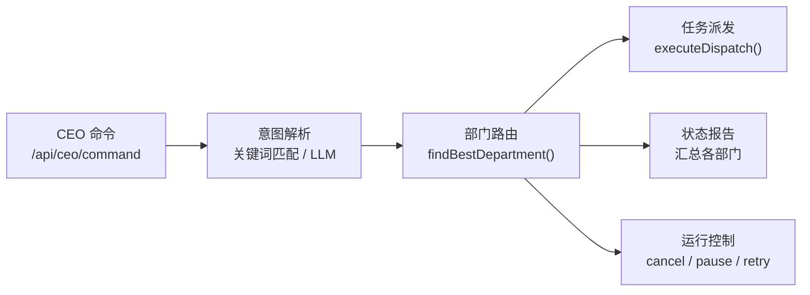

| 支持的操作 | 说明 |
|:----------|:-----|
| `create_project` | 在最匹配的部门创建项目 |
| `multi_create` | 批量创建多个项目 |
| `report_to_human` | 生成各部门状态汇报 |
| `cancel` / `pause` / `resume` | 控制运行中的任务 |
| `info` | 查询特定信息 |
| `needs_decision` | 需要 CEO 在多个方案间决策 |

### Approval Framework（审批框架）

Agent 在以下场景需要 CEO 审批：

| 审批类型 | 触发场景 |
|:---------|:---------|
| `token_increase` | 部门 Token 配额不足 |
| `tool_access` | 请求使用受限工具 |
| `provider_change` | 请求切换 Provider |
| `scope_extension` | 请求扩大写入范围 |
| `pipeline_approval` | Pipeline gate 节点卡点 |

#### 通知通道

| 通道 | 实现文件 | 交互方式 |
|:-----|:---------|:---------|
| Web UI | `approval/channels/web.ts` | Dashboard 审批页面 |
| Webhook (Slack/Discord) | `approval/channels/webhook.ts` | Webhook POST + 一键批准/拒绝链接 |
| IM (WeChat ACP) | `approval/channels/im.ts` | IM 内直接回复或点击链接 |

#### 审批流程

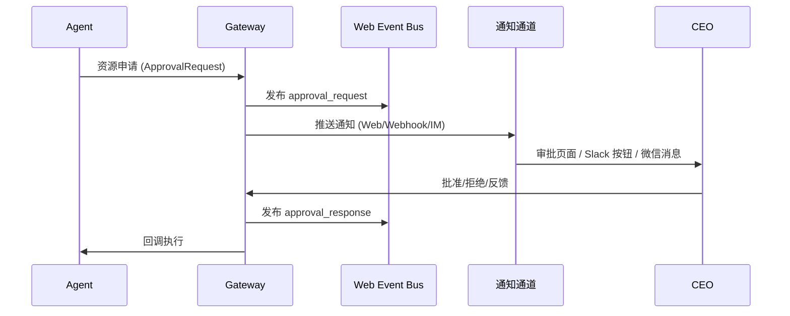

### Token 配额

```typescript
interface TokenQuota {
  daily: number                           // 每日额度
  monthly: number                         // 每月额度
  used: { daily: number; monthly: number } // 已使用
  canRequestMore: boolean                  // 是否允许申请增额
}
```

- Gateway 在 dispatch 前检查配额
- 配额不足时自动生成 `token_increase` 审批请求
- CEO 可通过 API 或 UI 调整配额

### 部门知识管理

```
workspace/
└── .department/
    ├── config.json      ← 结构化配置
    ├── rules/           ← 部门规则（Source of Truth，symlink 到各 IDE）
    ├── workflows/       ← 部门工作流
    └── memory/          ← 持久记忆
        ├── knowledge.md ← 技术知识
        ├── decisions.md ← 决策日志
        └── patterns.md  ← 最佳实践
```

### 关键文件

| 文件 | 职责 |
|---|---|
| `src/lib/agents/ceo-agent.ts` | CEO 命令处理 + 部门匹配 + 任务分发 |
| `src/lib/agents/ceo-tools.ts` | `listDepartments()` / `getDepartmentLoad()` / `ceoCreateProject()` |
| `src/lib/agents/ceo-prompts.ts` | CEO Agent 系统提示词 + 公司上下文构建 |
| `src/lib/organization/ceo-profile-store.ts` | CEOProfile 持久状态存储 |
| `src/lib/organization/ceo-routine.ts` | CEO routine summary 与首页 action target 生成 |
| `src/lib/organization/ceo-event-store.ts` | CEO 事件持久化存储 |
| `src/lib/organization/ceo-event-consumer.ts` | Project event → CEO event 消费器 |
| `src/lib/management/metrics.ts` | 经营指标、组织/部门概览与 scheduler runtime 状态计算 |
| `src/lib/ceo-office-home.ts` | CEO Office 首页展示辅助：日报候选排序、最近信号去重 |
| `src/lib/evolution/generator.ts` | 从 knowledge / repeated runs 生成 workflow/skill proposal |
| `src/lib/evolution/evaluator.ts` | 基于历史 runs 对 proposal 做评估 |
| `src/lib/evolution/publisher.ts` | proposal 审批发布与 rollout observe |
| `src/lib/approval/types.ts` | 审批数据模型（`ApprovalRequest` / `ApprovalResponse`） |
| `src/lib/approval/notification-events.ts` | Web 审批通知事件总线与最近事件回放 |
| `src/lib/approval/approval-urls.ts` | 审批 inbox / signed feedback URL 生成 |
| `src/lib/approval/tokens.ts` | 审批一键链接 HMAC token 生成与验证 |
| `src/lib/approval/channels/web.ts` | Web UI 通知通道 |
| `src/lib/approval/channels/webhook.ts` | Slack/Discord Webhook 通道 |
| `src/lib/approval/channels/im.ts` | WeChat ACP 通道 |
| `src/lib/ceo-events.ts` | CEO 事件流（critical/warning/info/done） |
| `src/app/api/departments/route.ts` | 部门配置 API（GET/PUT） |
| `src/app/api/ceo/command/route.ts` | CEO 命令入口 API |
| `src/app/api/ceo/profile/route.ts` | CEOProfile 读写 API |
| `src/app/api/ceo/profile/feedback/route.ts` | CEO 反馈信号写入 API |
| `src/app/api/ceo/routine/route.ts` | CEO routine summary API |
| `src/app/api/ceo/events/route.ts` | CEO 事件流 API |
| `src/app/api/management/overview/route.ts` | 组织/部门经营概览 API |
| `src/app/api/evolution/proposals/route.ts` | Evolution proposal 列表 API |
| `src/app/api/evolution/proposals/[id]/publish/route.ts` | Evolution proposal 发布审批入口 |
| `src/app/api/approval/route.ts` | 审批请求列表/提交 API |
| `src/app/api/approval/events/route.ts` | 审批 SSE 事件流 API |
| `src/server/control-plane/routes/approval-events.ts` | 独立 control-plane 审批 SSE handler |

---

## 7.5 Evolution Pipeline

### 概述

`Phase 5` 把“知识沉淀”进一步升级为“受控自演化闭环”：

1. `Proposal Generator`
   - 从 `KnowledgeAsset(status=proposal)` 与 repeated prompt runs 生成候选 proposal
2. `Replay Evaluator`
   - 用历史 runs 对 proposal 做样本匹配与成功率评估
3. `Approval Publish Flow`
   - proposal 先转为 `proposal_publish` 审批请求，再由 approval callback 真正发布
4. `Rollout Observe`
   - 发布后持续观测命中 run 数、成功率与最近采用时间

### 模块关系

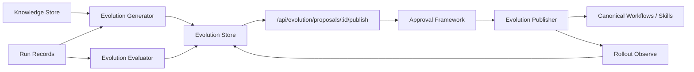

### 关键文件

| 文件 | 职责 |
|---|---|
| `src/lib/evolution/contracts.ts` | Proposal / Evaluation / Rollout 合同 |
| `src/lib/evolution/store.ts` | `evolution_proposals` SQLite 主存储 + 镜像 |
| `src/lib/evolution/generator.ts` | proposal 生成器 |
| `src/lib/evolution/evaluator.ts` | 历史 run 评估器 |
| `src/lib/evolution/publisher.ts` | 发布 + rollout 观察 |
| `src/app/api/evolution/proposals/generate/route.ts` | 生成 proposal |
| `src/app/api/evolution/proposals/[id]/evaluate/route.ts` | 评估 proposal |
| `src/app/api/evolution/proposals/[id]/publish/route.ts` | 创建发布审批 |
| `src/app/api/evolution/proposals/[id]/observe/route.ts` | 刷新 rollout 观察 |

---

## 8. Security Framework

### 概述

4 层安全机制保护 Agent 工具执行，从 Claude Code Base（CCB）适配而来。统一入口 `checkToolSafety()` 串行调用所有层，任一层失败即拒绝。

### 架构

```
┌─────────────────────────┐
│   Security Guard        │ ← 统一入口 checkToolSafety()
│   (security-guard.ts)   │   4 层串行检查，任一层失败即拒绝
├─────────────────────────┤
│ L1: Bash Safety         │ ← 命令模式匹配（阻止危险命令、检测注入）
│ L2: Permission Engine   │ ← 规则评估（allow/deny/ask × 4 种模式）
│ L3: Hook Runner         │ ← PreToolUse/PostToolUse 拦截器
│ L4: Sandbox Manager     │ ← 文件系统+网络隔离
└─────────────────────────┘
```

### 权限模式

| 模式 | 行为 |
|:-----|:-----|
| `bypass` | 跳过所有检查 |
| `strict` | 只允许明确 allow 的工具 |
| `permissive` | 只阻止明确 deny 的工具 |
| `default` | 按规则评估，未匹配时询问（OPC 中等同 deny） |

### 关键设计决策

1. **`ask` 在 OPC 等同 `deny`** — 无人交互环境下询问无意义
2. **Hook 失败容错（fail-open）** — Hook 抛错不阻塞执行，记录日志
3. **Bash 安全命令不短路** — `echo $(rm -rf /)` 不会因 `echo` 在安全列表而跳过
4. **路径遍历防护** — 规范化后检查是否在 workspace 内

### 关键文件

| 文件 | 职责 |
|---|---|
| `src/lib/security/security-guard.ts` | 统一入口，串行调用 4 层检查 |
| `src/lib/security/bash-safety.ts` | Bash 命令安全分析（10+ 检查项） |
| `src/lib/security/permission-engine.ts` | 权限规则评估 + 模式叠加 |
| `src/lib/security/hook-runner.ts` | Hook 注册/执行/排序/超时 |
| `src/lib/security/sandbox-manager.ts` | 文件系统 + 网络访问控制 |
| `src/lib/security/policy-loader.ts` | 策略加载/缓存/workspace 合并 |
| `src/lib/security/types.ts` | 完整类型定义 |

---

## 9. Scheduler（定时任务）

### 概述

Cron 风格的定时任务调度器，支持周期性触发 Pipeline、Execution Profile、Workflow 或 OPC 命令。默认同设备部署中由 `opc-api` 承载 cron 循环；`AG_ENABLE_SCHEDULER=0` 可显式关闭，`AG_ENABLE_SCHEDULER_COMPANIONS=1` 才会额外启动 fan-out / approval / CEO event consumer 等 companion 后台。

### 架构

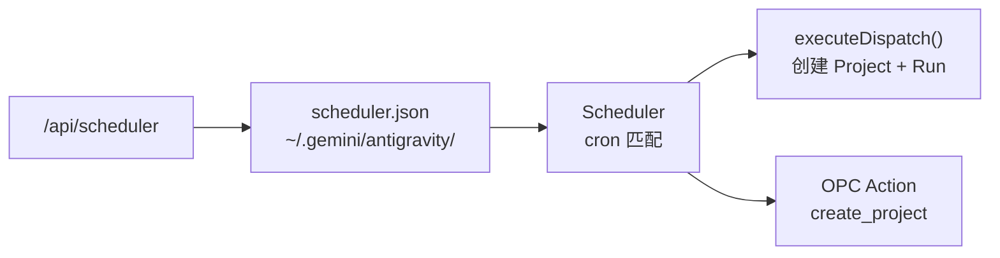

### 关键字段

| 字段 | 说明 |
|:-----|:-----|
| `name` | 任务名称 |
| `cron` | Cron 表达式 |
| `workspace` | 目标 workspace |
| `templateId` | Pipeline 模板 |
| `prompt` | 执行 prompt |
| `enabled` | 是否启用 |
| `departmentWorkspaceUri` | OPC 部门 workspace |
| `opcAction` | OPC 动作（`create_project`） |

### 关键文件

| 文件 | 职责 |
|---|---|
| `src/lib/agents/scheduler.ts` | 调度核心：cron 解析、任务执行、日志 |
| `src/lib/agents/scheduler-types.ts` | 类型定义 |

---

## 10. CLI

### 命令总览

```mermaid
mindmap
  root((ag CLI))
    projects
      list 列出所有项目
      project detail 项目详情
    runs
      list 列出 Run
      run detail Run 详情
    dispatch
      <templateId> 模板
      --stage 指定 stage
      --project 关联项目
      --source 上游 Run
      --prompt 目标描述
    intervene
      retry 重试
      nudge 推进
      restart_role 重启角色
      cancel 取消
      evaluate 评估
    resume
      --action recover/nudge/skip/force-complete
      --role 指定角色
```

### 连接方式

```
CLI (scripts/ag.ts) → HTTP REST → http://localhost:3000/api/*
                       可通过 AG_BASE_URL 环境变量覆盖
```

### 辅助 CLI

| 脚本 | 用途 |
|---|---|
| `scripts/ag.ts` | 主 CLI：项目、Run、`dispatch <templateId> [--stage <stageId>]`、介入 |
| `scripts/ag-wechat.ts` | 微信辅助：模型切换、状态查看 |
| `scripts/antigravity-acp.ts` | ACP Adapter（被 cc-connect 调用）|
| `scripts/ag-migrate.sh` | 数据迁移脚本 |

---

## 11. 微信支持 (Claude Connect / cc-connect)

### 架构

```mermaid
sequenceDiagram
    participant WX as 微信用户
    participant CC as cc-connect 客户端
    participant ACP as antigravity-acp.ts<br/>ACP Adapter
    participant GW as Gateway REST
    participant WS as Gateway WebSocket

    Note over WX,WS: 会话初始化
    WX->>CC: 发送消息
    CC->>ACP: JSON-RPC session/init
    ACP->>GW: POST /api/conversations
    ACP->>WS: WebSocket connect + subscribe

    Note over WX,WS: 消息交互
    WX->>CC: 用户输入
    CC->>ACP: JSON-RPC message
    
    alt 内置命令 (/models, /status, /workspace...)
        ACP-->>CC: 直接返回结果
    else 普通消息
        ACP->>GW: POST /api/conversations/{id}/send
        WS-->>ACP: 流式步骤更新
        ACP-->>CC: 完整回复
        CC-->>WX: 显示结果
    end
```

### Session 模型

```typescript
Session {
  cascadeId?: string    // 当前对话 ID
  workspace?: string    // 绑定的工作区
  model: string         // 当前模型 (默认 Gemini 3 Flash)
  ws?: WebSocket        // 实时连接
  cancelled: boolean    // 取消标志
}
// 每个微信用户一个 Session，持久化在 ~/.cc-connect/antigravity/
```

### 内置命令

| 命令 | 功能 |
|---|---|
| `/models` | 列出可用模型 + 配额 |
| `/model <name>` | 切换模型 |
| `/status` | 系统状态 + 配额信息 |
| `/workspace` | 切换工作区 |
| `/new` | 新建对话 (cc-connect 内置) |
| `/help` | 帮助信息 |

### Workspace 解析优先级

```
显式配置 workspace → /workspace 菜单选择 → 自动检测匹配 → Playground 回退
```

### cc-connect 配置

```toml
[[projects]]
name = "antigravity"

[projects.agent]
type = "acp"

[projects.agent.options]
work_dir = "/path/to/project"
command = "npx"
args = ["tsx", "/path/to/antigravity-acp.ts"]
```

---

## 12. Obsidian 插件

### 架构

```mermaid
flowchart TB
    subgraph Obsidian["Obsidian 应用"]
        Plugin["main.ts<br/>插件入口"]
        ChatView["chat-view.ts<br/>Chat 侧边栏"]
        Settings["settings.ts<br/>设置存储"]
    end

    subgraph Client["api-client.ts"]
        REST_C["REST 客户端<br/>getConversations()<br/>createConversation()<br/>sendMessage()<br/>getModels()"]
        WS_C["WebSocket 客户端<br/>subscribe()<br/>unsubscribe()"]
    end

    subgraph GW["Gateway"]
        API["/api/*"]
        WSS["/ws"]
    end

    Plugin --> ChatView & Settings
    ChatView --> REST_C & WS_C
    REST_C -->|HTTP| API
    WS_C -->|WebSocket| WSS
```

### 功能

- 右侧边栏 Chat View + Ribbon 图标快捷入口
- 对话列表（按 Workspace 过滤）
- 新建对话 + 实时流式消息
- 模型选择下拉 + Planning / Fast 模式切换
- Workspace 自动检测（Vault 路径匹配 Gateway Server）

### 设置

```typescript
{
  gatewayUrl: string      // e.g., "http://localhost:3000"
  workspaceUri?: string   // 覆盖 Workspace 自动检测
  defaultModel?: string   // 默认模型
}
```

---

## REST API 端点总览

| 路径 | 方法 | 模块 | 说明 |
|---|---|---|---|
| `/api/conversations` | GET / POST | Conversation | 列表 / 创建对话；GET 支持 `page/pageSize` 并返回分页 envelope；本地 provider 返回 `local-*` conversation；组合 `api` 服务允许 GET/POST 分属 control-plane/runtime route |
| `/api/conversations/{id}/send` | POST | Conversation | 发送消息（支持 `@file` 附件；本地 provider 走 Gateway executor / transcript store；provider failed status 会转为 502）|
| `/api/conversations/{id}/cancel` | POST | Conversation | 取消生成 |
| `/api/conversations/{id}/steps` | GET | Conversation | 获取步骤历史（gRPC checkpoint、本地 transcript 文件或 API-backed transcript store） |
| `/api/conversations/{id}/proceed` | POST | Conversation | 审批 Artifact / 继续 |
| `/api/conversations/{id}/revert` | POST | Conversation | 回退到指定步骤 |
| `/api/conversations/{id}/revert-preview` | GET | Conversation | 回退预览 ⚠️ *后端未实现* |
| `/api/conversations/{id}/files` | GET | Conversation | 对话关联的文件列表 |
| `/api/agent-runs` | GET / POST | Agent | 列表 / 调度 Run；GET 改为分页 list view，重字段留在 `/api/agent-runs/{id}`；手动调度会写 Company Kernel token/runtime ledger，但不消耗 autonomous dispatch quota |
| `/api/agent-runs/{id}` | GET / DELETE | Agent | 详情 / 取消 Run |
| `/api/agent-runs/{id}/intervene` | POST | Agent | 介入操作 (retry/nudge/restart_role/cancel/evaluate；prompt-mode 支持 cancel/evaluate) |
| `/api/scope-check` | POST | Agent | 写入范围校验 |
| `/api/projects` | GET / POST | Project | 列表 / 创建项目；GET 支持 `page/pageSize` 分页 envelope |
| `/api/projects/{id}` | GET / PATCH / DELETE | Project | 项目 CRUD |
| `/api/projects/{id}/resume` | POST | Project | 恢复阻塞 Pipeline |
| `/api/projects/{id}/diagnostics` | GET | Project | 项目健康诊断 |
| `/api/projects/{id}/reconcile` | POST | Project | 项目状态修复 |
| `/api/projects/{id}/graph` | GET | Project | 项目 DAG IR 表示 |
| `/api/projects/{id}/gate/{nodeId}/approve` | POST | Project (V5.2) | Gate 节点审批 |
| `/api/projects/{id}/checkpoints` | GET | Project (V5.2) | Checkpoint 列表（分页） |
| `/api/projects/{id}/checkpoints/{cpId}/restore` | POST | Project (V5.2) | 从 Checkpoint 恢复 |
| `/api/projects/{id}/journal` | GET | Project (V5.2) | 执行日志查询（分页；兼容 `limit -> pageSize`） |
| `/api/projects/{id}/replay` | POST | Project (V5.2) | Checkpoint 回放 |
| `/api/pipelines` | GET | Pipeline | 列出 Pipeline 模板 |
| `/api/pipelines/{id}` | GET / PUT / DELETE | Pipeline | 模板 CRUD |
| `/api/pipelines/lint` | POST | Pipeline (V4.4) | 模板契约校验 |
| `/api/pipelines/validate` | POST | Pipeline (V5.1) | 通用模板校验 |
| `/api/pipelines/convert` | POST | Pipeline (V5.1) | 格式互转 |
| `/api/pipelines/generate` | POST | Pipeline (V5.3) | AI 生成草案 |
| `/api/pipelines/generate/{draftId}` | GET | Pipeline (V5.3) | 查看草案 |
| `/api/pipelines/generate/{draftId}/confirm` | POST | Pipeline (V5.3) | 确认保存草案 |
| `/api/pipelines/subgraphs` | GET | Pipeline (V5.4) | 子图列表 |
| `/api/pipelines/policies` | GET | Pipeline (V5.4) | 资源策略列表 |
| `/api/pipelines/policies/check` | POST | Pipeline (V5.4) | 配额检查 |
| `/api/operations/audit` | GET | Operations | 审计日志（分页；兼容 `limit -> pageSize`） |
| `/api/models` | GET | Runtime | 可用模型 + 配额；split mode 下由 runtime 提供，web 仅代理 |
| `/api/agent-runs` | POST | Agent | 支持 `executionProfile` 分流到 `workflow-run / dag-orchestration`，并可附带 `departmentRuntimeContract/runtimeContract` 透传到 backend |
| `/api/servers` | GET | Core | 已发现的 Language Server |
| `/api/workspaces` | GET | Control Plane | 工作区列表 |
| `/api/workspaces/import` | POST | Control Plane | 导入 workspace 到 OPC catalog |
| `/api/workspaces/launch` | POST | Runtime | 启动工作区 |
| `/api/workspaces/close` | GET / POST / DELETE | Control Plane | 查询 / 隐藏 / 取消隐藏工作区 |
| `/api/workspaces/kill` | POST | Runtime | 终止工作区 Language Server |
| `/api/me` | GET | Runtime | 用户信息 |
| `/api/ai-config` | GET / PUT | Control Plane | 组织级 provider 配置 |
| `/api/api-keys` | GET / PUT | Control Plane | Provider key 与登录状态 |
| `/api/api-keys/test` | POST | Control Plane | 测试 provider 凭据 |
| `/api/mcp` | GET | Control Plane | MCP 配置读取 |
| `/api/mcp/servers` | POST / DELETE | Control Plane | MCP server 配置更新 |
| `/api/mcp/tools` | GET | Control Plane | MCP server 工具视图 |
| `/api/company/run-capsules` | GET | Company Kernel | RunCapsule 列表（分页） |
| `/api/company/memory-candidates` | GET | Company Kernel | MemoryCandidate 审核列表（分页） |
| `/api/company/signals` | GET | Company Kernel | OperatingSignal 经营信号列表（分页） |
| `/api/company/agenda` | GET | Company Kernel | OperatingAgendaItem 议程列表（分页） |
| `/api/company/agenda/{id}/dispatch-check` | POST | Company Kernel | 预算 / 熔断 gate，仅检查不创建 run |
| `/api/company/agenda/{id}/dispatch` | POST | Company Kernel | gate 通过后创建 queued prompt run，并标记 agenda dispatched |
| `/api/company/operating-day` | GET | Company Kernel | CEO Office 今日经营读模型 |
| `/api/company/budget/policies` / `/api/company/budget/policies/{id}` | GET / PUT | Company Kernel | 预算策略列表与单条策略更新；Settings Autonomy 预算页使用该接口保存组织级预算、冷却与审批阈值 |
| `/api/company/budget/ledger` | GET | Company Kernel | 预算流水列表 |
| `/api/company/circuit-breakers` | GET | Company Kernel | 熔断器列表 |
| `/api/company/growth/proposals` | GET | Company Kernel | GrowthProposal 列表（SOP/workflow/skill/script/rule） |
| `/api/company/growth/proposals/generate` | POST | Company Kernel | 经过 budget gate 后从 run/knowledge/candidate 生成增长提案 |
| `/api/company/growth/proposals/{id}/evaluate` | POST | Company Kernel | 经过 budget gate 后评估提案，必要时创建 approval request |
| `/api/company/growth/proposals/{id}/dry-run` | POST | Company Kernel | 对 script proposal 做发布前静态 sandbox dry-run |
| `/api/company/growth/proposals/{id}/publish` | POST | Company Kernel | 审批与 script dry-run 均满足后发布 canonical workflow/skill/rule/script 或 SOP knowledge |
| `/api/company/growth/observations` | GET / POST | Company Kernel | 增长提案发布后观察 |
| `/api/company/loops/policies` / `/api/company/loops/policies/{id}` | GET / PUT | Company Kernel | CompanyLoopPolicy 列表与更新；Settings Autonomy 预算页使用；scheduler 内置 company-loop cron 读取该策略 |
| `/api/company/loops/runs` / `/api/company/loops/runs/{id}` | GET | Company Kernel | CompanyLoopRun 分页列表与详情，包含 `metadata.skippedAgenda` 审计原因 |
| `/api/company/loops/run-now` | POST | Company Kernel | 手动运行 daily/weekly/growth/risk loop；disabled policy 返回 skipped |
| `/api/company/loops/digests` / `/api/company/loops/digests/{id}` | GET | Company Kernel | CompanyLoopDigest 分页列表与详情 |
| `/api/company/loops/runs/{id}/retry` | POST | Company Kernel | 只允许 retry failed/skipped loop run |
| `/api/company/self-improvement/signals` | GET / POST | Company Kernel | SystemImprovementSignal 列表与创建 |
| `/api/company/self-improvement/proposals` | GET | Company Kernel | SystemImprovementProposal 列表 |
| `/api/company/self-improvement/proposals/generate` | POST | Company Kernel | 从 signals 生成带风险、测试计划、回滚计划的 proposal |
| `/api/company/self-improvement/proposals/{id}` | GET | Company Kernel | 系统改进 proposal 详情 |
| `/api/company/self-improvement/proposals/{id}/evaluate` | POST | Company Kernel | 重新评估 protected core 风险并按需创建 approval request |
| `/api/company/self-improvement/proposals/{id}/approve` / `reject` | POST | Company Kernel | 更新系统改进 proposal 审批状态 |
| `/api/company/self-improvement/proposals/{id}/attach-test-evidence` | POST | Company Kernel | 追加测试证据；high/critical 必须已有持久 approval metadata 才能进入 ready-to-merge，最新测试结果决定当前测试态 |
| `/api/company/self-improvement/proposals/{id}/observe` | POST | Company Kernel | 将 proposal 进入 observing 并记录观察摘要 |
| `/api/knowledge` | GET | Knowledge | 知识库条目列表（支持 workspace/category/limit 过滤） |
| `/api/knowledge/{id}` | GET / PUT / DELETE | Knowledge | 知识条目 CRUD（结构化资产 + 文件镜像双轨同步） |
| `/api/knowledge/{id}/artifacts/{path}` | GET / PUT | Knowledge | 知识条目附件读写 |
| `/api/ceo/profile` | GET / PATCH | Control Plane | CEOProfile 读取与更新 |
| `/api/ceo/profile/feedback` | POST | Control Plane | 写入用户对 CEO 的反馈信号 |
| `/api/ceo/routine` | GET | Control Plane | CEO routine summary / digest 视图，包含可执行 `actions[]` |
| `/api/ceo/events` | GET | CEO | CEO 最近组织事件流 |
| `/api/ceo/setup` | GET / POST | Control Plane | CEO identity / playbook 资产读写 |
| `/api/management/overview` | GET | Management | 组织/部门经营概览、指标与 `schedulerRuntime` |
| `/api/evolution/proposals` | GET | Evolution | proposal 列表（可附带 rollout observe） |
| `/api/evolution/proposals/generate` | POST | Evolution | 从 knowledge / repeated runs 生成 proposal |
| `/api/evolution/proposals/{id}` | GET | Evolution | proposal 详情 |
| `/api/evolution/proposals/{id}/evaluate` | POST | Evolution | 基于历史 runs 评估 proposal |
| `/api/evolution/proposals/{id}/publish` | POST | Evolution | 创建 proposal 发布审批请求 |
| `/api/evolution/proposals/{id}/observe` | POST | Evolution | 刷新 proposal rollout 观察 |
| `/api/skills` | GET | Skill | 技能列表（全局 + workspace）|
| `/api/skills/{name}` | GET | Skill | 技能详情 |
| `/api/workflows` | GET | Workflow | 工作流列表（全局 + workspace，去重）|
| `/api/rules` | GET | Rule | 自定义规则列表 |
| `/api/analytics` | GET | Analytics | 使用分析数据 |
| `/api/mcp` | GET | MCP | MCP 服务器配置 |
| `/api/tunnel` | GET | Tunnel | Tunnel 连接状态 |
| `/api/tunnel/start` | POST | Tunnel | 启动 Cloudflare Tunnel |
| `/api/tunnel/stop` | POST | Tunnel | 停止 Tunnel |
| `/api/tunnel/config` | GET / POST | Tunnel | Tunnel 配置 |
| `/api/codex` | POST | Codex | 单次任务执行 (`codex exec`) |
| `/api/codex/sessions` | POST | Codex | 创建多轮 MCP 会话 |
| `/api/codex/sessions/{threadId}` | POST | Codex | 多轮会话续接 |
| `/api/ceo/command` | POST | Control Plane | CEO 命令解析；即时部门任务会先创建 `Ad-hoc Project`，再派发 template/prompt run |
| `/api/approval` | GET / POST | Control Plane | 审批请求列表 / 提交 |
| `/api/approval/{id}` | GET / PATCH | Control Plane | 审批详情 / 更新 |
| `/api/approval/{id}/feedback` | GET / POST | Control Plane | 审批反馈 |
| `/api/approval/events` | GET | Control Plane | 审批 SSE 推送事件流 |
| `/api/departments` | GET / PUT | Control Plane | 部门配置 |
| `/api/departments/sync` | POST | Control Plane | 同步部门状态 |
| `/api/departments/digest` | GET | Control Plane | 部门摘要 |
| `/api/departments/quota` | GET | Control Plane | 部门配额 |
| `/api/departments/memory` | GET / POST | Control Plane | 部门记忆 |
| `/api/scheduler/jobs` | GET | Scheduler | 定时任务列表（分页，按 SQLite 主存储刷新；`cron` 支持 `timeZone`） |
| `/api/scheduler/jobs/{id}` | GET / PATCH / DELETE | Scheduler | 任务 CRUD（DELETE 物理移除 `scheduled_jobs` 行） |
| `/api/scheduler/jobs/{id}/trigger` | POST | Scheduler | 手动触发任务；`workflow-run` 可进入 post-run finalize（如 AI 日报自动上报） |
| `/api/projects/{id}/deliverables` | GET / POST | Project | SQLite-backed 交付物管理（GET 分页；含 run output 自动同步） |
| `/api/logs` | GET | Core | 日志查看 |
| `/api/workflows/{name}` | GET | Workflow | 单个工作流详情 |
| `/api/scheduler` | GET | Scheduler | 调度器状态 |
| `/ws` | WebSocket | Realtime | 实时步骤流 |

---

## 技术栈

| 层 | 技术 |
|---|---|
| **前端** | Next.js 16 + React 19 + shadcn/ui + Tailwind CSS 4 |
| **后端** | Node.js + tsx + 自定义 HTTP Server + WebSocket |
| **协议** | gRPC-Web Connect (protobuf envelope) / REST / WebSocket / MCP (stdio) |
| **日志** | pino 结构化日志 + pino-roll 日志轮转 |
| **持久化** | SQLite projection/store + JSONL + 外部只读 `.pb` / `brain` / StateDB importer |
| **隧道** | Cloudflare Tunnel (远程访问) |
| **构建** | TypeScript 5 + tsx (开发) + next build (生产) |
| **测试** | Vitest + ESLint + bb-browser / Playwright E2E |

---

## 目录结构

```
├── ARCHITECTURE.md          # ← 本文件
├── server.ts                # role launcher（web/api/control-plane/runtime/scheduler）
├── src/
│   ├── app/
│   │   ├── layout.tsx       # 全局布局与浅色 Apple-style shell
│   │   ├── page.tsx         # 主路由: CEO Office + Projects + Knowledge + Ops + Settings
│   │   └── api/             # Next route 薄入口 / proxy / adapter
│   ├── components/
│   │   ├── chat.tsx         # 聊天主界面
│   │   ├── sidebar.tsx      # 左侧一级导航 + profile / quick entry
│   │   ├── project-workbench.tsx  # Pipeline 可视化
│   │   ├── agent-run-detail.tsx   # Run 详情
│   │   └── ui/              # shadcn/ui 基础组件
│   ├── lib/
│   │   ├── bridge/          # gateway.ts + grpc.ts + discovery.ts
│   │   ├── agents/          # Stage Runtime (group-runtime.ts) + registry + asset-loader + review
│   │   ├── ceo-office-home.ts # CEO Office 首页展示辅助
│   │   ├── i18n/            # 国际化
│   │   └── types.ts         # 核心类型定义
│   ├── server/
│   │   ├── api/             # 同设备默认后端，组合控制面与运行时 API
│   │   ├── control-plane/   # 控制面独立 server + routes
│   │   ├── runtime/         # 运行时独立 server + routes
│   │   ├── workers/         # scheduler / importer worker
│   │   └── shared/          # 共享 HTTP server / proxy
│   └── mcp/
│       └── server.ts        # MCP stdio 服务器
├── scripts/
│   ├── ag.ts                # 主 CLI
│   ├── antigravity-acp.ts   # 微信 ACP 适配器
│   └── ag-wechat.ts         # 微信辅助 CLI
├── plugins/
│   └── obsidian-antigravity/ # Obsidian 插件
└── docs/                    # 详细文档
```
