# Antigravity Gateway — 产品架构

> 将 Antigravity (Google DeepMind AI 编程代理) 变为无头 API 服务器，解锁远程访问、子代理集成和自动化 AI 工作流。

---

## 系统全景

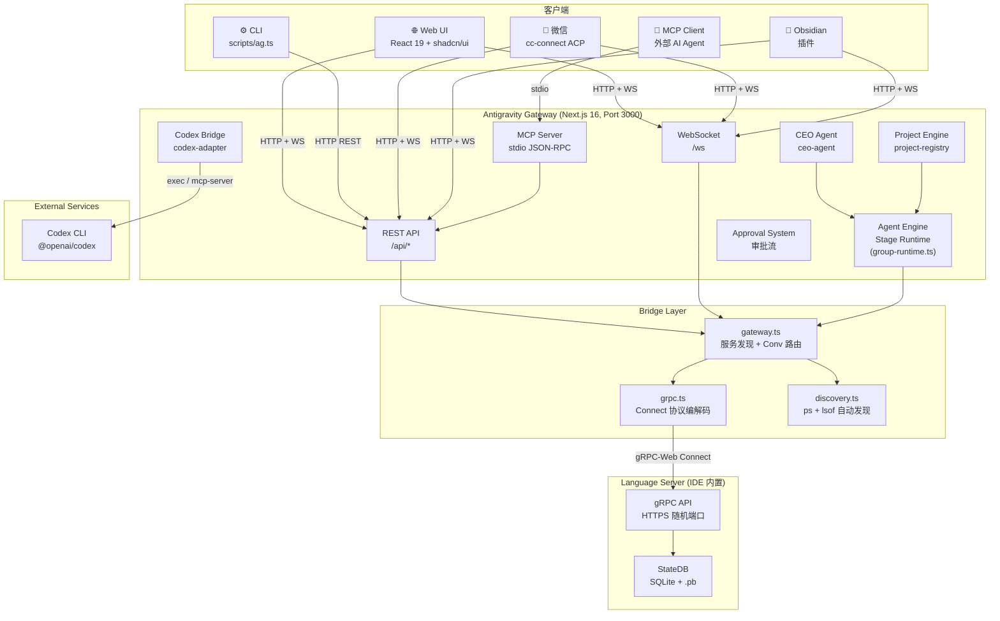

---

## 模块依赖关系

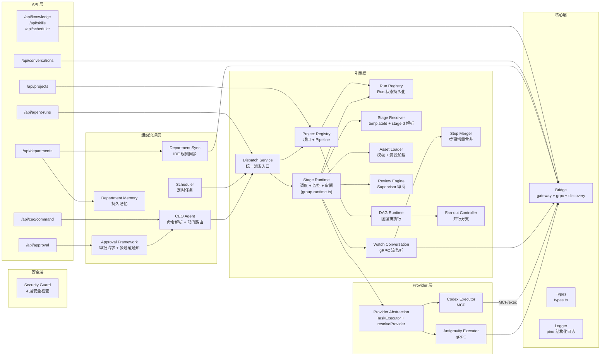

---

## 编排概念逻辑关系

系统中存在多个层次的编排概念，它们构成如下逻辑关系：

### 概念层级总览

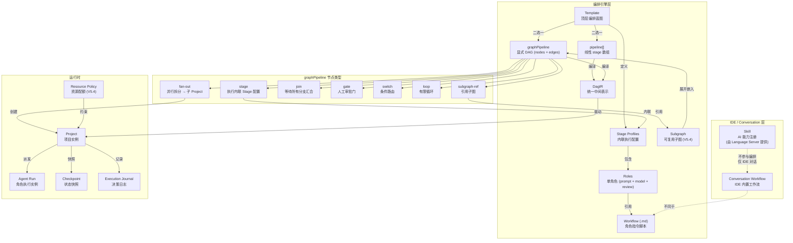

### 概念说明

| 概念 | 定义 | 生命周期 |
|:-----|:-----|:---------|
| **Skill** | Language Server 注册的 AI 能力（如 `edit_file`、`codebase_search`）。通过 gRPC 从 IDE 获取。 | IDE 内置，**不参与 Pipeline 编排** |
| **Workflow** | 存储在 `assets/workflows/*.md` 的指令脚本。每个 Role 引用一个 workflow 路径（如 `/dev-worker`），运行时注入为 Agent 的 system prompt。 | 由模板作者编写，角色执行时加载 |
| **Stage Profile** | Stage / node 内联执行配置，定义执行模式、角色、能力、来源约束。 | 内联定义在 `pipeline[]` / `graphPipeline.nodes[]` |
| **Template** | 顶层编排蓝图。包含 `pipeline[]` 或 `graphPipeline`，以及可选的 `contract` 定义。 | 存储在 `assets/templates/*.json` |
| **pipeline[]** | 线性 stage 数组，隐式顺序依赖。简单场景推荐。 | Template 内定义，编译时转化为 DagIR |
| **graphPipeline** | 显式 DAG 定义（`nodes[]` + `edges[]`），支持 8 种节点类型。复杂场景推荐。 | Template 内定义，编译时转化为 DagIR |
| **DagIR** | 统一的中间表示（V5.0）。运行时只认 DagIR，不区分原始格式。 | 编译时生成，缓存在内存 |
| **Fan-out** | DAG 中的并行拆分点。读取上游产出的 work-packages，为每项创建独立子 Project。 | graphPipeline 或 pipeline 中的节点类型 |
| **Subgraph** | 可复用的 DAG 片段（V5.4）。在编译时展开为 IR 节点。 | 存储在 `assets/templates/*.json`（`kind: 'subgraph'`） |
| **Resource Policy** | 资源配额策略（V5.4）。限制 runs / branches / iterations 等。 | 存储在 policies 目录 |

### 关键澄清

1. **Skill ≠ Workflow**：Skill 是 IDE 层面的 AI 能力注册（类似 MCP tool），不参与 Pipeline 编排。Workflow 是 Agent 的指令脚本，驱动每个 Role 的行为。
2. **pipeline[] 与 graphPipeline 互斥**：一个 Template 只能用一种格式。两者编译为同一个 DagIR，共享同一个运行时。
3. **Fan-out 创建子 Project**：fan-out 不是"在同一个 Project 中并行"，而是为每个 work-package 创建独立子 Project，各自有独立的 `projectId`、运行历史和状态。
4. **Subgraph 是编译时概念**：subgraph-ref 在编译为 DagIR 时被展开，运行时不存在"子图"的概念。

---

## 1. Conversation 对话系统

### 数据流

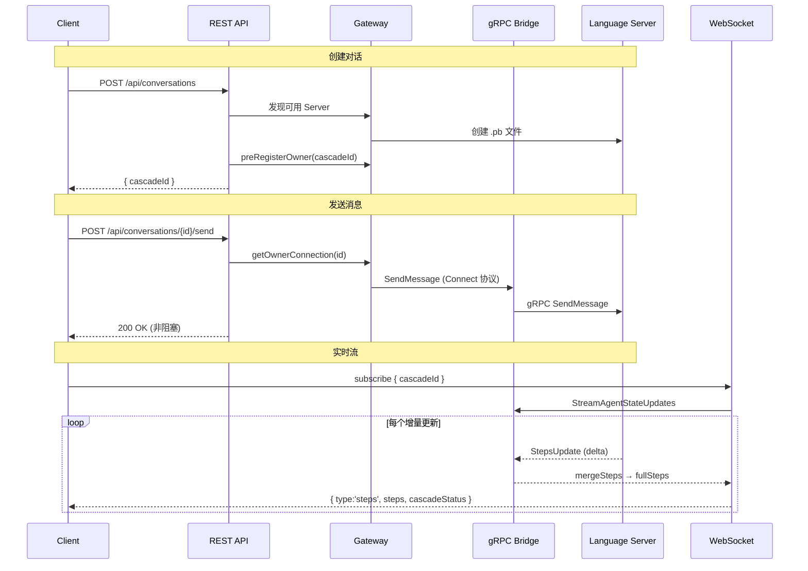

### 关键文件

| 文件 | 职责 |
|---|---|
| `src/app/api/conversations/route.ts` | 创建/列出对话 |
| `src/app/api/conversations/[id]/send/route.ts` | 发送消息，支持 `@[file]` 附件 |
| `server.ts` `/ws` | WebSocket 订阅 (`subscribe` / `multi-subscribe` / `unsubscribe`) |
| `src/lib/bridge/gateway.ts` | 服务发现 + Conv→Owner 路由映射 |
| `src/lib/bridge/grpc.ts` | Connect 协议编解码 `[flags:1][len:4][payload]` |
| `src/lib/agents/step-merger.ts` | 增量步骤合并为完整时间线 |
| `src/components/chat.tsx` | 聊天 UI，Timeline 步骤渲染 |

### Connect 协议封装

Gateway 与 Language Server 之间使用 **gRPC-Web Connect** 协议通信：

```
请求: POST https://localhost:{port}/connect-rpc/{service}/{method}
Body:  [flags: 1 byte][length: 4 bytes][JSON payload]
认证:  x-csrf-token header
```

### 服务发现

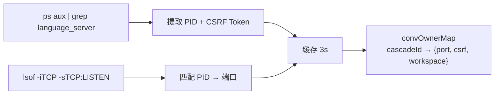

---

## 2. Agent 多代理系统

### 运行生命周期

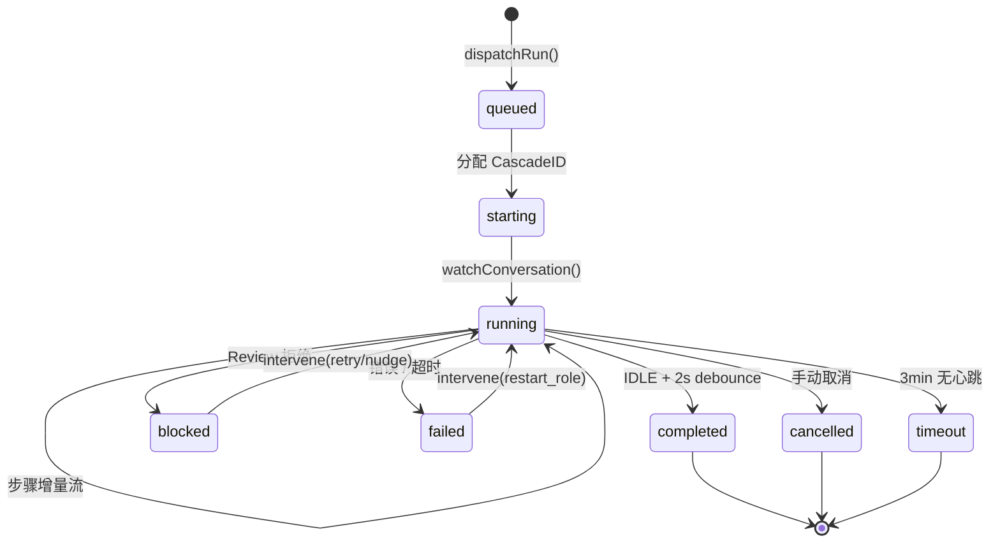

### Stage Profile 及角色

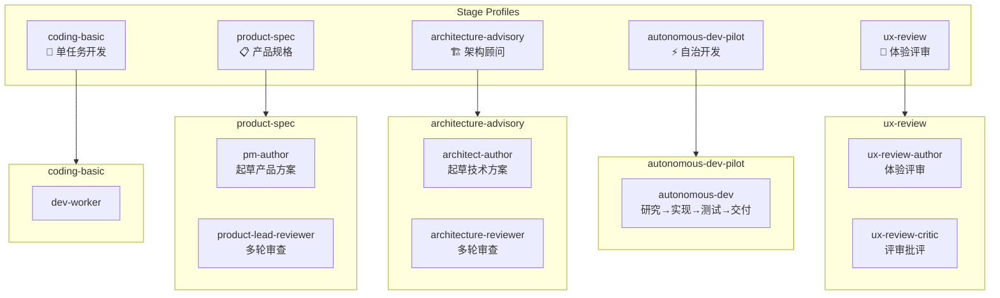

### Pipeline 交付流

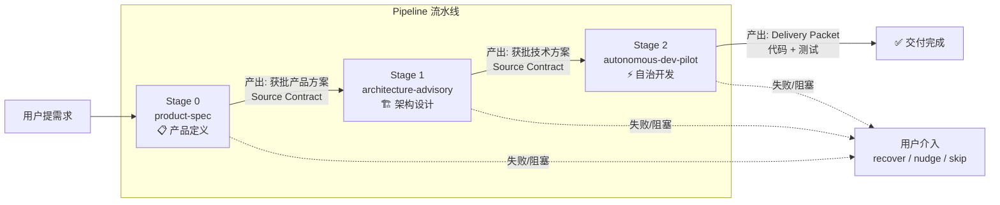

### Source Contract 机制

上游 Run 的产物自动注入下游：

```
SourceContract {
  requireReviewOutcome: ['approved']       // 上游必须通过审阅
  acceptedSourceStageIds: ['product-spec'] // 可接受的上游 stage
  autoBuildInputArtifactsFromSources: true // 自动构建输入产物
  autoIncludeUpstreamSourceRuns: true      // 传递性依赖解析
}
```

### Review 审阅机制

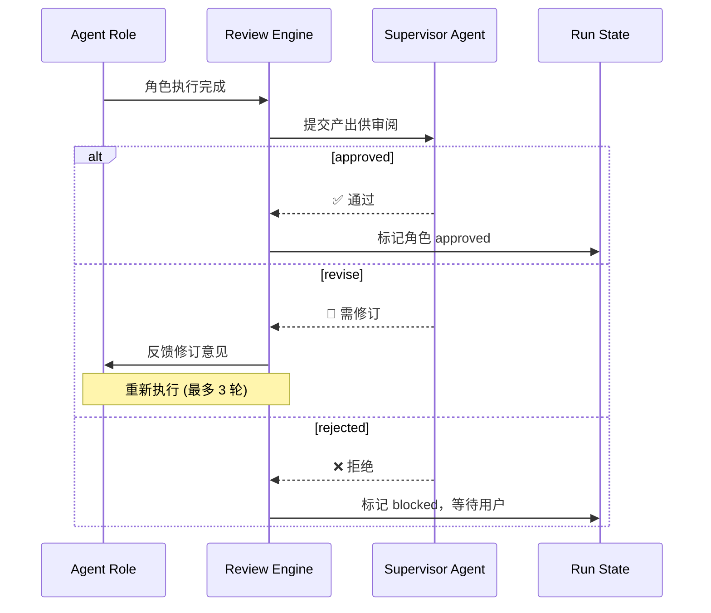

### 关键文件

| 文件 | 职责 |
|---|---|
| `src/lib/agents/group-runtime.ts` | 核心 stage runtime: dispatch → watch → compact → review |
| `src/lib/agents/dispatch-service.ts` | 统一派发入口 `executeDispatch()`，CEO 和 team-dispatch 共用 |
| `src/lib/agents/stage-resolver.ts` | 基于 `templateId + stageId` 解析 stage 定义 |
| `src/lib/agents/pipeline/template-normalizer.ts` | 加载期归一化 legacy 模板到 inline-only schema |
| `src/lib/agents/prompt-builder.ts` | Prompt 构建 + review 决策解析 |
| `src/lib/agents/supervisor.ts` | Supervisor AI Loop + 步骤摘要 |
| `src/lib/agents/run-artifacts.ts` | Artifact 扫描/复制 + 交付包读取 + 范围审计 |
| `src/lib/agents/result-parser.ts` | Result.json 解析 + step 启发式提取 |
| `src/lib/agents/finalization.ts` | Advisory/Delivery run 终态处理 |
| `src/lib/agents/runtime-helpers.ts` | 路径规范化、证据提取、审计构建、终止传播 |
| `src/lib/agents/run-registry.ts` | Run 状态持久化 (`~/.gemini/antigravity/runs.json`) |
| `src/lib/agents/asset-loader.ts` | 从磁盘加载 template/review-policy，并做 inline-only normalize |
| `src/lib/agents/watch-conversation.ts` | gRPC 流监听子对话，30s 心跳 / 3min 超时 |
| `src/lib/agents/review-engine.ts` | Supervisor 审阅: approve / revise / reject |
| `src/lib/agents/step-merger.ts` | 增量步骤合并 |
| `src/lib/agents/checkpoint-manager.ts` | Pipeline 状态快照与恢复 |
| `src/lib/agents/scheduler.ts` | Cron 定时任务调度 |
| `src/lib/agents/department-sync.ts` | IDE 规则同步（Antigravity/Claude/Codex/Cursor） |
| `src/lib/agents/department-memory.ts` | 三层持久记忆（组织/部门/会话） |
| `src/lib/agents/approval-triggers.ts` | 异常时自动触发审批请求 |

---

## 3. Project 项目系统

### 数据模型


### Pipeline 状态机

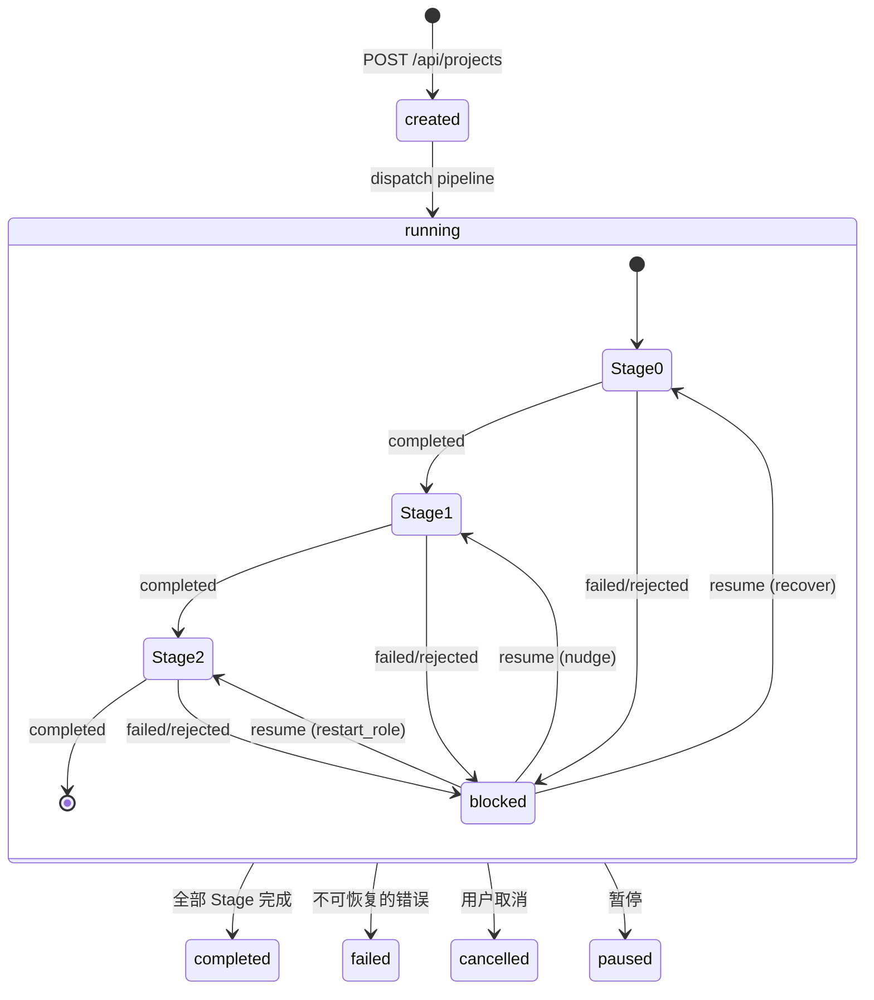

### 持久化

```
~/.gemini/antigravity/gateway/
├── assets/
│   ├── templates/             # Pipeline 模板 JSON
│   ├── workflows/             # 全局 Workflow .md（跨项目共享）
│   └── review-policies/       # 审阅策略 JSON
├── projects.json              # 全局项目索引
├── agent_runs.json            # 全局 Run 索引
└── local_conversations.json   # 对话缓存

~/.gemini/antigravity/
└── conversations/             # 对话 .pb 文件

{workspace}/demolong/
├── projects/{projectId}/
│   ├── project.json           # 项目详情
│   └── runs/{runId}/          # 按 Run 存储产出
└── runs/{runId}/              # 独立 Run（无 Project）产出
```

### 关键文件

| 文件 | 职责 |
|---|---|
| `src/lib/agents/project-registry.ts` | 项目 CRUD + Pipeline 状态管理 |
| `src/lib/agents/project-types.ts` | 项目数据模型 |
| `src/lib/agents/project-events.ts` | 项目事件总线（`stage:failed` 等） |
| `src/lib/agents/project-diagnostics.ts` | 项目健康诊断 |
| `src/lib/agents/project-reconciler.ts` | 项目状态修复 |
| `src/lib/agents/dag-compiler.ts` | Pipeline → DagIR 编译器 |
| `src/lib/agents/dag-ir-types.ts` | DagIR 中间表示类型 |
| `src/lib/agents/dag-runtime.ts` | DagIR 运行时执行器 |
| `src/lib/agents/graph-compiler.ts` | graphPipeline → DagIR 编译 |
| `src/lib/agents/graph-pipeline-types.ts` | graphPipeline 类型定义 |
| `src/lib/agents/fan-out-controller.ts` | Fan-out 分支控制器 |
| `src/lib/agents/contract-validator.ts` | Source Contract 验证 |
| `src/lib/agents/execution-journal.ts` | 决策日志记录/查询 |
| `src/lib/agents/pipeline-generator.ts` | AI 辅助 Pipeline 生成 |
| `src/lib/agents/resource-policy-engine.ts` | 资源配额策略执行 |
| `src/lib/agents/scope-governor.ts` | 写入范围审计 |

---

## 4. MCP Server

### 架构

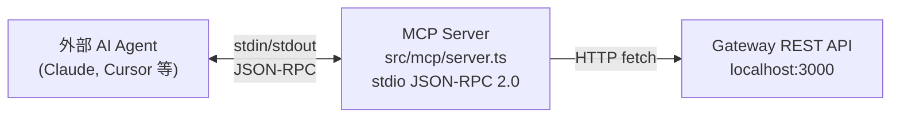

### 暴露的 Tools

| Tool | 版本 | 功能 | 只读 | 幂等 |
|---|---|---|---|---|
| `antigravity_list_projects` | V3 | 列出项目 + Pipeline 状态 | ✅ | ✅ |
| `antigravity_get_project` | V3 | 获取项目详情 + 全部阶段 | ✅ | ✅ |
| `antigravity_get_run` | V3 | 获取 Run 详情 + Supervisor 审阅 | ✅ | ✅ |
| `antigravity_intervene_run` | V3 | 重试 / 推进 / 重启角色 / 取消 | ❌ | ❌ |
| `antigravity_dispatch_pipeline` | V3 | 从模板启动新 Agent Run | ❌ | ✅* |
| `antigravity_get_project_diagnostics` | V3.5 | 项目健康诊断 | ✅ | ✅ |
| `antigravity_list_scheduler_jobs` | V3.5 | 定时任务列表 | ✅ | ✅ |
| `antigravity_reconcile_project` | V3.5 | 项目状态修复（默认 dryRun） | ❌ | ✅ |
| `antigravity_lint_template` | V4.4 | 模板契约校验 | ✅ | ✅ |
| `antigravity_validate_template` | V5.1 | 通用格式校验（自动检测格式） | ✅ | ✅ |
| `antigravity_convert_template` | V5.1 | pipeline ↔ graphPipeline 互转 | ✅ | ✅ |
| `antigravity_gate_approve` | V5.2 | Gate 节点审批 / 拒绝 | ❌ | ❌ |
| `antigravity_list_checkpoints` | V5.2 | 列出 Checkpoint 快照 | ✅ | ✅ |
| `antigravity_replay` | V5.2 | 从 Checkpoint 恢复 | ❌ | ❌ |
| `antigravity_query_journal` | V5.2 | 查询执行日志 | ✅ | ✅ |
| `antigravity_generate_pipeline` | V5.3 | AI 生成 Pipeline 草案 | ✅ | ❌ |
| `antigravity_confirm_pipeline_draft` | V5.3 | 确认保存 AI 草案 | ❌ | ❌ |
| `antigravity_list_subgraphs` | V5.4 | 列出可复用子图 | ✅ | ✅ |
| `antigravity_list_policies` | V5.4 | 列出资源配额策略 | ✅ | ✅ |
| `antigravity_check_policy` | V5.4 | 检查配额是否超限 | ✅ | ✅ |

> *dispatch 具有幂等检测：已完成的 Run 会自动短路，避免重复执行。

### 启动方式

```bash
npx tsx src/mcp/server.ts    # stdio 模式
```

---

## 5. Codex 集成

### 架构

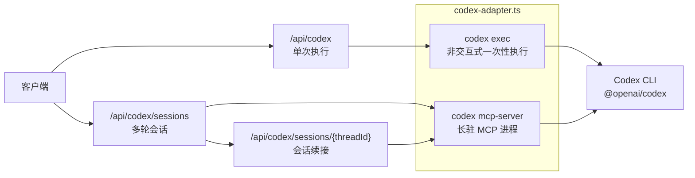

### 两种模式

| 模式 | API | 说明 |
|:-----|:----|:-----|
| **Exec** | `POST /api/codex` | 单次非交互执行。等价于 `codex exec "prompt"`。适合简单一次性任务 |
| **MCP Session** | `POST /api/codex/sessions` + `POST /api/codex/sessions/{threadId}` | 多轮对话。底层维持 `codex mcp-server` 长驻进程，支持线程续接 |

### 关键组件

| 文件 | 职责 |
|---|---|
| `src/lib/bridge/codex-adapter.ts` | Codex CLI 封装：exec 函数 + MCP Client 类 |
| `src/app/api/codex/route.ts` | 单次执行 API |
| `src/app/api/codex/sessions/route.ts` | 创建 MCP 会话 |
| `src/app/api/codex/sessions/[threadId]/route.ts` | 续接 MCP 会话 |
| `src/app/api/codex/_mcp-client.ts` | MCP Client 单例管理（globalThis 存活，热重载安全） |

### Sandbox 模式

| Sandbox | 权限 |
|:--------|:-----|
| `read-only` | 只读（exec 默认） |
| `workspace-write` | 可写工作区（session 默认） |
| `danger-full-access` | 完全访问 |

### 前置条件

需要全局安装 Codex CLI：`npm i -g @openai/codex`

---

## 6. Provider Abstraction Layer

### 概述

Provider Abstraction Layer 是多 Provider 支持的核心。所有 AI 交互（Agent 任务执行、Supervisor 审阅、Nudge）都通过统一的 `TaskExecutor` 接口进行。运行时仍由 `group-runtime.ts` 承载，但它现在是 stage-centric 的 Stage Runtime，不直接调用 gRPC 或 Codex MCP。

### 架构

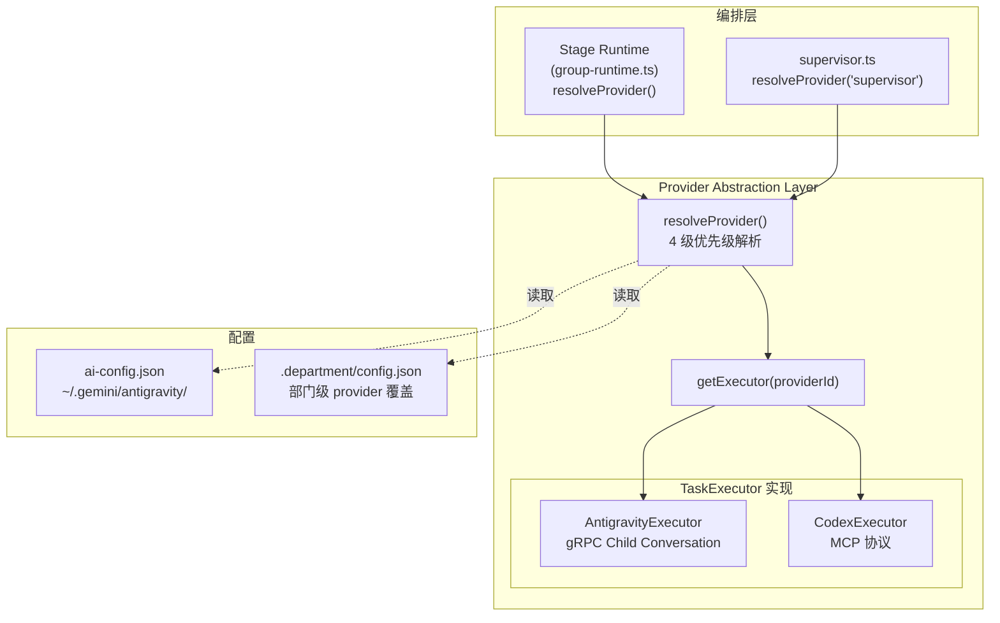

### TaskExecutor 接口

```typescript
interface TaskExecutor {
  readonly providerId: string
  executeTask(opts: TaskExecutionOptions): Promise<TaskExecutionResult>
  appendMessage(handle: string, opts: AppendMessageOptions): Promise<TaskExecutionResult>
  cancel(handle: string): Promise<void>
  capabilities(): ProviderCapabilities
}
```

### Provider 解析优先级

`resolveProvider(sceneOrLayer, workspacePath?)` 按以下顺序依次匹配：

| 优先级 | 来源 | 示例 |
|:-------|:-----|:-----|
| 1 (最高) | Scene 级覆盖 | `scenes.supervisor.provider = 'antigravity'` |
| 2 | Department 级覆盖 | `.department/config.json` 中 `provider: 'codex'` |
| 3 | Layer 级默认 | `layers.execution.provider = 'codex'` |
| 4 (兜底) | 组织默认 | `defaultProvider: 'antigravity'` |

### AI Layer 定义

| Layer | 场景 | 默认 Provider |
|:------|:-----|:-------------|
| `executive` | （保留，用于未来 CEO AI 决策） | antigravity |
| `management` | Supervisor 巡检、Evaluate 干预、记忆提取 | antigravity |
| `execution` | Pipeline 任务执行（Stage Runtime 角色执行） | antigravity |
| `utility` | Review 决策解析、代码摘要 | antigravity |

### Scene 覆盖

可对特定场景指定 provider + model + 约束条件：

```json
{
  "scenes": {
    "supervisor": { "provider": "antigravity", "model": "MODEL_PLACEHOLDER_M47" },
    "nudge": { "provider": "codex", "constraints": { "timeout": 60000 } }
  }
}
```

### 支持的 Provider

| ProviderId | 实现类 | 协议 | 状态 |
|:-----------|:-------|:-----|:-----|
| `antigravity` | `AntigravityExecutor` | gRPC → Language Server | ✅ 已实现 |
| `codex` | `CodexExecutor` | MCP → Codex CLI | ✅ 已实现 |
| `claude-api` | — | — | 🔧 预留 |
| `openai-api` | — | — | 🔧 预留 |
| `custom` | — | — | 🔧 预留 |

### Capability 矩阵

| 能力 | Antigravity | Codex |
|:-----|:------------|:------|
| 流式步骤数据 | ✅ | ❌ |
| 多轮对话 | ✅ | ✅ |
| IDE 技能（重构/导航） | ✅ | ❌ |
| 沙盒执行 | ❌ | ✅ |
| 取消运行 | ✅ | ❌ |
| 实时步骤监听 | ✅ | ❌ |

### 配置文件

- **组织级**: `~/.gemini/antigravity/ai-config.json`
- **部门级**: `workspace/.department/config.json` 中的 `provider` 字段

### 关键文件

| 文件 | 职责 |
|---|---|
| `src/lib/providers/types.ts` | `TaskExecutor`、`AIProviderConfig`、`ProviderId` 等类型定义 |
| `src/lib/providers/ai-config.ts` | 配置加载/缓存/持久化 + `resolveProvider()` 4 级解析 |
| `src/lib/providers/antigravity-executor.ts` | gRPC 子对话创建 + 消息发送 |
| `src/lib/providers/codex-executor.ts` | MCP Client 池管理 + 同步任务执行 |
| `src/lib/providers/index.ts` | 导出 + `getExecutor()` 工厂函数 |

---

## 7. OPC 组织治理

### 概述

OPC（One Person Company）是 Antigravity Gateway 的组织治理模型。核心理念：

- **电脑 = 总部**，**文件夹 = 部门**
- **CEO（用户）** 通过自然语言下达指令，系统自动路由到正确的部门
- **部门自运营**：自主选择 Provider、工具、工作方式，在 Token 配额内自由操作

### Department 数据模型

每个 workspace 可配置为一个部门，配置存于 `workspace/.department/config.json`：

```typescript
interface DepartmentConfig {
  name: string                          // 部门名称
  type: string                          // 类型：build / research / operations / ceo
  typeIcon?: string                     // 类型图标
  description?: string                  // 部门定位描述
  templateIds?: string[]                // 可用 Pipeline 模板
  skills: DepartmentSkill[]             // 技能清单
  okr?: DepartmentOKR                   // OKR 目标
  roster?: DepartmentRoster[]           // 角色花名册（UI 人格化显示）
  provider?: 'antigravity' | 'codex'    // 默认 Provider（覆盖组织级配置）
  tokenQuota?: TokenQuota               // Token 配额
}
```

### CEO Agent

CEO Agent 接收用户的自然语言命令，自动完成：

1. **意图识别**: 从命令文本中提取操作意图（创建项目、查看报告、取消任务等）
2. **部门匹配**: 根据命令关键词匹配最合适的部门（workspace）
3. **任务派发**: 调用 `executeDispatch()` 在目标部门创建 Project + Run

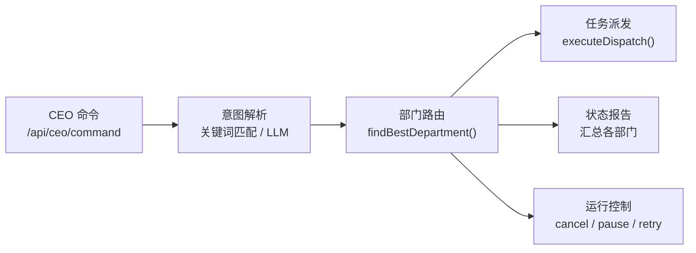

| 支持的操作 | 说明 |
|:----------|:-----|
| `create_project` | 在最匹配的部门创建项目 |
| `multi_create` | 批量创建多个项目 |
| `report_to_human` | 生成各部门状态汇报 |
| `cancel` / `pause` / `resume` | 控制运行中的任务 |
| `info` | 查询特定信息 |
| `needs_decision` | 需要 CEO 在多个方案间决策 |

### Approval Framework（审批框架）

Agent 在以下场景需要 CEO 审批：

| 审批类型 | 触发场景 |
|:---------|:---------|
| `token_increase` | 部门 Token 配额不足 |
| `tool_access` | 请求使用受限工具 |
| `provider_change` | 请求切换 Provider |
| `scope_extension` | 请求扩大写入范围 |
| `pipeline_approval` | Pipeline gate 节点卡点 |

#### 通知通道

| 通道 | 实现文件 | 交互方式 |
|:-----|:---------|:---------|
| Web UI | `approval/channels/web.ts` | Dashboard 审批页面 |
| Webhook (Slack/Discord) | `approval/channels/webhook.ts` | 一键批准/拒绝按钮 |
| IM (WeChat ACP) | `approval/channels/im.ts` | IM 内直接回复或点击链接 |

#### 审批流程

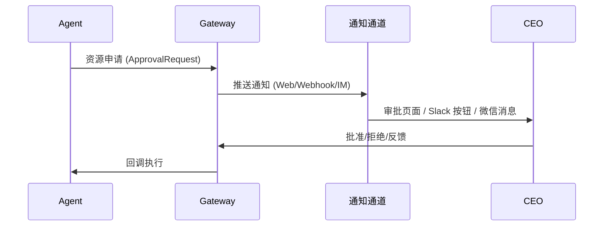

### Token 配额

```typescript
interface TokenQuota {
  daily: number                           // 每日额度
  monthly: number                         // 每月额度
  used: { daily: number; monthly: number } // 已使用
  canRequestMore: boolean                  // 是否允许申请增额
}
```

- Gateway 在 dispatch 前检查配额
- 配额不足时自动生成 `token_increase` 审批请求
- CEO 可通过 API 或 UI 调整配额

### 部门知识管理

```
workspace/
└── .department/
    ├── config.json      ← 结构化配置
    ├── rules/           ← 部门规则（Source of Truth，symlink 到各 IDE）
    ├── workflows/       ← 部门工作流
    └── memory/          ← 持久记忆
        ├── knowledge.md ← 技术知识
        ├── decisions.md ← 决策日志
        └── patterns.md  ← 最佳实践
```

### 关键文件

| 文件 | 职责 |
|---|---|
| `src/lib/agents/ceo-agent.ts` | CEO 命令处理 + 部门匹配 + 任务分发 |
| `src/lib/agents/ceo-tools.ts` | `listDepartments()` / `getDepartmentLoad()` / `ceoCreateProject()` |
| `src/lib/agents/ceo-prompts.ts` | CEO Agent 系统提示词 + 公司上下文构建 |
| `src/lib/approval/types.ts` | 审批数据模型（`ApprovalRequest` / `ApprovalResponse`） |
| `src/lib/approval/channels/web.ts` | Web UI 通知通道 |
| `src/lib/approval/channels/webhook.ts` | Slack/Discord Webhook 通道 |
| `src/lib/approval/channels/im.ts` | WeChat ACP 通道 |
| `src/lib/ceo-events.ts` | CEO 事件流（critical/warning/info/done） |
| `src/app/api/departments/route.ts` | 部门配置 API（GET/PUT） |
| `src/app/api/ceo/command/route.ts` | CEO 命令入口 API |
| `src/app/api/approval/route.ts` | 审批请求列表/提交 API |

---

## 8. Security Framework

### 概述

4 层安全机制保护 Agent 工具执行，从 Claude Code Base（CCB）适配而来。统一入口 `checkToolSafety()` 串行调用所有层，任一层失败即拒绝。

### 架构

```
┌─────────────────────────┐
│   Security Guard        │ ← 统一入口 checkToolSafety()
│   (security-guard.ts)   │   4 层串行检查，任一层失败即拒绝
├─────────────────────────┤
│ L1: Bash Safety         │ ← 命令模式匹配（阻止危险命令、检测注入）
│ L2: Permission Engine   │ ← 规则评估（allow/deny/ask × 4 种模式）
│ L3: Hook Runner         │ ← PreToolUse/PostToolUse 拦截器
│ L4: Sandbox Manager     │ ← 文件系统+网络隔离
└─────────────────────────┘
```

### 权限模式

| 模式 | 行为 |
|:-----|:-----|
| `bypass` | 跳过所有检查 |
| `strict` | 只允许明确 allow 的工具 |
| `permissive` | 只阻止明确 deny 的工具 |
| `default` | 按规则评估，未匹配时询问（OPC 中等同 deny） |

### 关键设计决策

1. **`ask` 在 OPC 等同 `deny`** — 无人交互环境下询问无意义
2. **Hook 失败容错（fail-open）** — Hook 抛错不阻塞执行，记录日志
3. **Bash 安全命令不短路** — `echo $(rm -rf /)` 不会因 `echo` 在安全列表而跳过
4. **路径遍历防护** — 规范化后检查是否在 workspace 内

### 关键文件

| 文件 | 职责 |
|---|---|
| `src/lib/security/security-guard.ts` | 统一入口，串行调用 4 层检查 |
| `src/lib/security/bash-safety.ts` | Bash 命令安全分析（10+ 检查项） |
| `src/lib/security/permission-engine.ts` | 权限规则评估 + 模式叠加 |
| `src/lib/security/hook-runner.ts` | Hook 注册/执行/排序/超时 |
| `src/lib/security/sandbox-manager.ts` | 文件系统 + 网络访问控制 |
| `src/lib/security/policy-loader.ts` | 策略加载/缓存/workspace 合并 |
| `src/lib/security/types.ts` | 完整类型定义 |

---

## 9. Scheduler（定时任务）

### 概述

Cron 风格的定时任务调度器，支持周期性触发 Pipeline 或 OPC 命令。

### 架构

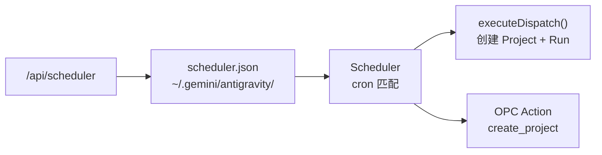

### 关键字段

| 字段 | 说明 |
|:-----|:-----|
| `name` | 任务名称 |
| `cron` | Cron 表达式 |
| `workspace` | 目标 workspace |
| `templateId` | Pipeline 模板 |
| `prompt` | 执行 prompt |
| `enabled` | 是否启用 |
| `departmentWorkspaceUri` | OPC 部门 workspace |
| `opcAction` | OPC 动作（`create_project`） |

### 关键文件

| 文件 | 职责 |
|---|---|
| `src/lib/agents/scheduler.ts` | 调度核心：cron 解析、任务执行、日志 |
| `src/lib/agents/scheduler-types.ts` | 类型定义 |

---

## 10. CLI

### 命令总览

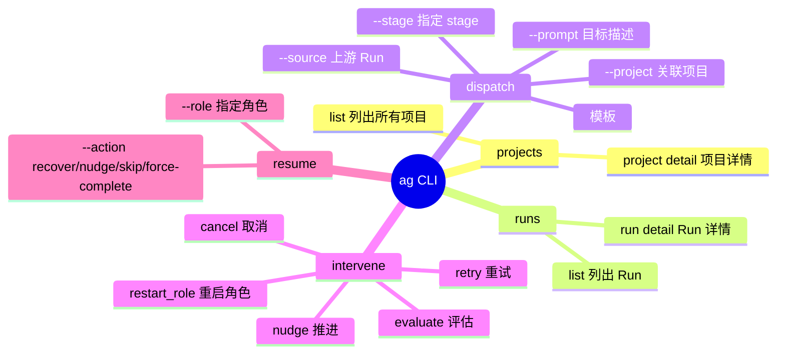

### 连接方式

```
CLI (scripts/ag.ts) → HTTP REST → http://localhost:3000/api/*
                       可通过 AG_BASE_URL 环境变量覆盖
```

### 辅助 CLI

| 脚本 | 用途 |
|---|---|
| `scripts/ag.ts` | 主 CLI：项目、Run、`dispatch <templateId> [--stage <stageId>]`、介入 |
| `scripts/ag-wechat.ts` | 微信辅助：模型切换、状态查看 |
| `scripts/antigravity-acp.ts` | ACP Adapter（被 cc-connect 调用）|
| `scripts/ag-migrate.sh` | 数据迁移脚本 |

---

## 11. 微信支持 (Claude Connect / cc-connect)

### 架构

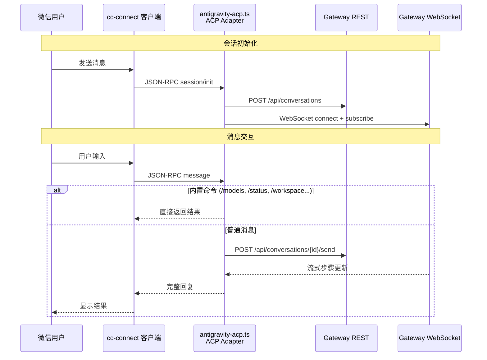

### Session 模型

```typescript
Session {
  cascadeId?: string    // 当前对话 ID
  workspace?: string    // 绑定的工作区
  model: string         // 当前模型 (默认 Gemini 3 Flash)
  ws?: WebSocket        // 实时连接
  cancelled: boolean    // 取消标志
}
// 每个微信用户一个 Session，持久化在 ~/.cc-connect/antigravity/
```

### 内置命令

| 命令 | 功能 |
|---|---|
| `/models` | 列出可用模型 + 配额 |
| `/model <name>` | 切换模型 |
| `/status` | 系统状态 + 配额信息 |
| `/workspace` | 切换工作区 |
| `/new` | 新建对话 (cc-connect 内置) |
| `/help` | 帮助信息 |

### Workspace 解析优先级

```
显式配置 workspace → /workspace 菜单选择 → 自动检测匹配 → Playground 回退
```

### cc-connect 配置

```toml
[[projects]]
name = "antigravity"

[projects.agent]
type = "acp"

[projects.agent.options]
work_dir = "/path/to/project"
command = "npx"
args = ["tsx", "/path/to/antigravity-acp.ts"]
```

---

## 12. Obsidian 插件

### 架构

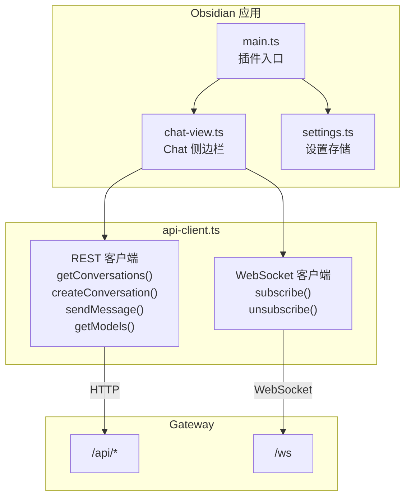

### 功能

- 右侧边栏 Chat View + Ribbon 图标快捷入口
- 对话列表（按 Workspace 过滤）
- 新建对话 + 实时流式消息
- 模型选择下拉 + Planning / Fast 模式切换
- Workspace 自动检测（Vault 路径匹配 Gateway Server）

### 设置

```typescript
{
  gatewayUrl: string      // e.g., "http://localhost:3000"
  workspaceUri?: string   // 覆盖 Workspace 自动检测
  defaultModel?: string   // 默认模型
}
```

---

## REST API 端点总览

| 路径 | 方法 | 模块 | 说明 |
|---|---|---|---|
| `/api/conversations` | GET / POST | Conversation | 列表 / 创建对话 |
| `/api/conversations/{id}/send` | POST | Conversation | 发送消息（支持 `@file` 附件）|
| `/api/conversations/{id}/cancel` | POST | Conversation | 取消生成 |
| `/api/conversations/{id}/steps` | GET | Conversation | 获取步骤历史 |
| `/api/conversations/{id}/proceed` | POST | Conversation | 审批 Artifact / 继续 |
| `/api/conversations/{id}/revert` | POST | Conversation | 回退到指定步骤 |
| `/api/conversations/{id}/revert-preview` | GET | Conversation | 回退预览 ⚠️ *后端未实现* |
| `/api/conversations/{id}/files` | GET | Conversation | 对话关联的文件列表 |
| `/api/agent-runs` | GET / POST | Agent | 列表 / 调度 Run |
| `/api/agent-runs/{id}` | GET / DELETE | Agent | 详情 / 取消 Run |
| `/api/agent-runs/{id}/intervene` | POST | Agent | 介入操作 (retry/nudge/restart_role/cancel/evaluate) |
| `/api/scope-check` | POST | Agent | 写入范围校验 |
| `/api/projects` | GET / POST | Project | 列表 / 创建项目 |
| `/api/projects/{id}` | GET / PATCH / DELETE | Project | 项目 CRUD |
| `/api/projects/{id}/resume` | POST | Project | 恢复阻塞 Pipeline |
| `/api/projects/{id}/diagnostics` | GET | Project | 项目健康诊断 |
| `/api/projects/{id}/reconcile` | POST | Project | 项目状态修复 |
| `/api/projects/{id}/graph` | GET | Project | 项目 DAG IR 表示 |
| `/api/projects/{id}/gate/{nodeId}/approve` | POST | Project (V5.2) | Gate 节点审批 |
| `/api/projects/{id}/checkpoints` | GET | Project (V5.2) | Checkpoint 列表 |
| `/api/projects/{id}/checkpoints/{cpId}/restore` | POST | Project (V5.2) | 从 Checkpoint 恢复 |
| `/api/projects/{id}/journal` | GET | Project (V5.2) | 执行日志查询 |
| `/api/projects/{id}/replay` | POST | Project (V5.2) | Checkpoint 回放 |
| `/api/pipelines` | GET | Pipeline | 列出 Pipeline 模板 |
| `/api/pipelines/{id}` | GET / PUT / DELETE | Pipeline | 模板 CRUD |
| `/api/pipelines/lint` | POST | Pipeline (V4.4) | 模板契约校验 |
| `/api/pipelines/validate` | POST | Pipeline (V5.1) | 通用模板校验 |
| `/api/pipelines/convert` | POST | Pipeline (V5.1) | 格式互转 |
| `/api/pipelines/generate` | POST | Pipeline (V5.3) | AI 生成草案 |
| `/api/pipelines/generate/{draftId}` | GET | Pipeline (V5.3) | 查看草案 |
| `/api/pipelines/generate/{draftId}/confirm` | POST | Pipeline (V5.3) | 确认保存草案 |
| `/api/pipelines/subgraphs` | GET | Pipeline (V5.4) | 子图列表 |
| `/api/pipelines/policies` | GET | Pipeline (V5.4) | 资源策略列表 |
| `/api/pipelines/policies/check` | POST | Pipeline (V5.4) | 配额检查 |
| `/api/operations/audit` | GET | Operations | 审计日志 |
| `/api/models` | GET | Core | 可用模型 + 配额 |
| `/api/servers` | GET | Core | 已发现的 Language Server |
| `/api/workspaces` | GET | Core | 工作区列表 |
| `/api/workspaces/launch` | POST | Core | 启动工作区 |
| `/api/workspaces/close` | POST | Core | 关闭工作区（隐藏）|
| `/api/workspaces/kill` | POST | Core | 终止工作区 Language Server |
| `/api/me` | GET | Core | 用户信息 |
| `/api/knowledge` | GET | Knowledge | 知识库条目列表 |
| `/api/knowledge/{id}` | GET / PUT / DELETE | Knowledge | 知识条目 CRUD |
| `/api/knowledge/{id}/artifacts/{path}` | GET | Knowledge | 知识条目附件 |
| `/api/skills` | GET | Skill | 技能列表（全局 + workspace）|
| `/api/skills/{name}` | GET | Skill | 技能详情 |
| `/api/workflows` | GET | Workflow | 工作流列表（全局 + workspace，去重）|
| `/api/rules` | GET | Rule | 自定义规则列表 |
| `/api/analytics` | GET | Analytics | 使用分析数据 |
| `/api/mcp` | GET | MCP | MCP 服务器配置 |
| `/api/tunnel` | GET | Tunnel | Tunnel 连接状态 |
| `/api/tunnel/start` | POST | Tunnel | 启动 Cloudflare Tunnel |
| `/api/tunnel/stop` | POST | Tunnel | 停止 Tunnel |
| `/api/tunnel/config` | GET / POST | Tunnel | Tunnel 配置 |
| `/api/codex` | POST | Codex | 单次任务执行 (`codex exec`) |
| `/api/codex/sessions` | POST | Codex | 创建多轮 MCP 会话 |
| `/api/codex/sessions/{threadId}` | POST | Codex | 多轮会话续接 |
| `/api/ceo/command` | POST | CEO | CEO 命令解析 + 自动派发 |
| `/api/approval` | GET / POST | Approval | 审批请求列表 / 提交 |
| `/api/approval/{id}` | GET / PATCH | Approval | 审批详情 / 更新 |
| `/api/approval/{id}/feedback` | POST | Approval | 审批反馈 |
| `/api/departments` | GET | Departments | 部门配置 |
| `/api/departments/sync` | POST | Departments | 同步部门状态 |
| `/api/departments/digest` | GET | Departments | 部门摘要 |
| `/api/departments/quota` | GET | Departments | 部门配额 |
| `/api/departments/memory` | GET / POST | Departments | 部门记忆 |
| `/api/scheduler/jobs` | GET | Scheduler | 定时任务列表 |
| `/api/scheduler/jobs/{id}` | GET / PATCH / DELETE | Scheduler | 任务 CRUD |
| `/api/scheduler/jobs/{id}/trigger` | POST | Scheduler | 手动触发任务 |
| `/api/projects/{id}/deliverables` | GET / POST | Project | 交付物管理 |
| `/api/logs` | GET | Core | 日志查看 |
| `/api/workflows/{name}` | GET | Workflow | 单个工作流详情 |
| `/api/scheduler` | GET | Scheduler | 调度器状态 |
| `/ws` | WebSocket | Realtime | 实时步骤流 |

---

## 技术栈

| 层 | 技术 |
|---|---|
| **前端** | Next.js 16 + React 19 + shadcn/ui + Tailwind CSS 4 |
| **后端** | Node.js + tsx + 自定义 HTTP Server + WebSocket |
| **协议** | gRPC-Web Connect (protobuf envelope) / REST / WebSocket / MCP (stdio) |
| **日志** | pino 结构化日志 + pino-roll 日志轮转 |
| **持久化** | JSON 文件 + .pb protobuf (StateDB / SQLite) |
| **隧道** | Cloudflare Tunnel (远程访问) |
| **构建** | TypeScript 5 + tsx (开发) + next build (生产) |
| **测试** | Playwright (E2E 截图) |

---

## 目录结构

```
├── ARCHITECTURE.md          # ← 本文件
├── server.ts                # HTTP + WS 入口
├── src/
│   ├── app/
│   │   ├── layout.tsx       # 全局布局 (Manrope 字体, 暗色主题)
│   │   ├── page.tsx         # 主路由: Sidebar + Chat + Panels
│   │   └── api/             # 30+ REST 端点
│   ├── components/
│   │   ├── chat.tsx         # 聊天主界面
│   │   ├── sidebar.tsx      # 左侧导航: Conversations/Projects/Agents/Knowledge
│   │   ├── project-workbench.tsx  # Pipeline 可视化
│   │   ├── agent-run-detail.tsx   # Run 详情
│   │   └── ui/              # shadcn/ui 基础组件
│   ├── lib/
│   │   ├── bridge/          # gateway.ts + grpc.ts + discovery.ts
│   │   ├── agents/          # Stage Runtime (group-runtime.ts) + registry + asset-loader + review
│   │   ├── i18n/            # 国际化
│   │   └── types.ts         # 核心类型定义
│   └── mcp/
│       └── server.ts        # MCP stdio 服务器
├── scripts/
│   ├── ag.ts                # 主 CLI
│   ├── antigravity-acp.ts   # 微信 ACP 适配器
│   └── ag-wechat.ts         # 微信辅助 CLI
├── plugins/
│   └── obsidian-antigravity/ # Obsidian 插件
└── docs/                    # 详细文档
```
