# Antigravity Gateway — 产品架构

> 将 Antigravity (Google DeepMind AI 编程代理) 变为无头 API 服务器，解锁远程访问、子代理集成和自动化 AI 工作流。

---

## 系统全景

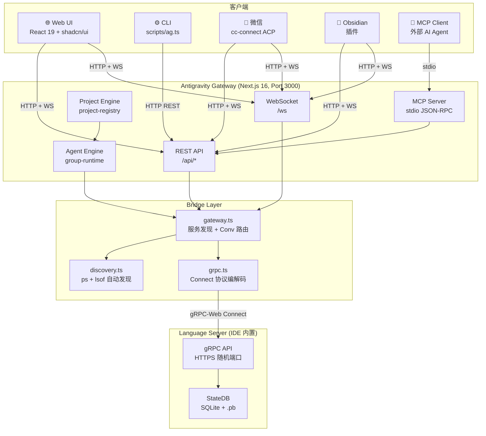

---

## 模块依赖关系

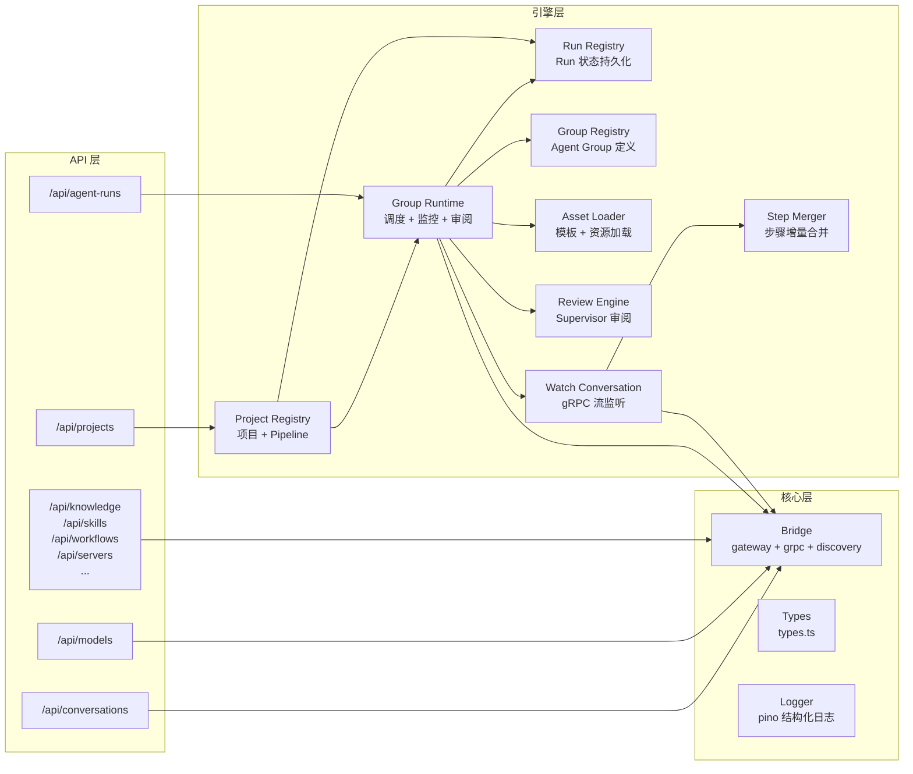

---

## 1. Conversation 对话系统

### 数据流

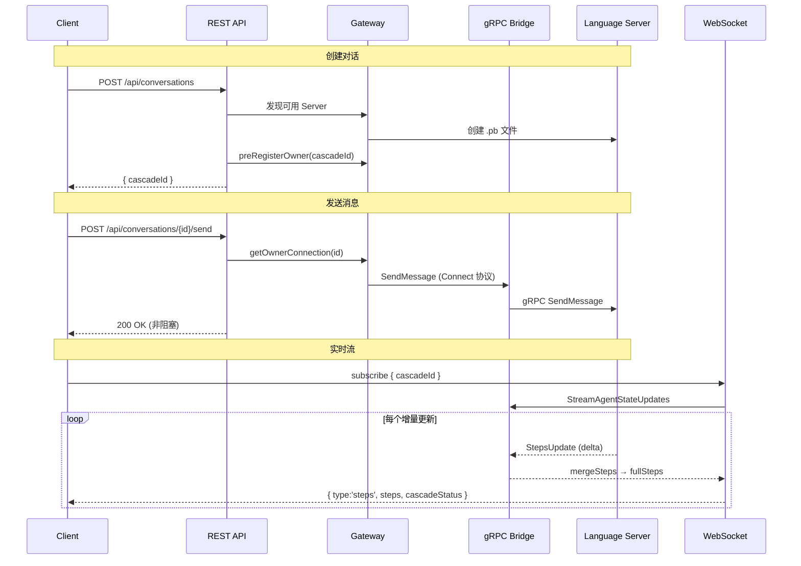

### 关键文件

| 文件 | 职责 |
|---|---|
| `src/app/api/conversations/route.ts` | 创建/列出对话 |
| `src/app/api/conversations/[id]/send/route.ts` | 发送消息，支持 `@[file]` 附件 |
| `server.ts` `/ws` | WebSocket 订阅 (`subscribe` / `multi-subscribe` / `unsubscribe`) |
| `src/lib/bridge/gateway.ts` | 服务发现 + Conv→Owner 路由映射 |
| `src/lib/bridge/grpc.ts` | Connect 协议编解码 `[flags:1][len:4][payload]` |
| `src/lib/agents/step-merger.ts` | 增量步骤合并为完整时间线 |
| `src/components/chat.tsx` | 聊天 UI，Timeline 步骤渲染 |

### Connect 协议封装

Gateway 与 Language Server 之间使用 **gRPC-Web Connect** 协议通信：

```
请求: POST https://localhost:{port}/connect-rpc/{service}/{method}
Body:  [flags: 1 byte][length: 4 bytes][JSON payload]
认证:  x-csrf-token header
```

### 服务发现

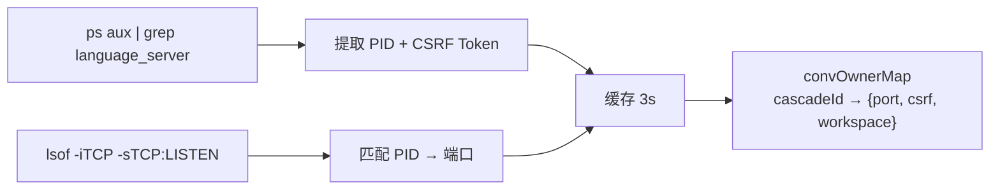

---

## 2. Agent 多代理系统

### 运行生命周期

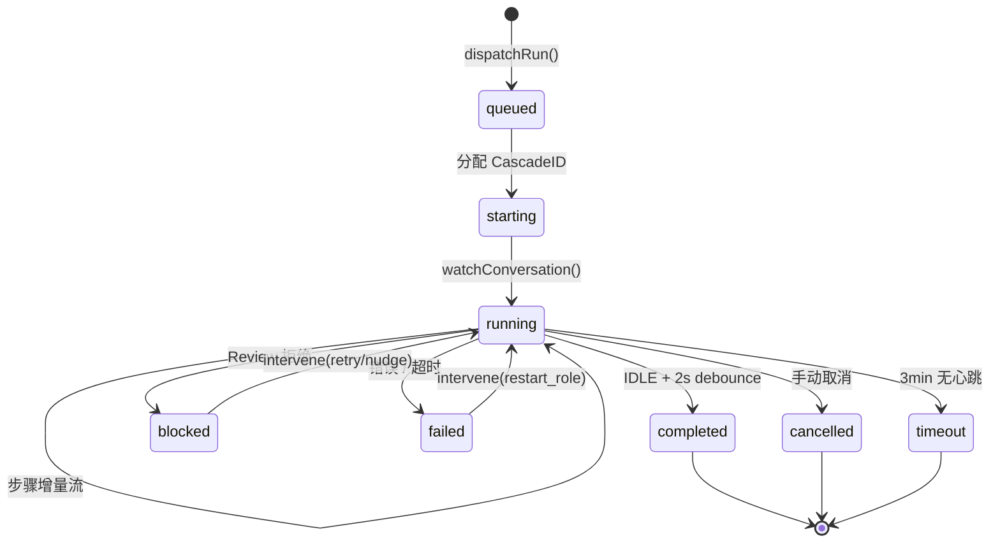

### Agent Group 及角色


### Pipeline 交付流

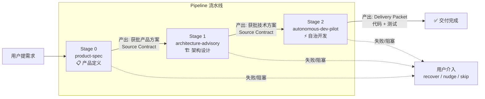

### Source Contract 机制

上游 Run 的产物自动注入下游：

```
SourceContract {
  requireReviewOutcome: ['approved']       // 上游必须通过审阅
  acceptedSourceGroupIds: ['product-spec'] // 可接受的上游 Group
  autoBuildInputArtifactsFromSources: true // 自动构建输入产物
  autoIncludeUpstreamSourceRuns: true      // 传递性依赖解析
}
```

### Review 审阅机制

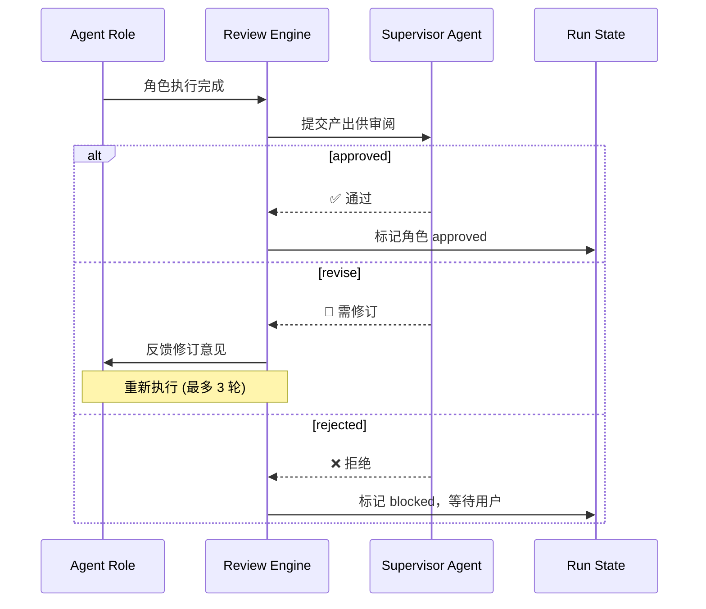

### 关键文件

| 文件 | 职责 |
|---|---|
| `src/lib/agents/group-runtime.ts` | 核心调度器: dispatch → watch → compact → review |
| `src/lib/agents/run-registry.ts` | Run 状态持久化 (`~/.gemini/antigravity/runs.json`) |
| `src/lib/agents/group-registry.ts` | Agent Group 模板注册 |
| `src/lib/agents/asset-loader.ts` | 从磁盘加载 group/template/review-policy |
| `src/lib/agents/watch-conversation.ts` | gRPC 流监听子对话，30s 心跳 / 3min 超时 |
| `src/lib/agents/review-engine.ts` | Supervisor 审阅: approve / revise / reject |
| `src/lib/agents/step-merger.ts` | 增量步骤合并 |

---

## 3. Project 项目系统

### 数据模型

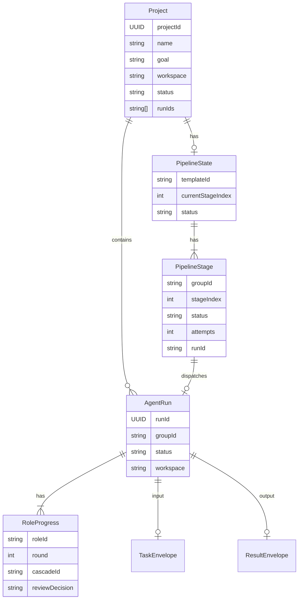

### Pipeline 状态机

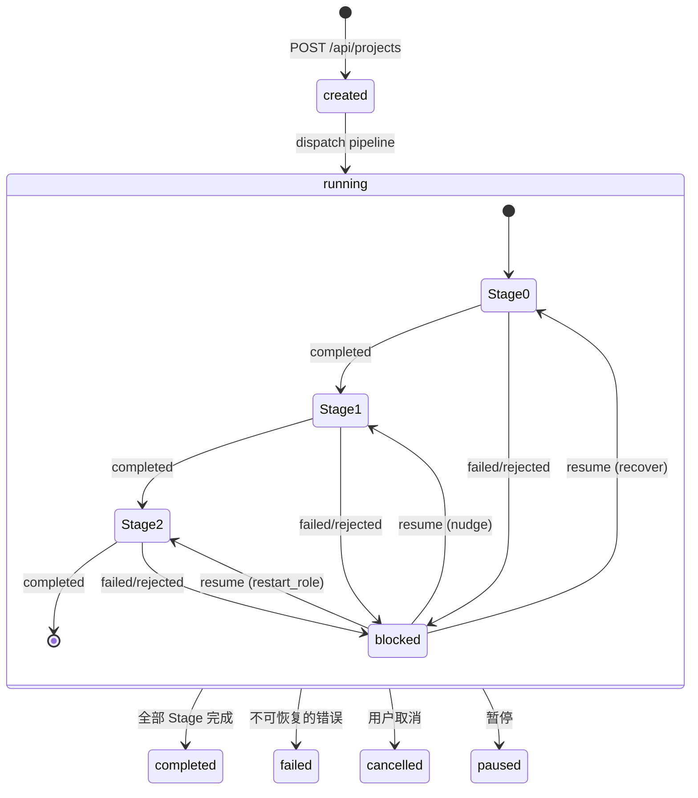

### 持久化

```
~/.gemini/antigravity/gateway/
├── assets/
│   ├── templates/             # Pipeline 模板 JSON
│   ├── workflows/             # 全局 Workflow .md（跨项目共享）
│   └── review-policies/       # 审阅策略 JSON
├── projects.json              # 全局项目索引
├── agent_runs.json            # 全局 Run 索引
└── local_conversations.json   # 对话缓存

~/.gemini/antigravity/
└── conversations/             # 对话 .pb 文件

{workspace}/demolong/
├── projects/{projectId}/
│   ├── project.json           # 项目详情
│   └── runs/{runId}/          # 按 Run 存储产出
└── runs/{runId}/              # 独立 Run（无 Project）产出
```

---

## 4. MCP Server

### 架构

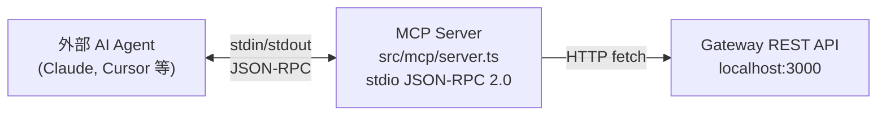

### 暴露的 Tools

| Tool | 功能 | 只读 | 幂等 |
|---|---|---|---|
| `antigravity_list_projects` | 列出项目 + Pipeline 状态 | ✅ | ✅ |
| `antigravity_get_project` | 获取项目详情 + 全部阶段 | ✅ | ✅ |
| `antigravity_get_run` | 获取 Run 详情 + Supervisor 审阅 | ✅ | ✅ |
| `antigravity_intervene_run` | 重试 / 推进 / 重启角色 / 取消 | ❌ | ❌ |
| `antigravity_dispatch_pipeline` | 从模板启动新 Agent Run | ❌ | ✅* |

> *dispatch 具有幂等检测：已完成的 Run 会自动短路，避免重复执行。

### 启动方式

```bash
npx tsx src/mcp/server.ts    # stdio 模式
```

---

## 5. CLI

### 命令总览

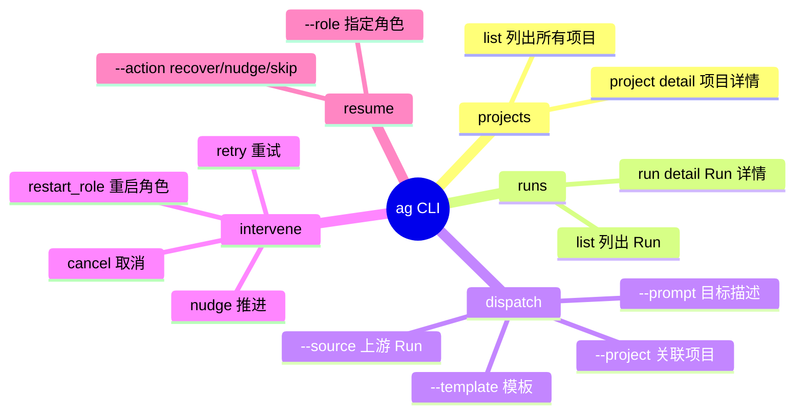

### 连接方式

```
CLI (scripts/ag.ts) → HTTP REST → http://localhost:3000/api/*
                       可通过 AG_BASE_URL 环境变量覆盖
```

### 辅助 CLI

| 脚本 | 用途 |
|---|---|
| `scripts/ag.ts` | 主 CLI：项目、Run、调度、介入 |
| `scripts/ag-wechat.ts` | 微信辅助：模型切换、状态查看 |
| `scripts/antigravity-acp.ts` | ACP Adapter（被 cc-connect 调用）|
| `scripts/ag-migrate.sh` | 数据迁移脚本 |

---

## 6. 微信支持 (Claude Connect / cc-connect)

### 架构

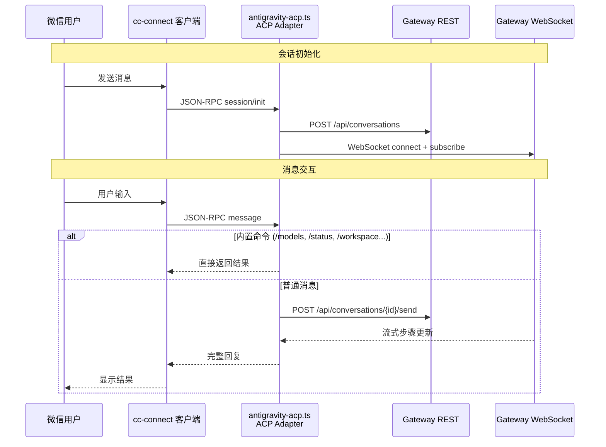

### Session 模型

```typescript
Session {
  cascadeId?: string    // 当前对话 ID
  workspace?: string    // 绑定的工作区
  model: string         // 当前模型 (默认 Gemini 3 Flash)
  ws?: WebSocket        // 实时连接
  cancelled: boolean    // 取消标志
}
// 每个微信用户一个 Session，持久化在 ~/.cc-connect/antigravity/
```

### 内置命令

| 命令 | 功能 |
|---|---|
| `/models` | 列出可用模型 + 配额 |
| `/model <name>` | 切换模型 |
| `/status` | 系统状态 + 配额信息 |
| `/workspace` | 切换工作区 |
| `/new` | 新建对话 (cc-connect 内置) |
| `/help` | 帮助信息 |

### Workspace 解析优先级

```
显式配置 workspace → /workspace 菜单选择 → 自动检测匹配 → Playground 回退
```

### cc-connect 配置

```toml
[[projects]]
name = "antigravity"

[projects.agent]
type = "acp"

[projects.agent.options]
work_dir = "/path/to/project"
command = "npx"
args = ["tsx", "/path/to/antigravity-acp.ts"]
```

---

## 7. Obsidian 插件

### 架构

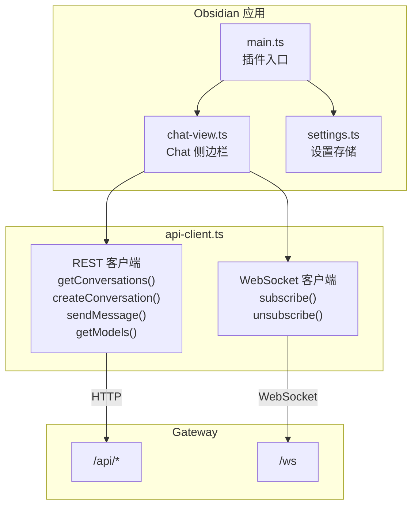

### 功能

- 右侧边栏 Chat View + Ribbon 图标快捷入口
- 对话列表（按 Workspace 过滤）
- 新建对话 + 实时流式消息
- 模型选择下拉 + Planning / Fast 模式切换
- Workspace 自动检测（Vault 路径匹配 Gateway Server）

### 设置

```typescript
{
  gatewayUrl: string      // e.g., "http://localhost:3000"
  workspaceUri?: string   // 覆盖 Workspace 自动检测
  defaultModel?: string   // 默认模型
}
```

---

## REST API 端点总览

| 路径 | 方法 | 模块 | 说明 |
|---|---|---|---|
| `/api/conversations` | GET / POST | Conversation | 列表 / 创建对话 |
| `/api/conversations/{id}/send` | POST | Conversation | 发送消息（支持 `@file` 附件）|
| `/api/conversations/{id}/cancel` | POST | Conversation | 取消生成 |
| `/api/conversations/{id}/steps` | GET | Conversation | 获取步骤历史 |
| `/api/conversations/{id}/proceed` | POST | Conversation | 审批 Artifact / 继续 |
| `/api/conversations/{id}/revert` | POST | Conversation | 回退到指定步骤 |
| `/api/conversations/{id}/revert-preview` | GET | Conversation | 回退预览 |
| `/api/conversations/{id}/files` | GET | Conversation | 对话中引用的文件列表 |
| `/api/agent-runs` | GET / POST | Agent | 列表 / 调度 Run |
| `/api/agent-runs/{id}` | GET / DELETE | Agent | 详情 / 取消 Run |
| `/api/agent-runs/{id}/intervene` | POST | Agent | 介入操作 (retry/nudge/restart_role/cancel) |
| `/api/agent-groups` | GET | Agent | 列出 Agent Groups |
| `/api/agent-groups/{id}` | GET | Agent | Group 详情 |
| `/api/scope-check` | POST | Agent | 写入范围校验 |
| `/api/projects` | GET / POST | Project | 列表 / 创建项目 |
| `/api/projects/{id}` | GET / PATCH / DELETE | Project | 项目 CRUD |
| `/api/projects/{id}/resume` | POST | Project | 恢复阻塞 Pipeline |
| `/api/pipelines` | GET | Project | 列出 Pipeline 模板 |
| `/api/models` | GET | Core | 可用模型 + 配额 |
| `/api/servers` | GET | Core | 已发现的 Language Server |
| `/api/workspaces` | GET | Core | 工作区列表 |
| `/api/workspaces/launch` | POST | Core | 启动工作区 |
| `/api/workspaces/close` | POST | Core | 关闭工作区（隐藏）|
| `/api/workspaces/kill` | POST | Core | 终止工作区 Language Server |
| `/api/me` | GET | Core | 用户信息 |
| `/api/knowledge` | GET | Knowledge | 知识库条目列表 |
| `/api/knowledge/{id}` | GET / PUT / DELETE | Knowledge | 知识条目 CRUD |
| `/api/knowledge/{id}/artifacts/{path}` | GET | Knowledge | 知识条目附件 |
| `/api/skills` | GET | Skill | 技能列表（全局 + workspace）|
| `/api/skills/{name}` | GET | Skill | 技能详情 |
| `/api/workflows` | GET | Workflow | 工作流列表（全局 + workspace，去重）|
| `/api/rules` | GET | Rule | 自定义规则列表 |
| `/api/analytics` | GET | Analytics | 使用分析数据 |
| `/api/mcp` | GET | MCP | MCP 服务器配置 |
| `/api/tunnel` | GET | Tunnel | Tunnel 连接状态 |
| `/api/tunnel/start` | POST | Tunnel | 启动 Cloudflare Tunnel |
| `/api/tunnel/stop` | POST | Tunnel | 停止 Tunnel |
| `/api/tunnel/config` | GET / POST | Tunnel | Tunnel 配置 |
| `/ws` | WebSocket | Realtime | 实时步骤流 |

---

## 技术栈

| 层 | 技术 |
|---|---|
| **前端** | Next.js 16 + React 19 + shadcn/ui + Tailwind CSS 4 |
| **后端** | Node.js + tsx + 自定义 HTTP Server + WebSocket |
| **协议** | gRPC-Web Connect (protobuf envelope) / REST / WebSocket / MCP (stdio) |
| **日志** | pino 结构化日志 + pino-roll 日志轮转 |
| **持久化** | JSON 文件 + .pb protobuf (StateDB / SQLite) |
| **隧道** | Cloudflare Tunnel (远程访问) |
| **构建** | TypeScript 5 + tsx (开发) + next build (生产) |
| **测试** | Playwright (E2E 截图) |

---

## 目录结构

```
├── ARCHITECTURE.md          # ← 本文件
├── server.ts                # HTTP + WS 入口
├── src/
│   ├── app/
│   │   ├── layout.tsx       # 全局布局 (Manrope 字体, 暗色主题)
│   │   ├── page.tsx         # 主路由: Sidebar + Chat + Panels
│   │   └── api/             # 30+ REST 端点
│   ├── components/
│   │   ├── chat.tsx         # 聊天主界面
│   │   ├── sidebar.tsx      # 左侧导航: Conversations/Projects/Agents/Knowledge
│   │   ├── project-workbench.tsx  # Pipeline 可视化
│   │   ├── agent-run-detail.tsx   # Run 详情
│   │   └── ui/              # shadcn/ui 基础组件
│   ├── lib/
│   │   ├── bridge/          # gateway.ts + grpc.ts + discovery.ts
│   │   ├── agents/          # group-runtime + registry + asset-loader + review
│   │   ├── i18n/            # 国际化
│   │   └── types.ts         # 核心类型定义
│   └── mcp/
│       └── server.ts        # MCP stdio 服务器
├── scripts/
│   ├── ag.ts                # 主 CLI
│   ├── antigravity-acp.ts   # 微信 ACP 适配器
│   └── ag-wechat.ts         # 微信辅助 CLI
├── plugins/
│   └── obsidian-antigravity/ # Obsidian 插件
└── docs/                    # 详细文档
```
