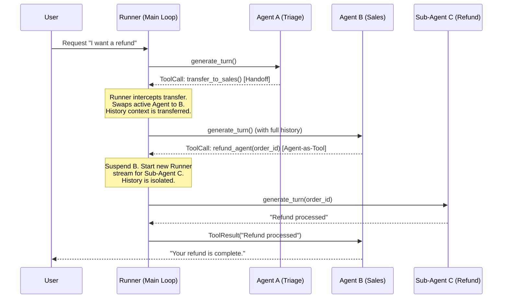

# 深度调研报告：OpenAI Agents Python Multi-Agent 机制全景剖析

**版本**: v2.0 (Exhaustive Deep Dive)
**日期**: 2026-04-19
**目标**: 穷尽式、源码级剖析 `openai-agents-python` 的多智能体机制，涵盖调度层、并发模型、护栏防御、状态流转及机制瓶颈。

---

## 1. 执行摘要 (Executive Summary)

与 LangGraph 的显式有向无环图 (DAG) 状态机或 AutoGen 的多方对话黑板模式不同，`openai-agents-python` SDK 走的是**极简转移驱动（Handoff-Driven）**与**Agent-as-Tool (工具化代理)** 结合的路线。

其 Multi-Agent 机制核心表现为两条技术主线：
1. **Handoff (转移接力赛)**: 将 Agent 之间的路由控制权封装为 `FunctionTool`，利用底座大模型原生的 `function_calling` 决定对话接力流向。
2. **Agent-as-Tool (嵌套父子调用)**: 允许将一整个 Agent 包装为工具，主 Agent 通过工具调用的形式，在一个独立沙箱中启动子 Agent，等待执行结果汇总后返回。



---

## 2. 核心架构与隔离模型：Handoff vs Agent-as-Tool

在 `src/agents/agent.py` 源码中，系统提供了两种完全不同的 Multi-Agent 范式，它们在上下文隔离上有着本质区别。

### 2.1 Handoff (平级转交机制)
通过定义 `handoffs: list[Agent | Handoff]`，底层框架会把目标 Agent 抽象为一个类似 `transfer_to_agent_name` 的工具。
- **上下文继承 (Context Inheritance)**: 在 `src/agents/run_internal/turn_resolution.py` 的 `execute_handoffs` 逻辑中，当 Handoff 发生时，`Runner` 只是切换了指针，新的 Agent 会**完全继承**之前的全部消息历史（Memory）。
- **拦截控制**: 转交是互斥的。系统在单回合强制抛弃平行的多余 Handoff 尝试，避免状态分叉爆炸。

### 2.2 Agent-as-Tool (嵌套沙箱机制)
见 `agent.py` 的 `as_tool()` 方法实现。当子 Agent 被调用时：
```python
def as_tool(self, ...) -> FunctionTool:
    def _run_agent_impl(params: BaseModel):
        # 内部启动独立的 Runner 循环
        result = Runner.run_streamed(agent=self, input=params.model_dump_json(), ...)
        return custom_output_extractor(result)
    return FunctionTool(name, _run_agent_impl)
```
- **物理隔离 (Physical Isolation)**: 子 Agent 不会看到父 Agent 的任何历史。它只接收被解析为 JSON 参数的指令。这种隔离彻底斩断了多 Agent 间的“上下文污染”。

---

## 3. 编排模式与并发调度 (Concurrency Model)

系统的编排调度分为“宏观串行”与“微观并行”两层。

### 3.1 宏观层：严格串行
无论是 Handoff 还是 Turn 生成，`Runner.run` 在 Agent 级别的控制流是阻塞且单线程的。不存在两个 Agent 同时跟用户讲话的设定。

### 3.2 微观层：基于异步的并发 (Parallel Tools)
在 `src/agents/run_internal/tool_planning.py` 的 `_execute_tool_plan` 阶段，源码明确了对同一 Turn 内多工具的并发支持：
```python
# 截取自 tool_planning.py
results = await asyncio.gather(
    *(execute_tool(call) for call in tool_calls),
    return_exceptions=True
)
```
**深度解析**: 
由于 `Agent-as-Tool` 本质也是 Tool，这意味着 **主 Agent 可以在同一回合内通过大模型发起并发 Tool Call，利用 `asyncio.gather` 同时启动多个隔离的子 Agent 进行 Map-Reduce 任务**。这是这套系统最隐蔽也最强大的并发能力。

---

## 4. 护栏体系与强制对齐 (Guardrails & Alignment)

对于多智能体系统，最怕的就是智能体“偷懒”或越权。`openai-agents-python` 采用的是“硬代码拦截”，而非“Prompt 软约束”。

### 4.1 Schema 强约束与 Structured Outputs
在 `agent.py` 内部，通过 `ensure_strict_json_schema` 强制将工具入参转化为 OpenAI 的 Strict Schema。
更重要的是 `output_type` 参数：如果配置了该参数，引擎会在底层强制要求 LLM 输出 `response_format` JSON，直接在端侧拒绝大模型随意回复“好的，任务完成了”等偷懒行为。

### 4.2 Guardrails 拦截网 (Middleware Interception)
见 `src/agents/guardrail.py`，系统提供 `input_guardrails` 和 `output_guardrails`。
这并不是让大模型自我检查，而是 Engine 层面的中间件。如果护栏函数不通过（如发现越权），拦截器会抛出异常，`Runner` 捕获后强行转译为 Tool Error 压回上下文，逼迫大模型重新思考。

### 4.3 审批挂起 (Needs Approval)
在敏感操作节点，工具配置了 `needs_approval=True`。运行时遇到该标记，整个 `Runner` 直接挂起（Suspend），返回 `Pending` 状态。上下文保存在序列化的 `RunState` 中，必须由外部系统显式调用 `RunState.approve()` 才能继续。极大地增强了 Multi-Agent 链条中的 Human-in-the-Loop 能力。

---

## 5. 可观测性与状态恢复 (Observability & State Management)

相比 pi-mono 的 Ephemeral OS Process，本系统提供了完整的内存态持久化基建。

### 5.1 RunState 序列化
核心见 `src/agents/run_state.py`。整个多回合的对话上下文、Tool 调用栈、Agent 指针，全都可以被 `RunState.model_dump()` 序列化。哪怕进程挂了，也可以从数据库读出 JSON 无损恢复现场。

### 5.2 MCP (Model Context Protocol) 赋能
`mcp/manager.py` 提供的服务器生命周期管理，使得所有 Agent 都可以“零成本”挂载海量的外部能力，而不需要在框架内重复造轮子。

---

## 6. 机制瓶颈与潜在雪崩风险 (Critical Vulnerabilities)

尽管架构极为精巧，但在长链路企业级业务中，该框架存在不可忽视的弱点。

### 6.1 缺乏确定性的拓扑图 (No Deterministic DAG)
完全依赖大模型的 `function_calling` 做路由转交。这意味着：
如果业务要求“必须先过审核 Agent -> 再过安全 Agent -> 最后执行 Agent”，框架无法用硬代码画出这条线。大模型只要产生一次幻觉，就会跳过审核直接转交，这在金融/合规场景是极其危险的。

### 6.2 状态爆炸与死循环 (Context Bloat & Infinite Loops)
Handoff 机制是携带全量历史的。在经过 10 次接力赛后，最后一个 Agent 的上下文里充斥着前 9 个人无关紧要的试错细节，极易引发上下文污染。
虽然 `tool_use_behavior='run_llm_again'` 能防止偷懒，但如果工具一直报错，大模型可能会陷入反复调用工具的“死循环（Infinite Retry Loop）”，只能靠粗暴的 `max_turns` 强行掐断。

---

## 7. 总结 (Conclusion)

`openai-agents-python` 的 Multi-Agent 机制是 **“极简主义与大模型能力的高度绑定”**。

其工程贡献度与 AI 贡献度大致是 **40% / 60%**。
工程上（40%），它极其漂亮地解决了并发调度、Schema 校验、RunState 序列化中断与恢复、以及 MCP 的原生集成；
业务流转上（60%），它彻底放弃了传统框架对 Agent 协作拓扑的硬编码，将“谁来干活、怎么干活”全盘托付给底座大模型的原生 Function Calling 精度。

这套机制在快速搭建具备单点突破能力的“智能体工作流”时所向披靡，但在面对需要严格 SOP 管控的超大型流水线任务时，缺乏控制论上的硬性保障。
