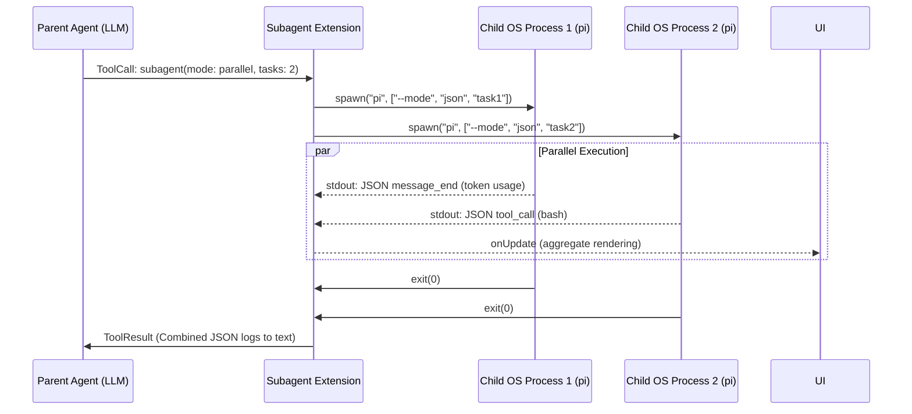

# 深度调研报告：pi-mono Multi-Agent 协作与隔离机制全景剖析

**版本**: v2.0 (Exhaustive Deep Dive)
**日期**: 2026-04-19
**目标**: 穷尽式、源码级剖析 pi-mono 的多智能体机制，涵盖调度层、进程层、沙箱安全、状态流转及潜在缺陷。

---

## 1. 执行摘要 (Executive Summary)

与 AutoGen、LangGraph 等将“多智能体编排”原生固化在状态机或图计算模型中的框架不同，`pi-mono` 采取了**扩展驱动、进程隔离**的极简主义路线。它本质上是一个高度模块化的单体 Coding Agent。

其 Multi-Agent 机制完全由外挂扩展（Extension API）拼装而成，核心表现为两条技术主线：
1. **Tool-Driven Process Delegation (工具驱动的进程委托)**: 通过 `subagent` 工具，将任务下发给动态生成的 OS 进程。
2. **Context Handoff (基于 Session 分支的上下文交接)**: 通过 `/handoff` 指令，抽取摘要并生成新的 Session 节点，斩断上下文膨胀。



---

## 2. 核心架构与隔离模型：OS 级进程沙箱

`pi-mono` 对于子 Agent 的隔离态度是极其严苛的物理隔离。

### 2.1 进程拉起机制 (Process Spawning)
在 `subagent/index.ts` 的 `runSingleAgent` 函数中，主 Agent 并不会在同一个 V8 引擎上下文中增加一轮 Prompt，而是直接构建 CLI 参数，使用 Node.js 的 `child_process.spawn` 拉起一个新的 `pi` 进程：

```typescript
const args: string[] = ["--mode", "json", "-p", "--no-session"];
if (agent.model) args.push("--model", agent.model);
if (agent.tools && agent.tools.length > 0) args.push("--tools", agent.tools.join(","));

const proc = spawn(invocation.command, invocation.args, {
    cwd: cwd ?? defaultCwd,
    shell: false,
    stdio: ["ignore", "pipe", "pipe"],
});
```
**深度解析**：
- `--mode json`：强制子进程丢弃人类友好的 Markdown 渲染，直接向 stdout 吐出 JSON 格式的结构化数据，供父进程做流式解析。
- `--no-session`：切断子进程对本地 SQLite Session 数据库的写入权限，子进程的状态是完全 Ephemeral（瞬态）的。
- 零上下文污染：由于完全不继承主进程的 Session 记录，子 Agent 的 Context Window 是处女地，这彻底消灭了长会话常见的“指令遗忘”和“上下文膨胀 (Context Bloat)”。

---

## 3. 编排模式与调度逻辑 (Orchestration Modes)

`subagent` 工具通过 Pydantic/TypeBox 定义了严格的入参 Schema（`SubagentParams`），提供了三种调度模式：

### 3.1 Parallel 模式：受控的并发调度
在并行模式下，框架并没有随意放权让大模型发起无限的并发请求，而是实施了严格的**工程节流阀**：
- `MAX_PARALLEL_TASKS = 8`：硬性限制一个工具调用里最多只能塞 8 个任务。
- `MAX_CONCURRENCY = 4`：限制同时 active 的进程数不超过 4。

**底层实现**：
系统实现了一个专用的 `mapWithConcurrencyLimit` 控制器，利用 Promise 池来压制 CPU 和 LLM API 的高并发突波：
```typescript
async function mapWithConcurrencyLimit<TIn, TOut>(
	items: TIn[],
	concurrency: number,
	fn: (item: TIn, index: number) => Promise<TOut>,
): Promise<TOut[]>
```
在执行期间，每个子任务都会触发 `emitParallelUpdate`，通过 `ctx.ui.setWidget` 流式更新主界面的 TUI（如 `Parallel: 2/5 done, 3 running...`）。

### 3.2 Chain 模式：基于模板插值的状态平移
Chain 模式通过异步 `for` 循环实现严格的同步阻塞。
**上下文流转机制**：
它并未采用复杂的 JSON Schema 传递，而是使用了最原始的字符串替换法：
```typescript
const step = params.chain[i];
const taskWithContext = step.task.replace(/\{previous\}/g, previousOutput);
```
- `previousOutput` 是通过 `getFinalOutput(result.messages)` 从上一个进程的日志中提取的最终 Assistant Text。
- **隐患**：一旦前序 Agent 输出的代码夹杂了大量解释性文字，或者结构发生破坏，字符串替换会将极其混乱的上下文注入给下游节点，导致下游大模型直接幻觉崩盘。

---

## 4. 权限门控与安全防御 (Security & Scope)

由于拉起的是 OS 进程，`pi-mono` 在安全校验上设计了严格的 `AgentScope`。

### 4.1 作用域鉴权 (AgentScope Validation)
Agent 配置来源分为两类：
- `user`：存放在 `~/.pi/agent/agents`，被认为是安全的全局预设。
- `project`：存放在当前项目目录 `.pi/agents`。

如果调用链中包含了 `project` 级别的自定义 Agent，框架在正式拉起进程前会进行强力门控阻断：
```typescript
if (projectAgentsRequested.length > 0) {
    const ok = await ctx.ui.confirm(
        "Run project-local agents?",
        `Agents: ${names}\nSource: ${dir}\n\nProject agents are repo-controlled. Only continue for trusted repositories.`,
    );
    if (!ok) return { isError: true, ... };
}
```
这种设计防范了供应链投毒攻击——如果开发者 clone 了一个恶意的仓库，仓库内的 `.pi/agents/worker.md` 被篡改注入了 `rm -rf /`，框架会在拉起前进行警报。

---

## 5. Session Branching：另一种多智能体形态 (Handoff)

除了进程委托外，`pi-mono` 的 `handoff` 扩展揭示了另一种基于“会话克隆”的协作形态。

**核心痛点**：长时间 Coding 后，上下文积累了大量错误的尝试和废弃的代码库上下文，LLM 变笨。
**解决机制**：
1. `ctx.sessionManager.getBranch()` 提取当前节点到根节点的纯净历史。
2. 注入特定的 `SYSTEM_PROMPT`（You are a context transfer assistant...），让模型将几万 Token 的历史总结为几百 Token 的精炼 Prompt。
3. **调用 `ctx.newSession({ parentSession: currentSessionFile })`**。
   这一步是灵魂。它利用底层 `agent-session-runtime.ts` 的原生分支能力，克隆了一个关联父节点的新 Session，将生成的精炼 Prompt 填入输入框，实现真正的“轻装上阵”上下文转移。

---

## 6. 流式解析与可观测性体系 (Observability)

在长耗时的多进程并行任务中，UI 不可处于假死状态。`pi-mono` 展现了顶级的流解析工程。

**子进程流拦截与 Token 溯源**：
子进程的标准输出 `stdout.on("data")` 会经过严格的分行和 JSON 尝试解析。当捕获到特定类型时：
- `message_end`：如果 `msg.role === "assistant"`，系统立刻进行**财务结算**。代码如下：
```typescript
if (usage) {
    currentResult.usage.input += usage.input || 0;
    currentResult.usage.output += usage.output || 0;
    currentResult.usage.cost += usage.cost?.total || 0;
}
```
- **渲染引擎合并计算**：通过重载 `renderResult` 和 `renderCall` 方法，聚合这些 `UsageStats`。当使用 Parallel 模式拉起多个子进程时，TUI 面板能自动合并/折叠并行子任务的日志，动态调用 `formatUsageStats` 展示总计的 Token 消费账单（例如：`↑12.5k ↓4.1k $0.05`），即便在终端中，也能提供不输 Web 界面的透视性。

---

## 7. 机制短板与潜在雪崩风险 (Critical Vulnerabilities)

尽管工程基建（隔离、并发控制、解析）极度优异，但该机制在“AI防偷懒与对齐”层面上存在重大设计缺陷。

### 7.1 缺乏自动化护栏 (No Automatic Guardrails)
- 底层仅靠进程 `exitCode !== 0` 判定失败。
- 如果大模型偷懒，输出了极短的“任务太复杂，我建议你自己写”，进程会返回 `exitCode = 0`。框架底层没有任何 `OutputValidator`（如 Copilot SDK 的 Schema Check 或 AG 的 Code Reviewer）来阻止这种行为，而是照单全收放入 `ToolResult`。

### 7.2 全盘压注主模型智商
所有针对偷懒的二次鞭策（Nudge）、对 Chain 模式输出结果的语义校验，完全且只能由**主 Agent（父 LLM）**负责。如果主 Agent 没有从长长的返回报告里察觉到子任务的失败，整个巨型任务就会发生静默失败（Silent Failure）。

### 7.3 并行态的孤岛问题 (Parallel Silos)
在 Parallel 模式下运行的子 Agent，相互之间完全不知道对方的存在和进度。没有任何机制允许子 Agent A 向 子 Agent B 进行横向通信（Cross-Agent Communication）。

---

## 8. 总结 (Conclusion)

`pi-mono` 的多智能体机制是**“极重基建、极轻语义”**的典型代表。

它的工程贡献度与 AI 贡献度大致是 **40% / 60%**。它通过 OS 级别的进程隔离和一流的 TUI 事件流聚合，为 LLM 提供了一个无懈可击的安全并发执行沙箱（40%）。但它彻底放弃了在框架层引入状态机纠偏和验证逻辑，将所有复杂的任务拆解、参数重写和失败识别全部下放给了基础模型的 Zero-Shot 能力（60%）。

这使得它在执行具有明确单一目标的隔离任务时极其稳定，但在面临需要持续博弈、精细结构化对接的长线并行任务时，会因为缺乏护栏防御而显得脆弱。
