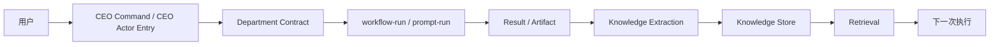

# AI 公司系统 Phase 0：合同与主链路冻结

**日期**: 2026-04-19  
**阶段定位**: `Phase 0`  
**阶段目标**: 在正式进入 `Knowledge Loop v1` 之前，冻结关键系统合同、最小主链路、文件级归属与阶段出口标准，避免后续实现阶段边做边改、主线漂移。

---

## 1. Phase 0 的使命

Phase 0 不负责“做出功能”，而负责：

1. 冻结关键系统对象
2. 冻结最小主链路
3. 冻结文件级归属
4. 冻结阶段成功标准

一句话：

> **Phase 0 的任务不是增加能力，而是减少歧义。**

如果这一步没做透，后面会反复出现：

- 改一半类型
- 改一半 runtime
- 改一半 UI
- 然后发现主链路理解不一致

---

## 2. 本阶段 In Scope

Phase 0 只覆盖以下内容：

1. `CEOProfile` 合同冻结
2. `DepartmentContract` 合同冻结
3. `ExecutionProfile` 合同冻结
4. `KnowledgeAsset` 合同冻结
5. `ManagementMetric` 合同冻结
6. 最小主链路冻结
7. 文件级 owner 与改动边界冻结
8. `Definition of Ready / Done` 冻结

## 2.1 本阶段 Out of Scope

本阶段明确不做：

1. 真实功能实现
2. 新 UI 页面开发
3. 大规模 Provider 接入
4. 自主演进实现
5. OKR runtime 实现
6. CEO Actor 真正落地

---

## 3. 当前系统基线

Phase 0 不是凭空抽象，而是建立在现有代码基线之上。

当前已经存在的关键基线：

### 3.1 Department 基线

现有 `DepartmentConfig` 已经在 [src/lib/types.ts](/Users/darrel/Documents/Antigravity-Mobility-CLI/src/lib/types.ts:113) 中定义，包含：

- `name`
- `type`
- `description`
- `templateIds`
- `skills`
- `okr`
- `provider`
- `tokenQuota`

这意味着 Department 不是新概念，已经是系统里的基础配置对象。

### 3.2 执行基线

现有运行时基线包括：

- `StageExecutionMode` / `StageDefinition` / `TaskResult`
  - [src/lib/agents/group-types.ts](/Users/darrel/Documents/Antigravity-Mobility-CLI/src/lib/agents/group-types.ts:52)
- prompt-mode 执行主链
  - [src/lib/agents/prompt-executor.ts](/Users/darrel/Documents/Antigravity-Mobility-CLI/src/lib/agents/prompt-executor.ts:286)
- CEO 调度入口
  - [src/lib/agents/ceo-agent.ts](/Users/darrel/Documents/Antigravity-Mobility-CLI/src/lib/agents/ceo-agent.ts:197)

### 3.3 Knowledge 基线

现有知识/记忆基线包括：

- `extractAndPersistMemory(...)`
  - [src/lib/agents/department-memory.ts](/Users/darrel/Documents/Antigravity-Mobility-CLI/src/lib/agents/department-memory.ts:115)
- prompt-mode `promptResolution` / `workflowSuggestion`
  - [src/lib/agents/group-types.ts](/Users/darrel/Documents/Antigravity-Mobility-CLI/src/lib/agents/group-types.ts:22)

因此：

> Phase 0 不是定义一个全新系统，而是给现有系统补“未来不会反复改的骨架合同”。

---

## 4. Phase 0 核心决策

## 决策 1：保留 `DepartmentConfig`，新增 `DepartmentContract`，不直接替换

原因：

- `DepartmentConfig` 已广泛用于 API / UI / local file config
- 现在直接替换会造成大面积无收益重构

因此：

- `DepartmentConfig` 继续作为**配置层 / 存储层对象**
- `DepartmentContract` 作为**运行时治理对象**

也就是说：

```text
DepartmentConfig = persisted config
DepartmentContract = runtime view
```

## 决策 2：`ExecutionProfile` 是调度层合同，不是 Provider 层合同

`ExecutionProfile` 只负责回答：

- 这个任务该走哪种执行模型？

它不负责回答：

- 用哪个 Provider？
- 用哪个 model？

这两者分别属于：

- `DepartmentContract.providerPolicy`
- `resolveProvider(...)`

## 决策 3：`KnowledgeAsset` 是 Learning Plane 的最小统一对象

`department-memory.ts` 当前主要是 Markdown 文件模型。  
Phase 0 冻结后，后续不再直接把“知识系统”理解成：

- `knowledge.md`
- `decisions.md`
- `patterns.md`

而是理解成：

- `KnowledgeAsset[]`

Markdown 文件只是它的存储表现之一。

## 决策 4：最小主链路优先走 prompt / workflow-run，不走重 DAG

原因：

- Phase 1 是 `Knowledge Loop v1`
- 目标是先打通 “run -> knowledge -> next run”
- 用轻链路最容易稳定验证

因此 Phase 0 冻结主链路时，优先定义：

- `CEO -> Department -> workflow-run/prompt-run -> knowledge extraction -> retrieval`

而不是：

- 跨部门重 DAG

## 决策 5：UI 在 Phase 0 只冻结读模型，不冻结页面实现

Phase 0 只回答：

- 管理层将来要看哪些指标
- 哪些对象提供给 UI

Phase 0 不回答：

- 具体卡片怎么排
- 哪个组件长什么样

---

## 5. 冻结的五个核心合同

## 5.1 `CEOProfile`

### 目标

定义 CEO 的持久状态对象，作为 CEO actor 化的前提。

### 合同草案

```ts
export interface CEOProfile {
  id: 'default-ceo';
  identity: {
    name: string;
    role: 'ceo';
    tone?: string;
  };
  priorities: string[];
  activeFocus?: string[];
  communicationStyle?: {
    verbosity?: 'brief' | 'normal' | 'detailed';
    escalationStyle?: 'aggressive' | 'balanced' | 'minimal';
  };
  riskTolerance?: 'low' | 'medium' | 'high';
  reviewPreference?: 'result-first' | 'process-first' | 'balanced';
  recentDecisions?: Array<{
    timestamp: string;
    summary: string;
    source: 'user' | 'ceo' | 'system';
  }>;
  feedbackSignals?: Array<{
    timestamp: string;
    type: 'correction' | 'approval' | 'rejection' | 'preference';
    content: string;
  }>;
  updatedAt: string;
}
```

### 边界

`CEOProfile` 不存：

- 对话全文
- run 列表
- 项目状态

这些仍然来自：

- conversations
- runs
- projects

## 5.2 `DepartmentContract`

### 目标

把 `DepartmentConfig` 提升为运行时治理单元。

### 合同草案

```ts
export interface DepartmentContract {
  workspaceUri: string;
  name: string;
  type: string;
  description?: string;
  responsibilities: string[];
  providerPolicy: {
    defaultProvider?: string;
    allowedProviders?: string[];
  };
  workflowRefs: string[];
  skillRefs: string[];
  memoryScopes: {
    department: boolean;
    organization: boolean;
    providerSpecific: boolean;
  };
  tokenQuota?: {
    daily: number;
    monthly: number;
    canRequestMore: boolean;
  };
  okrRef?: {
    enabled: boolean;
    period?: string;
  };
  routinePolicies?: {
    allowDailyDigest?: boolean;
    allowWeeklyReview?: boolean;
    allowAutonomousPatrol?: boolean;
  };
}
```

### 映射原则

- `DepartmentConfig` 是输入
- `DepartmentContract` 是标准化后的运行时视图

## 5.3 `ExecutionProfile`

### 目标

统一调度层执行模型。

### 合同草案

```ts
export type ExecutionProfile =
  | {
      kind: 'workflow-run';
      workflowRef?: string;
      skillHints?: string[];
    }
  | {
      kind: 'review-flow';
      reviewPolicyId?: string;
      roles: string[];
    }
  | {
      kind: 'dag-orchestration';
      templateId: string;
      stageId?: string;
    };
```

### 关键边界

`ExecutionProfile` 不等于现有：

- `ExecutionTargetFE`
- `StageExecutionMode`

它是更高一层的调度合同。

映射关系：

- `workflow-run` -> `prompt-executor.ts`
- `review-flow` -> stage runtime 的 review-loop 能力
- `dag-orchestration` -> template / graph pipeline

## 5.4 `KnowledgeAsset`

### 目标

冻结 Learning Plane 的最小知识对象。

### 合同草案

```ts
export interface KnowledgeAsset {
  id: string;
  scope: 'department' | 'organization';
  workspaceUri?: string;
  category:
    | 'decision'
    | 'pattern'
    | 'lesson'
    | 'domain-knowledge'
    | 'workflow-proposal'
    | 'skill-proposal';
  title: string;
  content: string;
  source: {
    type: 'run' | 'manual' | 'ceo' | 'system';
    runId?: string;
    artifactPath?: string;
  };
  confidence?: number;
  tags?: string[];
  status?: 'active' | 'stale' | 'conflicted' | 'proposal';
  createdAt: string;
  updatedAt: string;
}
```

### 关键边界

当前 `MemoryEntry` 仍可存在，但在 Phase 1 开始后，任何“知识系统”实现都必须向 `KnowledgeAsset` 看齐，而不是继续扩散新的 ad-hoc 结构。

## 5.5 `ManagementMetric`

### 目标

冻结经营指标对象，给 Management Console 和后续 KPI 计算一个统一出口。

### 合同草案

```ts
export interface ManagementMetric {
  key:
    | 'objectiveContribution'
    | 'taskSuccessRate'
    | 'blockageRate'
    | 'retryRate'
    | 'selfHealRate'
    | 'memoryReuseRate'
    | 'workflowHitRate'
    | 'departmentThroughput'
    | 'ceoDecisionQuality';
  scope: 'organization' | 'department' | 'ceo';
  workspaceUri?: string;
  value: number;
  unit: 'ratio' | 'count' | 'score' | 'hours';
  window: 'day' | 'week' | 'month' | 'rolling-30d';
  computedAt: string;
  evidence?: string[];
}
```

---

## 6. 文件级归属冻结

## 6.1 现有文件继续保留职责

以下文件职责在 Phase 0 不改：

| 文件 | 当前职责 | Phase 0 判断 |
|:--|:--|:--|
| `src/lib/types.ts` | 前端/API 投影类型 | 保留，但后续不继续无限扩张为全部系统合同 |
| `src/lib/agents/group-types.ts` | runtime / stage / run 核心类型 | 保留为执行平面类型中心 |
| `src/lib/agents/ceo-agent.ts` | CEO 命令解析与 dispatch 入口 | 保留，但不再继续塞长期 actor 状态 |
| `src/lib/agents/prompt-executor.ts` | 轻执行主链 | 作为最小主链路核心入口 |
| `src/lib/agents/department-memory.ts` | 当前文件型记忆读写与简易提取 | 保留为 Memory v0 实现 |

## 6.2 计划新增的合同文件

Phase 0 只冻结未来落点，不在本阶段实现：

| 计划文件 | 职责 |
|:--|:--|
| `src/lib/organization/contracts.ts` | `CEOProfile`、`DepartmentContract` |
| `src/lib/execution/contracts.ts` | `ExecutionProfile` |
| `src/lib/knowledge/contracts.ts` | `KnowledgeAsset` |
| `src/lib/management/contracts.ts` | `ManagementMetric` |

### 决策

后续新合同不继续堆进：

- `src/lib/types.ts`

原因：

- 该文件已承担过多 FE/API 投影职责
- 新系统合同应按平面拆分

---

## 7. Phase 0 最小主链路冻结

## 7.1 主链路定义

Phase 1 开发只服务下面这条主链：



## 7.2 主链路详细步骤

1. 用户发出一条 CEO 指令
2. CEO 选择一个 Department
3. 系统选择 `workflow-run`
4. 任务通过现有 prompt/workflow 轻链路执行
5. run 产出 result / artifacts
6. 系统从结果中提取知识
7. 知识进入统一 knowledge store
8. 下一次相似任务执行前能召回并注入

## 7.3 为什么不用重 DAG 作为最小主链

原因：

1. Phase 1 的目标是 Knowledge Loop，不是跨部门编排
2. workflow-run 更容易验证“沉淀 -> 回流”
3. 若主链过重，问题定位会混入：
   - source contract
   - review-loop
   - fan-out/join
   - gate

这会导致 Phase 1 难以收敛

---

## 8. Phase 0 之后允许进入 Phase 1 的条件

满足以下条件，才算 Phase 0 完成：

1. 五个核心合同冻结
2. 文件级归属冻结
3. 最小主链路冻结
4. Phase 1 不再讨论“先做什么”
5. 当前阶段明确不做事项写清楚

---

## 9. Phase 0 的 3-5 天执行清单

## Day 1：合同冻结

完成：

1. `CEOProfile`
2. `DepartmentContract`
3. `ExecutionProfile`
4. `KnowledgeAsset`
5. `ManagementMetric`

## Day 2：主链路冻结

完成：

1. 主链路步骤写死
2. 明确入口、出口、证据点
3. 确认用 `workflow-run / prompt-run` 做最小链路

## Day 3：文件落点冻结

完成：

1. 哪些文件保留职责
2. 哪些合同未来放进新文件
3. 哪些文件 Phase 1 必须碰

## Day 4：验收标准冻结

完成：

1. Phase 1 出口标准
2. DoR / DoD
3. 风险与禁止项

## Day 5：进入 Phase 1 文件级任务拆解

产出：

1. `Knowledge Loop v1` 文件级任务清单
2. 测试策略
3. smoke 路径

---

## 10. 本阶段明确不做的事

1. 不改 `group-runtime.ts` 主逻辑
2. 不开始 CEO actor 真实现
3. 不做 Management Console UI
4. 不补 OKR runtime
5. 不做 workflow proposal 发布闭环
6. 不新增重 Provider 路由策略

---

## 11. 风险与防漂移规则

## 风险 A：合同写太大，落不下来

控制：

- 合同只冻结最小必需字段
- 不在 Phase 0 做过度抽象

## 风险 B：Phase 0 变成无限讨论

控制：

- 以 3-5 天为硬上限
- 目标是冻结，不是追求完美

## 风险 C：Phase 1 偷偷改主链

控制：

- Phase 1 只服务既定最小主链
- 新想法全部进 backlog

---

## 12. 最终判断

Phase 0 的价值不在于“创造新能力”，而在于：

> **把后面 2-4 周不会再争的事先钉死。**

一句话执行口径：

> **先冻结合同、主链路和文件归属，再进入 Knowledge Loop v1。**

