# AI 公司系统 Phase 1：Knowledge Loop v1 文件级开发计划

**日期**: 2026-04-19  
**阶段定位**: `Phase 1`  
**阶段目标**: 在既定最小主链路上，完成第一个真正可用的知识闭环：

- `run -> structured knowledge extraction -> knowledge store -> retrieval -> next run`

---

## 1. Phase 1 的目标

本阶段不追求“完整知识系统”，只追求一个最小但真实可用的闭环。

### 本阶段必须完成的能力

1. 执行完成后生成**结构化知识资产**
2. 知识资产进入统一 store
3. 下一次相关任务执行前能召回知识
4. UI 能看到最近新增知识

### 本阶段不做的能力

1. 自动生成 workflow
2. 自动发布 skill
3. 复杂知识图谱
4. CEO actor 化
5. OKR runtime

---

## 2. Phase 1 的唯一主链

Phase 1 只服务下面这条主链：

```mermaid
flowchart LR
    User["用户"]
    CEO["CEO / Dispatch 入口"]
    Dept["Department"]
    Exec["workflow-run / prompt-run"]
    Result["result.json / artifacts"]
    Extract["Structured Extractor"]
    Store["Knowledge Store"]
    Retrieve["Retrieval"]
    NextRun["下一次执行"]

    User --> CEO
    CEO --> Dept
    Dept --> Exec
    Exec --> Result
    Result --> Extract
    Extract --> Store
    Store --> Retrieve
    Retrieve --> NextRun
```



### 为什么选这条主链

因为当前实际最短可控的链路是：

- `ceo-agent.ts`
- `prompt-executor.ts`
- `department-memory-bridge.ts`

而不是：

- 跨部门 DAG
- review-loop
- fan-out / join

这意味着 Phase 1 最优先验证对象不是 `group-runtime.ts`，而是 `prompt-executor.ts`。

---

## 3. 当前代码现实约束

## 3.1 已有基础

当前已有：

1. 文件型记忆读写与简单提取
   - `src/lib/agents/department-memory.ts`
2. 管理层 → 执行层记忆注入
   - `src/lib/agents/department-memory-bridge.ts`
3. prompt-mode 已有 `promptResolution` / `workflowSuggestion`
   - `src/lib/agents/prompt-executor.ts`
   - `src/lib/agents/department-execution-resolver.ts`
4. SQLite 已有统一主数据库
   - `src/lib/storage/gateway-db.ts`

## 3.2 当前缺口

当前最关键的现实缺口有三个：

### 缺口 A：没有结构化 `KnowledgeAsset` 持久层

当前知识主要还是：

- `knowledge.md`
- `decisions.md`
- `patterns.md`

而不是结构化知识对象。

### 缺口 B：最小主链的 `prompt-executor` 还没有知识沉淀闭环

`finalization.ts` 里有：

- `extractAndPersistMemory(...)`

但这条逻辑主要是 stage runtime 的 advisory/delivery 路径。

`prompt-executor.ts` 这条最小主链目前没有真正把执行结果沉淀成结构化知识。

### 缺口 C：现有 UI 只显示 Markdown 记忆，不显示结构化知识资产

`department-memory-panel.tsx` 现在主要展示：

- knowledge
- decisions
- patterns

还不是：

- recent structured knowledge assets

因此 Phase 1 必须补这一层最小可视化。

---

## 4. Phase 1 总体技术方案

## 4.1 方案原则

本阶段采用：

> **“结构化资产为主，Markdown 兼容输出为辅”的双轨方案。**

### 解释

不推翻现有 `.department/memory/*.md`，而是：

1. 新增结构化 `KnowledgeAsset`
2. 继续保留 Markdown 作为人类可读镜像
3. Retrieval 优先读结构化资产
4. UI 最小展示结构化资产

这样收益最大：

- 不破坏已有记忆路径
- 能快速形成真正的 knowledge loop

---

## 4.2 Phase 1 交付结构

Phase 1 拆成 4 个工作包：

1. `Knowledge Contracts & Storage`
2. `Knowledge Extraction`
3. `Knowledge Retrieval`
4. `Knowledge Visibility`

---

## 5. 工作包 1：Knowledge Contracts & Storage

## 5.1 目标

把 `KnowledgeAsset` 从文档合同落成代码合同和持久层。

## 5.2 计划新增文件

### [src/lib/knowledge/contracts.ts](/Users/darrel/Documents/Antigravity-Mobility-CLI/src/lib/knowledge/contracts.ts)

职责：

- 定义 `KnowledgeAsset`
- 定义 `KnowledgeScope`
- 定义 `KnowledgeCategory`
- 定义 `KnowledgeStatus`

### [src/lib/knowledge/store.ts](/Users/darrel/Documents/Antigravity-Mobility-CLI/src/lib/knowledge/store.ts)

职责：

- `insertKnowledgeAsset()`
- `listKnowledgeAssets()`
- `listKnowledgeAssetsByWorkspace()`
- `listRecentKnowledgeAssets()`
- `markKnowledgeAssetStatus()`

### [src/lib/knowledge/index.ts](/Users/darrel/Documents/Antigravity-Mobility-CLI/src/lib/knowledge/index.ts)

职责：

- 统一导出 Knowledge 子系统 API

## 5.3 计划修改文件

### [src/lib/storage/gateway-db.ts](/Users/darrel/Documents/Antigravity-Mobility-CLI/src/lib/storage/gateway-db.ts)

新增：

- `knowledge_assets` 表

建议字段：

- `knowledge_id`
- `scope`
- `workspace`
- `category`
- `status`
- `created_at`
- `updated_at`
- `payload_json`

### 为什么放 SQLite

原因：

1. 当前 projects / runs / jobs / deliverables 已统一在 `storage.sqlite`
2. Knowledge 作为经营级对象，不应只依赖 Markdown 文件
3. Retrieval 与 Console 都更适合从结构化表读取

## 5.4 计划测试

新增：

- `src/lib/knowledge/__tests__/store.test.ts`

覆盖：

1. 插入资产
2. workspace 过滤
3. recent 查询
4. status 更新

---

## 6. 工作包 2：Knowledge Extraction

## 6.1 目标

把执行结果稳定提取为 `KnowledgeAsset[]`。

## 6.2 计划新增文件

### [src/lib/knowledge/extractor.ts](/Users/darrel/Documents/Antigravity-Mobility-CLI/src/lib/knowledge/extractor.ts)

职责：

- 从以下输入提取知识：
  - `TaskResult.summary`
  - `changedFiles`
  - `resultEnvelope`
  - `promptResolution`
- 输出：
  - `KnowledgeAsset[]`

### 提取的最小类型

首版只提取四类：

1. `decision`
2. `pattern`
3. `lesson`
4. `workflow-proposal`

### 为什么包含 `workflow-proposal`

因为当前系统已经有：

- `workflowSuggestion.shouldCreateWorkflow = true`

这本质上就是最早期的知识资产之一，不应继续只埋在 run result 里。

## 6.3 计划修改文件

### [src/lib/agents/finalization.ts](/Users/darrel/Documents/Antigravity-Mobility-CLI/src/lib/agents/finalization.ts)

修改目标：

- 在保留现有 `extractAndPersistMemory(...)` 的前提下
- 新增结构化 `KnowledgeAsset` 生成与存储

### [src/lib/agents/prompt-executor.ts](/Users/darrel/Documents/Antigravity-Mobility-CLI/src/lib/agents/prompt-executor.ts)

这是本阶段最关键的修改点。

目标：

- `finalizePromptRun()` 结束时也触发结构化知识提取与入库

原因：

- 这是 Phase 1 的最小主链
- 如果这条链没有沉淀，整个 Phase 1 不成立

### [src/lib/agents/department-memory.ts](/Users/darrel/Documents/Antigravity-Mobility-CLI/src/lib/agents/department-memory.ts)

调整方向：

- 保留 Markdown 记忆
- 新增把 `KnowledgeAsset` 映射为 Markdown 镜像的 helper

避免：

- 未来 extraction 路径分裂成两套逻辑

## 6.4 计划测试

新增：

- `src/lib/knowledge/__tests__/extractor.test.ts`

覆盖：

1. 从 summary 提取 decision
2. 从 changedFiles 提取 pattern/knowledge
3. 从 `promptResolution.workflowSuggestion` 生成 `workflow-proposal`
4. 空结果不生成资产

扩展：

- `src/lib/agents/finalization.test.ts`
- `src/lib/agents/prompt-executor.test.ts`

锁住：

1. advisory run 会沉淀 knowledge asset
2. prompt run 会沉淀 knowledge asset

---

## 7. 工作包 3：Knowledge Retrieval

## 7.1 目标

让下一次执行能真正“用上”之前的知识。

## 7.2 计划新增文件

### [src/lib/knowledge/retrieval.ts](/Users/darrel/Documents/Antigravity-Mobility-CLI/src/lib/knowledge/retrieval.ts)

职责：

- 基于：
  - workspace
  - task goal / prompt text
  - workflowRef / skillHints

检索最相关 `KnowledgeAsset[]`

### 首版检索策略

不做复杂 embedding。

首版采用：

1. workspace 过滤
2. category 优先级
3. tags / 标题 / 内容关键词命中
4. recent 优先

## 7.3 计划修改文件

### [src/lib/agents/prompt-executor.ts](/Users/darrel/Documents/Antigravity-Mobility-CLI/src/lib/agents/prompt-executor.ts)

修改目标：

- 在 `executePrompt()` 中，构造 prompt 前调用 retrieval
- 将检索结果以结构化 section 注入 prompt

建议方式：

- 先不改 `department-memory-bridge.ts` 主结构
- 在 prompt-mode 先走显式 retrieval appendix

原因：

- 改动最小
- 易验证
- 主链更清晰

### [src/lib/agents/department-memory-bridge.ts](/Users/darrel/Documents/Antigravity-Mobility-CLI/src/lib/agents/department-memory-bridge.ts)

本阶段只做最小扩展：

- 可选地把 recent structured knowledge 转换成 `MemoryEntry`

但不把 retrieval 复杂逻辑塞进 bridge。

### 关键决策

`department-memory-bridge` 继续负责：

- 固定记忆注入

`knowledge/retrieval.ts` 负责：

- 任务相关知识召回

避免：

- bridge 变成“大杂烩检索器”

## 7.4 计划测试

新增：

- `src/lib/knowledge/__tests__/retrieval.test.ts`

覆盖：

1. workspace 过滤
2. keyword 匹配
3. recent 排序
4. workflow-proposal 不误注入普通执行上下文

扩展：

- `src/lib/agents/prompt-executor.test.ts`

验证：

- 第二次执行会带入第一条 run 生成的相关知识

---

## 8. 工作包 4：Knowledge Visibility

## 8.1 目标

让用户能看到 Phase 1 的成果，而不是只有底层写库。

## 8.2 计划新增文件

### [src/app/api/knowledge/route.ts](/Users/darrel/Documents/Antigravity-Mobility-CLI/src/app/api/knowledge/route.ts)

职责：

- 提供 recent knowledge assets 查询
- 支持：
  - `workspace`
  - `scope`
  - `category`
  - `limit`

## 8.3 计划修改文件

### [src/components/department-memory-panel.tsx](/Users/darrel/Documents/Antigravity-Mobility-CLI/src/components/department-memory-panel.tsx)

修改方向：

- 保留现有 Markdown 记忆页签
- 新增：
  - `Recent Assets`
  - 或在顶部增加最近结构化知识列表

### [src/lib/api.ts](/Users/darrel/Documents/Antigravity-Mobility-CLI/src/lib/api.ts)

新增：

- `listKnowledgeAssets()`

### 可选最小展示位

如果当前 `department-memory-panel.tsx` 改动过大，可先在：

- Department 页面
- 或 Knowledge 页面

加一个只读 recent list

但首版至少要让用户能看见：

- 本周新增了什么知识

## 8.4 计划测试

新增：

- `src/app/api/knowledge/route.test.ts`

覆盖：

1. workspace 过滤
2. recent 排序
3. category 过滤

---

## 9. Phase 1 文件级任务清单

## 9.1 新增文件

1. `src/lib/knowledge/contracts.ts`
2. `src/lib/knowledge/store.ts`
3. `src/lib/knowledge/extractor.ts`
4. `src/lib/knowledge/retrieval.ts`
5. `src/lib/knowledge/index.ts`
6. `src/lib/knowledge/__tests__/store.test.ts`
7. `src/lib/knowledge/__tests__/extractor.test.ts`
8. `src/lib/knowledge/__tests__/retrieval.test.ts`
9. `src/app/api/knowledge/route.ts`
10. `src/app/api/knowledge/route.test.ts`

## 9.2 修改文件

1. `src/lib/storage/gateway-db.ts`
2. `src/lib/agents/finalization.ts`
3. `src/lib/agents/prompt-executor.ts`
4. `src/lib/agents/department-memory.ts`
5. `src/lib/agents/department-memory-bridge.ts`
6. `src/lib/api.ts`
7. `src/components/department-memory-panel.tsx`
8. `src/lib/agents/finalization.test.ts`
9. `src/lib/agents/prompt-executor.test.ts`

---

## 10. 推荐实施顺序

### Step 1：合同与存储

先做：

1. `knowledge/contracts.ts`
2. `gateway-db.ts` 新表
3. `knowledge/store.ts`

### Step 2：提取

再做：

1. `knowledge/extractor.ts`
2. `finalization.ts`
3. `prompt-executor.ts`

### Step 3：召回

然后做：

1. `knowledge/retrieval.ts`
2. `prompt-executor.ts` 注入 retrieval
3. `department-memory-bridge.ts` 最小适配

### Step 4：可见性

最后做：

1. `/api/knowledge`
2. `api.ts`
3. `department-memory-panel.tsx`

---

## 11. 测试与验证计划

## 11.1 自动化测试

最小必跑：

```bash
npm test -- \
  src/lib/knowledge/__tests__/store.test.ts \
  src/lib/knowledge/__tests__/extractor.test.ts \
  src/lib/knowledge/__tests__/retrieval.test.ts \
  src/lib/agents/finalization.test.ts \
  src/lib/agents/prompt-executor.test.ts \
  src/app/api/knowledge/route.test.ts
```

## 11.2 lint

```bash
npx eslint \
  src/lib/knowledge/contracts.ts \
  src/lib/knowledge/store.ts \
  src/lib/knowledge/extractor.ts \
  src/lib/knowledge/retrieval.ts \
  src/app/api/knowledge/route.ts \
  src/lib/agents/finalization.ts \
  src/lib/agents/prompt-executor.ts \
  src/lib/agents/department-memory.ts \
  src/lib/agents/department-memory-bridge.ts \
  src/components/department-memory-panel.tsx \
  src/lib/api.ts
```

## 11.3 真实 smoke

必须验证这条链路：

1. 用 CEO 或直接 prompt-mode 发起一次轻任务
2. run 完成后确认：
   - 有 knowledge asset 入库
   - 有 Markdown 镜像或兼容写出
3. 再发起一次相似任务
4. 确认执行前 prompt / memoryContext 中出现相关知识
5. UI 能看到 recent knowledge

---

## 12. Phase 1 出口标准

只有同时满足以下条件，Phase 1 才算完成：

1. 至少一条 prompt/workflow-run 能沉淀出结构化 `KnowledgeAsset`
2. `KnowledgeAsset` 存入统一 store（非仅 Markdown）
3. 至少一条后续 run 能召回并注入相关知识
4. 用户能在 UI 中看到 recent knowledge assets
5. 自动化测试通过
6. 真实 smoke 跑通

---

## 13. 本阶段明确不做的事

1. 不做 embedding / vector store
2. 不做复杂知识图谱
3. 不做 workflow 自动发布
4. 不做 CEO actor
5. 不做 OKR runtime
6. 不做重 UI 改版

---

## 14. 最终判断

Phase 1 的关键不是“把记忆写得更多”，而是：

> **让知识第一次从执行里长出来，并且真的回到下一次执行里。**

一句话执行口径：

> **先做结构化知识资产，再做最小召回，再做最小可见性。**

