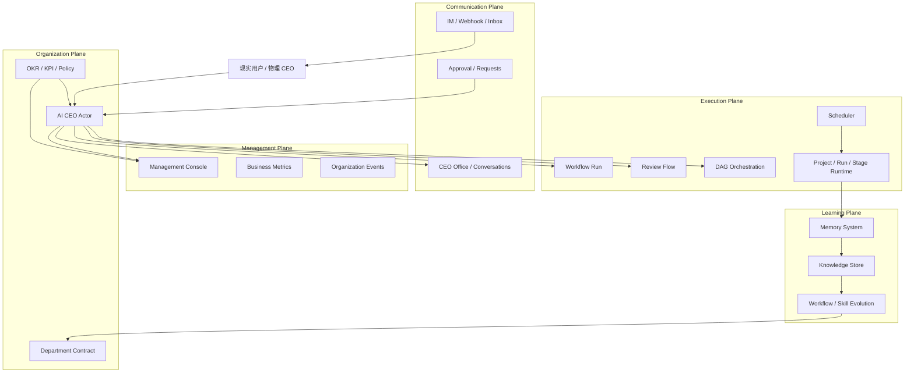
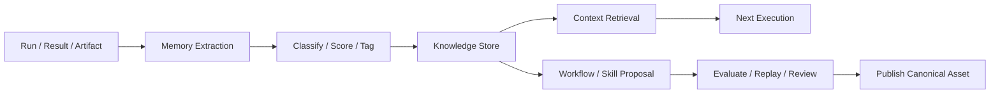

# AI 公司系统：用户需求梳理与技术架构设计

**日期**: 2026-04-19  
**目标**: 基于当前 Antigravity 的能力与用户愿景，形成一份可执行的产品需求与技术架构设计稿，用于后续分阶段实施。

---

## 1. 背景与目标

### 1.1 背景

当前系统已经具备：

- DAG / workflow / prompt-mode 执行能力
- scheduler 定时任务能力
- CEO 指令解析与部门分发能力
- Department 配置、Provider、Skill、Template 的基础模型
- Project / Run / Stage / Approval / Conversation 等执行与治理基础设施

但距离用户要的终局仍有明显差距。用户真正要的不是“一个会跑任务的 Agent 平台”，而是：

> 一个可以长期运营的 AI 公司系统。

### 1.2 北极星目标

构建一个由：

- AI CEO
- 各类 Department
- Rules / Skills / Workflows
- Memory / Knowledge / OKR
- Scheduler / Approval / Notification

共同组成的“AI 公司操作系统”，能够围绕真实业务长期运转。

### 1.3 一句话产品定义

> **Antigravity 不再只是 Agent 执行平台，而是一个以 CEO 为经营入口、以 Department 为运营单元、以 Workflow/DAG 为执行引擎、以 Memory/OKR 为学习与管理闭环的 AI 公司系统。**

---

## 2. 用户需求梳理

## 2.1 核心用户与角色

### 角色 A：用户本人（现实 CEO）

职责：

- 给 AI 公司设定方向、优先级和目标
- 决定重大资源和策略
- 审核关键决策
- 接收 CEO 主动汇报和异常告警

核心诉求：

- 不想亲自盯每个任务
- 想让 AI CEO 更像“自己”
- 想看清组织整体状态，而不是只看底层执行日志
- 想看到知识沉淀、进化和经营产出

### 角色 B：AI CEO（数字分身）

职责：

- 理解用户意图与目标
- 派发任务给不同 Department
- 监控组织状态
- 发起 routine / digest / review / approval
- 在需要时主动联系用户

核心诉求：

- 有稳定人格、偏好和经营策略
- 能调度 execution plane 而不是自己硬做所有事
- 有足够的组织记忆和决策依据

### 角色 C：Department

职责：

- 作为一等运营单元持续承担某类职责
- 拥有自己的规则、Skill、Workflow、Memory、Quota
- 接收 CEO 目标并转化为执行计划
- 进行知识沉淀和自我优化

核心诉求：

- 有清晰边界与职责
- 有长期记忆与技能积累
- 能自主运行，而不是每次从零开始

### 角色 D：执行单元（Workflow / Role / Run）

职责：

- 处理具体任务
- 产出 artifact / result
- 接受 review / intervention / approval

核心诉求：

- 获得清晰上下文
- 使用正确的 Provider 和工具
- 在边界内高效完成任务

---

## 2.2 用户核心需求

## 需求组 A：组织与角色建模

用户需要：

1. 一个 AI CEO，作为自己的数字分身
2. 多个 Department，分别承接不同类型工作
3. 每个 Department 有独立定位、规则、技能、Workflow、Provider、Memory
4. 系统支持“组织级”与“部门级”两层治理

### 需求判断

这是系统的基础建模需求，不是附加功能。

---

## 需求组 B：多形态任务执行

用户需要同时支持：

1. DAG 任务
2. Workflow 任务
3. 一次性任务
4. 定时任务
5. 轻任务与复杂任务的不同执行路径

### 需求判断

系统不能把所有任务都建模成重 DAG，必须支持执行复杂度分层。

---

## 需求组 C：长期知识沉淀与记忆管理

用户需要：

1. run 结束后自动沉淀知识
2. Department 能继承过往经验
3. Organization 能积累跨部门知识
4. CEO 能基于长期记忆做更好的决策
5. Workflow / Skill 能从重复模式中演化出来

### 需求判断

这不是“附加优化”，而是组织成长能力的核心。

---

## 需求组 D：CEO 与用户同步进化

用户需要：

1. CEO 理解自己的目标、偏好、节奏和决策风格
2. CEO 随使用不断拟合用户
3. CEO 能把外部世界的输入同步到组织内部
4. CEO 能主动汇报、提醒、提问、催办，而不是只被动等待命令

### 需求判断

这决定 AI CEO 是“调度器”还是“数字孪生”。

---

## 需求组 E：经营级可视化管理与考核

用户需要：

1. CEO 总览页
2. Department 经营页
3. OKR / KPI / 风险 / 资源 / 知识沉淀可视化
4. 能评估 Department 与 CEO 的运行质量
5. 能发现异常、低效、返工、阻塞和进化机会

### 需求判断

系统必须从 execution observability 升级到 management observability。

---

## 2.3 核心使用场景

### 场景 1：用户向 CEO 下达即时任务

示例：

- “让研究部做一份行业分析”
- “让产品部梳理需求”
- “让架构部评审这个方案”

系统预期：

1. CEO 理解意图
2. 判断目标 Department
3. 选择轻 workflow、review-flow 或 DAG
4. 派发任务并跟踪结果

### 场景 2：Department 自主处理 routine

示例：

- 每天生成日报
- 每周做巡检
- 定时汇总业务指标

系统预期：

1. Scheduler 触发
2. Department 基于 Memory 与 Rules 运行
3. 结果进入知识库和管理视图

### 场景 3：组织异常升级给 CEO

示例：

- 任务反复失败
- 资源不足
- 跨部门冲突
- OKR 偏差明显

系统预期：

1. 系统自动检测异常
2. 组织内无法自行恢复时升级给 CEO
3. CEO 主动联系用户或做局部治理动作

### 场景 4：知识沉淀与资产演化

示例：

- 某类任务重复出现
- 某个 Skill 被频繁使用
- 某种临时 prompt 模式反复成功

系统预期：

1. 系统识别可沉淀模式
2. 形成 workflow / skill proposal
3. 经过评估与审批进入正式资产体系

### 场景 5：用户查看经营状态

示例：

- “这周 AI 公司运行得怎么样？”
- “哪个部门最卡？”
- “最近有哪些知识沉淀？”
- “CEO 的派发有没有变得更像我？”

系统预期：

1. 不只是展示 runs/projects
2. 要展示目标、效率、风险、成长与偏差

---

## 2.4 非功能性需求

1. **可追溯**
   - 每个决策、审批、派发、干预都要可审计
2. **可恢复**
   - 关键执行链可 checkpoint / replay / intervene
3. **可扩展**
   - Provider、Department、Workflow、Skill 可持续扩展
4. **可演化**
   - 允许从 prompt 模式逐步沉淀为 workflow / skill
5. **可控**
   - 任何自治都必须可审计、可回退、可审批
6. **可运营**
   - 系统要能长期运行，不是只完成单次任务

---

## 3. 产品边界

## 3.1 In Scope

当前架构设计覆盖：

1. AI CEO 与 Department 组织模型
2. Workflow / DAG / prompt-mode 三档执行模型
3. Memory / Knowledge / Evolution 基础闭环
4. Scheduler / Approval / Notification
5. Management Console / OKR / KPI / 知识视图

## 3.2 Out of Scope

本阶段不优先覆盖：

1. 完整财务系统
2. 复杂企业 HR 系统
3. 强依赖外部 SaaS 的集成细节
4. 多机分布式一致性复杂协议
5. 无治理约束的完全自治自改系统

---

## 4. 目标技术架构

## 4.1 架构原则

1. **Execution Plane 不等于整个系统**
2. **CEO 不直接等同于 command parser**
3. **Department 是一等系统对象，不是 UI 抽象**
4. **Memory / Knowledge / OKR 必须进入 runtime**
5. **自治必须建立在治理与审计之上**

### 4.1.1 Workspace Catalog 与 Runtime Presence 必须分层

Department 的配置与治理边界不能直接绑定某个执行器当前是否在线。

必须拆开三层：

1. `Workspace Catalog`
   - OPC 自己知道哪些 workspace 属于系统管理范围
   - 可来自手动导入、Antigravity recent、CEO bootstrap
2. `Runtime Presence`
   - Antigravity language server / Claude Code / 其它 runtime 当前是否在线
3. `Department Domain`
   - `.department/config.json`
   - `DepartmentContract`
   - `DepartmentRuntimeContract`

因此：

1. Department 设置不应该要求 Antigravity runtime 先活着
2. 选 `antigravity` provider 时，执行阶段仍然可以走原有 language server / gRPC 主链
3. 选其它 IDE / API provider 时，应走对应 backend，而不是反向依赖 Antigravity catalog

---

## 4.2 五平面架构

### 平面说明

#### A. Organization Plane

负责：

- CEO 身份、策略、偏好、角色边界
- Department 合同
- OKR / KPI / 配额 / 治理策略

#### B. Communication Plane

负责：

- CEO Office
- 用户与 CEO 的交互
- Department -> CEO -> 用户的通知闭环
- 审批与外呼

#### C. Management Plane

负责：

- 经营总览
- 部门管理
- 风险、KPI、OKR、资源、知识可视化

#### D. Learning Plane

负责：

- Memory 生成、管理、注入
- Knowledge Store
- workflow / skill proposal 与演化
- CEO / Department 的反馈学习

#### E. Execution Plane

负责：

- workflow-run
- review-flow
- DAG orchestration
- scheduler
- runtime / intervention / audit / checkpoint

---

## 4.3 核心系统对象

### Object 1：CEOProfile

职责：

- 存储 CEO 身份、偏好、节奏、策略
- 驱动 CEO actor 的行为拟合

关键字段建议：

- identity
- priorities
- communicationStyle
- riskTolerance
- reviewPreference
- activeFocus
- decisionHistory

### Object 2：DepartmentContract

职责：

- 统一 Department 的治理边界

关键字段建议：

- identity
- responsibilities
- providerPolicy
- workflowRefs
- skillRefs
- memoryRefs
- tokenQuota
- okrRefs
- routinePolicies

### Object 3：ExecutionProfile

职责：

- 判断任务该走哪种执行模式

枚举建议：

- `workflow-run`
- `review-flow`
- `dag-orchestration`

### Object 4：KnowledgeAsset

职责：

- 统一沉淀的知识对象

类型建议：

- decision
- pattern
- lesson
- domain-knowledge
- workflow-proposal
- skill-proposal

### Object 5：ManagementMetric

职责：

- 统一经营指标

建议指标：

- objectiveContribution
- taskSuccessRate
- blockageRate
- retryRate
- selfHealRate
- memoryReuseRate
- workflowHitRate
- departmentThroughput
- ceoDecisionQuality

---

## 4.4 执行架构分层

## 执行层必须明确三档模型

### 1. Workflow Run

适用：

- 成熟任务
- 稳定流程
- 单 actor 或轻上下文任务

典型场景：

- 日报
- 巡检
- 摘要
- 固定上报

关键能力：

- prompt-mode / workflow hooks
- preflight / finalize
- evaluate / retry

### 2. Review Flow

适用：

- 高价值产物
- 需要质量门控
- 不需要完整 DAG

典型场景：

- 方案设计
- 产品文档
- 架构评审

关键能力：

- author / reviewer
- revise / approve / reject

### 3. DAG Orchestration

适用：

- 多阶段依赖
- 多部门协作
- fan-out / join
- 复杂治理

典型场景：

- 跨部门研发
- 大型专项
- 并行拆分任务

关键能力：

- stage graph
- source contract
- fan-out / join / gate / checkpoint / intervention

---

## 4.5 Learning Plane 架构

### 基础闭环

### 关键模块

1. `Memory Extractor`
   - 从 run / result / artifact 中提取结构化知识
2. `Knowledge Governance`
   - 去重、冲突检测、老化、权重
3. `Retrieval Layer`
   - 为 CEO / Department / Execution 提供上下文
4. `Evolution Pipeline`
   - 生成 workflow / skill proposal
   - 评估与发布

---

## 4.6 CEO Actor 架构

### 当前问题

当前 CEO 主要是 command parser。

### 目标升级

新增常驻 `CEO Actor Runtime`：

职责：

1. 消费组织事件
2. 追踪 active goals
3. 定期复盘
4. 派发任务
5. 主动汇报与提问
6. 依据用户反馈持续修正

### 核心输入

- CEO Office 对话
- 用户反馈
- 部门状态
- OKR 状态
- recent memory
- scheduler routines

### 核心输出

- dispatch action
- digest
- approval escalation
- decision proposal
- user notification

---

## 4.7 Management Console 架构

### 必需视图

#### 1. CEO 总览

展示：

- 本周目标进度
- 高优异常
- 待审批 / 待决策
- CEO 建议动作

#### 2. Department 经营页

展示：

- 目标进度
- throughput
- blockage
- resource usage
- workflow hit-rate
- 知识沉淀摘要

#### 3. Knowledge Console

展示：

- 新增知识
- 高复用知识
- 冲突知识
- 过期知识
- 可升级为 workflow 的模式

#### 4. CEO 拟合与进化页

展示：

- 最近被用户修正的决策
- CEO 决策偏差
- 偏好拟合趋势
- 主动行为质量

---

## 5. 分阶段技术实施路线

## Phase 0：Requirements & Contracts

目标：

- 定义清晰系统对象和边界

交付：

- CEOProfile contract
- DepartmentContract
- ExecutionProfile
- KnowledgeAsset
- ManagementMetric

## Phase 1：Knowledge Loop v1

目标：

- 打通 run -> memory -> retrieval 最小闭环

交付：

- 结构化 memory extractor
- 基础知识分类
- Knowledge Store
- run 前 retrieval 注入

## Phase 2：CEO Actor v1

目标：

- 让 CEO 从 command parser 升级为 actor

交付：

- CEO state store
- event consumer
- routine thinker
- user feedback ingestion

## Phase 3：Management Console v1

目标：

- 从 execution observability 升级为 management observability

交付：

- CEO 总览
- Department 经营页
- Knowledge Console
- 基础 KPI / OKR / risk dashboard

## Phase 4：Execution Profiles 正式分层

目标：

- 明确 workflow-run / review-flow / dag-orchestration 三档

交付：

- dispatch policy
- UI 语义分层
- scheduler 按 profile 触发

## Phase 5：Evolution Pipeline v1

目标：

- 让 workflow / skill 自我演化进入受控闭环

交付：

- proposal generation
- replay evaluation
- approval publish
- rollout observe

---

## 6. 核心技术决策

1. **保留 DAG，但降级为 Execution Plane 子系统**
2. **CEO Actor 单独建模，不继续堆进 command parser**
3. **Department 继续作为一等 contract，不只是 workspace 配置**
4. **Memory 不再只是 Markdown 归档，要升级为 Knowledge Asset 流**
5. **OKR 要进入 runtime，而不只停留在配置层**
6. **Management Console 以经营模型驱动，而不是先堆图表**

---

## 7. 风险与注意事项

### 风险 1：先做 UI，后补底层闭环

结果：

- 图很多
- 但没有真实经营数据

### 风险 2：过早做全自动自我进化

结果：

- workflow / skill 资产失控
- 治理与审计失效

### 风险 3：CEO actor 化但没有知识与反馈底座

结果：

- 表面上更像人格
- 本质上仍是随机决策器

### 风险 4：继续把所有任务塞进 DAG

结果：

- 用户感知持续“过重”
- execution plane 和 organization plane 混在一起

---

## 8. 最终建议

当前最正确的工作方法是：

1. 先明确需求与系统边界
2. 再补 Learning Plane
3. 再补 CEO Actor
4. 再做 Management Console
5. 最后推进 Evolution Pipeline

一句话总结：

> **先让系统学会沉淀和学习，再让 CEO 学会像你，再让界面真正像经营台。**
