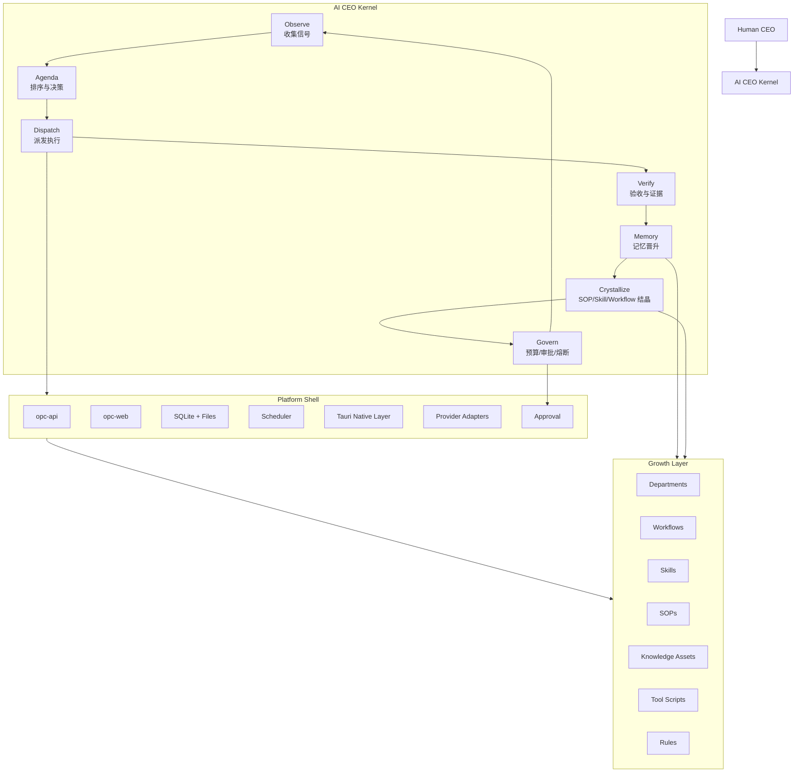
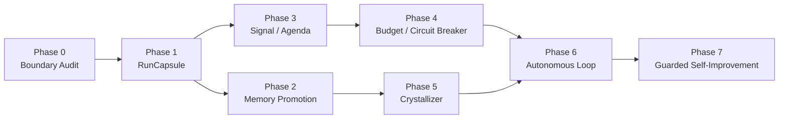

# AI 公司自增长内核长期策划书

**日期**: 2026-04-25  
**状态**: 长期设计策划  
**目标**: 深度吸收 GenericAgent 的小内核、自增长、分层记忆和技能结晶思路，夯实 OPC / AI CEO 系统的长期架构。  
**边界**: 本文是战略与架构策划，不代表已完成实现，不写入 `PROJECT_PROGRESS.md`。

---

## 1. 核心判断

GenericAgent 对我们的价值不是“替换现有系统”，而是证明一件事：

> Agent 平台真正应该增长的是 Memory / SOP / Skill / Workflow / Tool Script，而不是不断膨胀核心业务代码。

它的核心代码很小，能力却能增长，原因不是代码魔法，而是架构重心不同：

1. 核心代码只保留执行循环、工具调用、记忆读写、调度和模型适配。
2. 新任务的经验被沉淀为 SOP / Skill / Script。
3. 下次同类任务不再重新推理，而是通过记忆索引直接召回。
4. 分层记忆控制上下文密度，避免把所有历史都塞给模型。
5. 自主循环有最大轮次、冷却、调度锁、人类介入和长期记忆门槛。

我们的系统当前已经有 CEO、Department、Knowledge、Scheduler、Approval、Evolution Proposal、Workflow、Skill、Provider 抽象，但它们还没有汇聚成一个稳定的“自增长内核”。后续要做的不是再堆页面或特殊 API，而是把现有能力收束成一套可长期运行、可控制、可沉淀的 AI 公司操作系统。

---

## 2. 友商项目参考结论

参考项目：

1. GenericAgent README: <https://github.com/lsdefine/GenericAgent/blob/main/README.md>
2. GenericAgent Agent Loop: <https://github.com/lsdefine/GenericAgent/blob/main/agent_loop.py>
3. GenericAgent 工具与记忆入口: <https://github.com/lsdefine/GenericAgent/blob/main/ga.py>
4. GenericAgent 记忆管理 SOP: <https://github.com/lsdefine/GenericAgent/blob/main/memory/memory_management_sop.md>
5. GenericAgent 调度器: <https://github.com/lsdefine/GenericAgent/blob/main/reflect/scheduler.py>
6. GenericAgent 贡献原则: <https://github.com/lsdefine/GenericAgent/blob/main/CONTRIBUTING.md>

### 2.1 值得学习的机制

| 机制 | GenericAgent 做法 | 对我们的启发 |
|---|---|---|
| 小内核 | Agent loop 约百行，工具和模型适配也保持极简 | 我们要把 AI CEO Kernel 从 UI/API/业务页面里抽出来 |
| 自增长 | 任务完成后沉淀为 Skill / SOP / Script | 我们的 Evolution Proposal 应升级为“经验结晶器” |
| 分层记忆 | L1 索引、L2 事实、L3 SOP、L4 原始会话归档 | 我们的 Knowledge / Department Memory 需要明确晋升规则 |
| 工作检查点 | `update_working_checkpoint` 保存当前任务关键状态 | 长任务、日报、部门任务需要 Run Capsule / Working Checkpoint |
| 长期记忆门槛 | 只记录行动验证过的信息，禁止保存猜测和易变状态 | 我们要引入 Action-Verified Memory Policy |
| Token 节制 | 不预加载所有技能，只按索引召回 | Department / Workflow / Skill 不能全量注入上下文 |
| 循环边界 | 最大轮次、危险提示、ask_user、调度冷却、端口锁 | 我们的自运营循环必须先有预算、冷却、熔断、审批 |
| 代码哲学 | 核心代码越小越能被 AI 自己读懂和修改 | 自增长内核必须保持小、稳、可读、低耦合 |

### 2.2 不能照搬的部分

GenericAgent 是个人本地 Agent 框架，我们是 AI 公司平台。两者边界不同：

1. GenericAgent 更偏个人桌面自动化，我们需要 CEO / Department / Project / Approval / Scheduler / Knowledge / Provider 的组织治理。
2. GenericAgent 以文件记忆和脚本为主，我们需要 SQLite、API、UI、审计、审批、跨 Provider 合同。
3. GenericAgent 的调度是轻量文件轮询，我们已有 scheduler，不应替换，而应补上调度治理和自增长触发策略。
4. GenericAgent 可以让 Agent 动态安装依赖和写脚本，我们必须区分普通资产增长、需要审批的工具脚本、危险操作和生产运行边界。
5. GenericAgent 没有我们的 Antigravity / Codex Native / Tauri / workspace catalog 等兼容要求。

结论：

> 借鉴思想，不引入依赖；吸收内核原则，不搬迁架构。

### 2.3 OPC 自身优势与不可丢失的特点

GenericAgent 证明了“小内核 + 资产增长”的方向，但 OPC 不是 GenericAgent 的复刻。我们的优势在于我们不是一个单体个人 Agent，而是已经在走“AI 公司操作系统”的路线。

OPC 现有优势：

| 维度 | GenericAgent 更强的点 | OPC 自身更强的点 | 我们应保留的方向 |
|---|---|---|---|
| 执行内核 | 极小、AI 易读、工具半径大 | 已有 run / project / approval / scheduler / provider 的平台合同 | 学它的小内核，但保留平台级可追踪 |
| 组织模型 | 个人 Agent 自增长 | CEO / Department / Workspace / Project 是一等对象 | 不退化成个人助手，要继续强化 AI 公司结构 |
| 治理能力 | 靠 SOP 和人类审查 | 已有 Approval、Audit、Scheduler Runtime、Management Overview | 自增长必须进入治理平面 |
| 数据模型 | 文件友好、AI 可读 | SQLite + API + 文件镜像 + UI 展示 | 主存储结构化，文件作为 AI-readable mirror |
| Provider 生态 | 多模型 adapter 简洁 | Antigravity IDE / Codex Native / Codex CLI / OpenAI-compatible 并存 | Provider 差异留在 adapter，不污染 CEO Kernel |
| 用户入口 | 个人聊天 / 自动化 | CEO Office、部门工作面、Knowledge、Ops、Settings | 产品入口应是经营驾驶舱，不是普通 Chat UI |
| 本机能力 | 浏览器、文件、终端、ADB | Tauri 桌面壳 + 本机 workspace / IDE / filesystem 深结合 | 用 Tauri 补齐本机能力，不强行 Docker 化 |
| 长期运营 | 自主任务和 skill 增长 | 定时任务、日报、审批、项目、部门脉搏、知识资产 | 形成公司级 operating loop，而不是零散自动化 |

因此我们的长期路线不能只问“如何变得像 GenericAgent 一样小”，而要问：

> 如何让 OPC 的核心也足够小，同时保留组织治理、经营可视化、多 Provider、本机 IDE 集成和长期运营能力。

### 2.4 OPC 的差异化设计原则

1. **不是个人助手，而是 AI 公司**  
   GenericAgent 的主语是“我这个 Agent 如何变强”。OPC 的主语应该是“这家公司如何持续经营、沉淀能力、分配资源、处理风险”。

2. **不是单 Agent 自由探索，而是 CEO + Department 的治理结构**  
   自增长不能绕过部门边界。经验应该沉淀到组织、部门、workflow、skill、SOP，而不是只堆在一个全局 memory 里。

3. **不是只有执行力，还要经营可观测性**  
   用户要看到的不只是“任务跑完了”，而是今天公司做了什么、风险在哪里、能力增长了什么、哪些决策需要 CEO。

4. **不是纯文件状态，而是结构化主存储 + AI-readable 镜像**  
   GenericAgent 的文件记忆非常适合 AI 阅读，但 OPC 需要 UI 查询、分页、审计、权限和同步，所以不能放弃 SQLite / API 合同。

5. **不是无限自我改造，而是受控演化**  
   资产层可以更自由地增长；核心代码变更必须经过 proposal、测试、审批和回滚路径。

6. **不是把 Antigravity 抽掉，而是把它降级为可选执行目标**  
   OPC 不能强依赖 Antigravity，但也不能破坏 Antigravity IDE / Language Server 的原生能力。正确做法是 Provider / Execution Target 解耦。

### 2.5 长期策划书对 GenericAgent 精髓的吸收程度

当前策划书已经吸收的部分：

| GenericAgent 精髓 | 当前策划书落点 | 是否充分 |
|---|---|---|
| Seed Kernel | `AI CEO Kernel = Observe / Agenda / Dispatch / Verify / Memory / Crystallize / Govern` | 基本充分 |
| Working Memory | `RunCapsule / Working Checkpoint` | 方向充分，后续需落代码合同 |
| Action-Verified Memory | `No Execution, No Memory`、Memory Promotion | 方向充分，后续需补 evidence 字段和冲突处理 |
| Skill / SOP 结晶 | `GrowthProposal`、Crystallizer | 方向充分，后续需从真实 RunCapsule 生成 |
| Bounded Autonomy | Budget / Circuit Breaker / Approval | 方向充分，需尽早实现 |
| Scheduler as Trigger | Scheduler 进入 Budget 后触发 Dispatch | 基本充分 |
| Token Density | L1/L2/L3/L4、不要全量注入 | 基本充分 |

落地时仍需重点强化的部分：

1. **OPC 自身产品优势必须进入产品实现**：不能只在文档里说 AI 公司，CEO Office、Department、Knowledge、Ops 都要体现经营视角。
2. **经营级指标必须成为读模型**：能力增长、风险拦截、部门效率、重复任务减少，不能只靠前端拼接。
3. **Provider / Execution Target 解耦必须进入设置页和派发链路**：Antigravity、Codex Native、Codex CLI、OpenAI-compatible 应是同一层概念，不应在 UI 和配置里重复。
4. **文件镜像与结构化主存储的边界必须写进代码合同**：AI-readable 很重要，但 UI/API/审计必须以结构化数据为准。
5. **自我迭代边界必须默认保守**：资产层可增长，核心代码改造必须走系统改进 proposal、测试、审批和回滚路径。

---

## 3. 我们的长期目标

一句话：

> 把 OPC 从“可下发任务的 AI CEO 面板”升级为“可受控自运营、自学习、自沉淀、自改进的 AI 公司系统”。

目标状态：

```text
AI CEO Kernel
  Observe -> Agenda -> Dispatch -> Verify -> Memory -> Crystallize -> Govern

Platform Shell
  Web UI / API / Scheduler / Tauri / SQLite / Provider Adapter / Approval

Growth Layer
  Department / Workflow / Skill / SOP / Knowledge Asset / Tool Script / Rule
```

核心原则：

1. **核心代码稳定**：Kernel 只处理循环、合同、预算、记忆、结晶、审批，不塞业务细节。
2. **业务能力资产化**：日报、竞品分析、代码审查、市场监控等能力优先成为 workflow / skill / SOP / script，而不是硬编码。
3. **增长必须可验证**：只有成功执行、产出可追溯、被验证有复用价值的经验，才能晋升为长期资产。
4. **自治必须可治理**：所有自主触发都受 token、并发、冷却、风险、审批、熔断控制。
5. **AI 可读优先**：关键 Kernel 文件应保持短、小、边界清楚，避免 AI 后续维护时在巨型文件里迷路。

### 3.1 北极星体验

OPC 的北极星体验不是“用户打开一个 Agent 聊天窗口”，而是：

> 用户每天打开 CEO Office，就像走进自己的 AI 公司办公室：先看到公司状态、风险、进展、增长，再决定是否下达新目标或批准关键变化。

北极星体验必须满足：

1. **看得清**：今天公司发生了什么、哪些部门在工作、哪些事项需要 CEO 决策。
2. **管得住**：自主循环、定时任务、能力发布、代码自改都有预算、审批和熔断。
3. **长得起来**：重复任务会沉淀为 workflow / skill / SOP，能力增长可见。
4. **不中断原能力**：Antigravity IDE、Codex Native、Codex CLI、第三方 API 都能作为执行目标存在，不互相污染。
5. **不过度解释**：界面不靠大段文案解释系统，而是通过状态、图标、指标、行动入口表达。

### 3.2 产品范式：从 Agent 平台到 AI 公司操作系统

OPC 不应被定义为“多 Agent 平台”这么窄。多 Agent 只是执行方式之一，真正的产品范式应是：

```text
Human CEO
  设定目标 / 审批风险 / 修正偏好

AI CEO
  理解方向 / 维护 agenda / 派发部门 / 汇总经营状态

Department
  持续承担职责 / 拥有记忆和能力 / 交付 routine 与项目

Execution Target
  Antigravity IDE / Codex Native / Codex CLI / OpenAI-compatible / Future Tool Runtime

Growth Layer
  Knowledge / SOP / Workflow / Skill / Tool Script / Rule
```

因此系统的增长路径不是“更多 Agent”，而是：

1. 更多清晰的部门职责。
2. 更稳定的执行目标抽象。
3. 更多经过验证的 workflow / skill / SOP。
4. 更少重复临时 prompt。
5. 更强的经营可观测性和风险控制。

### 3.3 三条必须跑通的主链路

长期架构的所有实现都要服务三条主链路。

#### 主链路 A：CEO 即时派发

```text
CEO 输入目标
-> AI CEO 判断意图、部门、风险、预算
-> 选择 workflow / skill / prompt-mode
-> 选择 execution target
-> 创建 run + RunCapsule
-> 执行与验证
-> 产出结果 / 需要审批 / 需要用户补充
-> Memory Promotion / Crystallizer 判断是否沉淀能力
```

验收标准：

1. 用户不需要先理解 Provider 才能派发任务。
2. AI CEO 能解释为什么选这个部门和执行目标。
3. 每个 run 都有可追溯 evidence 和 capsule。
4. 重复成功任务会进入结晶候选。

#### 主链路 B：部门 routine 自运营

```text
Scheduler 到点
-> Budget / Circuit Breaker 检查
-> Department routine signal
-> Agenda 排序
-> Dispatch 执行
-> 产生日报 / 巡检 / 监控结果
-> 上报 CEO Office / 邮件 / 后台
-> 形成 Knowledge / SOP / Workflow proposal
```

验收标准：

1. Scheduler 只触发，不夹带业务脑。
2. 每个 routine 有明确报告、runId、状态和失败原因。
3. 同类 routine 不产生重复任务风暴。
4. 部门 routine 能逐步提高命中率和稳定性。

#### 主链路 C：系统自我改进

```text
系统发现断点 / 重复劳动 / 慢接口 / 失败模式
-> 生成 System Improvement Signal
-> CEO Kernel 打分
-> 低风险进入文档/规则/Workflow proposal
-> 高风险进入代码改进 proposal
-> 分支 / 测试 / 审批 / 发布
-> 观察回归与收益
```

验收标准：

1. 自我改进不能直接改主线核心代码。
2. 每个 proposal 必须有证据、收益预估、风险级别和回滚思路。
3. 未测试不得发布，未审批不得影响核心运行。
4. 发布后要观察命中率、错误率、延迟和用户反馈。

### 3.4 用户旅程分层

OPC 的用户旅程应分成四层，不应全部塞进首页。

| 层级 | 用户问题 | 系统应给的答案 | 主要页面 |
|---|---|---|---|
| CEO 层 | 今天公司怎么样？我要决策什么？ | 经营状态、风险、agenda、能力增长 | CEO Office |
| 部门层 | 每个部门在做什么？卡在哪里？ | 部门职责、任务、routine、能力、记忆 | Department / Projects |
| 能力层 | 公司学到了什么？哪些能力可复用？ | Knowledge、SOP、Workflow、Skill、Proposal | Knowledge |
| 运行层 | 后台是否健康？为什么没跑？ | Scheduler、Budget、Provider、Runtime、Logs | Ops / Settings |

设计原则：

1. CEO Office 是决策驾驶舱，不是所有功能入口的堆叠。
2. Projects 是交付和任务工作面，不是公司总览。
3. Knowledge 是能力资产工作面，不是纯文档仓库。
4. Ops 是运行治理工作面，不是普通设置页。
5. Settings 只放偏好、Provider、权限、组织策略，不承载经营状态。

---

## 4. 现状差距

### 4.1 已有基础

当前系统已经具备以下能力：

1. `CEO Agent`：能解析 CEO 指令并路由部门。
2. `Department`：已有 workspace catalog、部门配置、skills、provider 偏好。
3. `Scheduler`：已有定时任务、手动触发、runtime 状态检查。
4. `KnowledgeAsset`：已有结构化知识、文件镜像、查询与召回。
5. `Department Memory`：已有组织/部门/会话三层概念和 markdown 持久化。
6. `Evolution Proposal`：已有 workflow / skill proposal、evaluate、publish、observe。
7. `Approval`：已有发布审批、Web/IM/Webhook 通道。
8. `Tauri`：已有本机文件夹选择入口，为桌面能力层打基础。

### 4.2 关键断点

| 断点 | 当前表现 | 影响 |
|---|---|---|
| 没有统一自增长 Kernel | CEO routine、scheduler、knowledge、evolution 各自存在 | 系统像功能集合，不像自运营组织 |
| 没有 Working Checkpoint | 长任务主要依赖 run state 和最终结果 | 长任务上下文容易丢，失败后难复盘 |
| 记忆晋升规则不足 | Department Memory 仍偏追加 markdown，提取规则偏弱 | 容易记录噪声、重复、不可复用内容 |
| Knowledge 与 Memory 未完全统一 | KnowledgeAsset 与 Department Memory 并存 | 不清楚哪些是事实、哪些是 SOP、哪些是索引 |
| Evolution Proposal 太“模板化” | 能从 repeated runs 生成草案，但不够像真实执行路径结晶 | 生成的 workflow/skill 可能泛泛而谈 |
| Scheduler 只会按时间触发 | 缺少 signal scoring / agenda / budget | 系统不会根据状态主动组织优先级 |
| Token / 并发预算不成体系 | 有局部 quota 和节流，但不是统一经营预算 | 自运营扩大后容易失控 |
| UI 缺少自增长可视化 | CEO Office 能看任务，但看不到能力如何成长 | 用户难判断 AI 公司是否真的在进化 |

---

## 5. 目标架构

### 5.1 四层架构



### 5.2 Kernel 的职责

Kernel 只保留七件事：

1. **Observe**：读取组织事件、任务结果、日报、审批、失败、外部信号。
2. **Agenda**：把信号转为待办队列，并按价值、紧急度、风险、成本排序。
3. **Dispatch**：选择部门、workflow、skill、provider、执行模式。
4. **Verify**：确认结果是否有证据、是否完成、是否需要返工。
5. **Memory**：决定哪些信息进入短期 checkpoint、长期 fact、SOP 或归档。
6. **Crystallize**：把重复成功路径转为 workflow / skill / script / rule proposal。
7. **Govern**：控制 token、并发、冷却、失败熔断和审批门槛。

Kernel 不负责：

1. 不直接写复杂业务页面。
2. 不直接塞满各种行业逻辑。
3. 不直接替代 provider runtime。
4. 不绕过审批自动改生产资产。
5. 不把每次任务都写成长文档。

### 5.3 模块边界细化

目标架构里必须把五个概念拆干净。

| 模块 | 负责 | 不负责 | 当前风险 |
|---|---|---|---|
| `AI CEO Kernel` | signal、agenda、dispatch 决策、memory promotion、crystallization、governance | 不直接执行 provider 协议，不写 UI，不管理 React state | 现有 CEO routine / scheduler / evolution 分散 |
| `Execution Target Adapter` | Antigravity / Codex Native / Codex CLI / API Provider 的协议差异 | 不决定业务优先级，不写长期记忆 | Provider 配置和运行配置容易重复 |
| `Platform Shell` | API、SQLite、scheduler、approval、Tauri、Web UI、鉴权 | 不内嵌业务 SOP，不生成具体行业结论 | 后台初始化容易污染首页热路径 |
| `Growth Layer` | workflow、skill、SOP、tool script、rule、knowledge | 不直接绕过审批发布高风险资产 | 资产和核心代码边界不够硬 |
| `Observation Layer` | run archive、audit、metrics、budget ledger、provider health | 不直接派发任务 | 观测数据如果不结构化，无法经营分析 |

核心约束：

1. `AI CEO Kernel` 只能通过合同调用 adapter，不直接 import Antigravity 细节。
2. `Execution Target Adapter` 只报告能力、状态、成本、错误，不决定组织策略。
3. `Growth Layer` 的发布必须经过 policy 和 approval。
4. `Observation Layer` 所有数据都要可分页、可聚合、可追溯。

### 5.4 数据主权与写入边界

OPC 要避免“哪里都能写状态”的问题。建议确立数据主权：

| 对象 | 主存储 | 文件镜像 | 谁可以写 |
|---|---|---|---|
| Run / Project | SQLite | 可选 report / artifact | Execution runtime |
| RunCapsule | SQLite | 可选 markdown snapshot | Kernel / runtime hooks |
| KnowledgeAsset | SQLite | markdown mirror | Memory Promotion |
| Department Memory | Department workspace + SQLite index | `.department/memory/` | Memory Promotion / 用户手动编辑 |
| Workflow / Skill / SOP | Global assets + workspace assets | 原生 markdown/yaml | Crystallizer publish |
| Tool Script | Assets scripts dir | 原生脚本文件 | 高风险审批后发布 |
| Budget Ledger | SQLite | 不需要 | Governance |
| Approval | SQLite | 不需要 | Approval framework |

原则：

1. UI/API 查询以结构化主存储为准。
2. AI 阅读以文件镜像和 L1 index 为优先入口。
3. 任何自动写入都必须带 `sourceRunId`、`evidenceRef` 或 `approvalId`。
4. 文件镜像不能成为唯一事实源，除非对象本身就是 workflow / SOP / script。

### 5.5 Company Operating Day

AI 公司需要一个每天可解释的 operating day，不是零散任务堆积。

```ts
interface CompanyOperatingDay {
  date: string;
  timezone: 'Asia/Shanghai' | string;
  focus: string[];
  agenda: OperatingAgendaItem[];
  departmentStates: DepartmentOperatingState[];
  activeRuns: string[];
  completedRuns: string[];
  newKnowledgeIds: string[];
  growthProposalIds: string[];
  blockedSignals: string[];
  budgetSnapshot: OperatingBudgetSnapshot;
  ceoSummary?: string;
}
```

它解决的问题：

1. CEO Office 可以围绕“今天”组织信息，而不是从各种 API 拼凑。
2. 日报、scheduler、approval、knowledge、risk 都有同一个经营日视角。
3. 用户能看见“今天公司增长了什么”和“哪些东西被系统拦截”。

### 5.6 Department Operating State

部门不是 workspace 列表项，而是经营单元。

```ts
interface DepartmentOperatingState {
  departmentId: string;
  workspaceUri: string;
  mission: string;
  health: 'healthy' | 'attention' | 'blocked' | 'inactive';
  activeRuns: string[];
  routineStatus: 'idle' | 'scheduled' | 'running' | 'failed' | 'disabled';
  recentDeliverables: EvidenceRef[];
  knowledgeDelta: {
    newFacts: number;
    newSops: number;
    staleItems: number;
    conflicts: number;
  };
  capabilityDelta: {
    workflowHits: number;
    skillHits: number;
    proposals: number;
  };
  budgetUsage: {
    tokensUsed: number;
    runtimeMinutes: number;
    autonomousDispatches: number;
  };
}
```

它要求部门页从“配置页”升级为“部门经营页”：

1. 当前职责。
2. 当前任务。
3. routine 状态。
4. 近期交付。
5. 能力增长。
6. 风险和阻塞。

---

## 6. 关键算法设计

### 6.1 Signal -> Agenda

所有自运营都从 `OperatingSignal` 开始，而不是从无限循环开始。

```ts
interface OperatingSignal {
  id: string;
  source: 'scheduler' | 'run' | 'approval' | 'knowledge' | 'user' | 'system' | 'external';
  kind: 'opportunity' | 'risk' | 'routine' | 'failure' | 'learning' | 'decision';
  title: string;
  evidenceRefs: string[];
  workspaceUri?: string;
  createdAt: string;
  urgency: number;     // 0-1
  value: number;       // 0-1
  confidence: number;  // 0-1
  risk: number;        // 0-1
  estimatedCost: {
    tokens: number;
    minutes: number;
  };
}
```

排序建议：

```text
score = urgency * 0.25
      + value * 0.35
      + confidence * 0.20
      - risk * 0.15
      - normalizedCost * 0.05
```

硬门槛：

1. 没有证据引用的 signal 只能进入观察，不得自动派发。
2. 高风险 signal 必须进入审批或人工确认。
3. 低置信度 signal 可以转成调研任务，不得直接转执行任务。
4. 同类 signal 必须合并，禁止重复创建任务。

### 6.2 Working Checkpoint / Run Capsule

每个长任务要有一个 `RunCapsule`，用于连接执行过程、可恢复状态和后续记忆。

```ts
interface RunCapsule {
  runId: string;
  workspaceUri: string;
  goal: string;
  currentHypothesis?: string;
  verifiedFacts: string[];
  openQuestions: string[];
  blockers: string[];
  artifacts: Array<{
    type: 'file' | 'url' | 'api' | 'log' | 'screenshot';
    ref: string;
    verifiedAt?: string;
  }>;
  reusableSteps: string[];
  updatedAt: string;
}
```

规则：

1. checkpoint 记录“执行中仍然重要”的事实，不记录完整推理过程。
2. 所有 verifiedFacts 必须来自工具结果、文件、接口、日志或人工反馈。
3. 任务失败时，RunCapsule 是复盘和重试的入口。
4. 任务成功时，RunCapsule 是 Memory / SOP / Skill 的原料。

### 6.3 Memory Promotion

借鉴 GenericAgent 的 L1/L2/L3/L4，但映射到我们的系统：

| 层级 | OPC 名称 | 内容 | 存储建议 |
|---|---|---|---|
| L1 | Memory Index | 最小索引、场景关键词、指针 | SQLite + 镜像 markdown |
| L2 | Verified Facts | 长期稳定事实、环境配置、用户偏好 | KnowledgeAsset / Department Memory |
| L3 | SOP / Skill / Workflow | 可复用过程、关键坑点、脚本 | Global assets + department assets |
| L4 | Run Archive | 原始 run、日志、产物、会话摘要 | Run records + artifact archive |

晋升规则：

1. `No Execution, No Memory`：未经行动验证的信息不能晋升为 L2/L3。
2. `No Volatile State`：PID、临时 session、当前时间、一次性端口不得写入长期记忆。
3. `Minimum Sufficient Pointer`：L1 只写能定位 L2/L3 的最短索引，不写详细教程。
4. `Evidence First`：每条长期记忆必须能追溯到 run、artifact、用户反馈或审批。
5. `Decay and Conflict`：冲突记忆进入 `conflicted`，过期记忆进入 `stale`，不能静默覆盖。

### 6.4 Crystallization

经验结晶不是“生成一份看起来像 workflow 的模板”，而是从真实执行路径提炼。

```ts
interface GrowthProposal {
  id: string;
  kind: 'workflow' | 'skill' | 'sop' | 'script' | 'rule';
  title: string;
  sourceRunIds: string[];
  sourceKnowledgeIds: string[];
  evidenceRefs: string[];
  targetScope: 'global' | 'department';
  targetRef: string;
  draftContent: string;
  expectedBenefit: {
    repeatability: number;
    tokenSaving: number;
    failureReduction: number;
  };
  risk: 'low' | 'medium' | 'high';
  status: 'draft' | 'evaluating' | 'approval_required' | 'published' | 'rejected' | 'observing';
}
```

触发条件：

1. 同类 prompt-mode 任务 3 次以上成功。
2. 某个任务经历多轮探索后形成稳定步骤。
3. 用户多次手动纠正同类问题。
4. 某个失败被修复后形成明确避坑规则。
5. 日报/周报/巡检等 routine 形成固定产出规范。

发布门槛：

1. `rule`、`sop`：低风险，可自动进入 proposal，CEO 可批量确认。
2. `workflow`、`skill`：中风险，需要 evaluation 后发布。
3. `script`：高风险，必须审批，且需要 sandbox / dry-run / 最小权限说明。
4. 涉及外部发送、财务、删除、批量写入的工具，默认高风险。

### 6.5 Budget / Governance

自增长必须先有预算系统，否则会失控。

```ts
interface OperatingBudget {
  scope: 'organization' | 'department' | 'workflow';
  period: 'hour' | 'day' | 'week';
  maxConcurrentRuns: number;
  maxTokens: number;
  maxRuntimeMinutes: number;
  maxAutonomousDispatches: number;
  cooldownMinutesByKind: Record<string, number>;
  failureBudget: {
    maxConsecutiveFailures: number;
    circuitBreakMinutes: number;
  };
}
```

默认策略：

1. 任何自主循环都不能无限运行。
2. 同部门默认同时最多 1 个自主任务。
3. 同类失败连续 2 次进入熔断。
4. 高风险 proposal 只生成，不自动发布。
5. 每日 CEO routine 只产出有限 agenda，不自动铺开大量任务。
6. Scheduler 触发任务必须和 Budget Ledger 交互，不能绕过统一预算。

### 6.6 Execution Target 统一模型

Provider 和 Execution Target 必须拆开：

1. `Provider` 表示模型或能力来源，例如 Antigravity、Codex Native、Codex CLI、OpenAI-compatible。
2. `Execution Target` 表示实际执行路径，例如 IDE language server、Codex MCP、CLI process、HTTP API、未来本地 tool runtime。
3. `Execution Profile` 表示任务复杂度和治理策略，例如 prompt-mode、workflow-run、dag-orchestration、review-flow。

```ts
interface ExecutionTargetProfile {
  id: string;
  providerId: 'antigravity' | 'native-codex' | 'codex-cli' | 'openai-compatible' | string;
  targetKind: 'ide-language-server' | 'native-agent' | 'cli-process' | 'http-api' | 'tool-runtime';
  displayName: string;
  capabilities: Array<'chat' | 'code-edit' | 'browser' | 'filesystem' | 'approval-aware' | 'streaming'>;
  availability: 'available' | 'missing-config' | 'offline' | 'error';
  costClass: 'low' | 'medium' | 'high' | 'unknown';
  riskClass: 'low' | 'medium' | 'high';
  configRef?: string;
}
```

配置原则：

1. “默认 Provider”只解决默认模型选择。
2. “应用到运行配置”不应另起一套概念，而应选择具体 execution target profile。
3. Antigravity IDE 和 Codex Native 是平级执行目标，不应一个藏在 provider，一个藏在 runtime。
4. UI 应用“能力矩阵”表达，而不是用重复表单让用户理解底层差异。

### 6.7 Agenda Item 生命周期

`OperatingSignal` 不是直接变成任务，中间要进入 agenda。

```ts
type AgendaStatus =
  | 'observed'
  | 'triaged'
  | 'ready'
  | 'blocked'
  | 'dispatched'
  | 'completed'
  | 'dismissed'
  | 'snoozed';

interface OperatingAgendaItem {
  id: string;
  signalIds: string[];
  title: string;
  recommendedAction: 'dispatch' | 'ask_user' | 'approve' | 'observe' | 'snooze' | 'dismiss';
  targetDepartmentId?: string;
  suggestedWorkflowRef?: string;
  suggestedExecutionTargetId?: string;
  priority: 'p0' | 'p1' | 'p2' | 'p3';
  score: number;
  status: AgendaStatus;
  reason: string;
  evidenceRefs: string[];
  createdAt: string;
  updatedAt: string;
}
```

生命周期规则：

1. `observed`：刚从 signal 生成，未决策。
2. `triaged`：已去重、聚合、打分。
3. `ready`：预算和风险检查通过，可派发。
4. `blocked`：缺配置、缺审批、预算不足或 provider 不可用。
5. `dispatched`：已创建 run。
6. `completed`：run 完成且 verify 通过。
7. `dismissed`：CEO 或策略明确忽略。
8. `snoozed`：延后处理，有明确唤醒时间。

### 6.8 Memory Quality Score

记忆晋升需要评分，不能只靠 category。

```text
memoryQuality =
  evidenceStrength * 0.35
  + reusePotential * 0.25
  + stability * 0.20
  + specificity * 0.10
  - volatilityRisk * 0.10
```

字段解释：

1. `evidenceStrength`：是否有 run/artifact/API/log/user feedback 证据。
2. `reusePotential`：未来是否会重复使用。
3. `stability`：是否长期有效。
4. `specificity`：是否足够具体，能避免未来踩坑。
5. `volatilityRisk`：是否包含容易过期的信息。

晋升门槛：

| 分数 | 动作 |
|---:|---|
| `< 0.35` | 丢弃或只留在 run archive |
| `0.35 - 0.55` | 保留为 candidate，暂不注入上下文 |
| `0.55 - 0.75` | 晋升 L2 Verified Fact |
| `> 0.75` 且包含步骤 | 生成 L3 SOP / workflow / skill candidate |

### 6.9 Crystallization Score

能力结晶也需要评分，避免生成一堆泛泛 workflow。

```text
crystallizationScore =
  recurrence * 0.30
  + successRate * 0.25
  + stepStability * 0.20
  + tokenSaving * 0.15
  - riskPenalty * 0.10
```

触发动作：

| 分数 | 动作 |
|---:|---|
| `< 0.40` | 不生成 proposal |
| `0.40 - 0.60` | 生成 SOP candidate |
| `0.60 - 0.75` | 生成 workflow / skill proposal |
| `> 0.75` | 生成 proposal 并进入 evaluation |
| 高风险 script | 无论分数多高，都必须审批 |

### 6.10 EvidenceRef 统一合同

所有记忆、proposal、审批、报告都应共享证据引用。

```ts
interface EvidenceRef {
  id: string;
  type: 'run' | 'artifact' | 'log' | 'api-response' | 'user-feedback' | 'screenshot' | 'file' | 'approval';
  ref: string;
  title?: string;
  workspaceUri?: string;
  runId?: string;
  createdAt: string;
  verifiedAt?: string;
  hash?: string;
}
```

统一 EvidenceRef 的价值：

1. CEO Office 能解释每个结论来自哪里。
2. Knowledge 能追溯来源。
3. Proposal 能被评估。
4. 审批能看到证据，不靠大段模型描述。
5. 自我改进可以要求测试证据。

---

## 7. 产品形态

### 7.1 CEO Office 应展示什么

CEO Office 不应该只是任务列表，也不应该展示大量设计说明。它应该展示 AI 公司的经营状态和自增长状态：

1. 今天需要 CEO 决策的事情。
2. 哪些部门正在运行。
3. 哪些任务产生了可复用经验。
4. 哪些 workflow / skill proposal 等待审批。
5. 哪些记忆被新增、过期或冲突。
6. 哪些 autonomous loop 被预算/风险拦截。

### 7.2 新增工作面建议

不建议新增一个复杂主导航。建议在现有工作面里补齐：

1. `CEO Office`：新增“增长动态 / 能力沉淀 / 风险拦截”区域。
2. `Knowledge`：加入 L1/L2/L3/L4 过滤和记忆晋升状态。
3. `Ops`：加入 Budget Ledger、熔断、scheduler runtime、autonomous dispatch 记录。
4. `Settings`：加入组织级自治策略、审批阈值、部门预算。

### 7.3 CEO Office 信息结构

CEO Office 第一屏应按“决策优先级”排列，而不是按技术模块排列。

建议结构：

| 区域 | 目的 | 内容 |
|---|---|---|
| 今日经营摘要 | 让 CEO 10 秒内知道公司状态 | 运行健康、待决策、风险、今日完成、能力增长 |
| 指令中心 | 让 CEO 发起即时任务或 routine | 对话输入、任务类型、部门建议、定时任务入口 |
| Agenda / 决策队列 | 让 CEO 处理真正需要决策的事项 | 审批、风险、阻塞、系统建议、能力发布 |
| Department Pulse | 看各部门是否健康 | 部门状态、routine、active runs、知识增长、预算 |
| Growth Feed | 看公司是否在成长 | 新知识、新 SOP、新 proposal、workflow 命中 |
| Risk / Guardrails | 看系统替你挡住了什么 | 熔断、预算不足、高风险拦截、provider 异常 |

设计原则：

1. 首屏不解释“什么是 CEO Office”，直接展示状态。
2. 所有数字必须能下钻到真实数据，不允许伪造趋势。
3. “能力增长”要和任务完成并列展示，否则用户感受不到自增长。
4. 被拦截事件要可见，用户才会信任自治不是失控。

### 7.4 Knowledge 工作面信息结构

Knowledge 不应只是“知识列表”，而是能力资产中心。

应支持：

1. L1：索引和触发词。
2. L2：Verified Facts。
3. L3：SOP / Workflow / Skill / Script。
4. L4：Run Archive。
5. Conflicts：冲突记忆。
6. Stale：过期候选。
7. Proposals：待发布能力。

关键操作：

1. 查看证据。
2. 标记过期。
3. 合并冲突。
4. 批准晋升。
5. 回滚错误记忆。
6. 查看使用次数和命中来源。

### 7.5 Ops 工作面信息结构

Ops 负责回答“为什么没有跑、为什么跑慢、为什么被拦截”。

应支持：

1. Scheduler runtime：cron 是否真的启动。
2. Job ledger：每个 job 最近触发、跳过、失败、补跑。
3. Budget ledger：谁消耗了 token / 时间 / 并发。
4. Circuit breaker：哪些能力被熔断，什么时候恢复。
5. Provider health：Antigravity / Codex Native / Codex CLI / API profile 状态。
6. Background noise：是否有异常 worker、重复轮询、后台恢复噪音。

### 7.6 Settings 工作面信息结构

Settings 只放长期偏好和配置，不展示经营状态。

应收口为：

1. CEO Profile：偏好、决策风格、关注重点。
2. Execution Targets：Antigravity / Codex Native / Codex CLI / OpenAI-compatible 能力矩阵。
3. API Keys / Provider Profiles：凭证和 endpoint。
4. Department Policy：部门默认 provider、预算、审批阈值。
5. Autonomy Policy：每日自主上限、风险阈值、熔断策略。
6. Notification：后台推送、邮件、IM、Webhook。

反模式：

1. 不要同时存在“默认配置”和“应用到运行配置”两套含义重叠的表单。
2. 不要在用户界面堆设计说明。
3. 不要让普通用户理解 control-plane / runtime / scheduler 内部概念。
4. 不要让 Provider 配置决定部门是否存在。

---

## 8. 分阶段路线图

### Phase 0：Kernel Boundary Audit

目标：

1. 梳理 CEO / scheduler / knowledge / evolution / approval 当前调用链。
2. 明确哪些逻辑属于 Kernel，哪些属于 Platform Shell，哪些属于 Growth Layer。
3. 清理直接在页面里合成业务语义的代码。

交付：

1. Kernel 模块边界文档。
2. 关键文件清单。
3. 不动功能，只冻结边界。
4. Provider / Execution Target 概念审计表。
5. 现有数据写入点审计表。

验收：

1. 可以画出 Observe -> Agenda -> Dispatch -> Verify -> Memory -> Crystallize -> Govern 的现有映射。
2. 每个已有子系统都有明确归属。
3. 所有直接写 Knowledge / Department Memory / Evolution Proposal 的入口被列出。
4. 首页、Settings、Ops 中的重复概念被标记为待收口项。

工程清单：

1. 建立 `docs/design/company-kernel-boundary-audit-*.md`。
2. 标注 `src/lib/organization`、`src/lib/agents`、`src/lib/knowledge`、`src/lib/evolution`、`src/lib/approval`、`src/lib/backends` 的职责。
3. 列出所有 scheduler / worker 初始化点，避免未来重复后台。
4. 列出所有真实数据库写入点，标出测试隔离风险。
5. 给 Execution Target 建统一命名表。

### Phase 1：Run Capsule / Working Checkpoint

目标：

1. 为长任务、日报、部门任务建立结构化 checkpoint。
2. 让失败任务可复盘，成功任务可结晶。

交付：

1. `RunCapsule` 合同。
2. beforeRun / afterRun hook。
3. Run detail / CEO Office 展示最小状态。
4. EvidenceRef 最小合同。
5. RunCapsule 与现有 AgentRunState 的映射。

验收：

1. 一个真实日报任务能产生 RunCapsule。
2. 一个失败任务能记录 blockers / verifiedFacts。
3. 不污染用户数据库的测试隔离必须完成。
4. RunCapsule 至少能被 CEO Office、Knowledge Promotion、Crystallizer 三处读取。

工程清单：

1. 新增 `src/lib/company-kernel/run-capsule.ts` 或等价模块。
2. 新增 capsule store，优先 SQLite，允许 markdown snapshot mirror。
3. 接入 agent run finalization。
4. 接入 scheduler manual trigger 和 cron trigger。
5. 增加测试隔离，不允许测试写真实 `~/.gemini/antigravity`。

### Phase 2：Memory Promotion v1

目标：

1. 把 Department Memory、KnowledgeAsset、Run Archive 统一到 L1/L2/L3/L4 晋升语义。
2. 只允许行动验证过的信息进入长期记忆。

交付：

1. Memory Promotion Policy。
2. L1 index 生成与更新。
3. KnowledgeAsset 增加 evidence / volatility / promotion metadata。
4. Department Memory 写入从“简单追加”升级为“候选 -> 评估 -> 晋升”。
5. Memory Quality Score。
6. Conflict / Stale 处理策略。

验收：

1. 普通 run 不再无脑追加 markdown。
2. 有证据的 fact 可进入 L2。
3. 可复用过程可进入 L3 proposal。
4. 冲突/过期记忆可被标记，不静默覆盖。
5. `No Execution, No Memory` 变成代码测试，而不是文档口号。

工程清单：

1. 扩展 `KnowledgeAsset` contract。
2. 增加 evidence refs。
3. 增加 memory candidate store。
4. 改造 `extractAndPersistMemory`，禁止直接 append。
5. Knowledge UI 增加 candidate / active / stale / conflicted 过滤。
6. 增加 promotion 单元测试和端到端测试。

### Phase 3：Signal / Agenda v1

目标：

1. Scheduler、run、approval、knowledge、system health 都统一变成 `OperatingSignal`。
2. CEO routine 不再只是摘要，而是生成受控 agenda。

交付：

1. `OperatingSignal` 合同。
2. Signal dedupe / scoring / grouping。
3. Agenda API。
4. CEO Office 展示今日 agenda。
5. CompanyOperatingDay 聚合模型。

验收：

1. AI 日报、审批、失败、知识 proposal 都能变成 signal。
2. 同类 signal 不重复刷屏。
3. 高风险 signal 不自动执行。
4. CEO Office 能解释每个 agenda 的来源和建议动作。

工程清单：

1. 新增 signal store。
2. scheduler / approval / run finalization / knowledge promotion 写入 signal。
3. 新增 agenda builder。
4. 新增 `/api/company/operating-day` 或等价读模型。
5. CEO Office 从 operating day 读模型渲染，而不是分散拼接。

### Phase 4：Budget / Circuit Breaker

目标：

1. 自运营循环必须统一经过预算。
2. 禁止无限并发、无限重试、无限轮询。

交付：

1. `OperatingBudget` 合同。
2. Budget Ledger。
3. Scheduler / CEO dispatch / evolution generate 接入预算。
4. 熔断与冷却事件可见。
5. Department / workflow / organization 三层预算。

验收：

1. 同部门并发限制生效。
2. 连续失败触发熔断。
3. 预算不足时生成“被拦截”的可解释记录。
4. Ops 能看到为什么某个任务没有执行。

工程清单：

1. 新增 budget store。
2. Dispatch 前强制 budget check。
3. Scheduler trigger 前强制 budget check。
4. Evolution proposal generate 前强制 budget check。
5. Ops 增加 budget ledger 和 circuit breaker 视图。

### Phase 5：Crystallizer v1

目标：

1. 从真实 RunCapsule、KnowledgeAsset、repeated runs 中提炼 SOP / workflow / skill。
2. 让 evolution proposal 不再泛泛生成模板。

交付：

1. `GrowthProposal` 合同升级。
2. Crystallizer：从 verified steps / artifacts / reusable steps 生成草案。
3. Evaluation：基于历史样本和预期收益评分。
4. Publish：继续走 approval。
5. Observe：发布后跟踪命中率、节省 token、失败率。
6. Proposal risk classification。
7. Script proposal sandbox / dry-run 要求。

验收：

1. 连续 3 次同类日报或分析任务能生成具体 workflow proposal。
2. proposal 内容包含真实执行路径和证据引用。
3. 发布后下次同类任务能命中 workflow / skill。
4. 泛泛模板型 proposal 被评分挡住。

工程清单：

1. 改造 `src/lib/evolution/generator.ts`，以 RunCapsule 为主要输入。
2. 扩展 evaluator，计算 recurrence / successRate / tokenSaving / riskPenalty。
3. 发布后写入 usage observe。
4. Knowledge / CEO Office 展示增长 proposal。
5. 高风险 script proposal 默认 approval required。

### Phase 6：Autonomous Company Loop v1

目标：

1. 形成每日可控自运营循环。
2. 不是无限执行，而是每天产生有限 agenda、有限派发、有限结晶。

交付：

1. 每日 CEO Operating Loop。
2. 部门 routine loop。
3. Weekly Review loop。
4. 自增长报告。
5. Agenda batch dispatch。

验收：

1. 每天 20:00 AI 日报仍按固定 scheduler 运行。
2. 每天 CEO loop 只处理预算允许的 top agenda。
3. 用户能看到今天增长了什么能力、拦截了什么风险。
4. 自主 loop 不能产生重复后台、重复 5 秒轮询或无限任务。

工程清单：

1. 新增 daily operating loop job。
2. 对 agenda 做 top-N batch，不允许全量执行。
3. 每日输出 CompanyOperatingDay summary。
4. 接入 notification，不绕过后台推送机制。
5. Ops 显示 loop runtime 和最近执行结果。

### Phase 7：Self-Improvement Guarded Mode

目标：

1. AI CEO 可以提出系统改进任务，但不能无约束直接修改核心系统。
2. 自我迭代必须走 proposal、分支、测试、审批、发布。

交付：

1. System Improvement Proposal。
2. Code-change risk classification。
3. Test evidence requirement。
4. Manual approval gate。
5. Rollback / revert plan requirement。
6. Protected core modules list。

验收：

1. AI 能发现重复代码、慢接口、断点旅程并创建改进 proposal。
2. 未审批前不能自动合并或发布核心代码。
3. 每个改进都有测试证据和回滚路径。
4. 涉及 scheduler、provider、database、approval、memory promotion 的改动默认高风险。

工程清单：

1. 新增 system improvement proposal kind。
2. 生成 proposal 时必须带 affected files、risk level、test plan。
3. 代码改造任务必须在分支上执行。
4. 合并前必须有测试输出。
5. 核心模块改动必须人工审批。

### 8.1 阶段依赖图



不能跳过的依赖：

1. 没有 RunCapsule，不做 Crystallizer。
2. 没有 Budget，不做 Autonomous Company Loop。
3. 没有 Memory Promotion，不允许长期记忆自动写入。
4. 没有 EvidenceRef，不允许系统改进 proposal。
5. 没有 Provider / Execution Target 收口，不继续扩展 Settings 配置。

### 8.2 建议实施节奏

| 周期 | 主目标 | 不做什么 |
|---|---|---|
| 第 1 周 | Phase 0 + Execution Target 审计 | 不做新 UI 大改 |
| 第 2 周 | Phase 1 RunCapsule | 不做 Crystallizer |
| 第 3 周 | Phase 2 Memory Promotion | 不做自主派发 |
| 第 4 周 | Phase 3 Signal / Agenda | 不做无限 routine |
| 第 5 周 | Phase 4 Budget / Circuit Breaker | 不做系统自改 |
| 第 6-7 周 | Phase 5 Crystallizer | 不自动发布高风险资产 |
| 第 8 周 | Phase 6 Daily Operating Loop | 不跳过预算 |
| 第 9 周以后 | Phase 7 Guarded Self-Improvement | 不无审批改核心代码 |

---

## 9. 和 GenericAgent 的能力映射

| GenericAgent 能力 | OPC 对应落点 | 实施阶段 |
|---|---|---|
| 100 行 Agent Loop | AI CEO Kernel loop | Phase 0 / 6 |
| `update_working_checkpoint` | RunCapsule / WorkingCheckpoint | Phase 1 |
| `start_long_term_update` | Memory Promotion | Phase 2 |
| L1/L2/L3/L4 memory | Knowledge + Department Memory 分层 | Phase 2 |
| 技能结晶 | Crystallizer / Evolution Proposal | Phase 5 |
| 9 个原子工具 | Provider tool capability registry | Phase 5+ |
| Scheduler port lock / cooldown | Budget + Circuit Breaker | Phase 4 |
| 小代码贡献原则 | Kernel 小文件边界与 AI-readable 规则 | Phase 0 |

---

## 10. 工程约束

### 10.1 代码增长约束

1. Kernel 文件必须小而集中，避免继续出现巨型组件/巨型 service。
2. 新业务能力优先进入资产层，不优先进入核心代码。
3. 新增 API 前必须确认是否只是已有 Growth Layer 的读取/发布/审批动作。
4. 能通过 workflow / skill / SOP 表达的，不写死到 TypeScript。

### 10.2 数据安全约束

1. 测试必须使用隔离数据库或临时目录。
2. 不允许测试污染用户真实 scheduler、run、knowledge、evolution 数据。
3. 高风险 script proposal 不自动执行。
4. 所有发布动作必须可审计、可回滚。

### 10.3 Antigravity 兼容约束

1. 不改变 Antigravity IDE / Language Server 原生发现逻辑。
2. `Antigravity`、`Codex Native`、`Codex CLI` 都是 provider / execution target，不应在设置页制造重复层级。
3. Tauri 只提供本机能力层，不接管 provider runtime。
4. Department 可以来自 Antigravity workspace，也可以来自普通本地文件夹。

---

## 11. 成功指标

### 11.1 产品指标

1. 用户能清楚看到 AI 公司今天做了什么、学到了什么、哪里被拦截。
2. 重复任务逐步变少，workflow / skill 命中率逐步提高。
3. 用户不需要理解底层 provider，也能完成新建部门、派发任务、审批能力沉淀。

### 11.2 技术指标

1. 首页和设置页不被执行 runtime 污染。
2. 自主循环不会产生 5 秒全量查询、无限后台、重复 scheduler。
3. Knowledge / Memory / Evolution 的数据可追溯到 run / artifact / approval。
4. Kernel 代码保持可读、低耦合、可测试。

### 11.3 自增长指标

1. 每周新增的有效 SOP / workflow / skill 数。
2. proposal 发布后的实际命中率。
3. 命中后节省的 token / 时间。
4. 因 SOP / skill 命中减少的失败率。
5. 被 Budget / Circuit Breaker 拦截的风险事件数量。

### 11.4 经营指标

AI 公司必须有经营指标，否则 CEO Office 会退化成任务列表。

| 指标 | 含义 | 数据来源 |
|---|---|---|
| Agenda Resolution Rate | 今日 agenda 被处理比例 | Agenda store |
| Department Health Score | 部门健康度 | DepartmentOperatingState |
| Routine Reliability | 定时任务按时成功率 | Scheduler ledger |
| Decision Load | 需要人类 CEO 决策的事项数量 | Approval + agenda |
| Autonomous Block Rate | 自主任务被预算/风险拦截比例 | Budget ledger |
| Capability Growth Rate | 每周有效能力增长 | Growth proposals + published assets |
| Reuse Rate | workflow / skill 命中率 | Dispatch / run records |
| Memory Quality | active memory 中有证据比例 | Knowledge / Memory Promotion |
| Noise Ratio | 被去重/丢弃的低价值 signal 比例 | Signal store |
| Recovery Time | 失败任务到恢复的时间 | Run / incident records |

### 11.5 阶段验收门

每个阶段都必须满足三个门：

1. **Contract Gate**：数据对象、API、写入边界明确。
2. **Runtime Gate**：真实链路至少跑通一个端到端场景。
3. **Observation Gate**：用户能在 CEO Office / Knowledge / Ops 中看到结果或原因。

如果一个阶段只有后端代码，没有可见观察结果，不能算完成。

如果一个阶段只有 UI 展示，没有真实数据合同，不能算完成。

如果一个阶段无法解释失败原因，不能进入下一阶段。

---

## 12. 推荐下一步

近期不要继续发散 UI 或 provider 细节。建议按以下顺序推进：

1. **先做 Phase 0**：把 Kernel 边界审计清楚。
2. **马上做 Phase 1**：RunCapsule / WorkingCheckpoint 是自增长的地基。
3. **随后做 Phase 2**：把 Memory Promotion 规则立住，禁止无证据记忆污染。
4. **再做 Phase 4**：预算和熔断要早于大规模自治。
5. **最后做 Phase 5/6**：有了证据、记忆、预算，再让系统真正自增长。

如果直接跳到“AI 自己迭代系统”，风险很高；正确路线是：

```text
先让系统会记录真实经验
再让系统会筛选经验
再让系统会沉淀能力
再让系统在预算内使用能力
最后才允许系统提出自我改进
```

---

## 13. 最终结论

GenericAgent 的核心启发是：

> 用极小内核驱动可增长资产，而不是用越来越大的代码库假装智能。

OPC 的长期方向应该是：

```text
小 Kernel
+ 强 Governance
+ 分层 Memory
+ 资产化 Workflow / Skill / SOP
+ 可验证 Crystallization
+ 可控 Autonomous Loop
```

这条路线可以让我们的系统从“任务平台”进化成真正的 AI 公司，同时避免无限循环、后台失控、记忆污染和代码膨胀。
