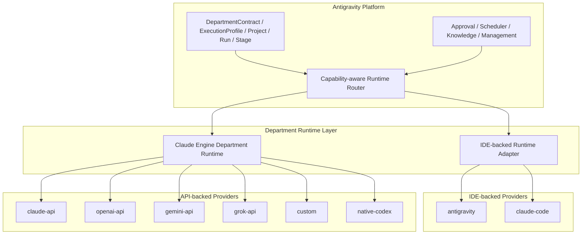

# Claude Engine Department Runtime 统一设计（2026-04-19）

**日期**: 2026-04-19  
**状态**: 设计稿 / 下一阶段实施基线  
**目标**: 把 `Claude Engine` 从“已移植的 API agent loop”升级为 Antigravity 中所有 API-backed provider 的统一 Department runtime，并让 `native-codex` 具备 Department runtime 级别能力。

---

## 1. 设计背景

当前系统已经完成：

1. `Claude Engine` 基础移植
   - query loop
   - transcript store
   - 文件工具
   - bash 工具
   - MCP resource 工具
   - 简化权限 checker
2. `AgentBackend` / `AgentSession` 事件架构
3. `ExecutionProfile`
4. `Knowledge Loop`
5. `CEO / Management / Evolution` 最小闭环

但当前有一个明显结构问题：

> **Department 是一等运行单元，但 API-backed provider 还没有真正获得 Department runtime。**

目前的真实状态更像：

1. `antigravity`
   - 有完整 IDE / language server / watcher / owner routing runtime
2. `claude-code`
   - 有独立 CLI / stream-json runtime
3. `claude-api` / `openai-api` / `gemini-api` / `grok-api` / `custom`
   - 接到了 `ClaudeEngineAgentBackend`
   - 但还没有成为真正 Department runtime
4. `native-codex`
   - 仍然是轻量 completion-style backend
   - 不能稳定支撑高约束 Department 任务

这和用户对系统的要求不一致：

1. 所有任务都以 Department 为单位运行
2. Department 需要有自己的工作目录、读写边界、记忆、工具和产物协议
3. `native-codex` 作为 API-backed provider，也必须具备同等级运行时语义

---

## 2. 一句话结论

> **IDE-backed provider 保留各自原生 runtime；所有 API-backed provider 统一接入 Claude Engine Department Runtime；`native-codex` 从轻量 completion backend 升级为 API-backed Department runtime provider。**

---

## 3. 设计原则

## 3.1 Department 是运行时真边界，不是 prompt 提示词装饰

Department contract 必须真正决定：

1. 这个任务在哪些目录工作
2. 能读哪些目录
3. 能写哪些目录
4. 允许哪些工具
5. 必须产出哪些文件
6. 触发哪些治理动作

不能只停留在：

1. provider 选择
2. prompt preamble
3. UI 展示

## 3.2 Runtime 分层要按“执行能力来源”划分，而不是按 provider 名称划分

未来系统里真正应该存在的是两类 runtime：

### A. IDE-backed runtime

代表：

1. `antigravity`
2. `claude-code`

特点：

1. 自带 IDE / session / tool runtime
2. 平台只需要做 adapter 和 session 归一化

### B. API-backed Department runtime

代表：

1. `claude-api`
2. `openai-api`
3. `gemini-api`
4. `grok-api`
5. `custom`
6. `native-codex`

特点：

1. 没有 IDE 自带 runtime
2. 需要平台提供统一 agent runtime
3. 统一由 `Claude Engine` 承担

## 3.3 不再让 API-backed provider 走“completion-only 特例”

对于 Department 任务，API-backed provider 不应继续分成：

1. 有的走 `Claude Engine`
2. 有的走轻量 completion executor

否则就会出现：

1. `workflow-run` 能跑
2. `review-flow` 不行
3. 文件读写边界不一致
4. artifact protocol 不一致
5. governance / audit 不一致

## 3.4 平台拥有 Department runtime contract，Claude Engine 只是实现

不能把平台重新写成 Claude Code 的外壳。

平台继续拥有：

1. Project / Run / Stage / ExecutionProfile
2. DepartmentContract
3. approval / governance / scheduler
4. artifact contract
5. knowledge / evolution / management

`Claude Engine` 只是：

1. API-backed Department runtime 的默认实现

---

## 4. 当前问题诊断

## 4.1 已有能力

当前 `Claude Engine` 已经有这些原语：

1. `ToolContext`
   - `workspacePath`
   - `readFile`
   - `writeFile`
   - `exec`
   - `additionalWorkingDirectories`
2. query loop
3. transcript store
4. file tools
5. bash tool
6. MCP resource tools
7. `PermissionChecker` 原语
8. toolset 概念

## 4.2 真正断点

### 断点 A：Backend 合同太薄

`BackendRunConfig` 里没有：

1. `toolset`
2. `permissionMode`
3. `additionalWorkingDirectories`
4. `readRoots`
5. `writeRoots`
6. `artifact contract`
7. `department contract`

结果：

- Claude Engine 有原语，但 backend 拿不到 Department 边界

### 断点 B：权限原语没有进入真实工具决策

当前：

1. `ClaudeEngine` 创建了 `PermissionChecker`
2. 但 `ToolExecutor` 对绝大多数工具直接 `tool.call(...)`
3. 只有 `BashTool` 额外走安全检查

结果：

- 有权限类型
- 没有完整 permission enforcement

### 断点 C：高级工具没有接线

当前默认工具注册表里虽然有：

1. `AgentTool`
2. `ListMcpResourcesTool`
3. `ReadMcpResourceTool`

但它们依赖外部注入：

1. `setAgentHandler()`
2. `setMcpResourceProvider()`

而 `ClaudeEngineAgentBackend` 启动时没有做这些注入。

### 断点 D：runtime 没有按能力矩阵路由 provider

当前 runtime 大致还是：

1. `resolveProvider('execution', workspacePath)`
2. `getAgentBackend(provider)`

没有：

1. “这个任务是否需要 Department runtime”
2. “这个 provider 是否满足 Department runtime 能力”
3. “如果不满足，是否降级或切换 provider”

### 断点 E：`native-codex` 仍是轻量 backend

当前 `native-codex` backend：

1. `supportsIdeSkills = false`
2. `supportsSandbox = false`
3. `supportsCancel = false`
4. `supportsStepWatch = false`

并且主要还是：

1. 拼 prompt
2. 调 Codex backend API
3. 拿文本

这让它无法稳定支撑：

1. artifact-heavy workflow
2. `review-flow`
3. Department 级目录约束

---

## 5. 目标架构



### 核心意思

1. `antigravity` / `claude-code`
   - 继续保留原生 runtime
2. 所有 API-backed provider
   - 不再各写一套轻 backend
   - 统一走 `Claude Engine Department Runtime`
3. `native-codex`
   - 不再是特例
   - 也纳入同一个 API-backed runtime 合同

---

## 6. 新的运行时合同

## 6.1 DepartmentRuntimeContract

建议新增：

```ts
export interface DepartmentRuntimeContract {
  workspaceRoot: string;
  additionalWorkingDirectories: string[];
  readRoots: string[];
  writeRoots: string[];
  artifactRoot: string;
  executionClass: 'light' | 'artifact-heavy' | 'review-loop' | 'delivery';
  toolset: 'research' | 'coding' | 'safe' | 'full';
  permissionMode: 'default' | 'dontAsk' | 'acceptEdits' | 'bypassPermissions';
  requiredArtifacts?: Array<{
    path: string;
    required: boolean;
    format?: 'md' | 'json' | 'txt';
  }>;
  mcpServers?: string[];
  allowSubAgents?: boolean;
}
```

### 作用

它回答的不是“用哪个模型”，而是：

1. 这个 Department 的任务应该如何运行
2. 在哪些目录内运行
3. 用哪些工具
4. 写哪些文件
5. 失败的判断依据是什么

## 6.2 BackendRunConfig 扩展

在现有 `BackendRunConfig` 基础上新增：

1. `runtimeContract?: DepartmentRuntimeContract`
2. `toolset?: string`
3. `permissionMode?: string`
4. `additionalWorkingDirectories?: string[]`
5. `allowedWriteRoots?: string[]`
6. `requiredArtifacts?: ...`

这样 runtime 不再靠 prompt 暗示边界，而是把边界以结构化形式送给 backend。

## 6.3 Capability Matrix

建议给 backend 增加两类能力声明：

```ts
export interface DepartmentRuntimeCapabilities {
  supportsDepartmentRuntime: boolean;
  supportsToolRuntime: boolean;
  supportsArtifactContracts: boolean;
  supportsReadWriteAudit: boolean;
  supportsPermissionEnforcement: boolean;
  supportsReviewLoops: boolean;
}
```

### 预期

#### antigravity / claude-code

应该趋近于：

- 全部 `true`

#### Claude Engine Department Runtime

目标是：

1. `supportsDepartmentRuntime = true`
2. `supportsToolRuntime = true`
3. `supportsArtifactContracts = true`
4. `supportsReadWriteAudit = true`
5. `supportsPermissionEnforcement = true`
6. `supportsReviewLoops = true`

#### 当前 `native-codex` 轻 backend

当前大致是：

1. `supportsDepartmentRuntime = false`
2. `supportsToolRuntime = false`
3. `supportsArtifactContracts = false`

设计目标是：

- 不再保留这条轻 backend 主链

---

## 7. Claude Engine Department Runtime 的具体目标

## 7.1 统一 API-backed provider

统一支持：

1. `claude-api`
2. `openai-api`
3. `gemini-api`
4. `grok-api`
5. `custom`
6. `native-codex`

## 7.2 统一 Department 行为

对于 API-backed provider，统一具备：

1. 文件读写
2. bash 执行
3. grep / glob / notebook edit
4. MCP resource 访问
5. toolset 限制
6. 权限决策
7. artifact contract 检查
8. transcript / append / cancel

## 7.3 统一治理入口

所有 API-backed provider 的：

1. file write
2. shell write
3. artifact output
4. reviewer round

都应该以平台自己的 governance contract 为准，而不是各 provider 自己定义一套。

---

## 8. `native-codex` 的目标形态

## 8.1 不再把 `native-codex` 当特例 executor

当前 `native-codex` 最大问题不是模型能力，而是执行器形态太轻。

未来形态应改成：

1. `native-codex` 只提供模型/响应接口
2. 真正的 Department runtime 由 `Claude Engine` 提供
3. `native-codex` 只是 `Claude Engine` 的一个 API provider adapter

## 8.2 这意味着要新增 `native-codex` 的 Claude Engine API adapter

当前 `Claude Engine` API layer 只认识：

1. `anthropic`
2. `openai`
3. `gemini`
4. `grok`
5. `bedrock`
6. `vertex`

需要新增：

1. `native-codex`

其职责不是一口气复刻 Codex IDE，而是：

1. 接收 `Claude Engine` 的消息 / tool schema
2. 转成 `native-codex` responses 格式
3. 支持 tool call 往返
4. 把结果再映射回 `Claude Engine` 的 `APIMessage / StreamEvent`

## 8.3 设计上的关键好处

一旦 `native-codex` 被纳入 `Claude Engine` API-backed runtime：

1. 它自动获得：
   - 文件工具
   - bash 工具
   - MCP resources
   - transcript
   - artifact contract
   - Department 边界
2. `review-flow` 失败就不再是“因为 backend 太轻”
3. 平台不需要为 `native-codex` 单独发明 Department runtime

---

## 9. 从父目录 `claude-code` 最值得继续移植的代码

## 9.1 第一优先级：不是继续散移植，而是拉齐主循环协议

从专项 review 看，最值得继续吸收的不是单个工具，而是上游整条：

```text
headless entry
  -> QueryEngine.ask / submitMessage
  -> query.ts 主循环
  -> toolOrchestration / toolExecution / toolHooks
  -> permissions
  -> AgentTool.runAgent / MCP fetch
  -> 再次回到 query loop
```

这条“厚上下文 query spine”才是 Claude Code 真正的 runtime 主脊柱。

最值得继续吸收的是：

### A. query 主循环的权限/工具上下文接线模式

上游关键位置：

- `../claude-code/src/query.ts`
- `../claude-code/src/QueryEngine.ts`

重点不是整文件照搬，而是吸收这类结构：

1. `getToolPermissionContext`
2. `mcpTools`
3. `agents`
4. `allowedAgentTypes`
5. tool permission 与 query loop 同步协作
6. `refreshTools()` 让 MCP / agent 新能力可在 query 中途进入主循环

### B. `ToolContext` / `ToolUseContext` 的 richer shape

上游关键位置：

- `../claude-code/src/Tool.ts`

最值得继续吸收的是：

1. richer permission context
2. additional working directories
3. agent / mcp / session 相关上下文

### C. 权限系统上游接线，而不仅是类型搬运

建议继续吸收：

1. `packages/security-core`
2. query/tool 调用时的 permission flow

重点不是再复制更多规则文件，而是让：

- `PermissionChecker`

真正进入：

- `ToolExecutor`
- `queryLoop`
- Department approval / permission bridge

### D. Agent / MCP provider 注入模式

当前我们已有工具定义，但缺外部注入。

应继续吸收上游的：

1. AgentTool 运行时绑定
2. MCP resource / tool provider 绑定

重点参考：

1. `../claude-code/src/tools/AgentTool/runAgent.ts`
2. `../claude-code/src/utils/forkedAgent.ts`
3. `../claude-code/src/services/mcp/client.ts`
4. `../claude-code/src/tools.ts`

## 9.2 `native-codex` 不是继续包一层 executor，而是补成 Claude Engine provider

专项评估确认：

1. 当前 `native-codex-adapter` 已能：
   - 发 `/responses`
   - 读 SSE
   - 抽最终 `function_call`
2. 但它还不是 `Claude Engine API provider`
3. 它只输出聚合后的 `NativeCodexResponse`
4. 没有把 SSE 转成 `Claude Engine StreamEvent`
5. 没有 tool loop 回注 `tool_result`
6. 没有接 `AbortSignal`

因此下一步不应继续强化 `NativeCodexExecutor` 这条轻量链，而应：

1. 新增：
   - `src/lib/claude-engine/api/native-codex/index.ts`
2. 把：
   - `APIMessage / APIContentBlock`
   转成 native responses payload
3. 把：
   - native SSE
   转成 `Claude Engine StreamEvent`
4. 再让 `native-codex` 通过 `ClaudeEngineAgentBackend('native-codex')` 接入

这样它才能真正获得：

1. query loop
2. tool execution
3. transcript
4. Department contract
5. artifact-heavy task 能力

---

## 10. 不建议直接照搬的部分

不建议直接移植：

1. Ink / React TUI UI 层
2. Claude Code 的 session / appState 全量壳层
3. 和本平台 ownership 冲突的 conversation ownership 逻辑
4. 把平台 Project / Run / Stage 语义让位给 Claude session 语义

原因：

你要的是：

- Department runtime

不是：

- 再造一个 Claude Code IDE

## 10.5 本地最小改造写点

如果下一阶段直接开工，最小写点应优先锁在下面这些文件。

### 合同层

1. `src/lib/backends/types.ts`
   - 扩展 `BackendRunConfig`
2. `src/lib/organization/contracts.ts`
   - 新增 `DepartmentRuntimeContract`
3. `src/lib/execution/contracts.ts`
   - 保留原始 `ExecutionProfile` 进入 backend

### Department 解析层

1. `src/lib/agents/department-capability-registry.ts`
2. `src/lib/agents/department-execution-resolver.ts`

这里负责把：

1. `DepartmentConfig`
2. `DepartmentContract`
3. `ExecutionProfile`
4. security policy

收口成结构化 runtime contract，而不是只拼 prompt preamble。

### Run 装配层

1. `src/lib/agents/prompt-executor.ts`
2. `src/lib/agents/group-runtime.ts`

这里是真正生成 `BackendRunConfig` 的入口，必须把：

1. 原始 `executionProfile`
2. `resolvedWorkflowRef / resolvedSkillRefs / promptResolution`
3. toolset / permission / working directories / write roots
4. artifact obligations

一起向下传。

### Claude Engine backend 层

1. `src/lib/backends/claude-engine-backend.ts`
2. `src/lib/claude-engine/engine/claude-engine.ts`
3. `src/lib/claude-engine/engine/query-loop.ts`
4. `src/lib/claude-engine/engine/tool-executor.ts`

这里要完成：

1. richer ToolContext
2. toolset 真正透传
3. permission enforcement 真正接线
4. AgentTool / MCP provider 注入

### native-codex 适配层

1. `src/lib/bridge/native-codex-adapter.ts`
2. `src/lib/claude-engine/api/types.ts`
3. `src/lib/claude-engine/api/retry.ts`
4. `src/lib/backends/builtin-backends.ts`

目标不是继续维护轻量 executor，而是把 `native-codex` 升格为 Claude Engine provider adapter。

---

## 11. 实施阶段建议

## Phase A：合同层

交付：

1. `DepartmentRuntimeContract`
2. `BackendRunConfig` 扩展
3. `DepartmentRuntimeCapabilities`

出口：

1. runtime 层能先判断任务是否需要 Department runtime

## Phase B：Claude Engine 接线层

交付：

1. `ClaudeEngineAgentBackend` 注入：
   - toolset
   - permission mode
   - additional working directories
   - allowed write roots
   - AgentTool handler
   - MCP resource provider

出口：

1. API-backed provider 获得真正 Department 边界

## Phase C：`native-codex` 适配层

交付：

1. `native-codex` 进入 `Claude Engine` API adapter 层
2. 废弃当前轻量 `native-codex` Department 主链

出口：

1. `native-codex` 拥有与其他 API-backed provider 一致的 runtime 行为

## Phase D：Capability-aware Routing

交付：

1. 任务复杂度与 backend 能力矩阵路由
2. 高约束任务不再派给低能力 backend

出口：

1. `review-flow` / artifact-heavy workflow 不再误路由

## Phase E：审计与验收

验收重点：

1. Department 可限定一个或多个目录工作
2. file read/write 真正受限于 Department contract
3. artifact-heavy workflow 可在 API-backed provider 下稳定完成
4. `review-flow + native-codex` 至少有一条模板链路跑通

---

## 12. 最终判断

用户的方向是正确的：

1. `Claude Engine` 应该成为 API-backed provider 的统一 Department runtime
2. `native-codex` 不应该继续做 completion-style 特例

当前阻碍这件事的，不是模型能力，也不是移植不够多，而是：

1. backend 合同没有表达 Department runtime
2. Claude Engine 的权限/高级工具没有真正接入执行主循环
3. runtime 没有按能力矩阵路由 provider

所以真正的下一步不是“继续散点移植文件”，而是：

> **先把 Department runtime contract 和 Claude Engine 接线层建好，再把 `native-codex` 适配进去。**
