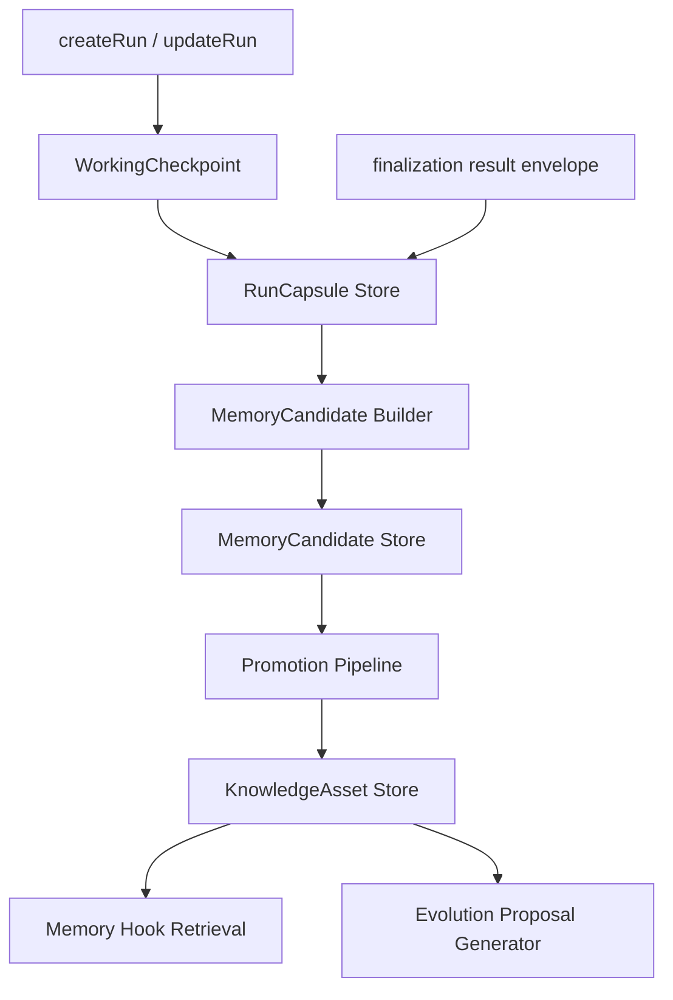

# Company Kernel Phase 0-2 Implementation RFC

**日期**: 2026-04-25  
**状态**: Draft for implementation  
**关联策划**: `docs/design/ai-company-self-growth-kernel-long-term-plan-2026-04-25.md`  
**关联研究**: `docs/research/genericagent-design-essence-code-analysis-2026-04-25.md`

## 1. 摘要

本 RFC 定义 OPC 从“任务调度 + 运行记录 + 经验沉淀”升级到“AI 公司自运营内核”的前 3 个落地阶段：

1. Phase 0: 边界盘点与主线冻结。
2. Phase 1: RunCapsule 与 WorkingCheckpoint。
3. Phase 2: Memory Promotion v1。

这 3 个阶段不追求立刻做完整自生长系统，而是先补齐底座：

1. 每次运行都能形成结构化、可查询、可追溯的运行胶囊。
2. 经验不会再从 run summary 里用正则直接写成永久记忆。
3. 记忆进入系统前必须先成为候选，经过评分、证据绑定、冲突检查和晋升。
4. 现有 Antigravity IDE、Native Codex、Codex CLI、第三方 API Provider 的执行路径保持兼容。
5. 不新增 5 秒轮询、后台常驻 worker 或无法解释的自循环。

核心判断：OPC 的长期价值不是“能跑任务”，而是“能把一次次任务转化为公司状态、可复用能力和受控演进”。当前代码已经有 run、knowledge、memory hook、evolution proposal 等组件，但缺少统一的公司内核协议，导致经验沉淀粗糙、自演进缺少可信证据、UI 难以表达真实状态。

## 2. 背景

### 2.1 现有系统已经具备的优势

OPC 不是从 0 开始：

1. 已经有真实运行主线：`AgentRunState`、project、scheduler、conversation、artifact、deliverable。
2. 已经有多 Provider 抽象：Antigravity IDE、Native Codex、Codex CLI、第三方 API 能在不同执行目标下工作。
3. 已经有知识资产表：`knowledge_assets` 以 SQLite 为主，文件镜像为辅。
4. 已经有 memory hook：执行前能注入部门记忆，执行后能接收 terminal event。
5. 已经有 evolution proposal：能从 knowledge 和 repeated runs 生成 workflow / skill 草稿。
6. 已经有 CEO Office、Knowledge、Ops、Settings 等管理面。

这些是 GenericAgent 类项目不一定具备的资产。GenericAgent 的优点是小而清晰，核心是 action outcome、working memory、verified memory 的闭环。OPC 的优势是更接近真实组织管理：多部门、多运行目标、多工作台、可视化、审批、任务调度和本地工作区。

### 2.2 当前短板

现有系统的问题不是某一个 API 或某一个页面，而是缺少统一的“公司运行内核”：

1. `AgentRunState` 记录运行事实，但不是面向公司学习的抽象。
2. `TaskResult.summary` 直接被正则抽取为 memory / knowledge，证据链弱。
3. `.department/memory/*.md` 仍存在自动 append 路径，容易污染部门记忆。
4. `KnowledgeAsset` 有 category/status/confidence，但缺少 evidence、promotion level、volatility、conflict group。
5. `EvolutionProposal` 能生成草稿，但来源主要是模板化 knowledge/repeated prompt，不知道 run 中哪些步骤真正可复用。
6. 自运营循环缺少 token budget、触发节流、目标函数和停止条件。不能简单靠 scheduler 无限跑。

本 RFC 只处理前两个核心问题：运行如何结构化沉淀，记忆如何受控进入系统。

## 3. 目标与非目标

### 3.1 目标

1. 建立 Company Kernel 的最小模块边界。
2. 为每个 run 生成 RunCapsule，作为后续记忆、复盘、进化和 UI 展示的统一输入。
3. 引入 WorkingCheckpoint，记录运行过程中的关键状态变化，但不制造高频后台噪音。
4. 引入 MemoryCandidate 与 Promotion pipeline，替换“run 完成后直接写永久记忆”的行为。
5. 让 KnowledgeAsset 支持 evidence、promotion、volatility、conflict 元数据。
6. 保持现有 API、UI、Provider 和 Antigravity IDE 兼容。
7. 所有新增持久化必须支持测试隔离，不能污染用户真实数据库和 `~/.gemini/antigravity`。

### 3.2 非目标

1. 不在本阶段实现完整自我写代码、自我发布系统。
2. 不在本阶段实现长期 token economy / budget scheduler。
3. 不在本阶段重写 Provider、Language Server、Antigravity IDE 集成。
4. 不在本阶段迁移到 Go 或 Tauri-only 架构。
5. 不在本阶段大改 CEO Office 视觉。
6. 不在本阶段废弃 legacy memory 文件读取。只废弃自动写入路径，读取仍保留兼容。
7. 不在本阶段自动发布 workflow / skill。Phase 2 最多产生可审批候选。

## 4. 设计原则

### 4.1 证据优先

任何进入长期记忆、流程资产、技能资产的内容必须能追溯到证据：

1. run id。
2. artifact path。
3. result envelope。
4. delivery packet。
5. verification signal。
6. human approval。
7. API response。
8. user feedback。

没有证据的内容可以成为候选，但不能成为 active knowledge。

### 4.2 先候选，后晋升

自动抽取只能生成候选。候选经过评分和冲突检查后，才可以晋升为 active knowledge。

允许自动晋升，但必须满足明确阈值：

1. 来源 run 成功完成。
2. 有 artifact/result envelope 支撑。
3. 内容不是易变信息。
4. 不与已有 active knowledge 冲突。
5. 分数超过配置阈值。

### 4.3 数据库为主，文件为镜像

SQLite 是 source of truth。文件只作为 human-readable mirror 或外部 agent 可读上下文。

原因：

1. 当前 `gateway-db.ts` 已经使用 SQLite 管理 runs/projects/jobs/knowledge/evolution。
2. API 查询、分页、过滤、审计需要结构化数据。
3. Markdown append 容易重复、冲突、不可回滚。

### 4.4 不制造新后台噪音

Phase 0-2 不新增高频常驻 worker。

允许的触发方式：

1. run lifecycle hook。
2. API 显式触发。
3. scheduler 已存在任务的低频触发。
4. 管理员手动 review / promote。

禁止的触发方式：

1. 5 秒全量扫描 run/knowledge。
2. 启动时自动扫描全库并写入。
3. 多个 dev/start/watch 重复拉 scheduler。
4. 测试文件写入真实用户数据库。

### 4.5 不影响 Antigravity IDE

本 RFC 不改变 Antigravity IDE 下列路径：

1. workspace/server 扫描。
2. Language Server 查找。
3. Language Server 进程启动。
4. Antigravity conversation/cascade 接入。
5. Antigravity provider 的 session provenance。

Company Kernel 只消费 run lifecycle 与 artifacts，不改变 Provider 如何执行。

## 5. 当前代码审计结论

### 5.1 Run 主线

相关文件：

1. `src/lib/agents/group-types.ts`
2. `src/lib/agents/run-registry.ts`
3. `src/lib/storage/gateway-db.ts`
4. `src/lib/agents/finalization.ts`
5. `src/lib/backends/run-session-hooks.ts`
6. `src/lib/agents/group-runtime.ts`

现状：

1. `AgentRunState` 已经有 runId、workspace、prompt、status、result、artifactDir、executionTarget、triggerContext、provider、sessionProvenance、tokenUsage。
2. `createRun()` 创建 run 并写入 SQLite。
3. `updateRun()` 负责状态更新、持久化、run history、project pipeline 同步。
4. `upsertRunRecord()` 写入 `runs` 表，payload_json 保存完整 run。
5. finalization 里会扫描 artifacts、写 result envelope，并调用 memory/knowledge 写入。

缺口：

1. run 是执行记录，不是学习记录。
2. run summary、artifact、verification、token usage 没有被统一汇总成后续学习输入。
3. run 完成时会直接触发 `extractAndPersistMemory()` 与 `persistKnowledgeForRun()`，缺少候选层。
4. `applyAfterRunMemoryHooks()` 存在，但当前没有作为公司内核统一入口。

### 5.2 Knowledge 主线

相关文件：

1. `src/lib/knowledge/contracts.ts`
2. `src/lib/knowledge/extractor.ts`
3. `src/lib/knowledge/store.ts`
4. `src/lib/knowledge/retrieval.ts`
5. `src/app/api/knowledge/route.ts`
6. `src/app/api/knowledge/[id]/route.ts`

现状：

1. `KnowledgeAsset` 已有 scope/category/source/confidence/status/tags。
2. `knowledge_assets` 表保存结构化 payload。
3. `store.ts` 会同步镜像到 `~/.gemini/antigravity/knowledge/{id}`。
4. retrieval 能按 prompt/title/content/tags 做简单匹配并写 usage count。

缺口：

1. `source.runId` 不等于证据链。
2. `confidence` 没有清晰评分来源。
3. `status` 缺少 candidate/rejected/archived 等流程态。
4. 没有 promotion level。
5. 没有 volatility，导致日期、临时状态、接口延迟等易变事实可能被长期记忆化。
6. 没有 conflict group，无法表达新旧知识冲突。

### 5.3 Legacy Department Memory

相关文件：

1. `src/lib/agents/department-memory.ts`
2. `src/lib/agents/department-memory-bridge.ts`

现状：

1. `.department/memory/*.md` 支持部门级 Markdown 记忆。
2. bridge 会读取 shared/provider-specific memory。
3. bridge 还会读取最近 5 条 structured knowledge assets 注入执行上下文。

缺口：

1. `extractAndPersistMemory()` 会在 run 完成后 append `knowledge.md` / `decisions.md`。
2. append 基于正则和 changedFiles，不区分证据强弱。
3. 一旦写入 Markdown，很难审计、撤销、去重。

目标状态：

1. 保留读取 legacy memory。
2. 保留 manual append 能力。
3. 禁止 run finalization 自动 append legacy memory。
4. 自动提炼统一进入 MemoryCandidate。

### 5.4 Evolution 主线

相关文件：

1. `src/lib/evolution/contracts.ts`
2. `src/lib/evolution/generator.ts`
3. `src/lib/evolution/evaluator.ts`
4. `src/lib/evolution/publisher.ts`
5. `src/app/api/evolution/proposals/*`

现状：

1. 能从 `workflow-proposal` / `skill-proposal` knowledge 生成 proposal。
2. 能从 repeated prompt clusters 发现 workflow 候选。
3. 能 evaluate/publish/observe proposal。

缺口：

1. proposal 不是从 RunCapsule 产生，无法知道哪些步骤真正有效。
2. repeated prompt cluster 只看 prompt token 相似，不看结果质量。
3. knowledge proposal 的来源质量不稳定。

Phase 2 不重写 evolution，但要让 evolution 未来改成消费 RunCapsule 和 promoted memory。

## 6. 目标架构

新增模块建议放在：

```text
src/lib/company-kernel/
  contracts.ts
  evidence.ts
  run-capsule.ts
  run-capsule-store.ts
  working-checkpoint.ts
  memory-candidate.ts
  memory-candidate-store.ts
  memory-promotion.ts
  integration.ts
  index.ts
```

职责边界：

1. `contracts.ts`: 公司内核核心类型。
2. `evidence.ts`: evidence refs 构建、去重、校验。
3. `run-capsule.ts`: 从 AgentRunState / TaskResult / artifacts 构建 RunCapsule。
4. `run-capsule-store.ts`: SQLite 读写 RunCapsule。
5. `working-checkpoint.ts`: 将 lifecycle 事件转成低频 checkpoint。
6. `memory-candidate.ts`: 从 RunCapsule 生成候选。
7. `memory-candidate-store.ts`: SQLite 读写候选。
8. `memory-promotion.ts`: 评分、冲突检查、晋升、拒绝。
9. `integration.ts`: 连接 run registry / finalization / memory hooks。
10. `index.ts`: 对外导出稳定 API。

### 6.1 数据流



关键点：

1. RunCapsule 是后续学习的唯一标准输入。
2. MemoryCandidate 是自动抽取的默认输出。
3. KnowledgeAsset 只保存晋升后的内容。
4. Evolution 未来消费 promoted knowledge 和 RunCapsule，不直接消费 raw summary。

## 7. Phase 0: 边界盘点与主线冻结

### 7.1 目的

在写核心代码前，先把“哪些路径写记忆、哪些路径写知识、哪些路径会启动后台、哪些路径会触发 Provider”彻底盘清楚，避免继续补丁式改造。

### 7.2 交付物

新增文档：

```text
docs/design/company-kernel-boundary-audit-2026-04-25.md
```

内容必须包括：

1. Run lifecycle 写路径表。
2. Memory/Knowledge 写路径表。
3. Evolution proposal 写路径表。
4. Scheduler/worker 启动路径表。
5. API route 副作用表。
6. Test isolation 规则。
7. Antigravity IDE 不可破坏路径清单。
8. Company Kernel Phase 1/2 的代码 owner 与模块边界。

### 7.3 需要盘点的代码路径

必须覆盖：

1. `src/lib/agents/run-registry.ts`
2. `src/lib/agents/finalization.ts`
3. `src/lib/agents/group-runtime.ts`
4. `src/lib/backends/run-session-hooks.ts`
5. `src/lib/backends/memory-hooks.ts`
6. `src/lib/agents/department-memory.ts`
7. `src/lib/agents/department-memory-bridge.ts`
8. `src/lib/knowledge/index.ts`
9. `src/lib/knowledge/extractor.ts`
10. `src/lib/knowledge/store.ts`
11. `src/lib/evolution/generator.ts`
12. `src/lib/evolution/store.ts`
13. `src/lib/agents/scheduler.ts`
14. `src/lib/storage/gateway-db.ts`
15. `src/app/api/agent-runs/*`
16. `src/app/api/knowledge/*`
17. `src/app/api/evolution/*`
18. `src/app/api/scheduler/*`

### 7.4 Phase 0 冻结规则

Phase 0 完成后，进入 Phase 1/2 期间必须遵守：

1. 不新增任何 run 完成后直接写 `.department/memory` 的路径。
2. 不新增任何 run 完成后直接写 `knowledge_assets` active 状态的路径。
3. 不新增任何启动时自动恢复并写入 memory/knowledge 的逻辑。
4. 不新增高频全量扫描。
5. 新测试必须设置 `AG_GATEWAY_HOME` 或使用现有 Vitest 隔离机制。
6. 所有新 store 必须能清理 global singleton。

### 7.5 验收标准

1. 边界文档存在并覆盖上述文件。
2. 标出所有当前直接写 memory/knowledge 的路径。
3. 标出所有可能污染真实数据库的测试路径。
4. 明确 Phase 1/2 每个改动点的 owner module。
5. Phase 0 不改变运行行为。

## 8. Phase 1: RunCapsule 与 WorkingCheckpoint

### 8.1 目的

RunCapsule 是公司内核的“运行事实摘要”。它不是 UI 展示摘要，也不是 agent 自己写的总结，而是系统从 run lifecycle、result envelope、artifact、verification 中提炼出的结构化事实。

### 8.2 RunCapsule 类型

建议新增：

```ts
export type EvidenceRefType =
  | 'run'
  | 'artifact'
  | 'result-envelope'
  | 'delivery-packet'
  | 'log'
  | 'api-response'
  | 'user-feedback'
  | 'approval'
  | 'file'
  | 'screenshot';

export interface EvidenceRef {
  id: string;
  type: EvidenceRefType;
  label: string;
  runId?: string;
  artifactPath?: string;
  filePath?: string;
  apiRoute?: string;
  excerpt?: string;
  checksum?: string;
  createdAt: string;
  metadata?: Record<string, unknown>;
}

export type WorkingCheckpointKind =
  | 'run-created'
  | 'run-started'
  | 'conversation-attached'
  | 'artifact-discovered'
  | 'result-discovered'
  | 'verification-discovered'
  | 'run-completed'
  | 'run-blocked'
  | 'run-failed'
  | 'run-cancelled';

export interface WorkingCheckpoint {
  id: string;
  runId: string;
  kind: WorkingCheckpointKind;
  summary: string;
  occurredAt: string;
  evidenceRefs: EvidenceRef[];
  metadata?: Record<string, unknown>;
}

export interface RunCapsule {
  capsuleId: string;
  runId: string;
  workspaceUri: string;
  projectId?: string;
  providerId?: string;
  executionTarget?: ExecutionTarget;
  triggerContext?: TriggerContext;
  goal: string;
  prompt: string;
  status: RunStatus;
  startedAt?: string;
  finishedAt?: string;
  checkpoints: WorkingCheckpoint[];
  verifiedFacts: string[];
  decisions: string[];
  reusableSteps: string[];
  blockers: string[];
  changedFiles: string[];
  outputArtifacts: EvidenceRef[];
  qualitySignals: {
    resultStatus?: TaskResult['status'];
    reviewOutcome?: ReviewOutcome;
    verificationPassed?: boolean;
    reportedEventDate?: string;
    reportedEventCount?: number;
    hasResultEnvelope: boolean;
    hasArtifactManifest: boolean;
    hasDeliveryPacket: boolean;
  };
  tokenUsage?: {
    inputTokens: number;
    outputTokens: number;
    totalTokens: number;
  };
  sourceRunUpdatedAt: string;
  createdAt: string;
  updatedAt: string;
}
```

### 8.3 RunCapsule 字段解释

`verifiedFacts`

1. 只记录从 result envelope、delivery packet、verification signal、API response 中能支撑的事实。
2. 不记录“看起来可能正确”的总结。
3. 易变事实必须带上日期或上下文。

`decisions`

1. 可以从 result summary 抽取，但必须标为 low-confidence，除非 result envelope 或 human approval 支撑。
2. 后续是否进入 KnowledgeAsset 由 Phase 2 决定。

`reusableSteps`

1. 从 artifact、workflow output、delivery packet 的 procedure/followUps 提炼。
2. 不是简单复制 prompt。
3. 用于未来 evolution proposal。

`qualitySignals`

1. 后续 promotion 和 evolution 的评分依据。
2. 不直接替代人工审批。

### 8.4 WorkingCheckpoint 触发点

不引入高频监听，只在现有低频状态变化点记录：

1. `createRun()` 后记录 `run-created`。
2. `updateRun()` 状态变成 `starting/running` 时记录 `run-started`。
3. `sessionProvenance` 或 child conversation 出现时记录 `conversation-attached`。
4. `resultEnvelope.outputArtifacts` 变化时记录 `artifact-discovered`。
5. `run.result.summary` 出现时记录 `result-discovered`。
6. verification 字段变化时记录 `verification-discovered`。
7. terminal status 出现时记录 terminal checkpoint。

### 8.5 Store 设计

新增 SQLite 表：

```sql
CREATE TABLE IF NOT EXISTS run_capsules (
  capsule_id TEXT PRIMARY KEY,
  run_id TEXT NOT NULL UNIQUE,
  workspace TEXT NOT NULL,
  project_id TEXT,
  status TEXT NOT NULL,
  provider TEXT,
  created_at TEXT NOT NULL,
  updated_at TEXT NOT NULL,
  finished_at TEXT,
  payload_json TEXT NOT NULL
);

CREATE INDEX IF NOT EXISTS idx_run_capsules_run_id ON run_capsules(run_id);
CREATE INDEX IF NOT EXISTS idx_run_capsules_workspace ON run_capsules(workspace);
CREATE INDEX IF NOT EXISTS idx_run_capsules_project_id ON run_capsules(project_id);
CREATE INDEX IF NOT EXISTS idx_run_capsules_status ON run_capsules(status);
CREATE INDEX IF NOT EXISTS idx_run_capsules_provider ON run_capsules(provider);
CREATE INDEX IF NOT EXISTS idx_run_capsules_updated_at ON run_capsules(updated_at);
```

可选表：

```sql
CREATE TABLE IF NOT EXISTS working_checkpoints (
  checkpoint_id TEXT PRIMARY KEY,
  run_id TEXT NOT NULL,
  kind TEXT NOT NULL,
  occurred_at TEXT NOT NULL,
  payload_json TEXT NOT NULL
);

CREATE INDEX IF NOT EXISTS idx_working_checkpoints_run_id ON working_checkpoints(run_id);
CREATE INDEX IF NOT EXISTS idx_working_checkpoints_kind ON working_checkpoints(kind);
CREATE INDEX IF NOT EXISTS idx_working_checkpoints_occurred_at ON working_checkpoints(occurred_at);
```

推荐第一版只使用 `run_capsules.payload_json` 保存 checkpoints，避免过早拆表。若 UI 后续需要独立流式时间线，再拆 `working_checkpoints`。

### 8.6 Store API

```ts
export function upsertRunCapsule(capsule: RunCapsule): RunCapsule;
export function getRunCapsuleByRunId(runId: string): RunCapsule | null;
export function listRunCapsules(query?: {
  workspaceUri?: string;
  projectId?: string;
  status?: RunStatus | RunStatus[];
  providerId?: string;
  limit?: number;
  offset?: number;
}): RunCapsule[];
export function countRunCapsules(query?: ...): number;
export function appendWorkingCheckpoint(input: {
  run: AgentRunState;
  kind: WorkingCheckpointKind;
  summary: string;
  evidenceRefs?: EvidenceRef[];
  metadata?: Record<string, unknown>;
}): RunCapsule;
export function rebuildRunCapsuleFromRun(run: AgentRunState): RunCapsule;
```

### 8.7 Integration 设计

#### 8.7.1 run-registry 轻量接入

推荐不要在 `run-registry.ts` 内塞复杂逻辑，只调用 integration：

```ts
onRunCreated(run);
onRunUpdated({ previousRun, nextRun, updates });
```

`run-registry.ts` 只负责发事件，Company Kernel 决定是否写 capsule。

如果担心改动面，可以第一版在 `updateRun()` 中只在 terminal status 时调用：

```ts
captureRunCapsuleSnapshot(run);
```

但长期建议完整覆盖 lifecycle checkpoints。

#### 8.7.2 finalization 接入

`finalization.ts` 当前直接调用：

1. `extractAndPersistMemory()`
2. `persistKnowledgeForRun()`

Phase 1 不立刻删除这些路径，但要先插入：

```ts
finalizeRunCapsuleForRun(runId);
```

Phase 2 再替换直接写 memory/knowledge 的逻辑。

#### 8.7.3 memory hooks 接入

`applyAfterRunMemoryHooks()` 当前可以作为非侵入式 terminal event 入口。Phase 1 可注册一个 company-kernel hook：

```ts
export const companyKernelRunHook: BackendMemoryHook = {
  id: 'company-kernel-run-capsule',
  afterRun: async ({ config, event }) => {
    captureRunCapsuleFromTerminalEvent(config, event);
  },
};
```

但要注意：当前不同 runtime 未必都经过 afterRun hook，finalization 仍要兜底。

### 8.8 API 设计

新增 API：

```text
GET /api/company/run-capsules
GET /api/company/run-capsules/:runId
```

查询参数：

1. `workspaceUri`
2. `projectId`
3. `status`
4. `providerId`
5. `page`
6. `pageSize`

返回格式必须分页：

```ts
interface PaginatedRunCapsulesResponse {
  items: RunCapsule[];
  pagination: {
    page: number;
    pageSize: number;
    total: number;
    totalPages: number;
  };
}
```

禁止返回全量大 payload。默认 `pageSize = 20`，最大 `pageSize = 100`。

### 8.9 Phase 1 测试

新增测试建议：

1. `src/lib/company-kernel/run-capsule.test.ts`
2. `src/lib/company-kernel/run-capsule-store.test.ts`
3. `src/lib/company-kernel/integration.test.ts`
4. `src/app/api/company/run-capsules/route.test.ts`
5. `src/app/api/company/run-capsules/[runId]/route.test.ts`

必须覆盖：

1. completed run 能生成 capsule。
2. failed run 能记录 blocker 和 lastError。
3. result envelope outputArtifacts 能变成 evidence refs。
4. tokenUsage 被保留。
5. list API 有分页。
6. 测试使用临时 `AG_GATEWAY_HOME`。
7. 不写真实 `~/.gemini/antigravity`。

### 8.10 Phase 1 验收

1. 创建一个 fake run，更新为 completed 后能查到 RunCapsule。
2. failed/blocked/cancelled run 也能生成 RunCapsule。
3. `/api/company/run-capsules` 默认分页，不返回全量大包。
4. 原有 `/api/agent-runs` 行为不变。
5. 原有 Antigravity IDE provider 行为不变。
6. `npm run build` 通过。
7. 相关 Vitest 通过。

## 9. Phase 2: Memory Promotion v1

### 9.1 目的

把“自动抽取直接进入长期记忆”改成“候选 -> 评分 -> 晋升/拒绝”。这是从 Agent 运行到公司学习最关键的一步。

### 9.2 新增 MemoryCandidate 类型

```ts
export type MemoryCandidateKind =
  | 'decision'
  | 'pattern'
  | 'lesson'
  | 'domain-knowledge'
  | 'workflow-proposal'
  | 'skill-proposal';

export type MemoryCandidateStatus =
  | 'candidate'
  | 'auto-promoted'
  | 'pending-review'
  | 'promoted'
  | 'rejected'
  | 'archived';

export type KnowledgePromotionLevel =
  | 'l0-candidate'
  | 'l1-index'
  | 'l2-fact'
  | 'l3-process'
  | 'l4-archive';

export type KnowledgeVolatility =
  | 'stable'
  | 'time-bound'
  | 'volatile';

export interface MemoryCandidate {
  id: string;
  workspaceUri?: string;
  sourceRunId: string;
  sourceCapsuleId: string;
  kind: MemoryCandidateKind;
  title: string;
  content: string;
  evidenceRefs: EvidenceRef[];
  volatility: KnowledgeVolatility;
  score: {
    total: number;
    evidence: number;
    reuse: number;
    specificity: number;
    stability: number;
    novelty: number;
    risk: number;
  };
  reasons: string[];
  conflicts: Array<{
    knowledgeId: string;
    reason: string;
    severity: 'low' | 'medium' | 'high';
  }>;
  status: MemoryCandidateStatus;
  promotedKnowledgeId?: string;
  rejectedReason?: string;
  createdAt: string;
  updatedAt: string;
}
```

### 9.3 KnowledgeAsset 扩展

保持向后兼容，在现有 `KnowledgeAsset` 上新增可选字段：

```ts
export interface KnowledgeEvidence {
  refs: EvidenceRef[];
  strength: number;
  verifiedAt?: string;
}

export interface KnowledgePromotionMetadata {
  level: KnowledgePromotionLevel;
  volatility: KnowledgeVolatility;
  qualityScore: number;
  sourceCandidateId?: string;
  sourceCapsuleIds: string[];
  promotedBy: 'system' | 'ceo' | 'manual';
  promotedAt: string;
  conflictGroupId?: string;
}

export interface KnowledgeAsset {
  ...
  evidence?: KnowledgeEvidence;
  promotion?: KnowledgePromotionMetadata;
}
```

现有 API/UI 读取旧字段不受影响。新增字段只作为增强元数据。

### 9.4 MemoryCandidate Store

新增 SQLite 表：

```sql
CREATE TABLE IF NOT EXISTS memory_candidates (
  candidate_id TEXT PRIMARY KEY,
  workspace TEXT,
  source_run_id TEXT NOT NULL,
  source_capsule_id TEXT NOT NULL,
  kind TEXT NOT NULL,
  status TEXT NOT NULL,
  score REAL NOT NULL,
  created_at TEXT NOT NULL,
  updated_at TEXT NOT NULL,
  payload_json TEXT NOT NULL
);

CREATE INDEX IF NOT EXISTS idx_memory_candidates_workspace ON memory_candidates(workspace);
CREATE INDEX IF NOT EXISTS idx_memory_candidates_source_run_id ON memory_candidates(source_run_id);
CREATE INDEX IF NOT EXISTS idx_memory_candidates_source_capsule_id ON memory_candidates(source_capsule_id);
CREATE INDEX IF NOT EXISTS idx_memory_candidates_kind ON memory_candidates(kind);
CREATE INDEX IF NOT EXISTS idx_memory_candidates_status ON memory_candidates(status);
CREATE INDEX IF NOT EXISTS idx_memory_candidates_score ON memory_candidates(score);
CREATE INDEX IF NOT EXISTS idx_memory_candidates_updated_at ON memory_candidates(updated_at);
```

Store API：

```ts
export function upsertMemoryCandidate(candidate: MemoryCandidate): MemoryCandidate;
export function getMemoryCandidate(id: string): MemoryCandidate | null;
export function listMemoryCandidates(query?: {
  workspaceUri?: string;
  sourceRunId?: string;
  sourceCapsuleId?: string;
  kind?: MemoryCandidateKind | MemoryCandidateKind[];
  status?: MemoryCandidateStatus | MemoryCandidateStatus[];
  minScore?: number;
  limit?: number;
  offset?: number;
}): MemoryCandidate[];
export function countMemoryCandidates(query?: ...): number;
export function updateMemoryCandidateStatus(
  id: string,
  status: MemoryCandidateStatus,
  patch?: Partial<MemoryCandidate>,
): MemoryCandidate | null;
```

### 9.5 Candidate 生成规则

输入：RunCapsule。

输出：0-N 个 MemoryCandidate。

规则：

1. `decisions[]` -> `decision` candidate。
2. `reusableSteps[]` -> `pattern` or `workflow-proposal` candidate。
3. `blockers[]` + failed/blocked status -> `lesson` candidate。
4. repeated successful capsule patterns -> 后续 Phase 3/4 处理，本阶段不做全库扫描。
5. `promptResolution.workflowSuggestion` -> `workflow-proposal` candidate。

禁止：

1. 从 summary 任意句子生成 active knowledge。
2. 从 changedFiles 直接生成“Implementation pattern active knowledge”。
3. 把接口延迟、当天数据、任务状态这类 volatile 信息晋升为长期 stable memory。

### 9.6 Scoring 规则

第一版使用确定性评分，不调用 LLM，避免成本和不稳定。

建议满分 100：

```text
total =
  evidence * 0.30 +
  reuse * 0.20 +
  specificity * 0.15 +
  stability * 0.15 +
  novelty * 0.10 -
  risk * 0.10
```

字段解释：

1. `evidence`: result envelope、artifact、verification、approval 的强度。
2. `reuse`: 是否来自 reusableSteps、workflow suggestion、重复出现。
3. `specificity`: 是否具体到技术决策、流程步骤、约束。
4. `stability`: 是否不是易变事实。
5. `novelty`: 是否与已有 knowledge 不重复。
6. `risk`: 是否可能误导、过期、冲突、泄露敏感信息。

自动动作：

1. `total >= 75` 且无 high conflict 且 volatility != volatile: 可 auto-promote。
2. `50 <= total < 75`: pending-review。
3. `total < 50`: archived 或 candidate 保留。
4. high conflict: pending-review。
5. volatile: 不自动晋升，只允许 time-bound archive 或人工确认。

### 9.7 Promotion 规则

晋升函数：

```ts
export function promoteMemoryCandidate(input: {
  candidateId: string;
  promotedBy: 'system' | 'ceo' | 'manual';
  level?: KnowledgePromotionLevel;
  category?: KnowledgeCategory;
  title?: string;
  content?: string;
}): KnowledgeAsset;
```

晋升结果：

1. 写入 `knowledge_assets`。
2. `status = active` 或 `proposal`。
3. `evidence.refs` 写入 candidate evidence。
4. `promotion.sourceCandidateId` 绑定 candidate。
5. candidate status 改为 `promoted` 或 `auto-promoted`。
6. 文件镜像只在 promotion 后写入。

拒绝函数：

```ts
export function rejectMemoryCandidate(input: {
  candidateId: string;
  reason: string;
  rejectedBy: 'ceo' | 'manual' | 'system';
}): MemoryCandidate;
```

### 9.8 替换现有直接写路径

当前直接写路径：

1. `finalization.ts` 调用 `extractAndPersistMemory()`
2. `finalization.ts` 调用 `persistKnowledgeForRun()`
3. `persistKnowledgeForRun()` 调用 `extractKnowledgeAssetsFromRun()` 然后 `upsertKnowledgeAsset()`
4. `extractAndPersistMemory()` append `.department/memory/*.md`

Phase 2 目标：

1. `extractAndPersistMemory()` 不再由 run finalization 自动调用。
2. `persistKnowledgeForRun()` 保留函数名兼容，但内部改为：
   1. 获取或创建 RunCapsule。
   2. 生成 MemoryCandidate。
   3. 对高分候选执行 auto-promote。
   4. 返回被晋升的 KnowledgeAsset。
3. `extractKnowledgeAssetsFromRun()` 保留用于 legacy tests 或 manual migration，但标记为 deprecated。
4. `.department/memory` 自动 append 停止，manual API 不受影响。

### 9.9 API 设计

新增：

```text
GET /api/company/memory-candidates
GET /api/company/memory-candidates/:id
POST /api/company/memory-candidates/:id/promote
POST /api/company/memory-candidates/:id/reject
```

`GET /api/company/memory-candidates` 必须分页：

```ts
interface PaginatedMemoryCandidatesResponse {
  items: MemoryCandidate[];
  pagination: {
    page: number;
    pageSize: number;
    total: number;
    totalPages: number;
  };
}
```

默认 `pageSize = 20`，最大 `pageSize = 100`。

`POST /promote` body：

```ts
interface PromoteMemoryCandidateRequest {
  title?: string;
  content?: string;
  category?: KnowledgeCategory;
  level?: KnowledgePromotionLevel;
}
```

`POST /reject` body：

```ts
interface RejectMemoryCandidateRequest {
  reason: string;
}
```

### 9.10 UI 设计边界

Phase 2 不做大 UI，但需要一个最小管理入口：

1. Knowledge 页面可以新增 “候选” tab。
2. 或 Ops 页面新增 “公司内核 / 记忆候选”卡片。
3. 第一版只需要列表、详情、Promote、Reject。
4. 不要写大段解释文案。
5. 用证据、分数、状态、冲突标签表达，不靠说明文字堆砌。

### 9.11 Phase 2 测试

新增测试：

1. `src/lib/company-kernel/memory-candidate.test.ts`
2. `src/lib/company-kernel/memory-candidate-store.test.ts`
3. `src/lib/company-kernel/memory-promotion.test.ts`
4. `src/lib/knowledge/contracts.test.ts` 或现有 extractor tests 更新。
5. `src/app/api/company/memory-candidates/route.test.ts`
6. `src/app/api/company/memory-candidates/[id]/promote/route.test.ts`
7. `src/app/api/company/memory-candidates/[id]/reject/route.test.ts`

必须覆盖：

1. completed capsule 生成 candidate。
2. failed capsule 生成 lesson candidate。
3. volatile candidate 不自动晋升。
4. evidence 为空的 candidate 不自动晋升。
5. high conflict candidate 不自动晋升。
6. promote 后写 KnowledgeAsset，并带 evidence/promotion。
7. reject 后不写 KnowledgeAsset。
8. legacy `.department/memory` 不被自动 append。
9. API 分页生效。
10. 测试不污染真实 DB 和 home。

### 9.12 Phase 2 验收

1. run 完成后可以查到 MemoryCandidate。
2. 只有满足阈值的候选会进入 KnowledgeAsset。
3. KnowledgeAsset 有 evidence 和 promotion 元数据。
4. `.department/memory/*.md` 不再因为自动 run finalization 被追加。
5. 现有 Knowledge retrieval 能读取晋升后的 knowledge。
6. Evolution proposal 仍可从 proposal knowledge 生成，不回归。
7. `npm run build` 通过。
8. 相关 Vitest 通过。

## 10. 数据库迁移策略

### 10.1 当前模式

`gateway-db.ts` 目前使用：

1. `SCHEMA_VERSION = 3`
2. `CREATE TABLE IF NOT EXISTS`
3. `ensureColumn()`
4. JSON payload 存完整结构。
5. Indexed columns 存关键查询字段。

新增表应继续沿用该模式。

### 10.2 Schema Version

实施时建议：

1. 将 `SCHEMA_VERSION` 从 3 提升到 4。
2. 在 `initSchema()` 中创建 `run_capsules` 和 `memory_candidates`。
3. 不做破坏性 migration。
4. 不回填历史 run，除非用户/API 显式触发。

不自动回填的原因：

1. 历史 run 可能很多，启动回填会增加冷启动噪音。
2. 历史 run payload 质量不一致。
3. 自运营内核的第一目标是未来行为正确。

可选手动回填 API：

```text
POST /api/company/run-capsules/rebuild
```

此 API 不在 Phase 1 必做范围。

## 11. API 命名与文档同步

新增 API 统一放到：

```text
src/app/api/company/*
```

原因：

1. `knowledge` 是资产层。
2. `evolution` 是演进层。
3. `scheduler` 是调度层。
4. `company` 表达公司内核与运营状态。

实施代码时必须同步：

1. `docs/guide/gateway-api.md`
2. `docs/guide/cli-api-reference.md`
3. `ARCHITECTURE.md`
4. 如修改类型面向用户，还要更新 `docs/guide/agent-user-guide.md`

本 RFC 只是设计文档，不更新上述实现文档。

## 12. 测试隔离要求

所有新增测试必须遵守：

1. 设置临时 `AG_GATEWAY_HOME`。
2. 删除 `globalThis.__AG_GATEWAY_DB__`。
3. `vi.resetModules()` 后再 import store。
4. 测试结束清理临时目录。
5. 不写真实 `~/.gemini/antigravity/knowledge`。
6. 不写真实 workspace `.department/memory`，除非测试目录是临时 workspace。

当前已有范式可复用：

1. `src/lib/storage/gateway-db.test.ts`
2. `src/app/api/agent-runs/route.test.ts`
3. `src/lib/agents/department-memory.test.ts`

如发现现有测试污染真实 DB，Phase 0 必须列入修复清单。

## 13. Provider 与 Antigravity 兼容性

### 13.1 不改变执行目标

RunCapsule 消费 `AgentRunState.executionTarget`，但不决定 execution target。

现有三类 execution target 保持：

1. `template`
2. `prompt`
3. `project-only`

Provider 仍由现有配置/scene/department/layer/default 决定。

### 13.2 不改变 Language Server

本 RFC 不触碰：

1. Antigravity server discovery。
2. Language Server binary resolution。
3. Language Server process lifecycle。
4. Antigravity workspace scan。
5. Native Codex process launch。
6. Codex CLI invocation。

如果未来 UI 让用户选择 “Antigravity IDE / Native Codex / Codex CLI / Third-party API”，Company Kernel 只记录选择结果和执行证据，不拥有 provider 启动逻辑。

## 14. 与长期自运营系统的关系

Phase 0-2 是长期系统的地基。

后续阶段依赖关系：

1. Phase 3 Signal / Agenda 需要 RunCapsule 作为日常运营信号来源。
2. Phase 4 Budget / Trigger 需要 MemoryCandidate 和 RunCapsule 统计成功率、成本和收益。
3. Phase 5 Crystallizer 需要 promoted memory 和 reusable steps 生成 workflow/skill。
4. Phase 6 Company Graph 需要 capsule、knowledge、proposal 的关系图。
5. Phase 7 Self-Improvement 需要证据链和审批链防止失控。

如果不先做 Phase 1/2，后面会变成：

1. scheduler 越来越多。
2. memory 越来越脏。
3. workflow proposal 越来越像模板。
4. UI 展示越来越难说明真实状态。
5. AI 自我迭代缺少停机条件和质量函数。

## 15. 风险与缓解

### 15.1 风险：新增抽象导致复杂度上升

缓解：

1. Phase 1 只新增 RunCapsule，不改变执行主线。
2. Phase 2 只替换 memory/knowledge 自动写入，不做完整自演进。
3. Store 使用 SQLite JSON payload，减少过度建模。

### 15.2 风险：旧 knowledge UI 不认识新字段

缓解：

1. 新字段全部 optional。
2. 旧 API 返回兼容。
3. UI 渐进展示 evidence/promotion。

### 15.3 风险：run finalization 与 memory hook 重复写 capsule

缓解：

1. `run_id` 唯一约束。
2. `upsertRunCapsule()` 幂等。
3. checkpoint 按 `(runId, kind, occurredAt/source signature)` 去重。

### 15.4 风险：自动晋升污染 knowledge

缓解：

1. 默认阈值保守。
2. volatile 不自动晋升。
3. high conflict 不自动晋升。
4. 首版可配置关闭 auto-promote，只保留 pending-review。

### 15.5 风险：启动时恢复 run 导致写入噪音

缓解：

1. `initializeRunRegistry()` 加载历史 run 时不自动生成 RunCapsule。
2. 只在新 lifecycle event 或显式 rebuild API 时写 capsule。
3. 不做启动全库回填。

## 16. 实施清单

### 16.1 Phase 0 清单

1. 新建边界审计文档。
2. 审计 run finalization 直接写 memory/knowledge 路径。
3. 审计 tests 是否污染真实 DB/home。
4. 审计 scheduler/worker 启动副作用。
5. 明确 Antigravity 不可触碰路径。
6. 明确 Company Kernel 文件结构。

### 16.2 Phase 1 清单

1. 新增 `src/lib/company-kernel/contracts.ts`。
2. 新增 evidence helper。
3. 新增 run capsule builder。
4. 新增 run capsule store。
5. 在 `gateway-db.ts` 增加 `run_capsules` 表。
6. 在 run lifecycle 或 finalization 接入 capsule snapshot。
7. 新增 `/api/company/run-capsules`。
8. 新增 `/api/company/run-capsules/[runId]`。
9. 补测试。
10. 同步实现文档。

### 16.3 Phase 2 清单

1. 扩展 `KnowledgeAsset` optional evidence/promotion 字段。
2. 新增 MemoryCandidate contract。
3. 新增 MemoryCandidate store。
4. 在 `gateway-db.ts` 增加 `memory_candidates` 表。
5. 新增 candidate builder。
6. 新增 deterministic scoring。
7. 新增 conflict detection。
8. 新增 promotion/rejection functions。
9. 改造 `persistKnowledgeForRun()` 走 candidate/promotion。
10. 停止 finalization 自动调用 `extractAndPersistMemory()`。
11. 保留 legacy manual memory append。
12. 新增 `/api/company/memory-candidates`。
13. 新增 promote/reject API。
14. 补测试。
15. 同步实现文档。

## 17. 最小可验收版本

如果要控制第一轮工作量，MVP 应做到：

1. 有 `run_capsules` 表。
2. completed/failed run 能生成 RunCapsule。
3. 有 `memory_candidates` 表。
4. run 完成后生成 candidate。
5. candidate 可以手动 promote 成 KnowledgeAsset。
6. 自动 legacy markdown append 停止。
7. 所有 API 分页。
8. 所有测试隔离。

不需要第一轮完成：

1. UI 大改。
2. 自动 workflow/skill 发布。
3. 历史 run 回填。
4. token budget。
5. 自我写代码循环。

## 18. 验收命令建议

实施完成后至少运行：

```bash
npx eslint src/lib/company-kernel src/lib/knowledge src/lib/agents/finalization.ts src/lib/storage/gateway-db.ts
```

```bash
npx vitest run \
  src/lib/company-kernel \
  src/lib/knowledge/__tests__/extractor.test.ts \
  src/lib/agents/department-memory.test.ts \
  src/lib/storage/gateway-db.test.ts
```

```bash
npx vitest run \
  src/app/api/company \
  src/app/api/knowledge \
  src/app/api/evolution
```

```bash
npm run build
```

进程要求：

1. 不为测试同时拉多套 dev/start/watch。
2. 如启动服务验证，结束前必须回收进程。
3. 验证端口释放。

## 19. 决策记录

本 RFC 做出以下决策：

1. Company Kernel 第一阶段不做完整自生长，只做 RunCapsule 和 Memory Promotion。
2. SQLite 是 source of truth，Markdown/File 是镜像或兼容读取层。
3. 自动抽取不能直接进入 active memory。
4. RunCapsule 是 evolution、agenda、budget 的未来统一输入。
5. 不做启动时历史 run 自动回填。
6. 不影响 Antigravity IDE 和 Language Server。
7. 不新增高频后台循环。

## 20. Open Questions

1. Phase 2 默认是否开启 auto-promote，还是第一版全部 pending-review？
2. MemoryCandidate UI 放 Knowledge 页还是 Ops 页？
3. RunCapsule 是否需要文件镜像，还是只保留 SQLite？
4. conflict detection 第一版只做 token/title 相似，还是引入 embedding/LLM？
5. promotion level 是否需要在 UI 中暴露给用户？

建议默认答案：

1. 第一版关闭 auto-promote，只允许系统推荐 + 人工 promote。
2. UI 放 Knowledge 页的 “候选” tab。
3. RunCapsule 第一版只保留 SQLite。
4. conflict detection 第一版用确定性相似度。
5. promotion level 先不暴露，只展示证据、分数、状态、冲突。

