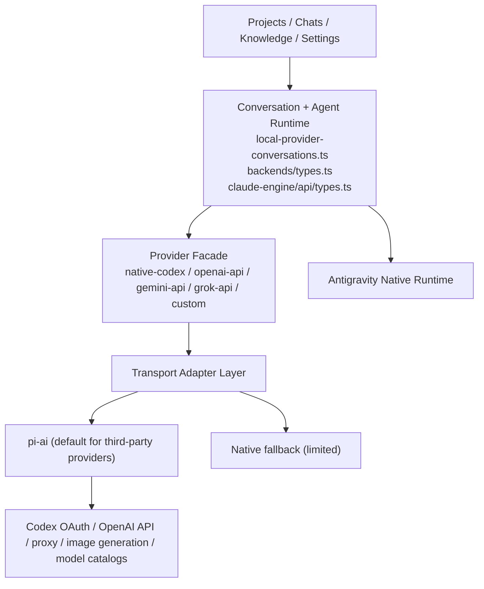

# pi-ai Transport 与可视化配置接入方案

日期：2026-04-28  
状态：Phase 1-4 已实施（图像上游实测受当前环境凭证约束；Claude Engine 主线已进一步收口为 `pi-ai only`）  
范围：`Antigravity Native runtime`、OpenAI-family transport、`Settings` 可视化配置、模型目录发现、`Knowledge` 的 provider 调用面

## 一句话结论

可以引入 `pi-ai`，而且值得引。

但它在这个仓库里应该被严格限制为：

1. provider transport SDK
2. subscription auth / API key / proxy 路由能力
3. streaming / tool-call / image generation transport 封装

同时，`Native` 的语义要收窄成：

1. `Antigravity IDE / runtime / workspace` 这类平台专有能力
2. provider-specific 非主线能力（例如当前仅剩的 `native-codex` 图像生成 helper）

而不是继续表示“我们自己手写一套 provider API transport”。

它**不应该**接管下面这些系统真相：

1. 本地 conversation / session ownership
2. `Project / Run / Stage` runtime
3. `AgentBackend / AgentSession / AgentEvent / StreamEvent` 主合同
4. `Knowledge` 的存储、索引、镜像和页面主数据结构

换句话说，这次方案不是“把系统迁到 pi 运行时”，而是：

1. 把除 `Antigravity` 之外的大多数自维护 transport 收口到 `pi-ai`
2. 把 `Native` 重新定义回 `Antigravity IDE/runtime`
3. 同时把 provider 可用模型目录也拉进配置系统，避免继续靠手填 model name

---

## 已落地范围（2026-04-28）

已完成并验证通过：

1. `native-codex` 底层 transport 已切到 `pi-ai`；后续主线 special path 与 native fetch fallback 已全部删除。
2. `AIProviderConfig` 已新增 `providerProfiles`，可表达 provider 级 `transport / authMode / imageGenerationModel / capability` 配置。
3. 新增 provider 模型目录服务：
   - `src/lib/provider-model-catalog.ts`
   - `GET/POST /api/provider-model-catalog`
   - 缓存路径：`~/.gemini/antigravity/provider-model-catalog.json`
4. `Settings -> Provider 配置 / Scene 覆盖` 已接入：
   - `Codex Transport`
   - `刷新模型`
   - provider-aware model picker
   - `pi-ai registry / remote-discovery / manual` 来源提示
5. `/api/models` 的 provider-aware fallback 已改为异步消费 provider model catalog。

本轮补齐：

1. `openai-api / gemini-api / grok-api / custom` 的 Claude Engine 运行时 transport 已统一走 `pi-ai`；后续已删除首个流事件前的 native provider fallback。
2. 新增 `src/lib/claude-engine/api/pi-transport.ts`，把 `pi-ai` 事件映射到现有 `StreamEvent`，不改变 `AgentSession / StreamEvent / Project / Run / Stage` 主合同。
3. 新增 `POST /api/provider-image-generation` 与 `src/lib/provider-image-generation.ts`，让 `Settings -> 图像生成` 能真实调起 provider image generation：
   - `native-codex` 通过 Codex Responses `image_generation` tool 走 SSE
   - `openai-api` 走标准 `/v1/images/generations`
   - `custom` 走 OpenAI-compatible `/v1/images/generations`
   - `custom -> openai-api` 失败回退保留
   - `native-codex` 小于上游最小像素预算的尺寸会在 provider 层归一到 `1024x1024`
4. 新增 `POST /api/knowledge/:id/summary`，Knowledge 条目现在可通过 `knowledge-summary` scene 复用统一 provider routing 与 `pi-ai` transport。
5. `Settings -> Provider 配置` 已扩展到所有第三方 provider 的 `Provider Transport`，不再只覆盖 `native-codex`；图像 Provider 也改成 capability 驱动，不再依赖静态白名单。
6. `knowledge-summary` / `knowledge-image` scene 已纳入组织级 provider 路由模型。
7. provider model catalog 缓存已加入 schema version，旧 catalog 不会再让图像模型列表卡在 `0 个模型`。

---

## 1. 为什么现在要做这件事

当前仓库的 provider transport 以自维护实现为主，尤其是 `native-codex` 这条链：

1. 自己读 OAuth token
2. 自己组 Responses payload
3. 自己 `fetch`
4. 自己解析 SSE
5. 自己抽取 tool-call / final text / finish reason

这条链主要集中在：

1. `src/lib/bridge/native-codex-adapter.ts`
2. `src/lib/claude-engine/api/native-codex/index.ts`

这类逻辑最容易长期积累的问题不是“功能完全不能跑”，而是：

1. 流式事件兼容性漂移
2. tool-call / tool-result 格式变化
3. subscription auth 刷新细节
4. cancel / abort 语义不一致
5. image generation / multimodal 支持落后
6. native route 与 OpenAI-compatible proxy 差异处理反复返工

因此，`pi-ai` 的价值不在于帮我们“拥有新的主线”，而在于帮我们：

1. **减少 transport 自维护 bug 面**
2. **统一第三方 provider 调用面**
3. **顺带拿到 provider 可用模型目录，支撑配置 UI**

---

## 2. 当前系统边界真相

在决定是否引 `pi-ai` 前，必须先把系统边界说清楚。

### 2.1 Session ownership 目前在我们自己手里

当前 conversation/session 的主线在：

1. `src/lib/local-provider-conversations.ts`
2. `src/app/api/conversations/[id]/send/route.ts`

这意味着当前系统自己控制：

1. conversation id
2. transcript 存储
3. append / preview / revert 行为
4. provider 路由分发

只要不改这两层，`pi-ai` 就不会天然接管 session 主线。

### 2.2 Agent runtime 合同也在我们自己手里

当前 runtime 主合同在：

1. `src/lib/backends/types.ts`
2. `src/lib/claude-engine/api/types.ts`

这里定义的是系统级合同，而不是某家 SDK 的合同：

1. `AgentBackend`
2. `AgentSession`
3. `AgentEvent`
4. `StreamEvent`
5. provider API adapter contract

这部分是整个平台的稳定接缝。引入 `pi-ai` 的正确做法，是把它映射到这份合同里，而不是让它取代这份合同。

### 2.3 `Settings` 已经存在可视化配置入口

当前 `Settings` 页已经有可视化 provider 配置承载面，主要在：

1. `src/components/settings-panel.tsx`
2. `src/lib/providers/ai-config.ts`
3. `src/lib/providers/provider-availability.ts`
4. `src/lib/providers/types.ts`

也就是说，这次不是从零发明配置 UI，而是在已有 provider matrix、third-party profile、scene 覆盖入口上扩展：

1. `pi-ai` transport 能力
2. provider 可用模型目录刷新与选择能力

### 2.4 `Knowledge` 当前不是 provider runtime 持有的子系统

`Knowledge` 主数据结构和 CRUD 主要在：

1. `src/lib/knowledge/store.ts`
2. `src/app/api/knowledge/route.ts`
3. `src/app/api/knowledge/[id]/route.ts`

这部分主要处理：

1. 知识条目存储
2. metadata / summary / reference 归档
3. mirror artifact
4. 列表 / 详情 API

因此，`pi-ai` 对 `Knowledge` 的直接影响很小；它只会影响“哪些生成型能力通过哪个 provider/transport 去调模型”。

---

## 3. 方案决策

## 3.1 决策

引入 `pi-ai`，但只放在 provider transport 层。

同时，把 `Native` 的定义显式收窄为：

1. `Antigravity` 的 IDE/runtime 集成
2. 必要时的本地 fallback

## 3.2 不采用的路线

本阶段**不**采用下面这条路线：

1. `pi-coding-agent` 接管会话生命周期
2. `pi-agent-core` 接管 tool loop
3. 用 pi 的 session/event model 替换现有 `AgentSession / StreamEvent`

原因很直接：

1. 这会把改造范围从 transport 升级成 runtime 迁移
2. 会直接碰到 `Project / Run / Stage`、会话历史、工具执行、artifact contract
3. 风险和回滚成本都明显偏大

## 3.3 采用的路线

本阶段采用：

1. `pi-ai` 作为 transport/provider SDK
2. 保留现有上层 runtime 合同
3. 先替换 `native-codex` 底层 transport
4. 再视情况扩到 OpenAI-family
5. `Native` 仅保留 `Antigravity` IDE/runtime 通道
6. 再补 image generation 和可用模型目录的配置与能力暴露

---

## 4. 目标架构



关键约束：

1. A、B 不因 `pi-ai` 改变 ownership
2. `Antigravity Native Runtime` 单独保留，不并入第三方 transport
3. C 只增加 transport implementation，不新增业务层分支
4. D 是这次的主要改造面

---

## 5. 配置模型设计

当前 `AIProviderConfig` 还只有：

1. `defaultProvider`
2. `defaultModel`
3. `layers`
4. `scenes`
5. `customProvider`

如果直接把 `pi-ai` 做成新的 `ProviderId`，会把“provider”和“transport”两个概念混在一起，后面会非常难收。

### 5.1 不建议的配置方式

不要新增：

1. `pi-ai`
2. `pi-openai`
3. `pi-codex`

这类 provider id。

原因：

1. 用户实际选择的是 `native-codex`、`openai-api`
2. `pi-ai` 是 transport，不是业务层 provider
3. 把 transport 抬成 provider 会污染 layer/scene 语义

### 5.2 建议的配置方式

在现有 provider 之下增加 transport/profile 配置。

建议新增一层类似结构：

```ts
interface ProviderTransportProfile {
  transport?: 'native' | 'pi-ai'
  authMode?: 'codex-oauth' | 'api-key' | 'proxy'
  baseUrl?: string
  apiKey?: string
  defaultModel?: string
  imageGenerationModel?: string
  videoGenerationModel?: string
  enableImageGeneration?: boolean
  enableWarmup?: boolean
  proxyLabel?: string
}
```

再在 `AIProviderConfig` 下挂：

```ts
providerProfiles?: Partial<Record<ProviderId, ProviderTransportProfile>>
```

这样有几个好处：

1. `defaultProvider / layers / scenes` 仍然只表达业务路由
2. `providerProfiles` 负责 transport 细节
3. `Settings` 页可以自然展示为“Provider + Transport + Auth + Capability”
4. `Knowledge` 也可以复用同一套 scene/provider 配置，不需要新造配置子系统

### 5.4 模型目录不应写进用户配置真相

“支持哪些模型”是一个**能力快照**，不是用户意图配置。

因此不建议把 provider 的完整模型列表直接写入 `AIProviderConfig`。

更合理的是新增独立的目录缓存，例如：

```ts
interface ProviderModelCatalogEntry {
  provider: ProviderId
  transport: 'native' | 'pi-ai'
  fetchedAt: string
  source: 'pi-registry' | 'remote-discovery' | 'manual'
  models: Array<{
    id: string
    label: string
    supportsTools?: boolean
    supportsVision?: boolean
    supportsReasoning?: boolean
    supportsImageGeneration?: boolean
    contextWindow?: number
  }>
}
```

它应该存放在独立缓存里，而不是 `ai-config.json` 这种用户主配置里。

原因：

1. 模型目录会频繁变化
2. 它属于 provider capability snapshot，不属于配置真相
3. 放进主配置会导致配置 diff 噪音和合并困难

建议新增一份单独缓存，例如：

1. `~/.gemini/antigravity/provider-model-catalog.json`

---

## 5.5 模型目录获取策略

这部分要作为正式能力写进实施范围，不能继续依赖用户手填 model name。

目标：

1. 在 `Settings` 中看到“当前 provider/transport 可配置哪些模型”
2. 在 `Scene 覆盖`、默认 provider、third-party profile 里都能复用同一份模型列表

建议按三层来源获取：

### 第一层：`pi-ai` 内建 registry

对内建 provider，优先使用 `pi-ai` 的 provider/model registry。

根据 `pi-ai` 文档：

1. 可通过 `getProviders()` 查询 provider
2. 可通过 `getModels(provider)` 查询该 provider 的模型列表
3. `pi` 对 built-in provider 维护一份随 release 更新的模型目录

这意味着对：

1. `openai`
2. `openai-codex`
3. `anthropic`
4. `google`
5. `groq`
6. 以及其他内建 provider

我们都可以优先拿到一份结构化模型列表，而不是只给用户一个字符串输入框。

### 第二层：远端 discovery

对 `custom / openai-compatible` 这类第三方 endpoint，优先尝试远端模型发现，例如：

1. OpenAI-compatible 的 `/v1/models`
2. 其他 provider 的标准模型目录接口

### 第三层：手动补录

如果 provider 不支持远端发现，或者代理侧没有暴露模型列表，则允许：

1. 手动输入 model id
2. 把该 model 记录为 `manual`
3. 作为目录缓存的一部分展示给用户

这样可以兼顾：

1. 内建 provider 的结构化目录
2. 第三方 endpoint 的自动发现
3. 私有代理/不标准网关的手动补录

### 5.3 Scene 覆盖仍然保留

`Knowledge`、`Projects`、`CEO Office` 这类业务面仍然用现有 scene/layer 规则选 provider。

需要补的只是：

1. scene 解析后，除了拿到 `provider` 和 `model`
2. 还要能拿到该 provider 的 `transport profile`

这样：

1. `Knowledge` 场景可以继续走 `openai-api`
2. 但它的实际 transport 可以是 `pi-ai`
3. 页面和任务不需要知道底层是 native fetch 还是 pi SDK

---

## 6. `Settings` 可视化配置方案

用户已经明确要求：引入 `pi-ai` 后，可视化配置也必须支持。

这部分不能只停留在 JSON 配置。

## 6.1 Provider 配置页需要新增的能力

位置：

1. `src/components/settings-panel.tsx`

建议在现有 Provider matrix 和 third-party profile 基础上补五类能力：

1. **Transport 选择**
   - `Native`
   - `pi-ai`
2. **Auth 模式**
   - `Codex OAuth`
   - `API Key`
   - `Proxy / custom base URL`
3. **Capability 开关**
   - `Image generation`
   - `Video generation`（如后续需要）
   - `Warm-up / priority route`（如果 transport 支持）
4. **连接测试**
   - 文本模型连通性
   - image generation 连通性
   - subscription auth 状态检查
5. **模型目录刷新与选择**
   - 拉取当前 provider 支持的模型列表
   - 搜索/过滤模型
   - 选择默认模型
   - 对无法自动发现的 provider 手动补录模型

### 6.2 UI 结构建议

不建议再加一个全新的一级 tab。

更合理的是扩在现有：

1. `Provider 配置`
2. `Scene 覆盖`

具体落点：

#### Provider 配置

每个 provider card 增加：

1. 当前 transport badge
2. 当前 auth 模式
3. capability 状态
4. 模型目录状态
5. `高级配置` 抽屉或折叠区域

#### Scene 覆盖

场景配置界面继续展示：

1. provider
2. model

但在“高级”里显示：

1. 该 provider 当前绑定的 transport
2. 是否启用 image generation
3. 是否有 auth/profile 可用
4. 模型是否来自目录选择还是手动输入

### 6.3 模型选择器设计

`Settings` 里不应该只给一个裸文本框。

建议为默认 model 和 scene model 增加：

1. `刷新模型` 按钮
2. 可搜索 model picker
3. capability tags
   - `Tools`
   - `Vision`
   - `Reasoning`
   - `Image`
4. `手动输入` 回退入口
5. “上次刷新时间 / 来源” 显示

对于 `custom` provider：

1. 优先展示远端 discovery 结果
2. 如果 discovery 失败，允许继续手填
3. 手填后进入本地目录缓存，避免每次重输

### 6.4 不建议的 UI 方式

不要让用户在场景层直接编辑所有 transport 细节。

原因：

1. scene 负责业务路由，不负责维护每个 provider 的连接资料
2. 如果 scene 也能改 baseUrl/apiKey，会导致配置真相分裂
3. `Knowledge`、`Projects`、`CEO Office` 会更难排查实际走哪条路

正确分工应该是：

1. Provider 页：维护 transport/auth/capability
2. Scene 页：选择业务场景走哪个 provider/model
3. 模型目录由 provider profile 拉取与缓存，scene 只消费结果

---

## 7. 对 `Knowledge` 的影响边界

## 7.1 不受影响的部分

下面这些不应该因为引 `pi-ai` 而改变：

1. `Knowledge` 条目 CRUD
2. store/index 结构
3. metadata 落盘
4. artifact mirror
5. `Knowledge` 页的主数据读取方式

## 7.2 会受影响的部分

只有这些“通过模型生成”的动作，会间接受到影响：

1. 摘要生成
2. 评审/分类
3. 提案生成
4. 图片生成型知识资产

这里的正确接法是：

1. `Knowledge` 继续通过 scene/layer 选 provider
2. provider 再走绑定的 `transport profile`

因此，`Knowledge` 的支持不是单独造一套配置，而是：

1. provider transport 引入成功
2. provider 模型目录可被查询
3. `Knowledge` 继续复用统一 provider 配置体系

---

## 8. 对 Session / Runtime 的影响评估

## 8.1 低风险前提

如果 `pi-ai` 只落在 transport 层，则：

1. conversation id 不变
2. transcript 存储不变
3. `AgentSession` 不变
4. `AgentEvent` 不变
5. `StreamEvent` 不变
6. `Project / Run / Stage` 状态推进不变

也就是说：

> 影响主要是 transport 语义映射，不是 runtime ownership 迁移。

## 8.2 真正需要验证的点

即使只接 transport，也必须重点验证：

1. text delta 映射
2. tool-call / tool-result 事件映射
3. finish reason
4. token usage
5. cancel / abort
6. timeout 行为
7. proxy/baseUrl 支持
8. subscription auth 刷新与复用
9. provider 模型目录是否可稳定读取并缓存

---

## 9. 实施计划

## Phase 0：能力审计与 PoC 接缝确认（✅ 已完成）

目标：

1. 确认 `pi-ai` 是否支持我们需要的最低 transport 能力
2. 不改 runtime，只做接缝验证

检查项：

1. 自定义 `baseUrl` / proxy
2. external auth 注入
3. Codex subscription auth 复用策略
4. 流式 text/tool 事件可读性
5. image generation 能力
6. abort/cancel
7. `getProviders()` / `getModels(provider)` 等模型目录能力

已验证结果：

1. `pi-ai` 能作为 `native-codex` 的 transport SDK 使用，不需要接管 session/runtime。
2. `getModels(provider)` 可直接支撑 provider model catalog；`custom` 可回退 `/v1/models` 或手动模型。
3. `native-codex` 所需的 OAuth token 仍由现有 `~/.codex/auth.json` 主线提供。

## Phase 1：`native-codex` transport 平替（✅ 已完成）

目标：

1. 只替换 `native-codex` 的底层 transport
2. 上层调用面保持不变

已落地：

1. `src/lib/bridge/native-codex-adapter.ts` 现在优先走 `pi-ai` transport。
2. transport 选择由 `resolveProviderProfile('native-codex')` 与 `NATIVE_CODEX_TRANSPORT` 控制。
3. `pi-ai` 失败时自动回退原生 fetch / SSE 解析，不阻断现有会话主线。

明确不动：

1. `src/lib/local-provider-conversations.ts`
2. `src/app/api/conversations/[id]/send/route.ts`
3. `src/lib/backends/types.ts`
4. `src/lib/claude-engine/api/types.ts`

## Phase 2：配置模型与 `Settings` 可视化支持（✅ 已完成）

目标：

1. `Settings` 能可视化配置 `pi-ai` transport
2. provider 与 transport 的职责明确分离

已落地：

1. `src/lib/providers/types.ts`
2. `src/lib/providers/ai-config.ts`
3. `src/lib/provider-model-catalog.ts`
4. `src/app/api/provider-model-catalog/route.ts`
5. `src/components/settings-panel.tsx`

交付要求：

1. 已能切换 `native` / `pi-ai`
2. 已能通过 `providerProfiles` 保存 auth/transport/capability
3. 已能刷新 provider 模型列表并选择默认模型
4. 文本连接测试仍由现有 `api-keys/test` 承担；图像连接测试待后续 image generation 接入

## Phase 3：OpenAI-family 扩展（✅ 已完成）

目标：

1. 在 `native-codex` 稳定后，把 Claude Engine API-backed provider 的 transport 统一到 `pi-ai`
2. 保留 native provider transport 作为首事件前的安全回退

已落地：

1. `src/lib/claude-engine/api/types.ts` 为 `ModelConfig` 增加 `providerId / transport`。
2. `src/lib/backends/claude-engine-backend.ts` 现在会把 `providerProfiles[provider].transport`、`providerId` 和 `custom` 的 `baseUrl` 透传到 Claude Engine。
3. `src/lib/claude-engine/api/pi-transport.ts` 负责：
   - `claude-api -> anthropic`
   - `openai-api -> openai`
   - `gemini-api -> google`
   - `grok-api -> xai`
   - `native-codex -> openai-codex`
   - `custom -> openai-completions compatible`
4. `src/lib/claude-engine/api/retry.ts` 在 `transport = pi-ai` 时优先走 `streamQueryViaPi()`；若在第一个流事件前失败，自动回退既有 native provider transport。
5. `src/lib/providers/ai-config.ts` 默认第三方 provider transport 已统一为 `pi-ai`：
   - `claude-api`
   - `openai-api`
   - `gemini-api`
   - `grok-api`
   - `custom`

验收结果：

1. `claude-engine-runtime-config.test.ts` 已验证 transport/provider 透传。
2. `pi-transport-routing.test.ts` 已验证：
   - `pi-ai` routing
   - 首事件前失败回退
   - `custom` provider 走 OpenAI-compatible 路径

## Phase 4：Knowledge / image generation / scene 路由验证（✅ 已完成）

目标：

1. 验证 `Knowledge` 场景可稳定复用 provider transport
2. 验证 image generation 的可配置、可调用、可回退

交付要求：

1. `Knowledge` 的 provider-backed 生成动作可跑通
2. 图像生成可通过 `Settings` 配置并测试
3. scene 覆盖与 provider profile 不冲突
4. `Knowledge` 相关 scene 能消费同一份 provider 模型目录

已落地：

1. 新增 `POST /api/knowledge/:id/summary`：
   - 读取 Knowledge 资产
   - 通过 `resolveProvider('knowledge-summary', workspacePath)` 解析 provider/model
   - 调用 `callLLMOneshot()` 走统一 provider transport
   - 将生成摘要回写到 Knowledge metadata
2. `src/lib/providers/ai-config.ts` 与 `src/lib/providers/types.ts` 已增加：
   - `knowledge-summary`
   - `knowledge-image`
3. `src/components/knowledge-panel.tsx` 与 `src/components/knowledge-browser-workspace.tsx` 已增加 `AI 摘要` 入口，用户可在 Knowledge 详情页直接触发 provider-backed summary generation。
4. 新增 `POST /api/provider-image-generation` 与 `src/lib/provider-image-generation.ts`：
   - 当前支持 `openai-api`
   - 当前支持 `custom`
   - `custom` 调用失败时，可回退到 `openai-api`
5. `src/components/settings-panel.tsx` 已增加 `图像生成` 配置卡：
   - 图像 provider
   - 启用/禁用
   - 图像 model
   - 测试提示词
   - 测试图像生成结果 / 错误展示
6. Settings 现已对所有第三方 provider 暴露 `Provider Transport`，scene/layer 模型选择器继续复用同一份 provider model catalog，没有额外第二套配置源。

验收结果：

1. `src/app/api/knowledge/[id]/summary/route.test.ts` 已验证摘要生成结果会回写 Knowledge 元数据。
2. `src/lib/provider-image-generation.test.ts` 已验证：
   - `openai-api` 图像生成
   - `custom -> openai-api` 回退
3. 页面验收：
   - `Settings` 页面确认存在 `Provider Transport`、`图像生成`、`测试图像生成`
   - `Knowledge` 页面确认 `AI 摘要` 可触发并返回成功提示
4. 当前环境未配置可用的 OpenAI 图像凭证，因此 `测试图像生成` 的真实上游调用返回预期的配置错误；这不影响路由、UI、回退逻辑和单元测试验收。

---

## 10. 风险与回滚

### 10.1 主要风险

1. `pi-ai` 事件模型和当前 `StreamEvent` 不完全对齐
2. tool 调用格式不一致
3. subscription auth 生命周期与当前自写逻辑不兼容
4. proxy/baseUrl 支持不满足我们自己的反代策略
5. image generation 虽可用，但与现有工具链参数不对齐
6. 模型目录与真实可调用模型不完全一致，导致配置页误导

### 10.2 风险控制

1. 先只做 `native-codex`
2. 用 feature flag 控制 transport 切换
3. 保留 native transport 回退路径
4. 模型目录缓存区分 `registry / remote / manual` 来源
5. 每阶段都有独立回滚点，不做 big bang 替换

---

## 11. 验收标准

最终进入实施后，至少要满足下面这些标准才算完成：

1. `native-codex` 可通过 `pi-ai` 正常流式输出
2. tool-call / cancel / timeout 行为不弱于当前实现
3. conversation / session / transcript 语义不变
4. `Settings` 能可视化配置 provider transport
5. `Settings` 能读取并展示 provider 支持的模型列表
6. `Knowledge` 的 provider-backed 生成能力不需要额外新配置体系
7. image generation 能在配置页启用、测试并落到真实调用链
8. 出问题时能一键切回 native transport

当前验收状态：以上 8 条均已满足；第 7 条中的“真实调用链”已完成代码、单测和 UI 错误路径验证，但受当前环境缺少图像 provider 凭证限制，未拿到真实远端图片样本。

---

## 12. 本方案明确不做的事

本文件只定义架构边界和实施计划，不代表本轮已经实施。

当前**明确不做**：

1. 不把 `pi-coding-agent` 作为新的系统主 runtime
2. 不改 `Project / Run / Stage` 状态真相
3. 不重写 `Knowledge` store
4. 不新增独立的 `pi-ai` 一级页面
5. 不把 `Settings` 配置拆成多套互相冲突的来源
6. 不把完整模型目录写进用户主配置文件

---

## 13. 外部参考

以下资料只作为能力与路线参考，不代表我们要照抄对方架构：

1. OpenClaw OpenAI provider 文档  
   - [https://docs.openclaw.ai/providers/openai](https://docs.openclaw.ai/providers/openai)  
   - 该页明确描述了：
     - `pi-ai` 参与 OpenAI/Codex streaming
     - 支持 ChatGPT/Codex subscription auth
     - 支持 image generation

2. OpenClaw Pi integration architecture  
   - [https://docs.openclaw.ai/pi](https://docs.openclaw.ai/pi)  
   - 该页展示了另一种“把 pi session 嵌入 runtime”的路线  
   - 它的参考价值在于说明 `pi` 可以做得更深，但本仓库当前方案**不采用**那条 runtime ownership 路线

3. `@mariozechner/pi-ai` README  
   - [https://github.com/badlogic/pi-mono/blob/main/packages/ai/README.md](https://github.com/badlogic/pi-mono/blob/main/packages/ai/README.md)  
   - 该文档明确描述了：
     - 可通过 `getProviders()` / `getModels(provider)` 查询 provider 与模型
     - 支持 OpenAI Codex OAuth
     - 支持 image input / capability 检查

4. Pi coding agent provider 文档  
   - [https://github.com/badlogic/pi-mono/blob/main/packages/coding-agent/docs/providers.md](https://github.com/badlogic/pi-mono/blob/main/packages/coding-agent/docs/providers.md)  
   - 该文档明确描述了：
     - `pi` 对 built-in provider 维护模型列表
     - 支持 subscription provider 与 API key provider
     - 支持通过 `models.json` 扩展 custom provider

---

## 14. 最终建议

建议按下面的顺序推进：

1. 先做 `native-codex` transport + 模型目录 PoC
2. PoC 通过后补 `Settings` 可视化 transport 配置和 model picker
3. 再扩到 OpenAI-family
4. 最后验证 `Knowledge`、image generation 和模型目录的统一接入

这样做的好处是：

1. 能明显降低底层 API/stream/auth 自维护 bug 面
2. `Native` 可以回归成 `Antigravity IDE/runtime` 的准确语义
3. 不会把整个平台拖进一次 runtime 重构
4. `Settings` 和 `Knowledge` 都能复用统一 provider 配置体系
5. 模型配置不再依赖手填字符串
