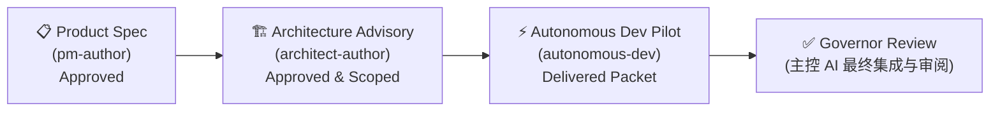

# Agent System 使用指南

> Multi-Agent 自治交付系统完整文档（V5.4）

---

## 目录

1. [系统简介](#1-系统简介)
2. [核心概念](#2-核心概念)
3. [Agent Groups 详解](#3-agent-groups-详解)
4. [Workflows 输入/输出约定](#4-workflows-输入输出约定)
5. [推荐交付生命周期](#5-推荐交付生命周期)
6. [Web UI 操作指南](#6-web-ui-操作指南)
7. [API 完整参考](#7-api-完整参考)
8. [Run 状态与生命周期](#8-run-状态与生命周期)
9. [产物体系](#9-产物体系)
10. [平台协议：Envelope 与 Manifest](#10-平台协议envelope-与-manifest)
11. [模型选择策略](#11-模型选择策略)
12. [常见问题与故障排查](#12-常见问题与故障排查)
13. [Fan-out / Join 并行编排](#13-fan-out--join-并行编排)
14. [GraphPipeline 显式图格式](#14-graphpipeline-显式图格式)
15. [数据契约系统（V4.4）](#15-数据契约系统v44)
16. [高级控制流（V5.2）](#16-高级控制流v52)
17. [AI 辅助流程生成（V5.3）](#17-ai-辅助流程生成v53)
18. [可复用子图与资源配额（V5.4）](#18-可复用子图与资源配额v54)
19. [共享对话模式（V5.5）](#19-共享对话模式v55)
20. [多 Provider 支持（V6）](#20-多-provider-支持v6)
21. [OPC 组织治理（V6）](#21-opc-组织治理v6)
22. [Security Framework（V6）](#22-security-frameworkv6)
23. [定时任务调度（V6）](#23-定时任务调度v6)

---

## 1. 系统简介

### 这是什么

本系统是一个内置于 Antigravity Gateway 的 **Workspace-Centric Multi-Agent Delivery System**。它不是简单的"聊天 + 代码"，而是一套完整的项目治理框架：

- **主控 AI（Governor）** 担任项目治理者，负责需求审批、任务分发、质量门禁
- **顾问团（Advisory Groups）** 产出获批的产品需求和技术方案
- **自治开发团队（Delivery Groups）** 接收结构化 Work Package，自主研究、实现、测试、交付
- **所有协作通过结构化产物包进行**，而非依赖对话上下文传递

### 设计理念

> 主控 AI 应该是项目治理者，而不是亲自承担所有执行细节的超级个体。多 Agent 的价值来自自治与并行，而非把同一份微操工作拆给更多 worker。

### 基本运行原理

```
用户提需求 → 主会话 dispatch → Group Runtime 创建 Hidden Child Conversation
           → Child 执行 Workflow → 产出结构化结果 → 主会话只看最终报告
```

所有 Agent Worker 都在**独立的隐藏对话**中运行，与主会话上下文完全隔离。

---

## 2. 核心概念

### Group（组）

一组角色组成的任务单元。每个 Group 定义了：
- 包含哪些角色（roles）
- 执行模式（单次执行 / 多轮审查 / 交付通过）
- 需要哪些上游输入（source contract）
- 超时与重试策略

### Template（模板 - V3.5 核心）

**Template = 零件目录 + 装配说明。** 一个模板是一个完整的解决方案包，自包含地定义了：

- **Groups**：该模板包含哪些团队及其角色
- **Pipeline**：执行顺序与自动链式触发规则
- **Review 配置**：审查策略

当前可用的 4 个模板：

| 模板 ID | 标题 | Groups | 文件 |
|:--------|:-----|:-------|:-----|
| `development-template-1` | 完整产研链 | product-spec → architecture → dev | `~/.gemini/antigravity/gateway/assets/templates/development-template-1.json` |
| `design-review-template` | 产品体验评审 | ux-review | `~/.gemini/antigravity/gateway/assets/templates/design-review-template.json` |
| `ux-driven-dev-template` | 交互驱动产研 | ux-review → product-spec → arch → dev | `~/.gemini/antigravity/gateway/assets/templates/ux-driven-dev-template.json` |
| `coding-basic-template` | 简单编码 | coding-basic | `~/.gemini/antigravity/gateway/assets/templates/coding-basic-template.json` |

Workflow（角色指令文件）是**全局可复用资产**，存储在 `~/.gemini/antigravity/gateway/assets/workflows/*.md`，可被多个模板或 Group 跨项目引用。模板本身互不继承；需要新的编排方式时，应新建模板而不是隐式修改已有模板语义。

### Role（角色）

Group 内部的一个具体执行单元。每个 role 绑定一个 workflow 文件，如 `pm-author` 绑定 `/pm-author` workflow。

### Run（运行实例）

一次具体的任务执行。Run 状态与完整生命周期见 [§8.1 状态流转](#81-状态流转)。

### Workflow（工作流）

定义在全局目录 `~/.gemini/antigravity/gateway/assets/workflows/` 下的 Markdown 文件，是 Agent Worker 的"执行脑"——告诉 AI 该做什么、按什么顺序做、最终输出什么。Workflow 是全局配置，跨项目共享，确保所有 workspace 使用一致的角色指令。

### Source Contract（来源合同）

声明一个 Group 需要消费哪个上游 Group 的产物。比如 `architecture-advisory` 要求上游必须是一个 `approved` 的 `product-spec` run。

### Envelope Protocol（信封协议）

平台级的输入/输出外壳。`TaskEnvelope` 是输入外壳（目标、约束、产物引用），`ResultEnvelope` 是输出外壳（状态、决策、风险、产出清单）。

### Project

一次完整的交付链路的容器。可以跨越多个 Run。所有相关的 run 会归属于同一个 project 目录下（而不是散落在孤立的 run 目录中）：

```
demolong/projects/{projectId}/
├── project.json       ← 项目元数据（目标、状态等）
├── runs/              ← 该项目的所有 run（例如 demolong/projects/{projectId}/runs/{runId}/）
└── integration/       ← 集成产物
```

### result.json（结构化输出协议 - V3 核心）

平台级强制协议。所有 Agent Worker（不管属于哪个角色）完成任务时，必须在其分配到的 artifact 目录根下写入 `result.json`。这个文件是与主控 AI 和后续环节通信的强制握手协议：

```json
{
  "status": "completed", 
  "summary": "详细的任务执行总结摘要",
  "changedFiles": ["src/app.tsx", "demolong/projects/xxx/runs/yyy/specs/draft-spec.md"],
  "outputArtifacts": ["specs/draft-spec.md"],
  "risks": ["由于依赖项 M 没有升级，可能存在兼容性风险"],
  "nextAction": "Ready for Review"
}
```

> **重点要求**：如果 `status` 为 `blocked`，还应当在该对象中补充 `blockedReason` 字段。Runtime 优先读取 `result.json` 以提取 Worker 的工作成果，如果不合规或缺失，Run 会被标记为 failed。对于 review-loop reviewer，还必须额外写 `review/result-round-{N}.json`，其中包含结构化 `decision` 字段。

---

## 3. Agent Groups 详解

### 3.1 Coding Worker (`coding-basic`)

**用途**：最简单的单任务开发模式——修 bug、做功能、重构。

| 属性 | 值 |
|------|-----|
| 执行模式 | `legacy-single` |
| 角色 | `dev-worker` |
| Workflow | `/dev-worker` |
| 超时 | 20 分钟 |
| 需要上游 | ❌ |
| 输出 Envelope | ❌ |

**适用场景**：
- 快速修复单个 bug
- 执行明确的代码重构
- 简单的功能添加

---

### 3.2 Product Specification (`product-spec`)

**用途**：产品需求定义。PM Author 起草产品需求文档，Lead Reviewer 多轮审查，最终输出获批的 Product Packet。

| 属性 | 值 |
|------|-----|
| 执行模式 | `review-loop` |
| 角色 | `pm-author` + `product-lead-reviewer` |
| 最大审查轮数 | 3 轮 |
| 超时 | Author 10 分钟, Reviewer 8 分钟 |
| 需要上游 | ❌ |
| 输出 Envelope | ✅ |

**工作流程**：
```
pm-author 起草 specs/
    ↓
product-lead-reviewer 审查
    ↓
approved → 完成 ✅
revise   → pm-author 修改 → reviewer 再次审查 (最多 3 轮)
rejected → Run 以 rejected 结束
```

**产出目录**：`specs/`

---

### 3.3 Architecture Advisory (`architecture-advisory`)

**用途**：技术方案设计。Architect Author 基于产品需求起草技术方案，Reviewer 多轮审查。

| 属性 | 值 |
|------|-----|
| 执行模式 | `review-loop` |
| 角色 | `architect-author` + `architecture-reviewer` |
| 最大审查轮数 | 3 轮 |
| 超时 | Author 12 分钟, Reviewer 10 分钟 |
| 需要上游 | ✅ 必须有一个 `approved` 的 `product-spec` run |
| 输出 Envelope | ✅ |

**产出目录**：`architecture/`（含 `write-scope-plan.json`，这是 V3 防护体系的关键）

---

### 3.4 Autonomous Dev Pilot (`autonomous-dev-pilot`)

**用途**：自治开发交付。接收一个 Work Package，自主研究代码、实现功能、运行测试、输出 Delivery Packet。

| 属性 | 值 |
|------|-----|
| 执行模式 | `delivery-single-pass` |
| 角色 | `autonomous-dev` |
| 超时 | 30 分钟 |
| 需要上游 | ✅ 必须有一个 `approved` 的 `architecture-advisory` run |
| 输出 Envelope | ✅ |
| 自动追溯 | ✅ 自动把 architecture 的上游 product-spec 需求文档也纳入输入 |

**Workflow 执行步骤**：
1. 读取 `work-package/work-package.json`
2. 读取 `input/` 下的上游产物（产品需求 + 技术方案）
3. 自行研究代码库
4. 遵守 `write-scope-plan.json` 中配置的防越权边界，实现代码变更
5. 运行 `npx tsc --noEmit` 和其他测试验证
6. 产出 `delivery/delivery-packet.json`（**强约束**）
7. 产出 `delivery/implementation-summary.md` 和 `delivery/test-results.md`

**强约束规则**：
- 如果 workflow 未在 `delivery/` 中产出 `delivery-packet.json` → Run 标记为 `failed`
- 如果 JSON 无法解析，或者 `taskId` 错误 → Run 标记为 `failed`
- **所有产出必须结合目录根下的 `result.json`** 交差。

---

### 3.5 UX Review (`ux-review`)

**用途**：产品体验评审。UX Review Author 从 5 个维度审计交互设计，Critic 进行对抗性挑战。3 轮收敛后产出改进方案。

| 属性 | 值 |
|------|-----|
| 执行模式 | `review-loop` |
| 角色 | `ux-review-author` + `ux-review-critic` |
| 最大审查轮数 | 3 轮 |
| 超时 | Author 12 分钟, Critic 10 分钟 |
| 需要上游 | ❌ |
| 输出 Envelope | ✅ |

**产出**：`audit-report.md`、`interaction-proposals.md`、`priority-matrix.md`

> 这是平台验证的第一个**非软件开发类模板**，证明了 review-loop 引擎可以承载开发以外的场景。

---

### 3.6 Supervisor 看护机制（V3.5 新增）

所有角色执行都受 Supervisor Runtime 看护：

| 机制 | 说明 | 配置字段 |
|:-----|:-----|:--------|
| **Stale 检测** | Agent 长时间无新步骤 → 强制判定失败 | `staleThresholdMs`（默认 3 分钟） |
| **失败重试** | 角色执行失败后创建新子对话重试 | `maxRetries`（默认 0 = 不重试） |

配置示例（在 Template JSON 的 roles 中）：
```json
{ "id": "autonomous-dev", "workflow": "/autonomous-dev", "timeoutMs": 1800000, "autoApprove": true, "maxRetries": 1, "staleThresholdMs": 120000 }
```

---

## 4. Workflows 输入/输出约定

各个 Workflow (工作流) 是实际驱动执行的提示词集，下面列出所有角色 Workflow 约定的详细输入输出结构。
所有 Workflow 都必须通过写出相应的业务文件，并在结束时汇报到根目录的 `result.json`。如果角色是 review-loop reviewer，还必须额外写 `review/result-round-{N}.json` 作为结构化 decision 文件。

| 工作流 Workflow | 所属 Group | 依赖的输入信息 | 核心产出约束 |
|-----------------|------------|---------------|-------------|
| **`/dev-worker`** | `coding-basic` | 用户传给主会话的 Prompt 目标 | 1. 源码修改 <br>2. 根目录的 `result.json` |
| **`/pm-author`** | `product-spec` | 用户 Prompt, 或者是修订轮次的 `review/review-round-{N-1}.md` | 1. `specs/requirement-brief.md`<br>2. `specs/implementation-reality.md`<br>3. `specs/draft-spec.md` |
| **`/product-lead-reviewer`** | `product-spec` | 同一 Run 下的 `specs/` 草案文档 | 1. `review/review-round-{N}.md`<br>2. `review/result-round-{N}.json` |
| **`/architect-author`** | `architecture-advisory` | `input/`（来自 product-spec 复制的关联需求），以及前轮反馈 | 1. `architecture/architecture-overview.md`<br>2. `architecture/module-impact-map.md`<br>3. `architecture/interface-change-plan.md`<br>4. `architecture/write-scope-plan.json`<br>5. `architecture/test-strategy.md` |
| **`/architecture-reviewer`** | `architecture-advisory` | 同一 Run 下的 `architecture/` 设计草案 | 1. `review/architecture-review-round-{N}.md`<br>2. `review/result-round-{N}.json` |
| **`/autonomous-dev`** | `autonomous-dev-pilot` | 1. `work-package/work-package.json`<br>2. `input/` 复制来的所有架构设计和产品需求 | 1. 源码修改<br>2. **强约束**: `delivery/delivery-packet.json`<br>3. `delivery/implementation-summary.md`<br>4. `delivery/test-results.md` |
| **`/ux-review-author`** | `ux-review` | 用户 Prompt（页面/功能描述），或来自 UI 截图的上下文 | 1. `specs/audit-report.md`<br>2. `specs/interaction-proposals.md`<br>3. `specs/priority-matrix.md` |
| **`/ux-review-critic`** | `ux-review` | 同一 Run 下 UX Review Author 的 `specs/` 审计产出 | 1. `review/review-round-{N}.md`<br>2. `review/result-round-{N}.json` |

---

## 5. 推荐交付生命周期

完整的端到端开发交付流程遵循经典的三阶段递进模型，即**产品 → 架构 → 开发**（product-spec → architecture → dev pilot）：



### 步骤说明

| 步骤 | Group | 你/主控AI 需要做什么 | Runtime 平台自动做什么 |
|------|-------|--------------------|-----------------------|
| **① 定产品** | `product-spec` | 发起 Project 并输入需求目标 | PM Author 起草 → Reviewer 审查 → 循环至获批 → 产出 Product Packet |
| **② 定架构** | `architecture-advisory` | 选择 ① 关联的获批源 Run | 拉取产品产物 → Architect 起草包含 scope 约束的方案 → 审查并获得 Architecture Packet |
| **③ 派发开发** | `autonomous-dev-pilot` | 选择 ② 关联的技术方案 | 自动级联并带入 ①/② 信息，打包成 Work Package 发送 → 自治执行 → 进行范围收缩检测 (Scope Audit) → 提交交付报告 |
| **④ 最终集成** | 主会话 (Governor) | 接收、审阅所有 Deliveries | 汇总 tasks、展示 scope warnings 与 risks、整合进主分支。 |

> **V3.5 Pipeline 自动链式触发**：如果使用 Template dispatch（传入 `pipelineId`），阶段 ②③ 会在前序阶段 approved/completed 后**自动触发**，无需手动逐个 dispatch。

> **提示**：完整的 `Project` 将贯穿整个生命周期。对于小型任务，允许跳离复杂链路，直接调用 `coding-basic` 或通过 UI 手动发起简单 Run。

---

## 6. Web UI 操作指南

### 6.1 主界面入口（OPC Dashboard）

打开应用后默认进入 **OPC（组织治理）** 视图，这是完整的操作中心：

- **顶部 Header 中央** — `GlobalCommandBar`：输入自然语言指令直接 CEO 派发，支持模型选择
- **左侧导航** — 4 个标签：**OPC**（项目管理）/ **对话**（Chat）/ **知识**（Knowledge）/ **Ops**（运操）
- **Header 右侧** — 三个通知指示器：🔔 审批 / ⚡ 事件 / ▶ 运行中的任务（点击展开侧滑抽屉）

### 6.2 方式一：CEO 命令（推荐 — 全自动）

在 Header 中央命令框输入自然语言指令，CEO Agent 自动完成部门匹配 + 创建项目 + 派发 Run：

```
让后端研发部实现用户登录接口
给产品部分析竞品功能
把这个 bug 修一下：登录页面按钮不响应
```

如果 CEO 找不到匹配的部门或模板，会返回 `needs_decision` 建议，前端弹出决策面板供选择。

### 6.3 方式二：快速任务（OPC 项目页顶部输入框）

切到 OPC 标签 → 项目列表顶部有**快速任务**输入框：
1. 输入任务描述
2. 选择目标部门（workspace）
3. 选择模型（可选，默认自动）
4. 点击派发

底层同样调用 CEO 命令 API，会自动创建项目并启动 Run。

### 6.4 方式三：创建项目（手动）

点击 OPC 页右上角 **`+ 创建项目`** 按钮 → 填写名称/目标/工作区 → 创建**空容器**（不启动执行）。

创建后在项目详情中点击 **「派发流水线」** 按钮，选择 Template（如 `development-template-1`），才会启动完整的 `product-spec → architecture → dev` 三段流水线。

### 6.5 查看运行进展

- **Header ▶ 抽屉**：展示所有活跃 Run，点击可查看详情
- **项目详情 Workbench**：点击左侧 Sidebar 项目 → 右侧显示 Pipeline DAG 进度 + 各 Stage 状态
- **Open Conversation**：每个 Run 详情页有「打开对话」按钮，查看 Agent 隐藏子对话的实时步骤
- **CEO Dashboard**：部门 + 项目总览 + 近期交付 + Token 配额

---

## 7. API 完整参考

*(节选核心部分，使用方式与此前一致)*

```http
POST /api/agent-runs
Content-Type: application/json

{
  "projectId": "xxx",
  "groupId": "architecture-advisory",
  "workspace": "file:///Users/you/project",
  "prompt": "设计任务系统技术方案",
  "sourceRunIds": ["<approved-product-spec-runId>"],
  "pipelineId": "development-template-1",
  "pipelineStageIndex": 1,
  "templateOverrides": { "maxConcurrency": 5, "defaultModel": "gemini-flash" },
  "conversationMode": "shared"
}
```

> `pipelineId` 和 `pipelineStageIndex` 用于 Pipeline 自动链式触发。如果 dispatch 时传入 `pipelineId`，后续阶段会在本阶段 approved 后自动 dispatch。
>
> `templateOverrides`（V5.3，可选）：运行时覆写 Template JSON 中的任意参数。通过 deep-merge 注入到 template 副本中，不会修改原始模板文件。覆写持久化到 Project 状态，在 Fan-out 等后续阶段自动生效。
>
> `conversationMode`（V5.5，可选）：控制 review-loop 中的对话复用策略。`"shared"` = author 在后续轮次复用同一个 conversation（节约 ~73% Token），`"isolated"` = 每个 role 创建独立 conversation（默认行为）。仅对 `review-loop` 执行模式的 Group 有效（如 `product-spec`、`architecture-advisory`）。也可通过环境变量 `AG_SHARED_CONVERSATION=true` 全局启用。

```http
GET /api/pipelines
```

> 返回所有可用的 Template 定义（每个 Template 自包含 groups + pipeline）。

---

## 8. Run 状态与生命周期

### 8.1 状态流转

```
queued → starting → running → completed ✅
                             → blocked   ⚠️  (受阻，例如等待 API 密钥或被平台拒绝)
                             → failed    ❌  (执行失败/必需协议文件缺失)
                             → cancelled 🚫  (用户终止)
                             → timeout   ⏰  
```

对于 Architecture 审查通过是 `approved`，而对于 Dev Pilot 提交成功是 `delivered`。如果不符合 scope 限定，会引发 `delivered-with-scope-warnings` 警告状态。

在 Project Pipeline 视角上，Stage 还会额外体现：

- `blocked`：等待人工输入或外部条件解除，不会自动 fork 新 run
- `cancelled`：由操作员终止；保留 pipeline 关联，但不会自动推进下游 stage

### 8.2 Pipeline 恢复动作

Project Pipeline 的标准恢复动作有 6 个：

- `recover`：从现有 artifact / resultEnvelope 恢复同一个 run 的完成态
- `nudge`：继续当前 `activeConversationId`，只适用于 stale-active run（`starting/running` 且已出现 `liveState.staleSince`）
- `restart_role`：在同一个 run 内新建 Conversation 接管某个 role/process
- `cancel`：终止 canonical run，并把 stage 标记为 `cancelled`
- `skip`：跳过当前 stage，不执行也不触发下游 dispatch。适用于 `pending`/`failed`/`blocked`/`cancelled` 状态的 stage
- `force-complete`：标记 stage 为 `completed` 并触发下游 dispatch（fan-out、join 等）。适用于 Watcher 断连等异常场景。适用于 `running`/`failed`/`blocked`/`cancelled`/`pending` 状态的 stage

关键约束：

- 正常恢复流程不会新建第二个 run
- superseded / cancelled 的旧 Conversation 即使迟到返回，也不会再写状态
- `redispatch` 不属于标准恢复动作

---

## 9. 产物体系

V3 系统产物彻底通过文件进行传递。由于引入了 Project 概念，产物存储目录会基于属于是否挂载在 Project 下有所不同。
正确的文件路径请认准 **`demolong/runs/`** 和 **`demolong/projects/`**。这些文件不在 `.agents/` 下面。

### 9.1 Advisory Run 产物目录

如果你使用的是独立 Run，路径为 `demolong/runs/<runId>/`。如果在 Project 中，则是 `demolong/projects/<projectId>/runs/<runId>/`：

```
demolong/runs/<runId>/ (或者 demolong/projects/<projectId>/runs/<runId>/)
├── task-envelope.json           ← 平台输入外壳
├── result-envelope.json         ← 平台输出外壳（含 decision / artifacts）
├── artifacts.manifest.json      ← 所有产出文件清单
├── result.json                  ← Agent Worker 执行完毕主动填写的最终结论 (必需)
├── input/
│   └── <sourceRunId>/...        ← 上游来源产物副本
├── specs/                       ← product-spec / ux-review author 的主要产出
│   ├── requirement-brief.md
│   ├── implementation-reality.md
│   ├── draft-spec.md
│   ├── audit-report.md
│   ├── interaction-proposals.md
│   └── priority-matrix.md
├── architecture/                ← architecture-advisory Workflow 的主要产出
│   ├── architecture-overview.md
│   ├── module-impact-map.md
│   ├── interface-change-plan.md
│   ├── write-scope-plan.json
│   └── test-strategy.md
└── review/
    ├── review-round-{N}.md
    ├── architecture-review-round-{N}.md
    └── result-round-{N}.json
```

### 9.2 Delivery Run 产物目录

同样使用 `demolong/runs/` 或 `demolong/projects/.../runs/` 前缀：

```
demolong/projects/<projectId>/runs/<runId>/
├── task-envelope.json
├── result-envelope.json
├── artifacts.manifest.json
├── result.json
├── work-package/
│   └── work-package.json        ← Runtime 自动拼装下发的 Work Package 约束凭证
├── input/
│   ├── <archRunId>/architecture/...
│   └── <prodRunId>/specs/...
└── delivery/
    ├── implementation-summary.md ← Workflow 产出：该节点实现说明
    ├── test-results.md           ← Workflow 产出：验证结果
    ├── delivery-packet.json      ← Workflow 产出：结构化交付报告（包含 changedFiles, tests等。强约束）
    └── scope-audit.json          ← Runtime 后台程序自动分析并生成：实际修改范围 vs 获批 scope 的审计报告
```

### 9.3 Scope Audit (范围防越权机制)

系统会自动计算并比较代码到底改了什么，以此来决定 run 是否真正被接纳。

```json
{
  "taskId": "wp_xxx",
  "withinScope": false,
  "declaredScopeCount": 1,
  "observedChangedFiles": ["src/settings.ts", "package.json"],
  "outOfScopeFiles": ["package.json"]
}
```
此时 Run 虽然能够保存结果，但由于安全问题会提示警告。

---

## 10. 平台协议：Envelope 与 Manifest

- `TaskEnvelope`: V3 中定义目标、约束、以及治理参数（reviewRequired, maxRounds 等）
- `ResultEnvelope`: V3 中包含 Run 执行后的最终裁决 `decision`，对上游的警告 `risks` 等。
- `ArtifactManifest`: Runtime 在每步结束后自动生成的快照清单，追踪 `specs/`、`architecture/`、`review/` 甚至 `delivery/` 目录下每一个产出的文件。

---

## 11. 模型选择策略

通常，请选择 `Group Recommended` (每个组会绑定表现最好、成功率最高的预设模型配置)。当你执行复杂且涉及 Project 维度的规划任务时，系统可能会强制应用一些具有更强推理能力的大模型。

---

## 12. 常见问题与故障排查

### Q: "No approved runs available" 怎么办？
确保当前 Project/Workspace 中已经存在成功流转上游前置的 Run。如果没有一个经过 Reviewer 审批批准（`approved`）的技术方案，你无法直接派发 `autonomous-dev-pilot`。这种机制保护了代码质量不会向更复杂的混乱情况坍塌。

### Q: Delivery Packet 缺失导致 Run failed？
`autonomous-dev-pilot` 角色受工作流引擎验证。AI 必须写入 `delivery/delivery-packet.json`。如未执行到这一步意外终止，会导致 Run Failed。您可以通过点击界面的 **Open Conversation** 进去看隐藏子对话中的执行报错卡点。

### Q: 所有相关的数据存放位置在哪里？
在 V5.4 中：
- **元数据存档**：记录在全局目录 `~/.gemini/antigravity/gateway/` 下的 `agent_runs.json` 及 `projects.json` 中。
- **运行时数据与产物目录**：项目内由 Runtime 管理至 `demolong/runs/<runId>/` 或 `demolong/projects/<projectId>/runs/<runId>/` 下。
- **Prompt/指令工作流存储**：全局存储在 `~/.gemini/antigravity/gateway/assets/workflows/` 下，跨项目共享。
- **模板配置**：`~/.gemini/antigravity/gateway/assets/templates/*.json` — 每个文件是一个完整的 Template（groups + pipeline 或 graphPipeline）。
- **子图定义**：`~/.gemini/antigravity/gateway/assets/templates/*.json`（`kind: 'subgraph'` 的文件）。
- **审查策略**：`~/.gemini/antigravity/gateway/assets/review-policies/*.json`。
- **Checkpoint 数据**：`~/.gemini/antigravity/gateway/projects/{projectId}/checkpoints/` 目录下。
- **执行日志**：`~/.gemini/antigravity/gateway/projects/{projectId}/journal.jsonl`。

---

## 13. Fan-out / Join 并行编排

### 13.1 什么是 Fan-out / Join

Fan-out / Join 是系统支持**并行工作拆分与汇合**的核心编排能力。它允许一个 Project 在某个 stage 处将工作拆分为多个并行子 Project，各自独立执行后再汇合到下一个 stage。

```
父 Project
  ├── planning stage （产出 work-packages.json）
  ├── fan-out stage  （读取 work-packages.json，为每个 package 创建子 Project）
  │     ├── 子 Project 0 ──→ 按 perBranchTemplateId 执行
  │     ├── 子 Project 1 ──→ 按 perBranchTemplateId 执行
  │     └── 子 Project N ──→ 按 perBranchTemplateId 执行
  ├── join stage     （等所有子 Project 完成后触发）
  └── integration stage （汇合后的集成工作）
```

### 13.2 Fan-out 工作机制

1. 上游 stage 完成后产出一个 JSON 文件（如 `docs/work-packages.json`），内含 work package 数组
2. fan-out stage 读取该文件
3. 为数组中的**每一项**创建一个独立的子 Project
4. 每个子 Project 使用 `perBranchTemplateId` 指定的模板独立运行
5. 每个子 Project 有自己的 `projectId`、`parentProjectId`、`branchIndex`

### 13.3 Join 工作机制

1. join stage 关联一个 fan-out stage（通过 `joinFrom` / `sourceNodeId`）
2. 当 `joinPolicy: 'all'` 时，所有分支子 Project 都 completed 后 join stage 才激活
3. join stage 被激活后执行汇合逻辑，然后触发下游 stage

### 13.4 在 pipeline[] 中的配置

```json
{
  "pipeline": [
    { "groupId": "project-planning", "autoTrigger": true },
    {
      "stageId": "wp-execution",
      "groupId": "wp-executor",
      "stageType": "fan-out",
      "upstreamStageIds": ["project-planning"],
      "fanOutSource": {
        "workPackagesPath": "docs/work-packages.json",
        "perBranchTemplateId": "wp-dev-template",
        "maxConcurrency": 3
      }
    },
    {
      "stageId": "convergence",
      "groupId": "convergence-review",
      "stageType": "join",
      "joinFrom": "wp-execution",
      "joinPolicy": "all"
    }
  ]
}
```

### 13.5 在 graphPipeline 中的配置

```json
{
  "graphPipeline": {
    "nodes": [
      { "id": "planning", "kind": "stage", "groupId": "project-planning", "autoTrigger": true },
      { "id": "wp-fanout", "kind": "fan-out", "groupId": "wp-executor",
        "fanOut": { "workPackagesPath": "docs/work-packages.json", "perBranchTemplateId": "wp-dev-template", "maxConcurrency": 3 } },
      { "id": "convergence", "kind": "join", "groupId": "convergence-review",
        "join": { "sourceNodeId": "wp-fanout", "policy": "all" } }
    ],
    "edges": [
      { "from": "planning", "to": "wp-fanout" },
      { "from": "wp-fanout", "to": "convergence" }
    ]
  }
}
```

### 13.6 子 Project 的数据结构

每个 fan-out 产生的子 Project 会包含以下关联信息：

| 字段 | 说明 |
|:-----|:-----|
| `parentProjectId` | 父 Project ID |
| `parentStageId` | 父 Project 的 fan-out stage ID |
| `branchIndex` | 在 fan-out 中的序号（0-based） |
| `templateId` | fan-out 配置中的 `perBranchTemplateId` |

### 13.7 并发控制 (`maxConcurrency`)

`maxConcurrency` 限制同时运行的分支数。超出限额的分支标记为 `queued`，前序分支完成后自动派发：

| 值 | 行为 |
|:---|:-----|
| 省略 / `0` | 全部分支同时派发（无限制） |
| `1` | 串行执行，一个接一个 |
| `N` | 最多 N 个分支同时运行 |

该值可以在 Template JSON 中静态配置，也可以通过 `templateOverrides` 在 dispatch 时动态覆写（见 13.9）。

### 13.9 运行时模板覆写 (`templateOverrides`)

V5.3 新增。在调用 `POST /api/agent-runs` 时，可通过 `templateOverrides` 字段动态覆写 Template JSON 中的**任意参数**，无需修改源文件：

```json
{
  "templateId": "universal-batch-template",
  "projectId": "proj-xxx",
  "workspace": "file:///Users/you/project",
  "prompt": "批量研究 10 个竞品",
  "templateOverrides": {
    "maxConcurrency": 10,
    "defaultModel": "MODEL_PLACEHOLDER_M47"
  }
}
```

**机制**：覆写通过 `structuredClone` + deep-merge 注入到 template 副本中，原始 asset 不受影响。覆写值持久化到 `project.pipelineState.templateOverrides`，在 Fan-out 初始派发和后续排队分支调度时均自动生效。

### 13.8 Join 汇总报告 (`fan-out-summary.json`)

Join 完成后，引擎在父 Project 目录自动生成 `fan-out-summary.json`：

```json
{
  "completedAt": "2026-03-29T10:00:00Z",
  "totalBranches": 5,
  "succeeded": 4,
  "failed": 1,
  "branches": [
    { "index": 0, "name": "模块 A", "status": "completed", "subProjectId": "...", "duration": "120s" },
    { "index": 1, "name": "模块 B", "status": "failed", "subProjectId": "...", "duration": "45s" }
  ]
}
```

> Integration 节点是可选的。如果模板中 join 后没有下游节点，Project 在 join 完成后即结束。

### 13.9 Universal Fan-out 与 Dual-Write 架构

对于大部分并行的批量调研、爬取或分析任务，无需再创建特定功能的模板，系统推荐使用内置的 `universal-batch-template` 结合通用打工人 (`research-worker`)，并遵循**双写 (Dual-Write) 隔离架构**。

**工作结构**：
1. **沙盒隔离区 (Sandbox)**：
   并行产生的所有引擎通信文件（例如底层强约束的 `result.json`）会被系统强制沙盒化，写入各自独立的 `ARTIFACT_ROOT_DIR`（例如 `demolong/projects/<projectId>/runs/<runId>/`）。深层 UUID 的物理隔离 100% 规避了高并发下 Worker 相互覆写状态文件导致的系统崩溃。
2. **人类阅览区 (Shared Deliverable)**：
   为了人类体验，`research-worker` 不仅会将底层协议写入沙盒，还会将**最终用于阅读的 Markdown 研究产物**，根据任务主题动态命名（如 `vue3-reactivity.md`），直接输出到工作区根目录的公共 `/research/` 文件夹。

**核心优势**：
- **永远拒绝模板膨胀**：一个 `universal-batch-template` 即可包打所有轻量级并行任务，零配置成本。
- **极简派发体验**：只需提供一个包含数据长列表的 Prompt，系统自动切片下发。
- **完美的验收体验**：40 个高并发任务结束后，人类用户无需钻进 40 个难以辨认的 UUID 沙盒抽屉，直接打开根目录 `/research/` 即可像阅读文件库一样集中审阅全部成果。
- **深层研究能力 (GitHub)**：`research-worker` 已内置专门的优化逻辑——如果遇到 GitHub 仓库的调研，它会主动使用终端命令把代码 `git clone` 到当前运行环境的临时目录（如 `/tmp` 或Artifacts文件夹），进而利用 `grep`、AST 解析等能力阅读底层源码，而不仅是浮于表面地检索在线 `README`。

### 13.10 Fan-out 场景下的 Pipeline 恢复

全部 6 个标准恢复动作（`recover` / `nudge` / `restart_role` / `cancel` / `skip` / `force-complete`）说明见 [§8.2 Pipeline 恢复动作](#82-pipeline-恢复动作)。

**Fan-out 特有场景**：Planner stage 的子会话已在 IDE 中完成工作，但 Watcher 断连导致 Pipeline 卡在 `planning: running`，无法自动触发 fan-out 分支。此时用 `force-complete` 手动推进：

```bash
curl -X POST http://localhost:3000/api/projects/<projectId>/resume \
  -H "Content-Type: application/json" \
  -d '{ "action": "force-complete", "stageId": "planning" }'
```

在前端 UI 中，每个 Stage 详情面板都有 **Force Complete** 按钮（橙色）可直接操作。

---

## 14. GraphPipeline 显式图格式

GraphPipeline 是 V5.1 引入的显式 DAG 定义格式，允许直接声明 `nodes[]` 和 `edges[]`，取代传统 `pipeline[]` 的线性隐式约定。

完整的 GraphPipeline 使用指南请参阅 **[GraphPipeline 完整指南](graph-pipeline-guide.md)**。

### 14.1 核心区别

| 特性 | `pipeline[]` | `graphPipeline` |
|:-----|:------------|:----------------|
| 依赖关系 | 隐式线性（前一个 → 后一个） | 显式 edge 声明 |
| 并行分支 | 通过 `upstreamStageIds` | 通过多条 from → to edge |
| 控制流节点 | 不支持 | 支持 gate / switch / loop |
| 可视化友好度 | 一般 | 好（有显式图结构） |
| AI 生成 | 不适合 | 适合（V5.3 生成的就是此格式） |
| 子图引用 | 不支持 | 支持 subgraph-ref |
| 边上条件 | 不支持 | 支持 |

### 14.2 格式共存

- 一个 template 要么用 `pipeline`，要么用 `graphPipeline`
- 如果两者都有，`graphPipeline` 优先，系统输出 warn
- 两者编译为**同一个 DagIR**，共享同一个运行时
- `pipeline[]` 不会被废弃，简单场景继续推荐使用
- 可通过 `POST /api/pipelines/convert` 在两种格式之间互转

### 14.3 快速入门

```json
{
  "id": "my-template",
  "kind": "template",
  "title": "示例模板",
  "graphPipeline": {
    "nodes": [
      { "id": "plan", "kind": "stage", "groupId": "project-planning", "autoTrigger": true },
      { "id": "dev", "kind": "stage", "groupId": "development" },
      { "id": "review", "kind": "stage", "groupId": "code-review" }
    ],
    "edges": [
      { "from": "plan", "to": "dev" },
      { "from": "dev", "to": "review" }
    ]
  }
}
```

---

## 15. 数据契约系统（V4.4）

V4.4 引入了类型化契约系统（Typed Contracts），让 stage 之间的数据传递从"约定 + 祈祷"升级为"定义 + 校验"。

### 15.1 核心概念

每个 stage 可以声明：

- **inputContract** — 期望从上游获得哪些 artifact
- **outputContract** — 承诺向下游提供哪些 artifact

系统在 **template 加载时**自动校验上下游契约兼容性，而不是等到运行时才暴露问题。

### 15.2 示例

```json
{
  "groupId": "project-planning",
  "contract": {
    "outputContract": [
      { "id": "plan", "kind": "report", "pathPattern": "docs/plan.md", "format": "md" },
      { "id": "work-packages", "kind": "data", "pathPattern": "docs/work-packages.json", "format": "json",
        "contentSchema": { "type": "array", "items": { "type": "object", "required": ["id", "name"] } } }
    ]
  }
}
```

### 15.3 校验规则

| 规则 | 说明 |
|:-----|:-----|
| Output→Input 兼容性 | 下游的每个 required inputContract 必须被上游 outputContract 满足 |
| Fan-out 契约对齐 | workPackageSchema 与 branch template 入口 inputContract 兼容 |
| Join merge 契约对齐 | branchOutputContract 与 join 下游 inputContract 兼容 |
| Artifact 路径冲突 | 同一 template 内不同 stage 的 pathPattern 不重叠 |
| stageType 一致性 | 非 fan-out stage 不应有 fanOutContract |

### 15.4 Lint API

```bash
# 校验特定 template 的契约
curl -X POST /api/pipelines/lint -d '{"templateId": "my-template"}'

# MCP
antigravity_lint_template(templateId: "my-template")
```

---

## 16. 高级控制流（V5.2）

V5.2 引入了受控的动态控制流原语——Gate、Switch、Loop，让编排引擎支持条件分支和有限循环。

### 16.1 Gate — 人工审批门

Gate 节点在上游完成后进入等待状态，必须有人工 approve/reject 才能继续：

```
上游 stage → [Gate] → 下游 stage
                ↑
          人工确认 API / MCP
```

操作方式：

```bash
# API
curl -X POST /api/projects/{pid}/gate/{nodeId}/approve \
  -d '{"action": "approve", "reason": "产出符合要求"}'

# MCP
antigravity_gate_approve(projectId, nodeId, decision: "approved")
```

`autoApprove: true` 可在开发调试时跳过人工确认。

### 16.2 Switch — 确定性条件分支

Switch 节点根据上游输出选择不同的下游路径。条件是**确定性表达式**（字段比较），不是 LLM 判断：

```
上游 → [Switch] ──条件A──→ Path A
                 ──条件B──→ Path B
                 ──default──→ Path C
```

条件类型：`always`、`field-exists`、`field-match`、`field-compare`。所有条件评估结果都记录到审计日志。

### 16.3 Loop — 有限循环

Loop 用 `loop-start` + `loop-end` 成对节点实现，必须有 `maxIterations` 上限：

```
[loop-start] → review → fix → [loop-end]
     ↑                           │
     └── 条件不满足 + 未达上限 ───┘
```

- 终止条件满足 → 跳出循环
- 达到上限 → 强制退出
- 每次迭代可自动创建 checkpoint

### 16.4 Checkpoint / Replay / Resume

系统在 loop 迭代和关键节点自动创建 checkpoint（项目状态快照）：

```bash
# 查看 checkpoint
curl /api/projects/{pid}/checkpoints

# 从 checkpoint 恢复
curl -X POST /api/projects/{pid}/checkpoints/{cpId}/restore

# 从最近 checkpoint 继续
curl -X POST /api/projects/{pid}/resume
```

每个项目最多保留 10 个 checkpoint，超出后最旧的自动清理。

### 16.5 Execution Journal

所有控制流决策都记录到 JSONL 格式的执行日志，支持查询和审计：

```bash
curl /api/projects/{pid}/journal
```

---

## 17. AI 辅助流程生成（V5.3）

V5.3 支持用自然语言描述项目目标，让 AI 生成 graphPipeline 草案。

### 17.1 核心原则

> AI 是建议者，不是执行者。所有 AI 生成的草案**必须人工确认**后才能保存为正式模板。

### 17.2 使用流程

```bash
# 1. 生成草案
curl -X POST /api/pipelines/generate \
  -d '{"goal": "构建微服务后端开发流程", "constraints": {"maxStages": 8}}'

# 返回：graphPipeline 草案 + 校验结果 + 风险评估 + draftId

# 2. 查看草案
curl /api/pipelines/generate/{draftId}

# 3. 确认保存（可选修改）
curl -X POST /api/pipelines/generate/{draftId}/confirm \
  -d '{"templateMeta": {"title": "微服务开发模板"}}'
```

### 17.3 风险评估

AI 生成后自动执行风险评估：

| 检查项 | 级别 | 说明 |
|:-------|:-----|:-----|
| stage 数 > 20 | critical | 过度复杂 |
| stage 数 > 10 | warning | 可能过度 |
| 引用不存在的 groupId | critical | 不可执行 |
| fan-out 嵌套 | warning | 复杂度高 |
| loop > 3 次 | warning | 成本高 |
| switch 无 default | warning | 可能走不通 |

**critical 级别风险的草案无法保存。**

### 17.4 草案管理

- 草案存储在内存中，30 分钟过期
- 不得重复确认同一个草案
- MCP 工具 `antigravity_generate_pipeline`（readOnly）+ `antigravity_confirm_pipeline_draft`（destructive）

---

## 18. 可复用子图与资源配额（V5.4）

### 18.1 可复用子图

子图（Subgraph）允许把一组节点和边封装为可复用的模块，在多个模板中引用：

```json
// 子图定义
{
  "id": "code-review-subgraph",
  "kind": "subgraph",
  "title": "代码审查子图",
  "graphPipeline": {
    "nodes": [
      { "id": "review", "kind": "stage", "groupId": "code-review" },
      { "id": "fix", "kind": "stage", "groupId": "development" }
    ],
    "edges": [{ "from": "review", "to": "fix" }]
  },
  "inputs": [{ "id": "code-input", "nodeId": "review" }],
  "outputs": [{ "id": "review-output", "nodeId": "fix" }]
}
```

```json
// 在模板中引用
{
  "id": "my-review-ref",
  "kind": "subgraph-ref",
  "groupId": "placeholder",
  "subgraphRef": { "subgraphId": "code-review-subgraph" }
}
```

子图在**编译时展开**为 IR 节点，节点 ID 自动加前缀避免冲突。

```bash
# 查看所有可用子图
curl /api/pipelines/subgraphs
```

### 18.2 资源配额策略

可以为 workspace / template / project 配置资源限制，防止 LLM 调用和 Agent 执行消耗失控：

```json
{
  "id": "project-limit",
  "kind": "resource-policy",
  "name": "项目级限制",
  "scope": "project",
  "targetId": "my-project-id",
  "rules": [
    { "resource": "runs", "limit": 50, "action": "block" },
    { "resource": "branches", "limit": 20, "action": "warn" },
    { "resource": "iterations", "limit": 15, "action": "block" }
  ]
}
```

```bash
# 检查当前 usage 是否超限
curl -X POST /api/pipelines/policies/check \
  -d '{"projectId": "xxx", "usage": {"runs": 15, "branches": 8, "iterations": 3, "stages": 10, "concurrentRuns": 2}}'

# MCP
antigravity_check_policy(projectId: "xxx", ...)
```

超限动作：`warn`（记录 + 继续）、`block`（拒绝 dispatch）、`pause`（暂停项目）。

---

## 19. 共享对话模式（V5.5）

### 19.1 概述

V5.5 引入了 **Shared Conversation Mode**，允许 review-loop 中的 author 角色在后续轮次复用已有的 conversation（cascade），而不是每次都新建独立对话。这大幅减少了重复的 system prompt + 代码上下文 + 上游产物注入，**预计节约 ~73% 的 input tokens**。

### 19.2 工作原理

```
Round 1:
  Author → createAndDispatchChild() → 新建 cascade-1  ← 正常行为
  Reviewer → createAndDispatchChild() → 新建 cascade-2  ← 始终独立

Round 2:
  Author → grpc.sendMessage(cascade-1, roleSwitchPrompt) ← 复用 cascade-1！
  Reviewer → createAndDispatchChild() → 新建 cascade-3  ← 始终独立

Round 3:
  Author → grpc.sendMessage(cascade-1, roleSwitchPrompt) ← 再次复用
  Reviewer → createAndDispatchChild() → 新建 cascade-4
```

**关键设计**：
- **Author 角色复用**：第 2 轮起 author 角色复用 Round 1 创建的 cascade，通过 `sendMessage` 追加角色切换 prompt
- **Reviewer 始终独立**：确保审查视角不受 author 上下文污染
- **Token 安全阀**：当单对话累计 token 估值超过阈值（默认 100K）时，自动回退到 isolated 模式

### 19.3 启用方式

**方式一：Per-Run API 参数**（推荐）

```json
POST /api/agent-runs
{
  "groupId": "product-spec",
  "workspace": "file:///Users/you/project",
  "prompt": "设计一个任务管理系统",
  "conversationMode": "shared"
}
```

**方式二：全局环境变量**

```bash
AG_SHARED_CONVERSATION=true        # 全局启用
AG_SHARED_CONVERSATION_TOKEN_RESET=100000  # Token 阈值（可选，默认 100000）
```

**方式三：Web UI**

在 Dispatch 面板中，当选择 `product-spec` 或 `architecture-advisory` Group 时，底部会出现 **Conversation Mode** 切换：
- **Isolated**（默认）：每个 role 独立 conversation，与当前行为一致
- **Shared (Beta)**：author 角色跨轮次复用 conversation

### 19.4 优先级

```
Per-Run API 参数 > 全局环境变量 > 默认 (isolated)
```

- `conversationMode: "shared"` → 即使环境变量未设，也使用 shared 模式
- `conversationMode: "isolated"` → 即使环境变量设了 `true`，也强制 isolated
- 省略 `conversationMode` → 看环境变量 `AG_SHARED_CONVERSATION`，如果也没设则 isolated

### 19.5 Token 节约量化

| 场景（3 轮审查 × 2 role） | Isolated | Shared | 节约 |
|:--------------------------|:---------|:-------|:-----|
| 子对话数 | 6 | 1 author + 3 reviewer = 4 | -33% |
| System prompt 注入 | ~30K tokens | ~20K | -33% |
| 代码上下文注入 | ~120K | ~40K | -67% |
| 上游产物注入 | ~90K | ~30K | -67% |
| **总 input tokens** | **~240K** | **~65K** | **~73%** |

### 19.6 适用范围

| Group 类型 | 适用？ | 说明 |
|:-----------|:-------|:-----|
| `review-loop`（product-spec, architecture-advisory） | ✅ | 核心生效场景 |
| `legacy-single`（coding-basic） | ❌ | 无多轮，无效果 |
| `delivery-single-pass`（autonomous-dev-pilot） | ❌ | 无 review loop |
| `orchestration` | ❌ | 由 DAG 编排，不经过 review loop |

### 19.7 限制与注意事项

1. **Gemini system instruction 不可更改**：shared 模式下角色切换依赖 user-turn prompt 中的显式指令分隔符，而非 system prompt 变更
2. **Token 安全阀**：超过 `AG_SHARED_CONVERSATION_TOKEN_RESET` 阈值后自动 fallback 到 isolated
3. **Beta 状态**：该功能标记为 Beta，建议先在非关键任务上验证

---

## 20. 多 Provider 支持（V6）

### 20.1 概述

V6 引入了 Provider Abstraction Layer，所有 AI 交互通过统一的 `TaskExecutor` 接口进行。`group-runtime` 在执行角色时调用 `resolveProvider()` 动态选择 Provider，不再硬编码 Antigravity gRPC。

### 20.2 支持的 Provider

| Provider ID | 执行器 | 协议 | 适用场景 |
|:-----------|:-------|:-----|:---------|
| `antigravity` | `AntigravityExecutor` | gRPC → Language Server | IDE 级任务，需要丰富工具和流式步骤 |
| `codex` | `CodexExecutor` | MCP → Codex CLI | 沙盒执行，无需 IDE，安全隔离 |
| `claude-api` | （预留） | — | 直接调用 Claude API |
| `openai-api` | （预留） | — | 直接调用 OpenAI API |
| `custom` | （预留） | — | 自定义 Provider |

### 20.3 Provider 解析优先级

`resolveProvider(sceneOrLayer, workspacePath?)` 按以下顺序依次匹配：

| 优先级 | 来源 | 配置位置 | 示例 |
|:-------|:-----|:---------|:-----|
| 1 (最高) | Scene 覆盖 | `ai-config.json` → `scenes.{sceneId}` | `supervisor` 场景固定用 Antigravity |
| 2 | Department 覆盖 | `workspace/.department/config.json` → `provider` | 某部门统一用 Codex |
| 3 | Layer 默认 | `ai-config.json` → `layers.{layer}` | `execution` 层用 Codex |
| 4 (兜底) | 组织默认 | `ai-config.json` → `defaultProvider` | 默认 `antigravity` |

### 20.4 AI Layer 体系

| Layer | 场景 | 说明 |
|:------|:-----|:-----|
| `executive` | CEO AI 决策（预留） | 最高级别 |
| `management` | Supervisor 巡检、Evaluate 干预、记忆提取 | 管理层 |
| `execution` | Pipeline 任务执行（角色执行） | 实际干活 |
| `utility` | Review 决策解析、代码摘要 | 辅助功能 |

### 20.5 组织级配置

存放于 `~/.gemini/antigravity/ai-config.json`：

```json
{
  "defaultProvider": "antigravity",
  "defaultModel": null,
  "layers": {
    "executive": { "provider": "antigravity" },
    "management": { "provider": "antigravity" },
    "execution": { "provider": "antigravity" },
    "utility": { "provider": "antigravity" }
  },
  "scenes": {
    "supervisor": { "provider": "antigravity", "model": "MODEL_PLACEHOLDER_M47" },
    "nudge": {
      "provider": "codex",
      "constraints": { "timeout": 60000 }
    }
  }
}
```

### 20.6 部门级覆盖

在 `workspace/.department/config.json` 中设置 `provider` 字段即可覆盖：

```json
{
  "name": "后端研发",
  "type": "build",
  "provider": "codex",
  "tokenQuota": { "daily": 500000, "monthly": 10000000, "used": { "daily": 0, "monthly": 0 }, "canRequestMore": true }
}
```

### 20.7 Capability 差异

| 能力 | Antigravity | Codex |
|:-----|:------------|:------|
| 流式步骤数据 | ✅ | ❌ |
| 多轮对话 | ✅ | ✅ |
| IDE 技能（重构/导航） | ✅ | ❌ |
| 沙盒执行 | ❌ | ✅ |
| 取消运行 | ✅ | ❌ |
| 实时步骤监听 | ✅ | ❌ |

> **注意**：Codex 任务是同步执行的（`startSession` 阻塞直到完成），不支持实时步骤监听和取消。Antigravity 是异步的（dispatch 后通过 `watchConversation` 监听完成）。

---

## 21. OPC 组织治理（V6）

### 21.1 核心概念

OPC（One Person Company）将 Antigravity Gateway 从"代码工具"升级为"组织治理平台"：

| 物理概念 | OPC 映射 | 说明 |
|:---------|:---------|:-----|
| 电脑 | 总部 | 一台电脑 = 一个组织 |
| 文件夹 | 部门 | 每个 workspace = 一个部门 |
| 用户 | CEO | 最高决策者 |
| AI Agent | 员工 | 在部门内自主工作 |

### 21.2 Department（部门）

每个 workspace 可配置为一个部门。配置文件位于 `workspace/.department/config.json`。

#### 部门配置字段

| 字段 | 类型 | 说明 |
|:-----|:-----|:-----|
| `name` | string | 部门名称 |
| `type` | string | 类型（`build`/`research`/`operations`/`ceo`） |
| `description` | string? | 部门定位（CEO 用于任务路由） |
| `skills` | DepartmentSkill[] | 技能清单 |
| `okr` | DepartmentOKR? | OKR 目标 |
| `templateIds` | string[]? | 可用 Pipeline 模板 |
| `provider` | `'antigravity' \| 'codex'`? | 默认 Provider |
| `tokenQuota` | TokenQuota? | Token 配额 |
| `roster` | DepartmentRoster[]? | 角色花名册（UI 人格化） |

#### 部门记忆目录

```
workspace/.department/
├── config.json      ← 结构化配置
├── rules/           ← 部门规则（Source of Truth）
├── workflows/       ← 部门工作流
└── memory/          ← 持久记忆
    ├── knowledge.md ← 技术知识
    ├── decisions.md ← 决策日志
    └── patterns.md  ← 最佳实践
```

### 21.3 CEO Agent

CEO Agent 是用户与整个组织之间的桥梁。用户通过自然语言下达命令，CEO Agent 自动完成意图识别、部门匹配、任务派发。

#### API 入口

```bash
curl -X POST http://localhost:3000/api/ceo/command \
  -H "Content-Type: application/json" \
  -d '{"command": "给后端团队安排一个登录模块的开发任务"}'
```

#### 支持的操作

| Action | 说明 |
|:-------|:-----|
| `create_project` | 在最匹配的部门创建项目 |
| `multi_create` | 批量创建多个项目（跨部门） |
| `report_to_human` | 生成各部门状态汇报 |
| `cancel` / `pause` / `resume` / `retry` / `skip` | 控制运行中的任务 |
| `info` | 查询特定信息 |
| `needs_decision` | 需要 CEO 在多个方案间选择 |

### 21.4 Approval Framework（CEO 审批框架）

Agent 在需要超出权限的操作时，自动生成审批请求，通过 Web/Webhook/IM 通知 CEO。

#### 审批类型

| 类型 | 触发场景 |
|:-----|:---------|
| `token_increase` | 部门 Token 配额不足 |
| `tool_access` | 请求使用受限工具 |
| `provider_change` | 请求切换 Provider |
| `scope_extension` | 请求扩大写入范围 |
| `pipeline_approval` | Pipeline gate 节点卡点 |

#### 通知通道

| 通道 | 交互方式 |
|:-----|:---------|
| Web UI | Dashboard 审批页面，一键批准/拒绝 |
| Webhook (Slack/Discord) | Block Kit 按钮，一键操作 |
| IM (WeChat ACP) | 微信消息 + 审批链接 |

#### API

```bash
# 查看待审批列表
curl http://localhost:3000/api/approval

# 批准审批
curl -X PATCH "http://localhost:3000/api/approval/{id}" \
  -H "Content-Type: application/json" \
  -d '{"action": "approved", "message": "同意"}'

# 提交反馈
curl -X POST "http://localhost:3000/api/approval/{id}/feedback" \
  -H "Content-Type: application/json" \
  -d '{"message": "请附上成本估算"}'
```

### 21.5 Token 配额

每个部门可配置 Token 使用上限：

| 字段 | 说明 |
|:-----|:-----|
| `daily` | 每日 Token 上限 |
| `monthly` | 每月 Token 上限 |
| `used.daily` / `used.monthly` | 当前已使用量 |
| `canRequestMore` | 是否允许向 CEO 申请增额 |

Gateway 在 dispatch 任务前自动检查配额。配额不足时：
- 如果 `canRequestMore = true`，自动生成 `token_increase` 审批请求
- 如果 `canRequestMore = false`，任务直接标记为 `blocked`

### 21.6 Department API 参考

| 端点 | 方法 | 说明 |
|:-----|:-----|:-----|
| `/api/departments?workspace=<uri>` | GET | 获取部门配置 |
| `/api/departments?workspace=<uri>` | PUT | 更新部门配置 |
| `/api/departments/sync` | POST | 同步部门状态 |
| `/api/departments/digest` | GET | 部门摘要 |
| `/api/departments/quota` | GET | 配额查询 |
| `/api/departments/memory` | GET / POST | 部门记忆读写 |

---

## 22. Security Framework（V6）

### 22.1 概述

V6 引入了 4 层安全机制，保护 Agent 工具执行的安全性。所有工具调用经过统一入口 `checkToolSafety()` 串行检查，任一层失败即拒绝执行。

### 22.2 安全层级

| 层级 | 模块 | 职责 |
|:-----|:-----|:-----|
| L1 | Bash Safety | 命令模式匹配，阻止危险命令（`rm -rf /`、`curl \| bash`），检测注入（`$()` 嵌套、控制字符） |
| L2 | Permission Engine | 权限规则评估：`allow` / `deny` / `ask`，4 种策略模式叠加 |
| L3 | Hook Runner | `PreToolUse` / `PostToolUse` 拦截器，支持注册自定义 Hook |
| L4 | Sandbox Manager | 文件系统读写控制 + 网络访问控制 + 路径遍历防护 |

### 22.3 权限模式

| 模式 | 行为 | 适用场景 |
|:-----|:-----|:---------|
| `bypass` | 跳过所有检查 | 开发/调试环境 |
| `strict` | 只允许明确 `allow` 的工具 | 生产环境、高安全需求 |
| `permissive` | 只阻止明确 `deny` 的工具 | 一般使用 |
| `default` | 按规则评估，未匹配时询问 | 标准模式 |

> **OPC 特殊规则**：在 OPC 自动化上下文中，`ask`（询问用户）等同于 `deny`（拒绝），因为无人交互。

### 22.4 Hook 系统

Hook 允许在工具执行前后注入自定义逻辑：

```typescript
// 注册 Hook
registerHook({
  event: 'PreToolUse',
  toolName: 'BashTool',
  priority: 10,
  handler: async (context) => {
    // 自定义检查逻辑
    return { allow: true };  // 或 { allow: false, reason: '...' }
  }
});
```

**设计决策**：Hook 执行失败时采用 **fail-open** 策略 — 不阻塞工具执行，仅记录日志。

### 22.5 Sandbox 控制

| 控制维度 | 说明 |
|:---------|:-----|
| 文件写入 | 限制写入范围到 workspace 内 |
| 文件读取 | 可配置允许/禁止读取特定路径 |
| 网络访问 | 可配置允许/禁止的域名列表 |
| 路径遍历 | 规范化路径后检查是否在允许范围内 |

### 22.6 安全策略配置

策略文件位于 `workspace/.security/policy.json` 或组织级 `~/.gemini/antigravity/security-policy.json`：

```json
{
  "mode": "default",
  "rules": [
    { "tool": "BashTool", "action": "ask", "conditions": { "command": "rm *" } },
    { "tool": "FileWriteTool", "action": "allow", "conditions": { "path": "src/**" } }
  ],
  "sandbox": {
    "writableRoots": ["src/", "tests/"],
    "blockedDomains": ["*.evil.com"]
  }
}
```

---

## 23. 定时任务调度（V6）

### 23.1 概述

Scheduler 支持 cron 风格的定时任务，可自动触发 Pipeline 执行、Agent Group 派发或项目健康检查。

### 23.2 任务类型

| 类型 | 说明 | 触发方式 |
|:-----|:-----|:---------|
| `cron` | 按 cron 表达式周期触发 | `cronExpression: "0 9 * * 1-5"` |
| `interval` | 按固定间隔触发 | `intervalMs: 3600000` |
| `once` | 一次性执行 | `scheduledAt: "2026-04-05T10:00:00Z"` |

### 23.3 Action 类型

| Action Kind | 说明 | 参数 |
|:-----------|:-----|:-----|
| `dispatch-pipeline` | 派发 Pipeline 模板 | `templateId`, `workspace`, `prompt` |
| `dispatch-group` | 派发 Agent Group | `groupId`, `workspace`, `prompt` |
| `health-check` | 项目健康检查 | `projectId` |

### 23.4 OPC 集成

Scheduler 任务可关联 OPC 部门：

```json
{
  "name": "每日代码审查",
  "type": "cron",
  "cronExpression": "0 9 * * 1-5",
  "departmentWorkspaceUri": "/Users/darrel/Projects/backend",
  "opcAction": {
    "type": "create_project",
    "projectType": "adhoc",
    "goal": "审查昨日提交的代码",
    "skillHint": "code-review"
  }
}
```

### 23.5 API 参考

| 端点 | 方法 | 说明 |
|:-----|:-----|:-----|
| `/api/scheduler/jobs` | GET | 定时任务列表 |
| `/api/scheduler/jobs` | POST | 创建定时任务 |
| `/api/scheduler/jobs/:id` | GET / PATCH / DELETE | 任务 CRUD |
| `/api/scheduler/jobs/:id/trigger` | POST | 手动触发执行 |

### 23.6 MCP 工具

在 MCP Server 中，可通过 `antigravity_list_scheduler_jobs` 工具查询定时任务列表。
