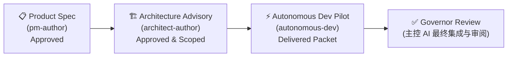

# Agent System 使用指南

> Multi-Agent 自治交付系统完整文档（V3.5）

---

## 目录

1. [系统简介](#1-系统简介)
2. [核心概念](#2-核心概念)
3. [Agent Groups 详解](#3-agent-groups-详解)
4. [Workflows 输入/输出约定](#4-workflows-输入输出约定)
5. [推荐交付生命周期](#5-推荐交付生命周期)
6. [Web UI 操作指南](#6-web-ui-操作指南)
7. [API 完整参考](#7-api-完整参考)
8. [Run 状态与生命周期](#8-run-状态与生命周期)
9. [产物体系](#9-产物体系)
10. [平台协议：Envelope 与 Manifest](#10-平台协议envelope-与-manifest)
11. [模型选择策略](#11-模型选择策略)
12. [常见问题与故障排查](#12-常见问题与故障排查)

---

## 1. 系统简介

### 这是什么

本系统是一个内置于 Antigravity Gateway 的 **Workspace-Centric Multi-Agent Delivery System**。它不是简单的"聊天 + 代码"，而是一套完整的项目治理框架：

- **主控 AI（Governor）** 担任项目治理者，负责需求审批、任务分发、质量门禁
- **顾问团（Advisory Groups）** 产出获批的产品需求和技术方案
- **自治开发团队（Delivery Groups）** 接收结构化 Work Package，自主研究、实现、测试、交付
- **所有协作通过结构化产物包进行**，而非依赖对话上下文传递

### 设计理念

> 主控 AI 应该是项目治理者，而不是亲自承担所有执行细节的超级个体。多 Agent 的价值来自自治与并行，而非把同一份微操工作拆给更多 worker。

### 基本运行原理

```
用户提需求 → 主会话 dispatch → Group Runtime 创建 Hidden Child Conversation
           → Child 执行 Workflow → 产出结构化结果 → 主会话只看最终报告
```

所有 Agent Worker 都在**独立的隐藏对话**中运行，与主会话上下文完全隔离。

---

## 2. 核心概念

### Group（组）

一组角色组成的任务单元。每个 Group 定义了：
- 包含哪些角色（roles）
- 执行模式（单次执行 / 多轮审查 / 交付通过）
- 需要哪些上游输入（source contract）
- 超时与重试策略

### Template（模板 - V3.5 核心）

**Template = 零件目录 + 装配说明。** 一个模板是一个完整的解决方案包，自包含地定义了：

- **Groups**：该模板包含哪些团队及其角色
- **Pipeline**：执行顺序与自动链式触发规则
- **Review 配置**：审查策略

当前可用的 4 个模板：

| 模板 ID | 标题 | Groups | 文件 |
|:--------|:-----|:-------|:-----|
| `development-template-1` | 完整产研链 | product-spec → architecture → dev | `~/.gemini/antigravity/gateway/assets/templates/development-template-1.json` |
| `design-review-template` | 产品体验评审 | ux-review | `~/.gemini/antigravity/gateway/assets/templates/design-review-template.json` |
| `ux-driven-dev-template` | 交互驱动产研 | ux-review → product-spec → arch → dev | `~/.gemini/antigravity/gateway/assets/templates/ux-driven-dev-template.json` |
| `coding-basic-template` | 简单编码 | coding-basic | `~/.gemini/antigravity/gateway/assets/templates/coding-basic-template.json` |

Workflow（角色指令文件）是**全局可复用资产**，存储在 `~/.gemini/antigravity/gateway/assets/workflows/*.md`，可被多个模板或 Group 跨项目引用。模板本身互不继承；需要新的编排方式时，应新建模板而不是隐式修改已有模板语义。

### Role（角色）

Group 内部的一个具体执行单元。每个 role 绑定一个 workflow 文件，如 `pm-author` 绑定 `/pm-author` workflow。

### Run（运行实例）

一次具体的任务执行。Run 的常见生命周期为：`queued → starting → running → completed | blocked | failed | cancelled | timeout`。

### Workflow（工作流）

定义在全局目录 `~/.gemini/antigravity/gateway/assets/workflows/` 下的 Markdown 文件，是 Agent Worker 的"执行脑"——告诉 AI 该做什么、按什么顺序做、最终输出什么。Workflow 是全局配置，跨项目共享，确保所有 workspace 使用一致的角色指令。

### Source Contract（来源合同）

声明一个 Group 需要消费哪个上游 Group 的产物。比如 `architecture-advisory` 要求上游必须是一个 `approved` 的 `product-spec` run。

### Envelope Protocol（信封协议）

平台级的输入/输出外壳。`TaskEnvelope` 是输入外壳（目标、约束、产物引用），`ResultEnvelope` 是输出外壳（状态、决策、风险、产出清单）。

### Project（项目 - V3 新增）

一次完整的交付链路（product-spec → architecture → dev groups）的容器。可以跨越多个 Run。所有相关的 run 会归属于同一个 project 目录下（而不是散落在孤立的 run 目录中）：

```
demolong/projects/{projectId}/
├── project.json       ← 项目元数据（目标、状态等）
├── runs/              ← 该项目的所有 run（例如 demolong/projects/{projectId}/runs/{runId}/）
└── integration/       ← 集成产物
```

### result.json（结构化输出协议 - V3 核心）

平台级强制协议。所有 Agent Worker（不管属于哪个角色）完成任务时，必须在其分配到的 artifact 目录根下写入 `result.json`。这个文件是与主控 AI 和后续环节通信的强制握手协议：

```json
{
  "status": "completed", 
  "summary": "详细的任务执行总结摘要",
  "changedFiles": ["src/app.tsx", "demolong/projects/xxx/runs/yyy/specs/draft-spec.md"],
  "outputArtifacts": ["specs/draft-spec.md"],
  "risks": ["由于依赖项 M 没有升级，可能存在兼容性风险"],
  "nextAction": "Ready for Review"
}
```

> **重点要求**：如果 `status` 为 `blocked`，还应当在该对象中补充 `blockedReason` 字段。Runtime 优先读取 `result.json` 以提取 Worker 的工作成果，如果不合规或缺失，Run 会被标记为 failed。对于 review-loop reviewer，还必须额外写 `review/result-round-{N}.json`，其中包含结构化 `decision` 字段。

---

## 3. Agent Groups 详解

### 3.1 Coding Worker (`coding-basic`)

**用途**：最简单的单任务开发模式——修 bug、做功能、重构。

| 属性 | 值 |
|------|-----|
| 执行模式 | `legacy-single` |
| 角色 | `dev-worker` |
| Workflow | `/dev-worker` |
| 超时 | 20 分钟 |
| 需要上游 | ❌ |
| 输出 Envelope | ❌ |

**适用场景**：
- 快速修复单个 bug
- 执行明确的代码重构
- 简单的功能添加

---

### 3.2 Product Specification (`product-spec`)

**用途**：产品需求定义。PM Author 起草产品需求文档，Lead Reviewer 多轮审查，最终输出获批的 Product Packet。

| 属性 | 值 |
|------|-----|
| 执行模式 | `review-loop` |
| 角色 | `pm-author` + `product-lead-reviewer` |
| 最大审查轮数 | 3 轮 |
| 超时 | Author 10 分钟, Reviewer 8 分钟 |
| 需要上游 | ❌ |
| 输出 Envelope | ✅ |

**工作流程**：
```
pm-author 起草 specs/
    ↓
product-lead-reviewer 审查
    ↓
approved → 完成 ✅
revise   → pm-author 修改 → reviewer 再次审查 (最多 3 轮)
rejected → Run 以 rejected 结束
```

**产出目录**：`specs/`

---

### 3.3 Architecture Advisory (`architecture-advisory`)

**用途**：技术方案设计。Architect Author 基于产品需求起草技术方案，Reviewer 多轮审查。

| 属性 | 值 |
|------|-----|
| 执行模式 | `review-loop` |
| 角色 | `architect-author` + `architecture-reviewer` |
| 最大审查轮数 | 3 轮 |
| 超时 | Author 12 分钟, Reviewer 10 分钟 |
| 需要上游 | ✅ 必须有一个 `approved` 的 `product-spec` run |
| 输出 Envelope | ✅ |

**产出目录**：`architecture/`（含 `write-scope-plan.json`，这是 V3 防护体系的关键）

---

### 3.4 Autonomous Dev Pilot (`autonomous-dev-pilot`)

**用途**：自治开发交付。接收一个 Work Package，自主研究代码、实现功能、运行测试、输出 Delivery Packet。

| 属性 | 值 |
|------|-----|
| 执行模式 | `delivery-single-pass` |
| 角色 | `autonomous-dev` |
| 超时 | 30 分钟 |
| 需要上游 | ✅ 必须有一个 `approved` 的 `architecture-advisory` run |
| 输出 Envelope | ✅ |
| 自动追溯 | ✅ 自动把 architecture 的上游 product-spec 需求文档也纳入输入 |

**Workflow 执行步骤**：
1. 读取 `work-package/work-package.json`
2. 读取 `input/` 下的上游产物（产品需求 + 技术方案）
3. 自行研究代码库
4. 遵守 `write-scope-plan.json` 中配置的防越权边界，实现代码变更
5. 运行 `npx tsc --noEmit` 和其他测试验证
6. 产出 `delivery/delivery-packet.json`（**强约束**）
7. 产出 `delivery/implementation-summary.md` 和 `delivery/test-results.md`

**强约束规则**：
- 如果 workflow 未在 `delivery/` 中产出 `delivery-packet.json` → Run 标记为 `failed`
- 如果 JSON 无法解析，或者 `taskId` 错误 → Run 标记为 `failed`
- **所有产出必须结合目录根下的 `result.json`** 交差。

---

### 3.5 UX Review (`ux-review`)

**用途**：产品体验评审。UX Review Author 从 5 个维度审计交互设计，Critic 进行对抗性挑战。3 轮收敛后产出改进方案。

| 属性 | 值 |
|------|-----|
| 执行模式 | `review-loop` |
| 角色 | `ux-review-author` + `ux-review-critic` |
| 最大审查轮数 | 3 轮 |
| 超时 | Author 12 分钟, Critic 10 分钟 |
| 需要上游 | ❌ |
| 输出 Envelope | ✅ |

**产出**：`audit-report.md`、`interaction-proposals.md`、`priority-matrix.md`

> 这是平台验证的第一个**非软件开发类模板**，证明了 review-loop 引擎可以承载开发以外的场景。

---

### 3.6 Supervisor 看护机制（V3.5 新增）

所有角色执行都受 Supervisor Runtime 看护：

| 机制 | 说明 | 配置字段 |
|:-----|:-----|:--------|
| **Stale 检测** | Agent 长时间无新步骤 → 强制判定失败 | `staleThresholdMs`（默认 3 分钟） |
| **失败重试** | 角色执行失败后创建新子对话重试 | `maxRetries`（默认 0 = 不重试） |

配置示例（在 Template JSON 的 roles 中）：
```json
{ "id": "autonomous-dev", "workflow": "/autonomous-dev", "timeoutMs": 1800000, "autoApprove": true, "maxRetries": 1, "staleThresholdMs": 120000 }
```

---

## 4. Workflows 输入/输出约定

各个 Workflow (工作流) 是实际驱动执行的提示词集，下面列出所有角色 Workflow 约定的详细输入输出结构。
所有 Workflow 都必须通过写出相应的业务文件，并在结束时汇报到根目录的 `result.json`。如果角色是 review-loop reviewer，还必须额外写 `review/result-round-{N}.json` 作为结构化 decision 文件。

| 工作流 Workflow | 所属 Group | 依赖的输入信息 | 核心产出约束 |
|-----------------|------------|---------------|-------------|
| **`/dev-worker`** | `coding-basic` | 用户传给主会话的 Prompt 目标 | 1. 源码修改 <br>2. 根目录的 `result.json` |
| **`/pm-author`** | `product-spec` | 用户 Prompt, 或者是修订轮次的 `review/review-round-{N-1}.md` | 1. `specs/requirement-brief.md`<br>2. `specs/implementation-reality.md`<br>3. `specs/draft-spec.md` |
| **`/product-lead-reviewer`** | `product-spec` | 同一 Run 下的 `specs/` 草案文档 | 1. `review/review-round-{N}.md`<br>2. `review/result-round-{N}.json` |
| **`/architect-author`** | `architecture-advisory` | `input/`（来自 product-spec 复制的关联需求），以及前轮反馈 | 1. `architecture/architecture-overview.md`<br>2. `architecture/module-impact-map.md`<br>3. `architecture/interface-change-plan.md`<br>4. `architecture/write-scope-plan.json`<br>5. `architecture/test-strategy.md` |
| **`/architecture-reviewer`** | `architecture-advisory` | 同一 Run 下的 `architecture/` 设计草案 | 1. `review/architecture-review-round-{N}.md`<br>2. `review/result-round-{N}.json` |
| **`/autonomous-dev`** | `autonomous-dev-pilot` | 1. `work-package/work-package.json`<br>2. `input/` 复制来的所有架构设计和产品需求 | 1. 源码修改<br>2. **强约束**: `delivery/delivery-packet.json`<br>3. `delivery/implementation-summary.md`<br>4. `delivery/test-results.md` |
| **`/ux-review-author`** | `ux-review` | 用户 Prompt（页面/功能描述），或来自 UI 截图的上下文 | 1. `specs/audit-report.md`<br>2. `specs/interaction-proposals.md`<br>3. `specs/priority-matrix.md` |
| **`/ux-review-critic`** | `ux-review` | 同一 Run 下 UX Review Author 的 `specs/` 审计产出 | 1. `review/review-round-{N}.md`<br>2. `review/result-round-{N}.json` |

---

## 5. 推荐交付生命周期

完整的端到端开发交付流程遵循经典的三阶段递进模型，即**产品 → 架构 → 开发**（product-spec → architecture → dev pilot）：



### 步骤说明

| 步骤 | Group | 你/主控AI 需要做什么 | Runtime 平台自动做什么 |
|------|-------|--------------------|-----------------------|
| **① 定产品** | `product-spec` | 发起 Project 并输入需求目标 | PM Author 起草 → Reviewer 审查 → 循环至获批 → 产出 Product Packet |
| **② 定架构** | `architecture-advisory` | 选择 ① 关联的获批源 Run | 拉取产品产物 → Architect 起草包含 scope 约束的方案 → 审查并获得 Architecture Packet |
| **③ 派发开发** | `autonomous-dev-pilot` | 选择 ② 关联的技术方案 | 自动级联并带入 ①/② 信息，打包成 Work Package 发送 → 自治执行 → 进行范围收缩检测 (Scope Audit) → 提交交付报告 |
| **④ 最终集成** | 主会话 (Governor) | 接收、审阅所有 Deliveries | 汇总 tasks、展示 scope warnings 与 risks、整合进主分支。 |

> **V3.5 Pipeline 自动链式触发**：如果使用 Template dispatch（传入 `pipelineId`），阶段 ②③ 会在前序阶段 approved/completed 后**自动触发**，无需手动逐个 dispatch。

> **提示**：完整的 `Project` 将贯穿整个生命周期。对于小型任务，允许跳离复杂链路，直接调用 `coding-basic` 或通过 UI 手动发起简单 Run。

---

## 6. Web UI 操作指南

### 6.1 入口

点击左侧导航栏的 **Agents** 图标进入 Agent 面板。面板提供两种布局：
- **Compact Layout**（侧边栏）— 适合快速输入 Prompt。
- **Full Layout**（独立页）— 提供全貌视图和详细的状态监控器。

### 6.2 派发任务

1. **选择 Workspace** 
2. **选择 Group** — 例如 `autonomous-dev-pilot`
3. **选择 Source Run** — (按需) 选择之前必须 completed 且 approved 的来源 Run ID（同 Project 下会优先呈现）
4. **选择模型策略** — Follow Header (跟随顶栏) / Group Recommended / Specific Model
5. **任务描述** — (如：设计用户偏好设置界面)
6. 点击 Dispatch。

... (Run 的进度、列表、详情都可以在交互页面中查看，并随时提供 "Open Conversation" 查看隐藏子对话。

---

## 7. API 完整参考

*(节选核心部分，使用方式与此前一致)*

```http
POST /api/agent-runs
Content-Type: application/json

{
  "projectId": "xxx",
  "groupId": "architecture-advisory",
  "workspace": "file:///Users/you/project",
  "prompt": "设计任务系统技术方案",
  "sourceRunIds": ["<approved-product-spec-runId>"],
  "pipelineId": "development-template-1",
  "pipelineStageIndex": 1
}
```

> `pipelineId` 和 `pipelineStageIndex` 用于 Pipeline 自动链式触发。如果 dispatch 时传入 `pipelineId`，后续阶段会在本阶段 approved 后自动 dispatch。

```http
GET /api/pipelines
```

> 返回所有可用的 Template 定义（每个 Template 自包含 groups + pipeline）。

---

## 8. Run 状态与生命周期

### 8.1 状态流转

```
queued → starting → running → completed ✅
                             → blocked   ⚠️  (受阻，例如等待 API 密钥或被平台拒绝)
                             → failed    ❌  (执行失败/必需协议文件缺失)
                             → cancelled 🚫  (用户终止)
                             → timeout   ⏰  
```

对于 Architecture 审查通过是 `approved`，而对于 Dev Pilot 提交成功是 `delivered`。如果不符合 scope 限定，会引发 `delivered-with-scope-warnings` 警告状态。

在 Project Pipeline 视角上，Stage 还会额外体现：

- `blocked`：等待人工输入或外部条件解除，不会自动 fork 新 run
- `cancelled`：由操作员终止；保留 pipeline 关联，但不会自动推进下游 stage

### 8.2 Pipeline 恢复动作

Project Pipeline 的标准恢复动作只有 4 个：

- `recover`：从现有 artifact / resultEnvelope 恢复同一个 run 的完成态
- `nudge`：继续当前 `activeConversationId`，只适用于 stale-active run（`starting/running` 且已出现 `liveState.staleSince`）
- `restart_role`：在同一个 run 内新建 Conversation 接管某个 role/process
- `cancel`：终止 canonical run，并把 stage 标记为 `cancelled`

关键约束：

- 正常恢复流程不会新建第二个 run
- superseded / cancelled 的旧 Conversation 即使迟到返回，也不会再写状态
- `redispatch` 不属于标准恢复动作

---

## 9. 产物体系

V3 系统产物彻底通过文件进行传递。由于引入了 Project 概念，产物存储目录会基于属于是否挂载在 Project 下有所不同。
正确的文件路径请认准 **`demolong/runs/`** 和 **`demolong/projects/`**。这些文件不在 `.agents/` 下面。

### 9.1 Advisory Run 产物目录

如果你使用的是独立 Run，路径为 `demolong/runs/<runId>/`。如果在 Project 中，则是 `demolong/projects/<projectId>/runs/<runId>/`：

```
demolong/runs/<runId>/ (或者 demolong/projects/<projectId>/runs/<runId>/)
├── task-envelope.json           ← 平台输入外壳
├── result-envelope.json         ← 平台输出外壳（含 decision / artifacts）
├── artifacts.manifest.json      ← 所有产出文件清单
├── result.json                  ← Agent Worker 执行完毕主动填写的最终结论 (必需)
├── input/
│   └── <sourceRunId>/...        ← 上游来源产物副本
├── specs/                       ← product-spec / ux-review author 的主要产出
│   ├── requirement-brief.md
│   ├── implementation-reality.md
│   ├── draft-spec.md
│   ├── audit-report.md
│   ├── interaction-proposals.md
│   └── priority-matrix.md
├── architecture/                ← architecture-advisory Workflow 的主要产出
│   ├── architecture-overview.md
│   ├── module-impact-map.md
│   ├── interface-change-plan.md
│   ├── write-scope-plan.json
│   └── test-strategy.md
└── review/
    ├── review-round-{N}.md
    ├── architecture-review-round-{N}.md
    └── result-round-{N}.json
```

### 9.2 Delivery Run 产物目录

同样使用 `demolong/runs/` 或 `demolong/projects/.../runs/` 前缀：

```
demolong/projects/<projectId>/runs/<runId>/
├── task-envelope.json
├── result-envelope.json
├── artifacts.manifest.json
├── result.json
├── work-package/
│   └── work-package.json        ← Runtime 自动拼装下发的 Work Package 约束凭证
├── input/
│   ├── <archRunId>/architecture/...
│   └── <prodRunId>/specs/...
└── delivery/
    ├── implementation-summary.md ← Workflow 产出：该节点实现说明
    ├── test-results.md           ← Workflow 产出：验证结果
    ├── delivery-packet.json      ← Workflow 产出：结构化交付报告（包含 changedFiles, tests等。强约束）
    └── scope-audit.json          ← Runtime 后台程序自动分析并生成：实际修改范围 vs 获批 scope 的审计报告
```

### 9.3 Scope Audit (范围防越权机制)

系统会自动计算并比较代码到底改了什么，以此来决定 run 是否真正被接纳。

```json
{
  "taskId": "wp_xxx",
  "withinScope": false,
  "declaredScopeCount": 1,
  "observedChangedFiles": ["src/settings.ts", "package.json"],
  "outOfScopeFiles": ["package.json"]
}
```
此时 Run 虽然能够保存结果，但由于安全问题会提示警告。

---

## 10. 平台协议：Envelope 与 Manifest

- `TaskEnvelope`: V3 中定义目标、约束、以及治理参数（reviewRequired, maxRounds 等）
- `ResultEnvelope`: V3 中包含 Run 执行后的最终裁决 `decision`，对上游的警告 `risks` 等。
- `ArtifactManifest`: Runtime 在每步结束后自动生成的快照清单，追踪 `specs/`、`architecture/`、`review/` 甚至 `delivery/` 目录下每一个产出的文件。

---

## 11. 模型选择策略

通常，请选择 `Group Recommended` (每个组会绑定表现最好、成功率最高的预设模型配置)。当你执行复杂且涉及 Project 维度的规划任务时，系统可能会强制应用一些具有更强推理能力的大模型。

---

## 12. 常见问题与故障排查

### Q: "No approved runs available" 怎么办？
确保当前 Project/Workspace 中已经存在成功流转上游前置的 Run。如果没有一个经过 Reviewer 审批批准（`approved`）的技术方案，你无法直接派发 `autonomous-dev-pilot`。这种机制保护了代码质量不会向更复杂的混乱情况坍塌。

### Q: Delivery Packet 缺失导致 Run failed？
`autonomous-dev-pilot` 角色受工作流引擎验证。AI 必须写入 `delivery/delivery-packet.json`。如未执行到这一步意外终止，会导致 Run Failed。您可以通过点击界面的 **Open Conversation** 进去看隐藏子对话中的执行报错卡点。

### Q: 所有相关的数据存放位置在哪里？
在 V3.5 中：
- **元数据存档**：记录在全局目录 `~/.gemini/antigravity/gateway/` 下的 `agent_runs.json` 及 `projects.json` 中。
- **运行时数据与产物目录**：项目内由 Runtime 管理至 `demolong/runs/<runId>/` 或 `demolong/projects/<projectId>/runs/<runId>/` 下。
- **Prompt/指令工作流存储**：全局存储在 `~/.gemini/antigravity/gateway/assets/workflows/` 下，跨项目共享。
- **模板配置**：`~/.gemini/antigravity/gateway/assets/templates/*.json` — 每个文件是一个完整的 Template（groups + pipeline）。
- **审查策略**：`~/.gemini/antigravity/gateway/assets/review-policies/*.json`。
