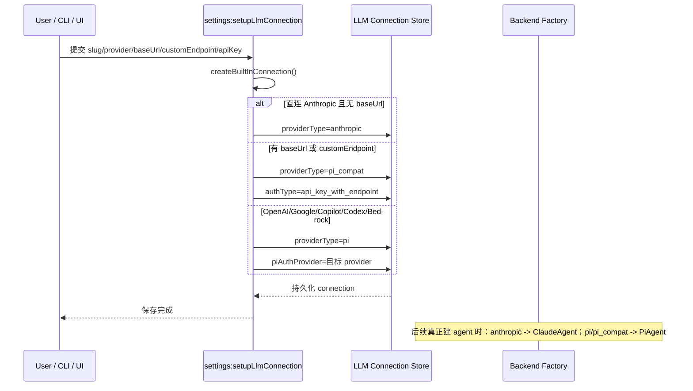
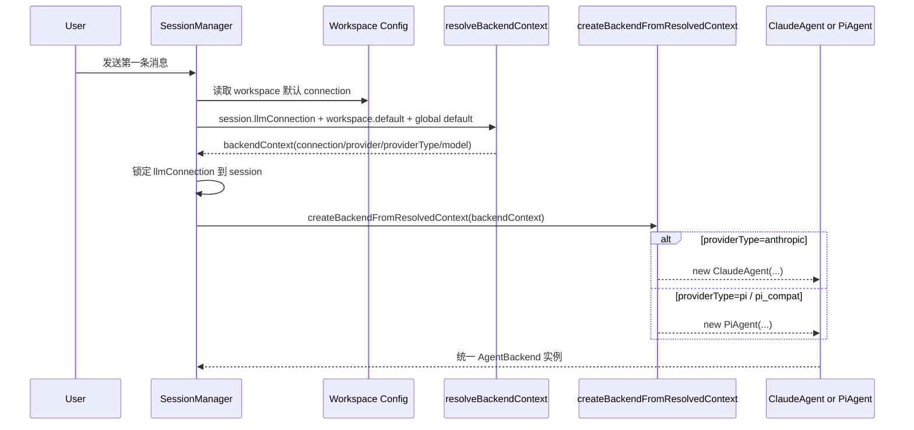
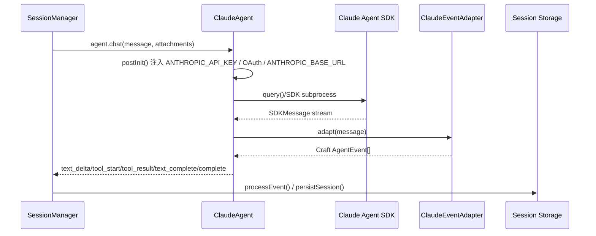
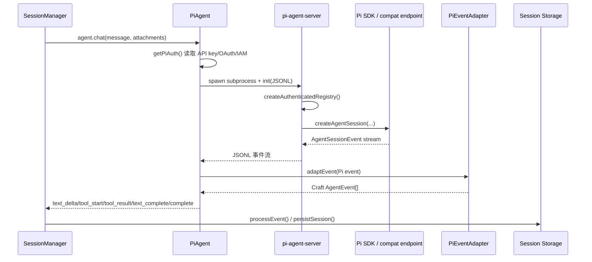
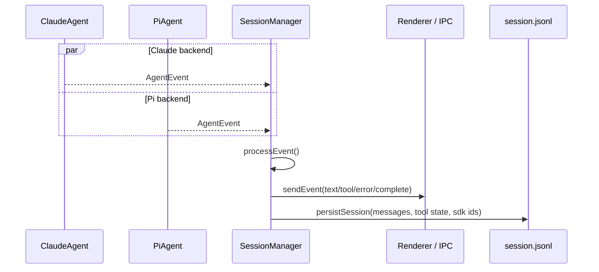

# craft-agents provider 路由与 PiAgent 研究

日期：2026-04-07
范围：静态代码研究，目标仓库为 `/Users/darrel/Documents/craft-agents-oss`

## 一句话结论

craft-agents 不是把所有第三方模型响应先转换成 Claude API/Anthropic message 再运行；它是通过双 backend 架构分流：`ClaudeAgent` 负责 Anthropic 直连，`PiAgent` 负责 OpenAI、Google、Copilot、Codex、Bedrock 以及各类兼容端点，然后两条链路在 Craft 内部统一收敛到同一套 `AgentEvent` 与会话流水线。

## 1. 最核心的判断

### 1.1 非 Anthropic API 会不会使用 Claude Agent SDK

结论：通常不会。

当前源码里的真实分流规则是：

- `providerType = anthropic` → `ClaudeAgent` → Claude Agent SDK
- `providerType = pi` → `PiAgent` → Pi SDK / `pi-agent-server`
- `providerType = pi_compat` → 仍然映射到 `PiAgent`

也就是说：

- OpenAI API key
- Google API key
- ChatGPT Plus / Codex OAuth
- GitHub Copilot OAuth
- Bedrock / Vertex
- OpenRouter / Ollama / vLLM / 自托管 OpenAI-compatible / Anthropic-compatible 端点

这些在当前实现里，主体都不是走 `ClaudeAgent`，而是走 `PiAgent`。

## 2. 路由总表

| 连接类型 | 典型凭证 | providerType | backend | 实际调用链 |
|:--|:--|:--|:--|:--|
| Anthropic 直连 | `ANTHROPIC_API_KEY` | `anthropic` | `ClaudeAgent` | Craft → Claude Agent SDK → Claude |
| Claude Max/Pro OAuth | OAuth token | `anthropic` | `ClaudeAgent` | Craft → Claude Agent SDK → Claude |
| Anthropic + 自定义 `baseUrl` | API key 或无 key | `pi_compat` | `PiAgent` | Craft → PiAgent → `pi-agent-server` → Pi SDK / compat endpoint |
| OpenAI API key | `OPENAI_API_KEY` | `pi` | `PiAgent` | Craft → PiAgent → Pi SDK |
| ChatGPT Plus / Codex OAuth | OAuth | `pi` + `piAuthProvider=openai-codex` | `PiAgent` | Craft → PiAgent → Pi SDK |
| GitHub Copilot OAuth | OAuth | `pi` + `piAuthProvider=github-copilot` | `PiAgent` | Craft → PiAgent → Pi SDK |
| Google AI Studio | `GOOGLE_API_KEY` | `pi` + `piAuthProvider=google` | `PiAgent` | Craft → PiAgent → Pi SDK |
| Bedrock / Vertex | IAM / env / none | `pi` | `PiAgent` | Craft → PiAgent → Pi SDK |
| OpenRouter / Ollama / Vercel AI Gateway / 自托管兼容端点 | API key / none + `baseUrl` | `pi_compat` | `PiAgent` | Craft → PiAgent → Pi SDK compat 模式 |

## 3. PiAgent 到底做什么

PiAgent 不是一个“文案转格式器”，而是 Craft 的第二套 backend runtime。它主要负责下面几件事：

1. 拉起 `pi-agent-server` 子进程，用 JSONL 协议通信。
2. 把连接配置、模型、工作目录、会话信息和凭证传给子进程。
3. 让子进程在 Pi SDK 里创建真实的 provider session。
4. 接收 Pi 侧事件流，并映射到 Craft 自己统一的 `AgentEvent`。
5. 接回 Craft 自己的权限、计划、source、automation、session storage 等公共基础设施。

换句话说，PiAgent 承担的是“非 Anthropic 路径的运行时宿主”和“统一事件适配层”。

## 4. PiAgent 有没有把响应变成 Claude 风格

### 4.1 对的部分

如果这句话的意思是：

“PiAgent 会把 Pi SDK 产生的事件整理成一套和 Claude 路径可以共用的内部事件格式，方便复用 UI、工具面板、会话持久化、自动化回调。”

这个说法是对的。

更准确地说，它不是统一到 Claude API，而是统一到 Craft 自己的内部 `AgentEvent`。

### 4.2 不对的部分

如果这句话的意思是：

“Craft 会先把 OpenAI / Gemini / Copilot / Ollama 的原始 HTTP 或 SSE 响应转换成 Anthropic 的 message 对象，再像 Claude 一样处理。”

这个说法从当前仓库能看到的实现边界看，不对。

当前仓库里看得到的是：

- Claude 路径：Claude SDK message → `ClaudeEventAdapter` → Craft `AgentEvent`
- Pi 路径：Pi SDK / `pi-agent-server` event → `PiEventAdapter` → Craft `AgentEvent`

也就是说，Craft 层做的是“统一内部事件模型”，不是“统一成 Anthropic 原始协议”。

### 4.3 为什么你会觉得它像 Claude 风格

因为 `PiEventAdapter` 的确会做一层 Claude Code 风格的 UI 兼容，尤其是工具输入字段的形状规整。比如它会把部分工具参数整理成更接近 Claude Code 工具展示层期望的格式，以复用现有的 diff、工具面板和渲染逻辑。

所以更精确的说法应该是：

`PiAgent` 会把 Pi 路径的事件适配为 Craft 统一事件模型，并在局部工具字段上做 Claude Code 风格兼容；但它不是在 Craft 层把所有 provider 的原始响应协议转换成 Anthropic 协议。

## 5. 统一收敛点在哪里

虽然底层 backend 不同，但两条链路最终会收敛到同一套内部抽象：

- 同一个 `AgentBackend` 接口
- 同一个 `BaseAgent` 公共能力层
- 同一个 `AgentEvent` 联合类型
- 同一个 `SessionManager` 处理链
- 同一个 session storage / message persistence

这就是为什么 UI 看起来像一套系统，而不是两套完全不同的聊天实现。

## 6. 关键源码证据

### 6.1 双 backend 架构

- `README` 明确写了 Claude Agent SDK 与 Pi SDK side by side。
- backend factory 里 `providerTypeToAgentProvider()` 明确把 `anthropic` 映射到 `ClaudeAgent`，把 `pi` 和 `pi_compat` 映射到 `PiAgent`。

对应文件：

- `craft-agents-oss/README.md`
- `craft-agents-oss/packages/shared/src/agent/backend/factory.ts`

### 6.2 PiAgent 不是 Claude SDK 包装器

- `PiAgent` 文件头直接说明它是 “Pi coding agent SDK via subprocess”。
- 它会拉起 `pi-agent-server` 子进程。
- 它把 Pi 事件喂给 `PiEventAdapter` 再转成 Craft `AgentEvent`。

对应文件：

- `craft-agents-oss/packages/shared/src/agent/pi-agent.ts`
- `craft-agents-oss/packages/pi-agent-server/src/index.ts`
- `craft-agents-oss/packages/shared/src/agent/backend/pi/event-adapter.ts`

### 6.3 Claude 路径与 Pi 路径的真正统一点

- `ClaudeEventAdapter`：Claude SDK message → Craft `AgentEvent`
- `PiEventAdapter`：Pi SDK event → Craft `AgentEvent`
- `BaseAgent`：两者共享的公共基类
- `AgentBackend`：两者都实现的统一接口
- `SessionManager`：统一消费 `agent.chat()` 产生的 `AgentEvent`

对应文件：

- `craft-agents-oss/packages/shared/src/agent/backend/claude/event-adapter.ts`
- `craft-agents-oss/packages/shared/src/agent/backend/pi/event-adapter.ts`
- `craft-agents-oss/packages/shared/src/agent/base-agent.ts`
- `craft-agents-oss/packages/shared/src/agent/backend/types.ts`
- `craft-agents-oss/packages/server-core/src/sessions/SessionManager.ts`

## 7. README 与当前实现存在的偏差

README 中有一段表述会让人误以为“第三方 endpoints 也走 Claude backend”。

但当前连接保存逻辑里，只要用户配置了 `baseUrl` 或 `customEndpoint`，通常就会把连接转成 `pi_compat`。而 `pi_compat` 在 factory 中最终映射到 `PiAgent`。

所以当前真实实现更接近：

- Anthropic 直连：ClaudeAgent
- 第三方兼容端点：PiAgent

不是“全部第三方都继续走 ClaudeAgent”。

## 8. 对当前问题的最精确回答

如果你的问题是：

“craft-agents 是不是靠 PiAgent 把所有 provider 响应统一翻译成 Claude 的格式？”

最准确回答是：

不是统一翻成 Claude 原始协议，而是统一翻成 Craft 自己的内部事件模型；只有局部工具输入/展示层会做 Claude Code 风格兼容。

如果你的问题是：

“非 anthropic API 最终是不是主要走 PiAgent？”

当前实现下，答案基本是：是。

## 9. 补充：workspace 语义

这次顺带确认的另一个点是：craft-agents 的 workspace 本质上是以文件夹为根的。

- 服务端注释直接写：folder is the workspace。
- session 主持久化位置在 `{workspaceRootPath}/sessions/{id}/session.jsonl`。

所以它的工作区语义更接近 IDE / Obsidian，而不是单纯的全局聊天列表。

## 10. 完整时序图

下面几张图把当前实现拆成 4 段：

1. 连接创建与 providerType 决策
2. session 创建与 backend 实例化
3. Claude 路径
4. Pi 路径与统一事件落盘

### 10.1 连接创建与 providerType 决策

### 10.2 Session 创建与 backend 实例化

### 10.3 Claude 路径

### 10.4 Pi 路径

### 10.5 统一收敛段

## 11. 看图后的最简结论

如果只保留一句话：

`PiAgent` 不是把第三方模型的原始协议翻译成 Anthropic 协议，而是把 Pi 路径的运行时事件翻译成 Craft 的统一事件模型；随后它和 `ClaudeAgent` 一起进入同一个 `SessionManager`、同一套 UI 和同一套 session storage。

## 12. PiEventAdapter 字段映射拆解

这一节只讨论 Craft 仓库内真实发生的适配，不讨论 Pi SDK 内部如何统一各 provider 的原始 HTTP/SSE。

### 12.1 事件类型映射表

| Pi 侧事件 | Craft 侧事件 | 说明 |
|:--|:--|:--|
| `agent_end` | `complete` | 如果有 usage，会一起带上 token/cost/contextWindow |
| `turn_start` | 无直接对外事件 | 只生成内部 `currentTurnId` |
| `turn_end` | 无直接对外事件 | 只做 turn 内状态清理，避免重复 `complete` |
| `message_update` | `text_delta` | 仅处理 assistant 的 streaming delta |
| `message_end` | `text_complete` | 仅处理 assistant；`stopReason=toolUse` 时标记为 intermediate |
| `message_end` + usage | `usage_update` | 把 usage 单独发给上层 |
| `message_end` + error | `typed_error` 或 `error` | 先过 `parseError()` 分类 |
| `tool_execution_start` | `tool_start` | 同时做工具名映射、参数规范化、metadata 合并 |
| `tool_execution_update` | 无直接对外事件 | 仅累积 partial output，等待 end 再汇总 |
| `tool_execution_end` | `tool_result` | 从 partial output / block reason / final result 中取结果 |
| `auto_compaction_start` | `status` | 固定文案带 `Compacting` 关键字 |
| `auto_compaction_end` | `info` 或 `error` | 成功用 `Compacted`，失败给 error |
| `auto_retry_start` | `status` | 展示 retry attempt |
| `auto_retry_end` | `error` 或无事件 | 仅在最终失败时发 error |

### 12.2 关键判断点

#### A. 文本不是按 Claude message 对象统一的

PiAdapter 关心的是：

- `message_update` 里有没有 `assistantMessageEvent.text_delta`
- `message_end` 的 `message.role` 是否为 `assistant`
- `stopReason` 是 `toolUse`、`error` 还是最终停止

然后它直接产出 Craft 自己的：

- `text_delta`
- `text_complete`
- `usage_update`
- `typed_error` / `error`

这说明它统一的是 Craft 内部事件语义，而不是把 Pi 消息重写成 Anthropic `messages[]` 协议。

#### B. 工具事件是适配最重的一层

`tool_execution_start` 阶段，PiAdapter 会同时完成：

1. 工具名映射
2. 参数字段重写
3. metadata 合并
4. 特殊工具兼容处理

最后才产出一个 Craft `tool_start`。

这正是“看起来像 Claude 风格”的主要来源。

### 12.3 字段重写表

#### Edit

Pi 风格：

- `path`
- `oldText`
- `newText`

重写后：

- `file_path`
- `old_string`
- `new_string`

#### Write / Read / Glob / Grep

Pi 风格：

- `path`

重写后：

- `file_path`

#### call_llm

Pi 路径里 `call_llm` 实际使用的是 `miniModel`，PiAdapter 会覆盖展示层的 `model` 字段，让 UI 显示真实使用的模型，而不是原始传入参数。

#### Bash 读文件分类

如果 `Bash` 实际上是在执行“读文件命令”，PiAdapter 会把它分类成 `Read` 工具事件，这样上层 UI 和 prerequisite 逻辑可以沿用已有的 Read 流程。

### 12.4 metadata 不是只看原始 args

`tool_execution_start` 的意图与展示名有三层来源：

1. 子进程事件里带的规范 metadata
2. 共享 store 里的 fallback metadata
3. args 中的 `_intent` / `_displayName` 或 `description`

然后 PiAdapter 统一产出：

- `intent`
- `displayName`

这仍然属于 Craft 的展示层统一，不等于底层 provider 响应协议统一。

### 12.5 tool_result 也不是简单原样透传

`tool_execution_end` 时，PiAdapter 会按优先级选结果：

1. 之前在 `tool_execution_update` 累积的 partial output
2. block reason
3. `event.result` 提取出的最终文本

然后产出统一的 `tool_result`。

所以这里的统一重点仍然是 Craft 的工具结果事件，不是 Claude 的原始 tool result schema。

### 12.6 最准确表述

如果要把这一层说得最准确，可以写成：

`PiEventAdapter` 做的是 “Pi SDK event -> Craft AgentEvent” 的语义映射，其中包含一小部分为了复用 Claude Code 风格 UI 而做的工具字段规范化；但它没有在 Craft 层把整条 provider 响应协议转换成 Anthropic 原始 message 协议。

## 13. Claude SDK 路径和 Pi SDK 路径到底差在哪

这个问题最容易被一句“一个走 Claude，一个走 Pi”说浅。更准确的比较应该看 6 个层次。

### 13.1 本质定位不同

| 维度 | Claude SDK 路径 | Pi SDK 路径 |
|:--|:--|:--|
| 在 Craft 里的 backend | `ClaudeAgent` | `PiAgent` |
| 面向的 provider | Anthropic 直连 | OpenAI / Google / Copilot / Codex / Bedrock / compat endpoint |
| 在 Craft 中的角色 | 原生 Claude backend | 多 provider 兼容 backend |
| 工程定位 | 原生路径 | 兼容与扩展路径 |

### 13.2 谁掌握底层协议控制权

Claude SDK 路径里，Craft 对底层协议更“近”。

- Craft 直接接 Claude Agent SDK
- 通过 `ANTHROPIC_API_KEY`、`CLAUDE_CODE_OAUTH_TOKEN`、`ANTHROPIC_BASE_URL` 这类 env 变量把连接信息交给 Claude SDK
- `ClaudeEventAdapter` 适配的是 Claude SDK 自己的 `SDKMessage`

Pi SDK 路径里，Craft 对底层 provider 协议更“远”。

- Craft 不直接处理 OpenAI/Google/Copilot 等 provider 的原始返回
- Craft 把凭证、模型、custom endpoint 等交给 `pi-agent-server`
- `pi-agent-server` 再交给 Pi SDK 建 session
- Craft 最终看到的是 Pi 事件，而不是 provider 原始响应

所以：

- Claude 路径更像“原生宿主 Claude SDK”
- Pi 路径更像“Craft 自己包了一层多 provider runtime 宿主”

### 13.3 认证方式不同

#### Claude SDK 路径

主要是 env 注入：

- Anthropic API key
- Claude OAuth token
- 可选 `ANTHROPIC_BASE_URL`

Craft 的工作主要是：

1. 从 credential manager 取凭证
2. 写入 env
3. 启动 Claude SDK subprocess

#### Pi SDK 路径

主要是结构化凭证对象：

- API key
- OAuth access/refresh token
- IAM credentials
- custom endpoint 参数

Craft 的工作主要是：

1. 从 credential manager 取凭证
2. 组装 `piAuth`
3. 通过 JSONL init 发给 `pi-agent-server`
4. 由 Pi SDK 自己决定如何访问 provider

所以 Pi 路径在 Craft 侧要维护更多“provider-aware credential plumbing”。

### 13.4 事件适配复杂度不同

Claude 路径的事件适配更接近“直译”。

- 输入是 Claude SDK 的 `SDKMessage`
- 输出是 Craft `AgentEvent`

Pi 路径的事件适配更接近“归一化”。

- 输入是 Pi SDK / `pi-agent-server` 事件
- 输出是 Craft `AgentEvent`
- 中间还要补：工具名映射、字段规范化、partial output 聚合、metadata 合并、错误分类、兼容 call_llm / Read / Bash 场景

所以从工程工作量看，Pi 路径明显更重。

### 13.5 为什么不能只保留其中一条

#### 只保留 Claude SDK 不够

因为它更偏 Anthropic 原生路径。

即使 README 里写过 custom endpoint/provider routing，也不代表它天然就是 Craft 当前这套多 provider 产品化能力的唯一解。当前实现已经把大部分第三方和 compat 路径放进 `PiAgent` 了。

#### 只保留 Pi SDK 也不一定合适

因为 Claude 在产品里仍然是一个重要的一等路径：

- Claude OAuth / Max 订阅链路
- Claude SDK 原生工具生态
- Claude 路径现有的 message/event 适配与产品体验

所以当前仓库保留两套 backend，不是重复造轮子，而是刻意把“Claude 原生路径”和“多 provider 兼容路径”分开。

### 13.6 最精确的理解

如果要用一句很工程化的话来概括：

- `ClaudeAgent` 是 Claude 原生 backend
- `PiAgent` 是多 provider 兼容 backend
- 两者上面是统一的 Craft facade、统一的 `AgentEvent`、统一的 `SessionManager`

所以真正统一的不是底层 provider 协议，而是 Craft 自己的 agent runtime 抽象层。

## 14. ClaudeEventAdapter 与 PiEventAdapter 对照

如果把两条链路放在一起看，最重要的差异不是“一个叫 Claude，一个叫 Pi”，而是：

- ClaudeAdapter 更像原生 SDK message 的直译器
- PiAdapter 更像兼容 runtime 的归一化器

### 14.1 输入对象不同

| 维度 | ClaudeEventAdapter | PiEventAdapter |
|:--|:--|:--|
| 输入 | Claude SDK `SDKMessage` | Pi SDK / `pi-agent-server` 事件 |
| 上游来源 | Claude Agent SDK | Pi SDK / compat runtime |
| Craft 看到的粒度 | assistant / stream_event / user / tool_progress / result / system / auth_status | message_update / message_end / tool_execution_start / tool_execution_end / agent_end / auto_compaction_* / auto_retry_* |

### 14.2 文本完成时机不同

#### ClaudeEventAdapter

Claude 路径不是看到 assistant text 就立刻发 `text_complete`。

- 在 `assistant` 消息里先提取文本，放入 `pendingText`
- 真正等到 `stream_event.message_delta` 里拿到 `stop_reason`
- 再决定 `isIntermediate = (stop_reason === tool_use)`
- 最后发 `text_complete`

这说明 Claude 路径更贴着 Claude SDK 的原生 message / stream 语义。

#### PiEventAdapter

Pi 路径则是在 `message_end` 时直接判断：

- `message.role === assistant`
- `stopReason === toolUse` 还是最终停止
- 直接产出 `text_complete`

所以 Pi 路径的文本完成逻辑更像“事件归一化”。

### 14.3 工具起止的来源不同

#### ClaudeEventAdapter

Claude 工具事件的来源更原生：

- `assistant.message.content` 中的 `tool_use`
- 或 `stream_event.content_block_start`
- 或 `tool_progress`

然后交给 `extractToolStarts()` / `extractToolResults()` 这类工具函数做 ID 级匹配。

#### PiEventAdapter

Pi 工具事件则更运行时化：

- `tool_execution_start`
- `tool_execution_update`
- `tool_execution_end`

这些已经不是 provider 原始消息块，而是 Pi runtime 提炼后的执行生命周期事件。

所以 PiAdapter 在 Craft 层的责任更重，它要把“运行生命周期事件”翻译回 UI 可用的工具事件。

### 14.4 字段兼容负担不同

#### ClaudeEventAdapter

Claude 路径本身就比较贴近 Craft 现有 UI 预期：

- 工具块结构更接近既有工具匹配逻辑
- 文本流、tool_use、tool_result 的抽取偏“识别与分发”
- 很少做大规模字段重写

#### PiEventAdapter

Pi 路径明显多一层字段兼容：

- `path -> file_path`
- `oldText -> old_string`
- `newText -> new_string`
- `call_llm` 展示模型覆盖
- `Bash` 读文件命令重分类为 `Read`

这说明 Pi 路径需要额外适配现有 Claude Code 风格 UI。

### 14.5 complete 事件来源不同

#### ClaudeEventAdapter

`complete` 主要在 `result` 消息阶段产出，并带 usage/cost/contextWindow。

#### PiEventAdapter

`complete` 主要在 `agent_end` 阶段产出；usage 取自之前缓存的 `lastUsage`。

这也说明：

- ClaudeAdapter 更贴着 Claude SDK 的 query result 语义
- PiAdapter 更贴着 agent runtime 的结束语义

### 14.6 错误处理差异

#### ClaudeEventAdapter

- assistant message 内若带 SDK error，走 `mapSDKError()`
- `auth_status` 单独转成 auth error
- `result` subtype 非 success 时再补 `error + complete`

#### PiEventAdapter

- `message_end` 时若 `stopReason=error` 且有 `errorMessage`
- 先过 `parseError()`
- 能分类就发 `typed_error`
- 否则发普通 `error`

Pi 路径的错误更像运行时执行阶段错误；Claude 路径的错误更像 SDK message 级错误。

### 14.7 最精确的对照结论

如果只保留一句话：

- `ClaudeEventAdapter` 更像 Claude SDK message 的原生直译层
- `PiEventAdapter` 更像 Pi runtime 事件到 Craft UI 事件的兼容归一层

所以你之前那句“是不是通过 Pi agent 把响应格式变成 Claude 的风格”，更准确的修正版是：

Pi 路径确实会为了复用现有 UI 和工具链而收敛到更接近 Claude Code 的事件/字段形状，但这主要发生在 Craft 的内部事件层和工具字段层，不是把 provider 原始协议整体改造成 Anthropic 原始 message 协议。